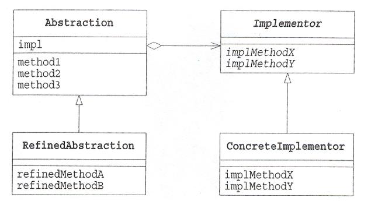

# 브릿지 패턴



- 브릿지 패턴은 추상화와 구현을 서로 분리하여, 이 둘이 독립적으로 확장될 수 있도록 만드는 패턴입니다.

---

### 핵심 아이디어: 두 개의 계층을 분리하여 연결

핵심은 두 개의 독립적인 상속 계층을 만드는 것입니다.

1. 추상화 계층 : 클라이언트가 사용하는 상위 레벨의 인터페이스. 
2. 구현 계층 **:** 실제 작업을 수행하는 하위 레벨의 인터페이스. 

추상화 객체가 구현 객체를 멤버 변수로 참조하며, 클라이언트의 요청을 받아 실제 구현은 멤버 변수에게 위임합니다.

---

### 브릿지 패턴이 필요한 상황 (문제점)


브릿지 패턴이 없다면, 기능과 구현의 조합만큼 클래스 수가 폭발적으로 증가하게 됩니다.

예를 들어, 도형이라는 기능과 그리기 API라는 구현이 있다고 가정해 봅시다.

- **기능의 종류:** `Circle` , `Square`
- **구현의 종류:** `WindowsAPI`, `LinuxAPI`

이 둘을 **상속**으로만 해결하려고 하면, 다음과 같은 2*2 = 4개의 클래스가 필요합니다.

Java

```jsx
/
abstract class Shape {
    abstract void draw();
}

// 문제점: 기능(Circle)과 구현(Windows)이 하나의 클래스로 강하게 결합
class WindowsCircle extends Shape {
    public void draw() { System.out.println("Windows API로 원 그리기"); }
}
class LinuxCircle extends Shape {
    public void draw() { System.out.println("Linux API로 원 그리기"); }
}

class WindowsSquare extends Shape {
    public void draw() { System.out.println("Windows API로 사각형 그리기"); }
}
class LinuxSquare extends Shape {
    public void draw() { System.out.println("Linux API로 사각형 그리기"); }
}

public class ProblemTest {
    public static void main(String[] args) {
        Shape shape1 = new WindowsCircle();
        shape1.draw();
        
        // 만약 'MacOS'가 추가되면? -> 'MacCircle', 'MacSquare' 2개 추가
        // 만약 'Triangle'이 추가되면? -> 'WindowsTriangle', 'LinuxTriangle' 2개 추가
        // 조합이 늘어날수록 클래스 수가 기하급수적으로 늘어난다.
    }
}
```

---

### 브릿지 패턴의 구조 (Structure)

브릿지 패턴은 이 문제를 해결하기 위해 '기능'과 '구현'을 두 개의 상속 계층으로 분리합니다.

### 1. Abstraction

- 클라이언트가 사용할 상위 레벨의 인터페이스를 정의합니다.
- 인터페이스를 멤버 변수로 가집니다.
- (예: `Shape` 추상 클래스)

### 2. Refined Abstraction

- Abstraction을 상속받아, 상위 레벨의 로직을 구현합니다.
- 실제 세부 구현은 Implementor에게 위임합니다.
- (예: `Circle`, `Square` 클래스)

### 3. Implementor

- 세부 구현을 위한 하위 레벨의 인터페이스를 정의합니다. (Abstraction의 인터페이스와 다를 수 있습니다.)
- (예: `DrawingAPI` 인터페이스)

### 4. Concrete Implementor

- Implementor 인터페이스를 실제로 구현한 클래스입니다.
- (예: `WindowsAPI`, `LinuxAPI` 클래스)브릿지 패턴 적용 예시 코드

---

Java

```jsx
// 3. Implementor
interface DrawingAPI {
    void drawCircle(int x, int y, int radius);
    void drawSquare(int x, int y, int side);
}

// 4. Concrete Implementor
class WindowsDrawingAPI implements DrawingAPI {
    @Override
    public void drawCircle(int x, int y, int radius) {
        System.out.printf("Windows API: 원 그리기 (%d, %d, %d)\n", x, y, radius);
    }
    @Override
    public void drawSquare(int x, int y, int side) {
        System.out.printf("Windows API: 사각형 그리기 (%d, %d, %d)\n", x, y, side);
    }
}

class LinuxDrawingAPI implements DrawingAPI {
    @Override
    public void drawCircle(int x, int y, int radius) {
        System.out.printf("Linux API: 원 그리기 (%d, %d, %d)\n", x, y, radius);
    }
    @Override
    public void drawSquare(int x, int y, int side) {
        System.out.printf("Linux API: 사각형 그리기 (%d, %d, %d)\n", x, y, side);
    }
}

// 1. Abstraction

abstract class Shape {

    protected DrawingAPI drawingAPI; 

    public Shape(DrawingAPI drawingAPI) {
        this.drawingAPI = drawingAPI;
    }
    
    public void setDrawingAPI(DrawingAPI drawingAPI) {
        this.drawingAPI = drawingAPI;
    }

    public abstract void draw();
    public abstract void resize(double pct);
}

// 2. Refined Abstraction
class Circle extends Shape 
    private int x, y, radius;

    public Circle(int x, int y, int radius, DrawingAPI drawingAPI) {
        super(drawingAPI);
        this.x = x;
        this.y = y;
        this.radius = radius;
    }

    @Override
    public void draw(){
        drawingAPI.drawCircle(x, y, radius);
    }

    @Override
    public void resize(double pct) {
        this.radius *= pct;
    }
}

class Square extends Shape {
    private int x, y, side;
    
    public Square(int x, int y, int side, DrawingAPI drawingAPI) {
        super(drawingAPI);
        this.x = x;
        this.y = y;
        this.side = side;
    }
    
    @Override
    public void draw() {
        drawingAPI.drawSquare(x, y, side);
    }

    @Override
    public void resize(double pct) {
        this.side *= pct;
    }
}

// 4. Client
public class BridgeTest {
    public static void main(String[] args) {
        
        DrawingAPI winAPI = new WindowsDrawingAPI();
        DrawingAPI linuxAPI = new LinuxDrawingAPI();

        // 1. Windows에서 원 그리기
        Shape winCircle = new Circle(1, 2, 3, winAPI);
        winCircle.draw();

        // 2. Linux에서 사각형 그리기
        Shape linuxSquare = new Square(4, 5, 6, linuxAPI);
        linuxSquare.draw();

        // 3. Linux에서 원 그리기
        Shape linuxCircle = new Circle(7, 8, 9, linuxAPI);
        linuxCircle.draw();
        
        // 런타임에 구현 변경하기
        System.out.println("--- 구현(다리) 변경 ---");
        linuxCircle.setDrawingAPI(winAPI);
        linuxCircle.draw(); // 같은 객체(linuxCircle)가 이제 Windows API로 그림
    }
}
```

---

### 언제 사용하면 좋을까?

- 기능과 구현의 조합이 많아 클래스 폭발이 우려될 때
- 추상화와 구현이 서로 독립적으로 변경되고 확장되어야 할 때

---

### 실제 사용 사례

- **JDBC** :
    - Abstraction: `java.sql` 패키지 (`Connection`, `Statement` 등)
    - Implementor: 각 DB 가 제공하는 `Driver`
    - 자바 애플리케이션(Client)은 `java.sql` 인터페이스(Abstraction)를 사용하여 코드를 작성하고, 런타임에 `MySQL Driver` 또는 `Oracle Driver` 를 다리로 연결하여 실제 DB와 통신합니다.
- **운영체제(OS)의 그래픽 드라이버:**
    - Abstraction: OS의 그래픽 API (예: DirectX, OpenGL)
    - Implement**:** 하드웨어 제조사(Nvidia, AMD)의  `그래픽 드라이버`
    - 게임은 OS의 API를 호출하면, OS는 다리를 통해 현재 설치된 그래픽 드라이버에게 실제 렌더링을 위임합니다.