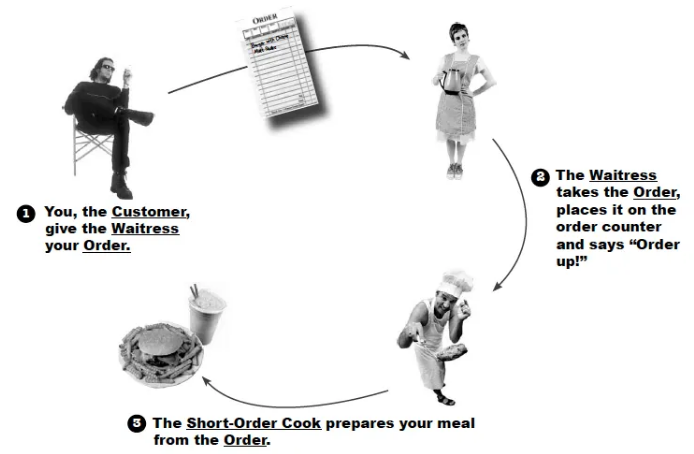
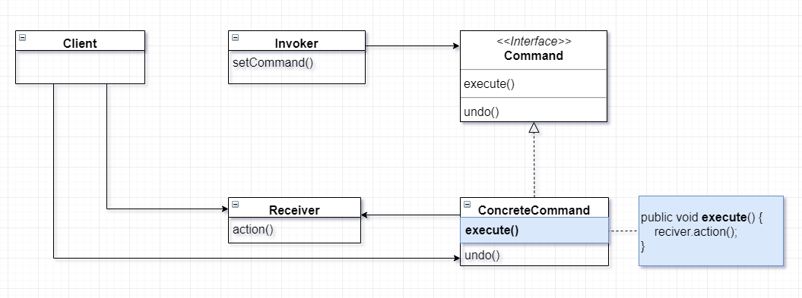

# Command Pattern ( 커맨드 패턴 )

<br/>
<br/>

# Command Pattern

- 요청을 객체의 형태로 캡슐화하여 사용자가 보낸 요청을 나중에 이용할 수 있도록 매서드 이름, 매개변수 등 요청에 필요한 정보를 저장 또는 로깅, 취소할 수 있게 하는 패턴이다.



**고객 → 웨이트리스에게 주문 → 주문서 작성 → 주방장에게 주문 전달**

- 웨이트리스 입장
  - 어떤 주문인지 조차도 몰라도 된다.
  - 누가 식사를 준비할지 몰라도 된다.
- 주방장 입장
  - 주문서를 읽고 필요한 메뉴만 준비하면 된다.
  - 누가 주문했는지 알 필요가 없다.

<br/>
<br/>

# ① Why? (의도, Intent)\*\*\*

> "이 패턴은 **어떤 문제(불편함)**를 해결하기 위해 등장했는가?"

---

- **강한 결합 (Tight Coupling)**
  - 요청을 하는 객체(Invoker)가 요청을 받아 실제 기능을 수행하는 객체(Receiver)의 **구체적인 클래스와 메서드를 직접 알아야 한다.**
  - 이로 인해 요청자는 수신자의 세부 구현에 의존하게 되며, 수신자가 변경되면 요청자 코드도 함께 변경되어야 한다.
- **OCP 위반**
  - 새로운 기능(요청)을 추가할 때마다, **요청을 하는 객체(Invoker)의 기존 코드를 수정해야 하는** 문제가 존재한다. (분기문에 새로운 분기 추가)
  - '확장에는 열려 있고, 수정에는 닫혀 있어야 한다'는 개방-폐쇄 원칙(OCP)을 위반한다.
- **유연성 부족 (Lack of Flexibility)**
  - 수행할 작업이 코드 로직 내부에 하드코딩되어 있어, 요청 자체를 **독립적인 객체로 다룰 수 없다.**
  - 요청을 나중에 실행하거나(지연 실행), 요청 내역을 로깅하거나, 실행된 작업을 되돌리는(Undo) 등의 부가 기능을 구현하기가 매우 복잡하다.

> 요청(Request) 자체를 객체로 캡슐화'하는 것

요청을 객체로 만듦으로써, 요청을 보내는 객체(Invoker)와 실제 기능을 수행하는 객체(Receiver) 사이의 의존성을 완전히 분리(Decoupling)
'무엇을 할 것인가'를 ‘언제/어떻게 할 것인가'와 분리하여 시스템 전체의 유연성을 높임

>

<br/>
<br/>

# ② What? (구조, Structure)

> "그 문제를 해결하기 위해, **어떤 역할(클래스)들이 등장**하며 **서로 어떻게 상호작용**하는가?"

---



- **Command (커맨드 인터페이스)**
  - 모든 `ConcreteCommand`(구체적인 커맨드)가 공통으로 구현해야 할 인터페이스
  - `execute()`와 같이 실행되어야 할 작업을 추상화하는 단일 메서드를 정의 (경우에 따라 `undo()` 메서드를 포함함)
  - `Invoker`(호출자)는 `Command` 인터페이스를 통해, 실제 실행되는 구체적인 로직이 무엇인지 구분하지 않고 동일하게 `execute()`를 호출할 수 있음
- **ConcreteCommand (구체적인 커맨드)**
  - `Command` 인터페이스를 실제로 구현하는 클래스
  - 실제 작업을 수행할 `Receiver`(수신자) 객체에 대한 참조(has-a)를 멤버 변수로 가짐
  - `execute()` 메서드가 호출되면, 내부적으로 자신이 참조하고 있는 `Receiver`의 특정 메서드를 호출하도록 구현
- **Receiver (수신자)**
  - 실제 비즈니스 로직을 수행하는 객체, 요청에 따른 구체적인 작업을 수행하는 방법을 알고 있음
  - `ConcreteCommand`는 `Receiver`의 메서드를 호출하여 실제 작업을 위임함
- **Invoker (호출자)**
  - `Command` 인터페이스 타입의 객체를 멤버 변수로 포함, 특정 시점에 `command.execute()`를 호출하는 객체
  - `setCommand()`와 같은 메서드를 통해 실행할 `Command` 객체를 외부(`Client`)로부터 주입받음
  - `Command`가 구체적으로 어떤 `Receiver`를 호출하는지, 어떤 작업을 수행하는지 **전혀 알지 못한다.** 오직 `Command` 인터페이스의 `execute()` 메서드만 알고 호출한다.
- **Client (클라이언트)**
  - `Receiver`(수신자)와 `ConcreteCommand`(구체적인 커맨드) 객체를 생성
  - `ConcreteCommand`를 생성할 때 `Receiver`를 주입하여 둘을 연결
  - 생성된 `ConcreteCommand` 객체를 `Invoker`(호출자)에게 설정(주입)하여 전체 시스템이 동작하도록 구성

### **`ConcreteCommand` is-a `Command`**

- `ConcreteCommand`는 `Command` 인터페이스를 구현(implement)함

### **`ConcreteCommand` has-a `Receiver`**

- `ConcreteCommand`는 내부에 `Receiver` 타입의 객체를 멤버 변수로 포함.
- `execute()`가 호출될 때, 이 `Receiver`의 실제 행동(`action()`)을 호출하기 위해 사용다.

### **`Invoker` has-a `Command`**

- `Invoker`는 내부에 `Command` 인터페이스 타입의 객체를 멤버 변수로 포함
- 사용자의 요청이 발생했을 때, 이 `Command`의 `execute()`를 호출하기 위해 사용

<br/>
<br/>

# ③ How? (구현, Implementation)

> "그래서 이걸 **코드로 어떻게 구현**하는가?"

---

## Code Sample (Java)

### Lamp.java

```java
// Receiver: 실제 action()을 수행
public class Lamp {
    public void turnOn() {
        System.out.println("Lamp On");
    }

    public void turnOff() {
        System.out.println("Lamp Off");
    }
}
```

### Command.java

```java
// Command: execute()와 undo()를 정의
public interface Command {
    public abstract void execute();
    public abstract void undo(); // UML에 맞게 undo() 추가
}
```

### LampOnCommand.java

```java
// ConcreteCommand 1
public class LampOnCommand implements Command {
    private Lamp lamp; // Receiver 참조

    public LampOnCommand(Lamp lamp) {
        this.lamp = lamp;
    }

    // execute()는 receiver.action()을 호출
    public void execute() {
        lamp.turnOn();
    }

    // undo()는 execute()의 작업을 되돌림
    public void undo() {
        lamp.turnOff();
    }
}
```

### LampOffCommand.java

```java
// ConcreteCommand 2
public class LampOffCommand implements Command {
    private Lamp lamp; // Receiver 참조

    public LampOffCommand(Lamp lamp) {
        this.lamp = lamp;
    }

    // execute()는 receiver.action()을 호출
    public void execute() {
        lamp.turnOff();
    }

    // undo()는 execute()의 작업을 되돌림
    public void undo() {
        lamp.turnOn();
    }
}
```

### Button.java

```java
// Invoker: Command를 참조하며 setCommand()를 가짐
public class Button {
    private Command command;

    // 생성자 대신 setCommand로 설정 (UML과 일치)
    public Button() { }

    // UML의 setCommand() 메서드
    public void setCommand(Command command) {
        this.command = command;
    }

    // execute() 호출
    public void pressed() {
        if (command != null) {
            command.execute();
        }
    }

    // undo() 호출 기능 추가
    public void undoPressed() {
        if (command != null) {
            command.undo();
        }
    }
}
```

### Client.java

```java
// Client: 모든 객체를 생성하고 관계를 설정함
public class Client {
    public static void main(String[] args) {
        // 1. Receiver 생성
        Lamp lamp = new Lamp();

        // 2. ConcreteCommands 생성 (Receiver 주입)
        Command lampOnCommand = new LampOnCommand(lamp);
        Command lampOffCommand = new LampOffCommand(lamp);

        // 3. Invoker 생성
        Button button = new Button();

        // --- 램프 켜기 및 되돌리기 테스트 ---
        // 4. Invoker에 Command 설정 (UML의 setCommand())
        button.setCommand(lampOnCommand);

        System.out.println("[램프 켜기 테스트]");
        button.pressed();     // execute() 호출 -> Lamp On
        button.undoPressed(); // undo() 호출    -> Lamp Off

        System.out.println("\n[램프 끄기 테스트]");
        // 5. 다른 Command로 교체
        button.setCommand(lampOffCommand);

        button.pressed();     // execute() 호출 -> Lamp Off
        button.undoPressed(); // undo() 호출    -> Lamp On
    }
}
```

### 실행 결과

```
[램프 켜기 테스트]
Lamp On
Lamp Off

[램프 끄기 테스트]
Lamp Off
Lamp On
```

<br/>
<br/>

# ④ When? (장단점, Consequences)

> "이 패턴을 적용했을 때의 **장점과 단점(Trade-off)**은 무엇인가?
> **언제 사용하고, 언제 사용하지 말아야** 하는가?"

---

<br/>

## TRADE-OFF

> **'결합도'와 '복잡도'의 맞교환**
>
> 요청을 하는 `Invoker`와 실제 기능을 수행하는 `Receiver`를 완벽하게 분리(Decoupling)하여 유연성을 얻는 대신, 단순한 메서드 호출 하나를 위해 `Command` 인터페이스, `ConcreteCommand` 클래스 등 **여러 개의 작은 클래스들을 추가로 만들어야** 한다. 전체적인 구조가 복잡해지고 코드량이 늘어날 수 있다.

### 장점

- **Invoker와 Receiver의 분리**
  - 요청을 호출하는 객체(`Invoker`)와 실제 작업을 수행하는 객체(`Receiver`) 사이의 **의존성이 완전히 제거됨**
  - `Invoker`는 `Command` 인터페이스의 `execute()` 메서드만 알면 되므로, `Receiver`의 종류나 작업 내용이 변경되거나 추가되어도 `Invoker` 코드는 전혀 수정할 필요가 없음
- **OCP (개방-폐쇄 원칙) 만족**
  - 새로운 동작(기능)을 추가하고 싶을 때, 기존의 `Invoker` 코드를 수정하는 대신 새로운 `ConcreteCommand` 클래스를 추가하기만 하면 된다.
- **요청을 1급 객체(First-Class Object)로 취급**
  - 요청(커맨드)이 객체화되므로, 객체로 할 수 있는 모든 유연한 작업이 가능
  - **Undo / Redo:** 커맨드 객체에 `undo()` 메서드를 구현하고 실행된 커맨드 객체들을 스택(Stack)에 저장하여 '작업 되돌리기' 및 '다시 실행' 기능을 쉽게 구현할 수 있다.
  - **지연 실행 및 큐(Queueing):** 커맨드 객체를 큐에 저장해두고, 원하는 시점에 하나씩 꺼내어 실행할 수 있다. (예: 작업 큐, 스레드 풀)
  - **로깅 및 트랜잭션:** `execute()`가 호출될 때마다 커맨드의 내용을 로그로 기록할 수 있으며, 여러 커맨드를 묶어 하나의 트랜잭션 단위로 실행(전부 실행 또는 전부 `undo`)할 수 있다.

### 단점

- **많은 수의 작은 클래스 생성**
  - 시스템에 존재하는 모든 개별 동작(기능)마다 `ConcreteCommand` 클래스를 각각 생성해야 한다.
  - 간단한 기능이라도 클래스를 새로 만들어야 하므로, 시스템 내 **클래스의 수가 불필요하게 많아질** 수 있다.
- **구조의 복잡성 증가**
  - `Invoker -> Command -> Receiver`로 이어지는 중간 단계(Indirection)가 추가된다.
  - 단순히 `receiver.action()`을 호출하면 될 일도, 여러 객체를 거쳐야 하므로 코드의 흐름을 파악하고 디버깅하기가 조금 더 어려워질 수 있다.
- **불필요한 추상화**(오버 엔지니어링)
  - Undo/Redo 기능이나 큐잉(Queueing)이 필요 없는 매우 단순한 작업에 커맨드 패턴을 도입하는 것은, 오히려 구조만 복잡하게 만들고 코드 가독성을 떨어뜨릴 수 있다.
