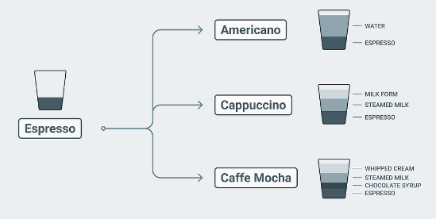
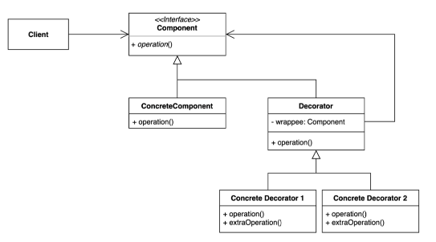

# Decorator Pattern ( 데코레이터 패턴)

<br/>
<br/>

# Decorator Pattern



- Gof 디자인 패턴 중 구조 패턴에 해당한다.
- 기본 기능에 추가할 수 있는 기능의 종류가 많은 경우에 각 추가기능을 Decorator 클래스로 정의한 후 필요한 Decorator 객체를 조합함으로써 추가기능의 조합을 설계하는 방식이다.
- 기존 코드를 변경하지 않고, 부가 기능을 추가하는 패턴이다.

<br/>
<br/>

# ① Why? (의도, Intent)\*\*\*

> "이 패턴은 **어떤 문제(불편함)**를 해결하기 위해 등장했는가?"

---

::> 기존 객체의 코드를 수정하지 않으면서, 동적으로 유연하게 기능을 추가하거나 확장하고 싶다.

- **상속의 한계**
  - 가장 고전적인 기능 확장 방식은 '상속'
  - 상속은 **정적**이기 때문에 컴파일 시점에 기능이 고정된다.
  - 프로그램이 실행되는 도중에 사용자의 선택이나 특정 조건에 따라 동적으로 기능을 추가하거나 조합해야 할 때, 상속 기반의 정적인 구조는 이를 지원하기 어렵다.
- **기능의 조합**

  - 필요한 모든 조합만큼 클래스가 기하급수적으로 늘어나는 문제가 발생한다.

    → OCP(개방 폐쇄 원칙) 위반 문제

  - 기능 확장이 필요할 때, 새로운 기능을 추가할 때마다 기존 코드를 수정해야한다.

    → SRP(단일 책임 원칙) 위반 문제

  - 상속을 피하기 위해 조건문으로 처리하게 된다면, 모든 부가 기능을 하나의 클래스에서 모두 처리해야하는 문제가 발생한다.

> 데코레이터 패턴은 이 문제를 **상속 대신 구성을 통해 객체를 감싸는(Wrapping) 방식**으로 해결한다.
>
> 객체의 결합 을 통해 기능을 동적으로 유연하게 확장 할 수 있게 해주는 패턴

---

<br/>
<br/>

# ② What? (구조, Structure)

> "그 문제를 해결하기 위해, **어떤 역할(클래스)들이 등장**하며 **서로 어떻게 상호작용**하는가?"

---



- **Component (컴포넌트 인터페이스)**
  - `ConcreteComponent`(원본 객체)와 모든 `Decorator`(데코레이터 객체)가 **공통으로 구현해야 할 인터페이스 또는 추상 클래스**
  - `operation()`과 같이 핵심적인 행동 정의함
  - 클라이언트는 `Component` 인터페이스를 통해 실제 객체가 `ConcreteComponent`인지, `Decorator`에 의해 포장된 객체인지 구분하지 않고 동일하게 다룰 수 있음
- **ConcreteComponent (구체적인 컴포넌트)**
  - `Component` 인터페이스를 구현하는 **원본 객체**로**,** `Decorator`에 의해 포장될 핵심 기능 또는 데이터를 제공하는 객체
  - `operation()` 자신의 기본 행동을 정의 메소드를 구현
  - `Decorator`에 의해 추가되는 어떤 기능도 가지고 있지 않음
- **Decorator (데코레이터 추상 클래스)**
  - `Component` 인터페이스를 구현하며, 동시에 `Component` 타입의 객체를 **멤버 변수로 포함(참조)하는 추상 클래스**
  - `wrapee`는 `is-a` 관계가 아닌 `has-a` 관계로, 다른 `Component` 객체를 감싸는(Wrapping) 역할
  - `operation()` 메소드는 `wrapee.operation()`을 호출하도록 구현될 수 있으며, 구체적인 데코레이터에서 기능을 추가할 여지를 남김
- **Concrete Decorator 1, Concrete Decorator 2 (구체적인 데코레이터)**
  - `Decorator` 추상 클래스를 상속받아 실제 추가할 기능(책임)을 구현하는 클래스들
  - `operation()` 메소드를 오버라이드하여, 자신이 맡은 부가적인 기능을 수행한 후, 내부에 참조하고 있는 `wrapee.operation()`을 호출
  - 필요에 따라 `extraOperation()`과 같이 데코레이터 고유의 새로운 메소드를 추가 가능함
    - (클라이언트가 해당 메소드를 호출하려면 `Component` 타입이 아닌 `ConcreteDecorator` 타입으로 캐스팅해야 하므로 `Component` 인터페이스의 추상화 이점이 일부 감소할 수 있음)

### **`ConcreteComponent` is-a `Component`**

- `ConcreteComponent`는 `Component` 인터페이스를 구현

### **`Decorator` is-a `Component`**

- `Decorator`도 `Component` 인터페이스를 구현

### **`Concrete Decorator` is-a `Decorator`**

- `Concrete Decorator`들은 `Decorator` 추상 클래스를 상속받음

### **`Decorator` has-a `Component`(wrapee)**

- `Decorator`는 내부에 `Component` 타입의 객체(이름: `wrapee`)를 멤버 변수로 포함함.
- '객체를 감싸는(Wrapping)' 메커니즘을 구현하며, 데코레이터가 또 다른 데코레이터나 원본 `Component`를 포장할 수 있게 함.
  <br/>
  <br/>

---

<br/>
<br/>

# ③ How? (구현, Implementation)

> "그래서 이걸 **코드로 어떻게 구현**하는가?"

---

## Code Sample (Java)

### Latte.java (Component)

```java
public abstract class Latte {
    public abstract void add();
}
```

### CafeLatte.java (ConcreteComponent)

```java
public class CafeLatte extends Latte {
    @Override
    public void add() {
        System.out.println("카페라떼");
    }
}
```

### AddOption.java (Decorator)

```java
public abstract class AddOption extends Latte {
    private Latte addOptionLatte;
    public AddOption(Latte addOptionLatte) {
        this.addOptionLatte = addOptionLatte;
    }
    @Override
    public void add() {
        addOptionLatte.add();
    }
}
```

### AddShot.java (ConcreteDecorator 1, 2)

```java
public class AddShot extends AddOption {    // 샷추가 옵션
    public AddShot(Latte addOptionLatte) {
        super(addOptionLatte);
    }
    @Override
    public void add() {
        super.add();
        addShot();
    }
    private void addShot() {
        System.out.println("샷추가");
    }
}

public class SizeUp extends AddOption { // 사이즈업 옵션
    public SizeUp(Latte addOptionLatte) {
        super(addOptionLatte);
    }
    @Override
    public void add() {
        super.add();
        SizeUp();
    }
    private void SizeUp() {
        System.out.println("사이즈업");
    }
}
```

### Client.java

```java
public class Client {
    public static void main(String[] args) {
        Latte latte = new CofeLatte();
        latte.add();    // 기본 카페라떼

        Latte latte2 = new SizeUp(new AddShot(new CofeLatte()));
        latte2.add();   // 모든 옵션이 추가된 카페라떼
    }
}
```

### 실행흐름

```
[Client: Client.main]
    |
    V
[Decorator: SizeUp] "SizeUp 객체의 add() 호출"
    |
    |  1. super.add() 호출  --> 자신이 감싸고 있는 AddShot 객체에게 위임
    |     (AddOption의 add()를 거쳐 addOptionLatte.add() 실행)
    |     V
    |   [Decorator: AddShot] "AddShot 객체의 add() 호출"
    |     |
    |     |  1-1. super.add() 호출 --> 자신이 감싸고 있는 CafeLatte 객체에게 위임
    |     |     (AddOption의 add()를 거쳐 addOptionLatte.add() 실행)
    |     |     V
    |     |   [Component: CafeLatte] "CafeLatte 객체의 add() 호출"
    |     |     |
    |     |     |  "카페라떼" 출력  (가장 안쪽 객체(원본)의 로직 실행)
    |     |     |
    |     |     <-- CafeLatte.add() 리턴 (종료)
    |     |
    |     |  1-2. addShot() 호출 (자신 고유의 로직 실행)
    |     |     |
    |     |     |  "샷추가" 출력
    |     |     |
    |     |     <-- addShot() 리턴
    |     |
    |     <-- AddShot.add() 리턴 (종료)
    |
    |  2. SizeUp() 호출 (자신 고유의 로직 실행)
    |     |
    |     |  "사이즈업" 출력
    |     |
    |     <-- SizeUp() 리턴
    |
    <-- SizeUp.add() 리턴 (종료)
```

### 실행결과

```java
카페라떼
샷추가
사이즈업
```

<br/>
<br/>

# ④ When? (장단점, Consequences)

> "이 패턴을 적용했을 때의 **장점과 단점(Trade-off)**은 무엇인가?
> **언제 사용하고, 언제 사용하지 말아야** 하는가?"

---

<br/>

## TRADE-OFF

> **기존 코드를 수정하지 않고** 객체에 **동적으로(런타임에) 새로운 책임을 유연하게 추가**할 수 있게 해주지만, 기능을 잘게 쪼개다 보면 자칫 **자잘한 클래스들이 너무 많아지고** 객체들의 **포장 구조가 복잡**해질 위험이 있다.

### **장점**

- **유연성 및 동적 기능 추가**
  - 상속과 달리, 컴파일 시점이 아닌 **런타임**에 원하는 기능(데코레이터)들을 동적으로 조합하거나 제거할 수 있다.
  - `new SizeUp(new AddShot(new CafeLatte()))`처럼 필요한 기능만 **선택적으로 조합 가능**하다.
- **OCP (개방-폐쇄 원칙) 만족**
  - 기존의 `Component`나 `ConcreteComponent` 코드(예: `CafeLatte`)를 **전혀 수정하지 않고도**, `AddSyrup`과 같은 새로운 데코레이터 클래스를 추가하여 **기능을 확장**할 수 있다.
- **SRP (단일 책임 원칙) 만족**
  - `ConcreteComponent` 의 핵심 기능은 `ConcreteComponent`가, 부가 기능은 `Decorator`를 상속한 `ConcreteDecorator`가 맡는다.
  - 모든 부가 기능이 하나의 클래스에 모여있는 것이 아니라, **각각의 기능(책임)이 별개의 작은 클래스로 분리**된다.
- **상속의 한계 극복**
  - 모든 조합을 상속으로 만들 때, 모든 경우의 수만큼 클래스를 생성하는 등의 문제를 해결한다.

### 단점

- **많은 수의 작은 클래스 생성**
  - 추가할 부가기능 하나 당 하나의 `ConcreteDecorator` 클래스가 필요하다.
  - 시스템에 관리해야 할 자잘한 클래스들이 많아질 가능성이 있다.
- **구조의 복잡성 증가**
  - 객체들이 겹겹이 포장(Wrapping)되는 구조는 상속 구조보다 파악하기 어렵다. (디버깅에 어려움)
  - 적용된 객체가 어떤 포장(Wrapping)이 되어있는지 직관적으로 파악하기 어렵다.
    - 디버깅 시 포장된 내부까지 추적해야 하는 번거로움이 있다.
- **불필요한 추상화**
  - 단순히 한두 가지 부가 기능만 필요하고 그 조합도 고정적이라면, 굳이 데코레이터 패턴을 도입하는 것이 오히려 구조를 복잡하게 만들고 코드 가독성을 떨어뜨릴 수 있다.

---

# 적용 사례 분석

## Java I/O (입출력 스트림)

- **원본 (Component):** `FileInputStream` (파일에서 바이트를 읽는 기본 기능)
- **데코레이터 (Decorator):** `BufferedInputStream`, `DataInputStream`, `GZIPInputStream` 등

1. **상속 (기본 구조):**
   - `InputStream`, `OutputStream`, `Reader`, `Writer` 같은 추상 클래스(Component)가 기본 뼈대를 이룸
   - `FileInputStream`, `ByteArrayInputStream` 등은 이 추상 클래스를 상속받아 데이터 소스(원본, ConcreteComponent)에 직접 연결되는 핵심 기능을 구현
2. **데코레이터 패턴 (기능 확장):**
   - `BufferedInputStream`, `DataInputStream`, `ObjectInputStream` 같은 클래스들(Decorator)이 핵심
   - 이 클래스들은 `InputStream`을 **상속**받는 동시에(`is-a`),
   - 생성자에서 다른 `InputStream` 객체를 **인자로 받는다**(`has-a`).
   - 즉, `FileInputStream`(원본)을 `BufferedInputStream`(데코레이터)으로 감싸서 '버퍼링' 기능을 동적으로 추가할 수 있는 것

`new BufferedInputStream(new FileInputStream("file.txt"))` 코드

```java
// 원본 객체 생성
InputStream fileIn = new FileInputStream("myFile.txt");

// 1. 버퍼링 기능(데코레이터) 추가
// 원본(fileIn)을 감싸서, 데이터를 미리 읽어오는 '버퍼' 기능을 덧씌움
InputStream bufferedIn = new BufferedInputStream(fileIn);

// 2. 데이터 타입별로 읽는 기능(데코레이터) 추가
DataInputStream dataIn = new DataInputStream(bufferedIn);

// 클라이언트는 DataInputStream을 사용하지만,
// 실제로는 Data -> Buffer -> File 순서로 기능이 래핑되어 실행됩니다.
int data = dataIn.readInt();
```
