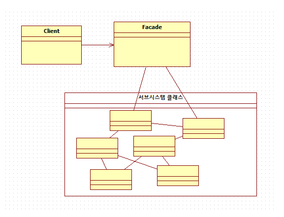

# 퍼사드 패턴



- 퍼사드는 복잡한 내부 로직을 감싸서 하나의 깔끔한 로직으로 보이게 숨기는 역할을 합니다.
- 퍼사드 패턴의 핵심은 클라이언트가 복잡한 서브시스템의 구성 요소들을 직접 하나하나 제어할 필요 없이 퍼사드를 통해 사용 가능하게 끔 하는 것입니다.

---

### 퍼사드 패턴이 필요한 상황 (문제점)

퍼사드 패턴이 없다면, 클라이언트는 시스템의 기능을 사용하기 위해 너무 많은 객체와 직접 상호작용해야 합니다.

예를 들어, '영화 보기'라는 기능을 실행하려면 클라이언트는 다음과 같은 모든 구성 요소를 직접 제어해야 합니다.

Java

```jsx
// 서브시스템의 복잡한 구성 요소들
class Amplifier {
    public void on() { System.out.println("앰프 켜기"); }
    public void setVolume(int level) { System.out.println("볼륨 조절: " + level); }
}
class DvdPlayer {
    public void on() { System.out.println("DVD 플레이어 켜기"); }
    public void play(String movie) { System.out.println(movie + " 재생"); }
}
class Projector {
    public void on() { System.out.println("프로젝터 켜기"); }
    public void wideScreenMode() { System.out.println("와이드 스크린 모드"); }
}
class Lights {
    public void dim(int level) { System.out.println("조명 밝기 조절: " + level); }
}

public class ProblemTest {
    public static void main(String[] args) {
        // 영화를 보기 위해 클라이언트가 직접 모든 것을 제어
        Amplifier amp = new Amplifier();
        DvdPlayer dvd = new DvdPlayer();
        Projector projector = new Projector();
        Lights lights = new Lights();

        System.out.println("--- 영화 보기 시작 ---");
        lights.dim(10);
        amp.on();
        amp.setVolume(5);
        projector.on();
        projector.wideScreenMode();
        dvd.on();
        dvd.play("인셉션");
        
    }
}
```

---

### 퍼사드 패턴의 구조 (Structure)

퍼사드 패턴은 크게 3개의 역할로 구성됩니다.

### 1. Subsystem

실제 기능을 수행하는 하나 이상의 복잡한 클래스들의 집합입니다.
서브시스템의 클래스들은 퍼사드의 존재를 알지 못합니다.

### 2. Facade

서브시스템의 복잡한 로직을 감싸는 객체입니다.
클라이언트를 위한 단순한 메서드(`watchMovie()`, `endMovie()` 등)를 제공합니다.
클라이언트의 요청이 오면, 내부적으로 서브시스템의 객체들을 조합하여 작업을 처리합니다.

Java

```jsx
// 2. Facade 클래스
class HomeTheaterFacade {
    private Amplifier amp;
    private DvdPlayer dvd;
    private Projector projector;
    private Lights lights;

    public HomeTheaterFacade(Amplifier amp, DvdPlayer dvd, Projector projector, Lights lights) {
        this.amp = amp;
        this.dvd = dvd;
        this.projector = projector;
        this.lights = lights;
    }

    public void watchMovie(String movie) {
        System.out.println("--- 영화 볼 준비 중... ---");
        lights.dim(10);
        amp.on();
        amp.setVolume(5);
        projector.on();
        projector.wideScreenMode();
        dvd.on();
        dvd.play(movie);
    }

    public void endMovie() {
        System.out.println("--- 영화 종료 중... ---");
    }
}
```

### 3. Client (클라이언트)

서브시스템의 기능을 사용하는 객체입니다.
Client는 퍼사드를 통해 서브시스템에 접근합니다.

Java

```jsx
// 3. Client
public class FacadeTest {
    public static void main(String[] args) {
        // 서브시스템 구성 요소들을 준비 (보통 Facade가 직접 생성하거나 DI 받음)
        Amplifier amp = new Amplifier();
        DvdPlayer dvd = new DvdPlayer();
        Projector projector = new Projector();
        Lights lights = new Lights();

        // Facade 객체 생성
        HomeTheaterFacade homeTheater = new HomeTheaterFacade(amp, dvd, projector, lights);

        // 클라이언트는 매우 단순한 메서드만 호출
        homeTheater.watchMovie("인셉션");
        
        System.out.println("--- 영화 감상 후 ---");
        homeTheater.endMovie();
    }
}
```

---

### 언제 사용하면 좋을까?

- 복잡한 서브시스템을 단순하게 사용하고 싶을 때: 클라이언트가 알아야 할 클래스의 수를 줄여주고, 사용법을 단순화합니다.
- 클라이언트와 서브시스템 간의 결합도를 낮추고 싶을 때: 서브시스템의 내부 구현이 변경되어도, Facade의 인터페이스만 동일하다면 클라이언트 코드는 영향을 받지 않습니다.

---

### 실제 사용 사례

- **SLF4J :**
    - 가장 대표적인 퍼사드 패턴의 예입니다.
    - 클라이언트는 `SLF4J`라는 단순한 로깅 인터페이스(Facade)를 사용합니다.
    - 실제 로깅 처리(Subsystem)는 `Logback`, `Log4j`, `java.util.logging` 등 다양한 구현체 중 하나가 담당합니다.
- **Spring의 `JdbcTemplate`:**
    - Java의 `JDBC` API는 `Connection`, `Statement`, `ResultSet` 등을 직접 다뤄야 하는 복잡한 서브시스템입니다.
    - `JdbcTemplate`은 이 복잡한 과정을 감싸는 Facade 역할을 하여, 개발자가 SQL 쿼리와 결과 매핑에만 집중할 수 있도록 단순한 인터페이스를 제공합니다.