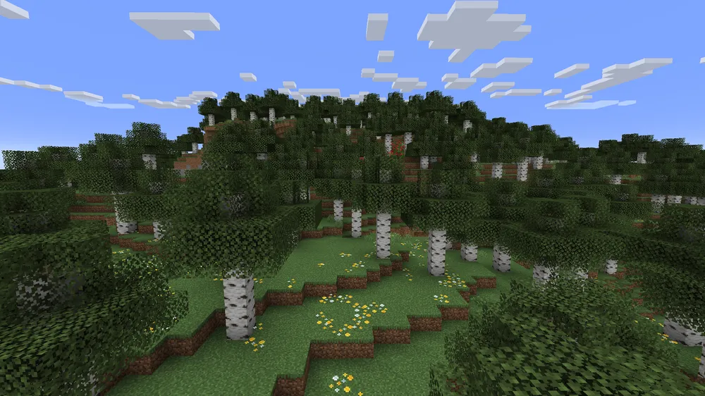

# etc. 플라이웨이트 패턴


*객체를 일일이 생성한 것과 객체를 공유 상태로 만든 것에 대한 메모리 무게 차이*

# 플라이웨이트 패턴의 개념

> [!NOTE]
> 플라이웨이트 패턴(Flyweight Pattern)은 공유를 위해 사용되는 패턴으로, 객체를 재사용해서 메모리를 절약하기 위한 목적의 디자인 패턴이다.

- 객체는 재사용되어야 하므로 공유되는 객체는 불변이어야 한다. 불변 객체가 아니라면 어떤 코드가 플라이 웨이트 객체를 임의로 수정했을 때 그 객체를 공유하고 있는 다른 코드에 영향을 미치기 때문이다. (싱글톤과 유사)

- 시스템에 많은 수의 동일한 불변 객체가 있다면 이 패턴을 사용해서 객체를 플라이웨이트로 설계하고 메모리에 하나의 인스턴스만 보관하여 메모리를 절약할 수 있다.

## 핵심 아이디어

> 내부 상태 공유 + 외부 상태 분리
> 

| 구분 | 설명 | 예시 |
| --- | --- | --- |
| **내부 상태 (Intrinsic)** | 여러 객체가 **공유할 수 있는 불변 데이터** | 글꼴, 색상, 타일 이미지 등 |
| **외부 상태 (Extrinsic)** | 개별 객체마다 **달라지는 데이터** | 위치, 사용자 입력 등 |
- 이렇게 분리하면 내부 상태는 한 번만 메모리에 올리고, 외부 상태만 각 인스턴스마다 다르게 유지할 수 있어서 메모리 절약 효과가 커진다.

⇒ 쉽게 말하면, 똑같은 속성을 가진 객체를 매번 새로 만들지 않고, 이미 만들어둔 객체를 재사용하는 방식이다.

# 플라이웨이트를 사용하는 이유

플라이웨이트는 보통 게임에서 많이 사용된다. 게임에서는 공통된 에셋이 많은데, 에셋을 새로 만들 때마다 객체를 새로 생성하면 분명 과부하가 생길 것이다.



플라이웨이트의 대표 예시가 마인크래프트이다.

마인크래프트에서 수천 개의 나무를 그린다고 하자. 나무마다 텍스쳐, 색상, 종류 등이 있다면 이런 것은 전부 공유 가능하고 불변한 내부 상태이다(Intrinsic). 하지만 각 나무의 좌표나 회전 각도는 각 인스턴스마다 달라지는 외부 상태이다(Extrinsic).

## Flyweight 패턴으로 나무 객체 관리

팩토리(Factory) 패턴과 함께 자주 쓰인다.

```jsx
// 플라이웨이트 객체 (공유할 데이터)
class TreeType {
  constructor(name, color, texture) {
    this.name = name;
    this.color = color;
    this.texture = texture;
  }

  draw(x, y) {
    console.log(
      `Draw ${this.name} tree with color ${this.color} at (${x}, ${y})`
    );
  }
}

// 플라이웨이트 팩토리
class TreeFactory {
  constructor() {
    this.treeTypes = {};
  }

  getTreeType(name, color, texture) {
    const key = `${name}_${color}_${texture}`;
    if (!this.treeTypes[key]) {
      console.log("새 TreeType 생성:", key);
      this.treeTypes[key] = new TreeType(name, color, texture);
    }
    return this.treeTypes[key];
  }
}

// 개별 Tree 객체 (외부 상태)
class Tree {
  constructor(x, y, treeType) {
    this.x = x;
    this.y = y;
    this.treeType = treeType;
  }

  draw() {
    this.treeType.draw(this.x, this.y);
  }
}

// 사용 예시
const factory = new TreeFactory();

const forest = [];
forest.push(new Tree(10, 20, factory.getTreeType("Oak", "Green", "Rough")));
forest.push(new Tree(15, 25, factory.getTreeType("Oak", "Green", "Rough"))); // 재사용
forest.push(new Tree(50, 60, factory.getTreeType("Pine", "DarkGreen", "Smooth")));

forest.forEach(tree => tree.draw());
```

**출력 결과:**

```jsx
새 TreeType 생성: Oak_Green_Rough
새 TreeType 생성: Pine_DarkGreen_Smooth
Draw Oak tree with color Green at (10, 20)
Draw Oak tree with color Green at (15, 25)
Draw Pine tree with color DarkGreen at (50, 60)
```

⇒ Oak_Green__Rough은 한 번만 생성돼서 재사용됨 - 메모리 절약 

## 플라이웨이트의 활용 사례

| 활용 분야 | 설명 |
| --- | --- |
| **React 컴포넌트 렌더링 최적화** | 동일한 UI 요소를 메모이제이션(`React.memo`)으로 재사용 |
| **캔버스 / 게임 엔진** | 동일한 이미지 리소스나 텍스처 공유 |
| **문자 렌더링 / 아이콘 폰트** | 동일한 글꼴 스타일을 공유 |
| **데이터 캐싱** | 같은 데이터를 매번 불러오지 않고 캐시에서 공유 |

# 플라이웨이트와 싱글톤, 캐시, 오브젝트 풀의 차이

## 플라이웨이트와 싱글톤의 차이

싱글톤은 한 클래스가 하나의 객체만 생성할 수 있는 반면, 플라이웨이트는 여러 객체를 생성할 수 있으며, 각각이 여러 코드에서 공유된다. 


플라이웨이트 패턴은 싱글톤 패턴의 변형인 다중 인스턴스 패턴과 다소 유사한 면이 있다. 그러나 플라이웨이트 패턴은 객체를 재사용해 메모리를 절약하는 데 목적이 있지만, 다중 인스턴스 패턴은 객체 수를 제한하는 데 목적이 있다. 


또한, 싱글턴 객체는 변할 수 있다(mutable). 플라이웨이트 객체들은 변할 수 없다(immutable).

## 플라이웨이트와 캐싱의 차이

플라이웨이트 패턴은 팩토리 클래스를 사용하여 생성된 객체를 캐싱한다. 여기서 캐시는 실제로 저장소를 의미하며 우리가 일반적으로 언급하는 데이터베이스 캐시, CPU 캐시, MemCache 캐시와는 다르다. 우리가 일반적으로 언급하는 캐시는 재사용을 위한 것이 아니라 주로 액세스 효율성을 개선하기 위한 것이기 때문이다.

## 플라이웨이트와 오브젝트 풀의 차이

오브젝트 풀은 빈번한 객체 생성과 해제로 인한 메모리 단편화를 방지하기 위해 만든 연속적인 메모리 공간이다. 객체가 생성될 때마다 객체 풀에서 객체를 꺼내서 사용하고 객체의 사용이 끝나면 다시 객체 풀에 넣는다.  


풀링 기술의 재사용은 반복 사용이라는 말로 바꿀 수 있으며, 주요 목적은 매번 재생성하지 않고 기존의 객체를 가져오는 것을 통해 시간을 절약하는 것이다. 이때 풀에서 가져온 객체는 단독 사용이 가능하기 때문에 다른 곳에서는 동시에 사용할 수가 없다. 반면 플라이웨이트 패턴의 재사용은 공동 사용이라는 말로 바꿀 수 있으며, 전체 라이프 사이클 내에서 모든 사용자가 객체를 공유하며, 주 목적은 시간이 아닌 공간을 절약하는 것이다.