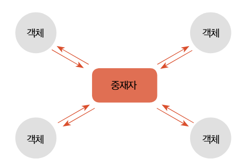
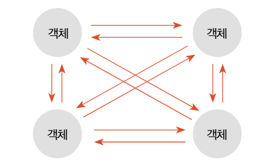
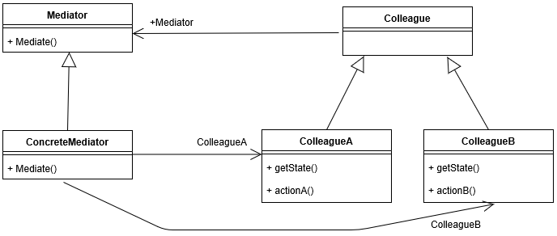
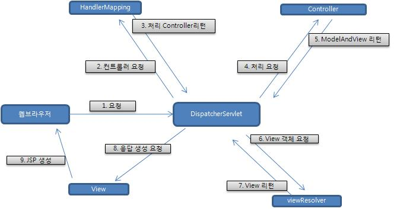
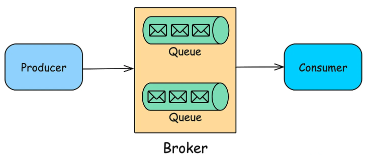
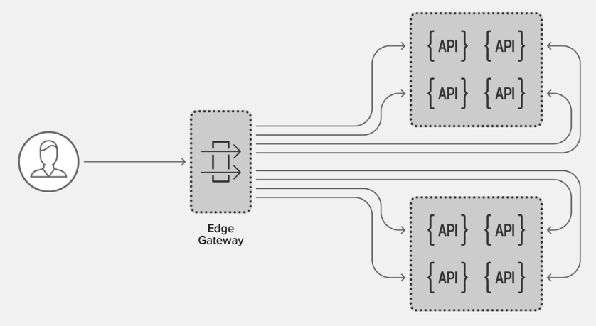

# Mediator Pattern ( 중재자 패턴 )

<br/>
<br/>

# Mediator Pattern



- 객체들 관계 중심에 중간에 객체들을 통제하고 지시할 수 있는 역할을 하 중재자를 두고, 중재자에게 모든 것을 요구하여 객체의 행위 요청을 중앙에서 제어한다.
- 통신의 빈도수를 줄여 상호 작용의 유연한 변경을 지원하고 객체 지향의 목표를 달성하게 해주는 패턴이다.
- 서로 직접 통신하는 밀접하게 결합된 개체 간의 복잡성과 의존성을 줄이는 것이다.

<br/>
<br/>

# ① Why? (의도, Intent)\*\*\*

> "이 패턴은 **어떤 문제(불편함)**를 해결하기 위해 등장했는가?"

---

서문

- 객체지향
  - 하나의 커다란 행동을 작은 단위의 객체로 분산하여 역할을 분할하고, 해당 동작을 재사용할 수 있게 한다.
  - 모든 행동을 하나의 객체에 집중하여 처리하지 않는다.
  - 행동은 작은 단위로 분리되고, 목적 동작을 수행하기 위해 분리된 행동을 연결한다.



:: > 분산된 객체들 간에 정보를 주고받기 위해 복잡한 메시지 호출 동작이 발생한다.

:: > 분리된 객체는 서로 강력한 의존적 결합 구조를 가진다. ( Tight coupling )

<aside>

객체의 구성 단위를 재사용하기 위해 분산된 객체 지향 구조를 채택했음에도 불구하고, 강력한 결합 구조가 객체의 재상용을 방해하는 요인이 된다.

객체를 분리했지만, 분리된 객체는 강한 의존성 때문에 독립적인 행동에 제약을 가진다.

</aside>

---

<br/>
<br/>

# ② What? (구조, Structure)

> "그 문제를 해결하기 위해, **어떤 역할(클래스)들이 등장**하며 **서로 어떻게 상호작용**하는가?"

---



- **`Mediator` (중재자 인터페이스)**
  - `Colleague` 객체들이 상호작용을 위해 사용하는 공통 인터페이스
  - `ConcreteMediator`가 이 인터페이스를 구현하며, `Colleague`들은 이 인터페이스 타입으로 `Mediator`를 참조함
  - `Mediate()`와 같이 중재를 위한 메서드를 정의함
- **`Colleague` (객체 인터페이스/추상 클래스)**
  - 상호작용이 필요한 개별 객체들의 공통 상위 타입
  - 자신과 통신할 `Mediator` 객체를 참조함
  - `ColleagueA`, `ColleagueB`가 이 `Colleague`를 구현(또는 상속)함
- **`ConcreteMediator` (실제 중재자)**
  - `Mediator` 인터페이스를 구현한 실제 중재 로직
  - 자신이 중재해야 할 모든 `Colleague` 객체들(`ColleagueA`, `ColleagueB`)을 참조함
  - 한 `Colleague`로부터 요청(예: `mediate()` 호출)을 받으면, 내부에 캡슐화된 복잡한 로직에 따라 다른 `Colleague`에게 필요한 작업을 지시함
- **`ConcreteColleague` (`ColleagueA`, `ColleagueB`)**
  - ⇒ `Colleague`를 구현한 실제 객체들
  - ⇒ 다른 `Colleague` 객체(`A`는 `B`를, `B`는 `A`를)를 전혀 알지 못함
  - ⇒ 자신의 상태가 변하거나 다른 객체와의 상호작용이 필요할 때, 오직 자신이 알고 있는 `Mediator`에게만 `mediate()` 요청을 보냅니다

### **`ConcreteMediator` is-a `Mediator`**

- `ConcreteMediator`는 `Mediator` 인터페이스를 구현

### **`ConcreteColleague` (`A`, `B`) is-a `Colleague`**

- `ColleagueA`와 `ColleagueB`는 `Colleague` 추상 클래스를 상속(또는 인터페이스를 구현)함

### **`Colleague` has-a `Mediator`**

- 모든 `Colleague`(동료)는 `Mediator`(중재자)를 멤버 변수로 포함
- 동료는 다른 동료 객체 대신, 자신이 아는 유일한 통신 대상인 `Mediator`를 통해 상호작용을 요청

### **`ConcreteMediator` has-a `Colleagues`**

- `ConcreteMediator`는 자신이 중재할 `ColleagueA`와 `ColleagueB`를 멤버 변수로 포함
- 이 참조를 이용해 `Colleague`들 간의 상호작용(예: `A`가 요청하면 `B`를 호출)을 조율

**결합도 (Decoupling)**

- `Colleague` 객체들은 `Mediator`의 존재만 알 뿐, 다른 `Colleague` 객체들의 존재를 알 필요가 없음**.**
- 이를 통해 객체 간의 복잡한 N:N 상호 의존 관계가 **1:N (Colleague -> Mediator)** 관계로 단순화되며 결합도가 낮아짐

---

<br/>
<br/>

# ③ How? (구현, Implementation)

> "그래서 이걸 **코드로 어떻게 구현**하는가?"

---

## Code Sample (Java)

### Mediator.java

```java
import java.util.ArrayList;
import java.util.List;

interface Mediator {
    // Colleague를 리스트에 등록
    void addColleague(Colleague colleague);

    // Colleague로부터 이벤트를 받아 중재 (메시지 추가)
    void mediate(Colleague colleague, String message);
}
```

### Colleague.java

```java
abstract class Colleague {
    protected Mediator mediator;

    public Colleague(Mediator mediator) {
        this.mediator = mediator;
    }

    // Mediator가 호출할 공통 수신 메서드 (추상)
    public abstract void receive(String message);
}
```

### ConcreteMediator.java

```java
class ConcreteMediator implements Mediator {

    private List<Colleague> colleagues;

    public ConcreteMediator() {
        this.colleagues = new ArrayList<>();
    }

    // Colleague 객체들을 리스트에 추가
    @Override
    public void addColleague(Colleague colleague) {
        this.colleagues.add(colleague);
    }

    // 중재 로직
    @Override
    public void mediate(Colleague sender, String message) {
        System.out.println("Mediator: " + sender.getClass().getSimpleName() + "로부터 이벤트 감지 (" + message + ")");

        for (Colleague receiver : colleagues) {
            if (receiver != sender) {
                // 다른 모든 동료에게 메시지를 수신하도록 함
                receiver.receive(message);
            }
        }
    }
}

```

### ColleagueA.java

```java
class ColleagueA extends Colleague {
    public ColleagueA(Mediator mediator) {
        super(mediator);
    }

    // 고유 기능
    public void actionA() {
        String message = "ColleagueA의 actionA() 실행됨";
        System.out.println(message);
        // Mediator에게 중재 요청
        mediator.mediate(this, message);
    }

    // Mediator로부터 메시지 수신
    @Override
    public void receive(String message) {
        System.out.println("  -> (ColleagueA 수신) " + message);
    }
}
```

### ColleagueB.java

```java
class ColleagueB extends Colleague {
    public ColleagueB(Mediator mediator) {
        super(mediator);
    }

    // 고유 기능
    public void actionB() {
        String message = "ColleagueB의 actionB() 실행됨";
        System.out.println(message);
        // Mediator에게 중재 요청
        mediator.mediate(this, message);
    }

    // Mediator로부터 메시지 수신
    @Override
    public void receive(String message) {
        System.out.println("  -> (ColleagueB 수신) " + message);
    }
}
```

### MediatorDemo.java

```java
public class MediatorDemo {
    public static void main(String[] args) {
        // 1. 중재자 생성
        Mediator mediator = new ConcreteMediator(); // 인터페이스 타입으로 받음

        // 2. 동료(Colleague) 생성 시 Mediator를 주입
        ColleagueA colleagueA = new ColleagueA(mediator);
        ColleagueB colleagueB = new ColleagueB(mediator);

        // 3. 중재자가 동료들을 알도록 리스트에 등록
        mediator.addColleague(colleagueA);
        mediator.addColleague(colleagueB);

        // 4. Client는 Colleague의 행동만 호출
        System.out.println("--- Client가 ColleagueA의 actionA() 호출 ---");
        colleagueA.actionA();

        System.out.println("\n--- Client가 ColleagueB의 actionB() 호출 ---");
        colleagueB.actionB();
    }
}
```

### 실행 흐름

```
[Client: MediatorListDemo.main]
        |
        | colleagueA.actionA() 호출
        V
[Colleague: ColleagueA]
        |
        | 1. "ColleagueA의 actionA() 실행됨" 출력 (자체 로직)
        |
        | 2. mediator.mediate(this, ...) 호출 --> 중재자에게 위임
        |       V
        |    [Mediator: ConcreteMediator]
        |       |
        |       | "Mediator: ColleagueA로부터 이벤트 감지..." 출력
        |       |
        |       | `colleagues` 리스트 순회 (A, B)
        |       |
        |       | A는 sender이므로 skip
        |       |
        |       | B는 sender가 아니므로 colleagueB.receive(...) 호출
        |       |       V
        |       |    [Colleague: ColleagueB]
        |       |       |
        |       |       | " -> (ColleagueB 수신)..." 출력 (수신 로직)
        |       |       |
        |       |    <--| 컨트롤 리턴 (receive 종료)
        |       |
        |       | (순회 종료)
        |       |
        |    <--| 컨트롤 리턴 (mediate 종료)
        |
        | 3. (actionA 메서드 종료)
        V
[호출 종료]
```

### 실행결과

```
--- Client가 ColleagueA의 actionA() 호출 ---
ColleagueA의 actionA() 실행됨
Mediator: ColleagueA로부터 이벤트 감지 (ColleagueA의 actionA() 실행됨)
  -> (ColleagueB 수신) ColleagueA의 actionA() 실행됨

--- Client가 ColleagueB의 actionB() 호출 ---
ColleagueB의 actionB() 실행됨
Mediator: ColleagueB로부터 이벤트 감지 (ColleagueB의 actionB() 실행됨)
  -> (ColleagueA 수신) ColleagueB의 actionB() 실행됨
```

---

<br/>
<br/>

# ④ When? (장단점, Consequences)

> "이 패턴을 적용했을 때의 **장점과 단점(Trade-off)**은 무엇인가?
> **언제 사용하고, 언제 사용하지 말아야** 하는가?"

---

## TRADE-OFF

> 객체 간 상호작용이 복잡한 경우 **결합도를 낮추고 재사용성을 높일 수 있지만**, 자칫 **'중재자' 자체가 너무 비대해질 위험**이 있다.

### **장점**

- **결합도 감소 (Loose Coupling)**
  - 동료(Colleague) 객체들이 서로를 몰라도 되므로 **결합도가 M:N에서 1:N으로** 낮아진다.
- **상호작용의 중앙화 (Centralized Control)**

  - 복잡한 관계와 로직이 모두 `ConcreteMediator` 한곳에 모여있어, 시스템의 상호작용을 이해하고 수정하기 쉬워진다.

    **→ SRP - 단일 책임 원칙,** 시스템 전체의 '상호작용' 관점에서 만족시킴
    → **OCP - 개방 폐쇄 원칙**, 시스템의 나머지 부분을 변경할 필요 없이 새로운 중재자(구현체)를 도입할 수 있음

- **객체 재사용성 증가**
  - `TcpComm`은 `Display`나 `Log`에 의존하지 않으므로, 다른 중재자 환경에서도 쉽게 재사용될 수 있습니다.

### **단점**

- **중재자의 복잡성 증가**
  - 모든 상호작용 로직이 `ConcreteMediator`로 집중되다 보니, 시스템이 커질수록 `ConcreteMediator`객체 자체가 너무 비대해져서 유지보수의 병목점이 될 수 있다.
- **불필요한 추상화**
  - 객체 간의 상호작용이 매우 단순하다면, 굳이 중재자 패턴을 도입하는 것이 오히려 클래스 수만 늘리고 구조를 불필요하게 복잡하게 만들 수 있다.

---

<br/>
<br/>

# 적용 사례 분석

## Spring MVC - DispatcherServlet



- **Mediator:** `DispatcherServlet`
- **Colleagues:** `HandlerMapping`, `Controller`, `ModelAndView`, `ViewResolver` 등

1. 모든 클라이언트의 HTTP 요청(Request)은 오직 **`DispatcherServlet`(중재자)**에게만 전달된다.
2. `DispatcherServlet`은 요청을 처리할 `Controller`가 누구인지 `HandlerMapping`(동료 1)에게 물어본다.
3. `DispatcherServlet`은 찾은 `Controller`(동료 2)에게 실제 비즈니스 로직 처리를 위임(호출)한다.
4. `Controller`는 처리 결과(데이터)와 뷰의 이름(논리적 이름)을 **`ModelAndView`(동료 3)** 객체에 담아 **`DispatcherServlet`에게만 반환한**다. (Controller는 ViewResolver를 모름)
5. `DispatcherServlet`은 이 논리적 뷰 이름을 실제 뷰(JSP, Thymeleaf 등)로 변환하기 위해 `ViewResolver`(동료 4)에게 물어본다.
6. `DispatcherServlet`은 최종적으로 뷰를 렌더링하여 클라이언트에게 응답(Response)을 보낸다.

> `Controller`가 `ViewResolver`의 존재를 전혀 모르고, `HandlerMapping`이 `Controller`를 직접 호출하지 않는다는 점이다.
> **모든 컴포넌트(동료)는 오직 `DispatcherServlet`(중재자)하고만 통신**하며, `DispatcherServlet`이 이들 간의 복잡한 상호작용을 모두 조율(중재)한다.

중재자 패턴이 완벽하게 적용된 것은 아니지만, 해당 디자인 패턴을 어느정도 가져간다.

>

<br/>
<br/>

## 메시지 브로커 / MessageQueue (Message Broker)



**RabbitMQ, Kafka, ActiveMQ** 같은 메시지 브로커

- **Mediator:** 메시지 브로커 서버 (예: RabbitMQ)
- **Colleagues:** `Publisher` (메시지 발행자)와 `Consumer` (메시지 구독자)

1. `Publisher`는 특정 `Exchange` (우체국)에 메시지를 보낼 뿐, 이 메시지를 누가(어떤 `Consumer`) 받아 처리할지 전혀 알지 못한다.
2. `Consumer` 또한 누가 메시지를 보냈는지(`Publisher`) 알 필요 없이, 특정 `Queue` (우편함)에서 메시지를 가져갈 뿐이다.
3. `메시지 브로커(Mediator)`가 이 둘 사이에서 메시지를 라우팅하고, 필터링하며, 저장하는 모든 **중재** 역할을 담당한다.

→ 이를 통해 `Publisher`와 `Consumer`는 서로를 전혀 모르는 상태(완벽한 디커플링)로 통신할 수 있다.

<br/>
<br/>

## API 게이트웨이 (API Gateway)



마이크로서비스 아키텍처(MSA)에서 **Spring Cloud Gateway, AWS API Gateway** 등

- **Mediator:** API Gateway 서버
- **Colleagues:** 외부 클라이언트 (Web/App) 및 내부 마이크로서비스 (User-Service, Order-Service 등)

1. 클라이언트는 수십 개의 마이크로서비스가 존재하는지 알 필요가 없다.
2. 클라이언트는 오직 API 게이트웨이(Mediator)라는 단일 엔드포인트하고만 통신한다.
3. 게이트웨이는 클라이언트의 요청을 받고, 어떤 서버로 요청을 보내야할지 판단하여 **중재**하고 라우팅해준다.
4. 또한, 인증, 로깅, 속도 제한 등 공통적인 상호작용 로직을 중앙에서 처리한다.

---

<br/>
<br/>

# 참고

[https://nginxstore.com/blog/api-gateway/효과적인-api-제공을-위한-api-gateway-패턴-선택/](https://nginxstore.com/blog/api-gateway/%ED%9A%A8%EA%B3%BC%EC%A0%81%EC%9D%B8-api-%EC%A0%9C%EA%B3%B5%EC%9D%84-%EC%9C%84%ED%95%9C-api-gateway-%ED%8C%A8%ED%84%B4-%EC%84%A0%ED%83%9D/)

[https://blog.algomaster.io/p/message-queues](https://blog.algomaster.io/p/message-queues)

[https://velog.io/@dnjsdn96/디자인패턴-중재자-패턴-Mediator-Pattern](https://velog.io/@dnjsdn96/%EB%94%94%EC%9E%90%EC%9D%B8%ED%8C%A8%ED%84%B4-%EC%A4%91%EC%9E%AC%EC%9E%90-%ED%8C%A8%ED%84%B4-Mediator-Pattern)

[https://docs.spring.io/spring-framework/docs/3.2.x/spring-framework-reference/html/mvc.html](https://docs.spring.io/spring-framework/docs/3.2.x/spring-framework-reference/html/mvc.html)
