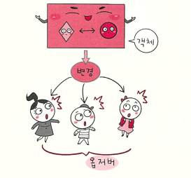

# 옵저버 패턴




- 옵저버 패턴은 한 객체(Subject)의 상태가 변할 때 그 객체에 의존하는 다른 객체들(Observers)에게 변화를 자동으로 알려주고 갱신할 수 있게 하는 행위 패턴입니다.

---

### 핵심 아이디어: 구독과 알림

옵저버 패턴의 핵심은 `Subject`(발행자)와 `Observer`(구독자)를 분리하는 것입니다.

- `Subject`(주체)는 자신의 상태가 변하는 객체입니다. `Subject`는 자신을 구독하는 `Observer`들의 목록(`List<Observer>`)을 가지고 있습니다.
- `Observer`(관찰자)는 `Subject`의 변화를 통보받아야 하는 객체입니다.
- `Subject`는 `Observer`가 구체적으로 누구인지 알 필요 없이, 오직 `Observer` 인터페이스의 `update()` 메서드만 알고 있습니다.
- `Subject`의 상태가 변하면, `Subject`는 자신이 가진 목록을 순회하며 모든 `Observer`의 `update()` 메서드를 호출하여 변화를 알립니다.

### 옵저버 패턴이 필요한 상황

옵저버 패턴이 없다면, 객체 간의 강한 결합이 발생합니다.

다음 예는 온라인 쇼핑몰의 주문 서비스입니다.
고객이 `OrderService`를 통해 주문을 완료했을 때, 다음과 같은 추가 작업들이 일어나야 합니다.

1. `EmailService`: 고객에게 주문 완료 이메일을 발송해야 함
2. `InventoryService`: 상품의 재고를 차감해야 함
3. `ShippingService`: 배송을 준비하라고 알려야 함

옵저버 패턴이 없다면, `OrderService`가 이 모든 것을 직접 처리해야 합니다.

---

Java

```jsx
class EmailService {
    public void sendEmail(Order order) {
        System.out.println("메일 발송: " + order.getProductName() + " 주문 완료");
    }
}
class InventoryService {
    public void decreaseStock(Order order) {
        System.out.println("재고 차감: " + order.getProductName());
    }
}

//OrderService가 모든 것을 직접 처리
class OrderService {
    // OrderService가 다른 모든 서비스들을 직접 알고 있어야 함
    private EmailService emailService = new EmailService();
    private InventoryService inventoryService = new InventoryService();
  
    // 주문 처리 메서드
    public void placeOrder(Order order) {
        System.out.println("[주문 서비스] " + order.getProductName() + " 주문 처리 시작");
        
        emailService.sendEmail(order);
        inventoryService.decreaseStock(order);
       
        // 만약 여기에 서비스가 추가된다면?
     
    }
}

public class ProblemTest {
    public static void main(String[] args) {
        OrderService orderService = new OrderService();
        Order order = new Order("신발", 50000);
        
        orderService.placeOrder(order);
    }
}
```

이 구조는 `OrderService`의 책임이 너무 많고(SRP 위반), 새로운 알림 대상이 생길 때마다 `OrderService` 코드를 수정해야 하는 OCP(개방-폐쇄 원칙) 위반 문제를 야기합니다.

---

### 옵저버 패턴의 구조 (Structure)

옵저버 패턴은 이 강한 결합을 '인터페이스'를 통해 해결합니다. `OrderService`는 `Subject`가 되고, 나머지 서비스들은 `Observer`가 됩니다.

### 1. Subject (주체, 발행자 인터페이스)

- Observer(관찰자)들을 등록(`register`)하고 제거(`remove`)하는 메서드를 제공합니다.
- 상태가 변경되었을 때 모든 Observer에게 알리는(`notifyObservers`) 메서드를 가집니다.

Java

```jsx
// 1. Subject 인터페이스
interface Subject {
    void registerObserver(Observer o);
    void removeObserver(Observer o);
    void notifyObservers(Order order);
}
```

### 2. Observer (관찰자, 구독자 인터페이스)

- Subject의 상태 변화를 통보받는(`update`) 메서드를 가지는 인터페이스입니다.

Java

```jsx
// 2. Observer 인터페이스
interface Observer {
    void update(Order order); // 주문 정보를 전달받음
}
```

### 3. ConcreteSubject

- `Subject` 인터페이스를 구현하며, 실제 상태(`state`)를 가집니다.
- 자신의 핵심 로직을 수행한 뒤, `notifyObservers()`를 호출하여 "관심 있는 사람들은 알아서 해"라고 알리기만 합니다.

Java

```jsx
import java.util.ArrayList;
import java.util.List;

// 3. ConcreteSubject (이제 OrderService는 부가 기능들을 모름)
class OrderService implements Subject {
    private List<Observer> observers = new ArrayList<>(); // 구독자 목록

    @Override
    public void registerObserver(Observer o) {
        observers.add(o);
    }

    @Override
    public void removeObserver(Observer o) {
        observers.remove(o);
    }

    @Override
    public void notifyObservers(Order order) {
        for (Observer observer : observers) {
            observer.update(order);
        }
    }

    // 주문 처리 (핵심 로직)
    public void placeOrder(Order order) {
        System.out.println("[주문 서비스] " + order.getProductName() + " 주문 처리 완료");
        
        notifyObservers(order);
    }
}
```

### 4. ConcreteObserver

- `Observer` 인터페이스를 구현하며, `update` 메서드에 실제 반응할 로직(이메일 발송, 재고 차감)을 작성합니다.

Java

```jsx
// 4. ConcreteObserver 1
class EmailServiceListener implements Observer {
    @Override
    public void update(Order order) {
        System.out.println("메일 발송: " + order.getProductName() + " 주문 완료");
    }
}

// 4. ConcreteObserver 2
class InventoryServiceListener implements Observer {
    @Override
    public void update(Order order) {
        System.out.println("재고 차감: " + order.getProductName());
    }
}
```

### 5. Client (클라이언트)

- `ConcreteSubject`와 `ConcreteObserver` 객체를 생성하고, `registerObserver`를 통해 둘을 연결(구독)합니다.

Java

```jsx
public class ObserverTest {
    public static void main(String[] args) {
        // 1. 주체(Subject) 생성
        OrderService orderService = new OrderService();

        // 2. 관찰자(Observers) 생성
        Observer emailListener = new EmailServiceListener();
        Observer inventoryListener = new InventoryServiceListener();

        // 3. Client가 주체에 관찰자들을 구독
        orderService.registerObserver(emailListener);
        orderService.registerObserver(inventoryListener);

        // 4. 주문 발생
        Order order1 = new Order("신발", 50000);
        orderService.placeOrder(order1);

        // 5. '쿠폰 서비스'가 새로 생겨도 OrderService 코드는 수정할 필요 없음
        Observer couponListener = new CouponServiceListener();
        orderService.registerObserver(couponListener);
        
        Order order2 = new Order("가방", 120000);
        orderService.placeOrder(order2);
    }
}
```

---

### 언제 사용하면 좋을까?

- 한 객체의 상태가 변경될 때, 그 변경에 반응해야 하는 다른 객체들이 많고 그 대상이 고정되어 있지 않을 때.
- 느슨한 결합이 중요할 때. (Subject는 Observer의 구체적인 클래스를 알 필요가 없음)
- 동적으로 관찰자를 추가하거나 제거해야 할 때. (구독/구독 취소)

---

### 실제 사용 사례

- **JavaScript DOM 이벤트 리스너**
    - `Subject` (주체): HTML `button` 요소
    - `Observer` (관찰자): `button.addEventListener('click', ...)`로 등록된 콜백 함수(리스너)
    - `Notify`: 사용자가 버튼을 click하는 이벤트
    - 버튼(`Subject`)은 어떤 함수(`Observer`)가 자신을 구독했는지 모르지만, 'click' 이벤트가 발생하면 등록된 모든 함수를 호출합니다.
- **Spring Framework의 ApplicationEvent**
    - `Subject` (주체): 이벤트를 발행하는 `ApplicationEventPublisher`
    - `Observer` (관찰자): `@EventListener` 어노테이션이 붙은 메서드 또는 `ApplicationListener` 구현체 (위 예시의 `EmailServiceListener`)
    - `OrderService`가 `publisher.publishEvent(new OrderEvent(order))`를 호출하면, `@EventListener`로 `OrderEvent`를 구독하고 있는 모든 메서드가 자동으로 실행됩니다.