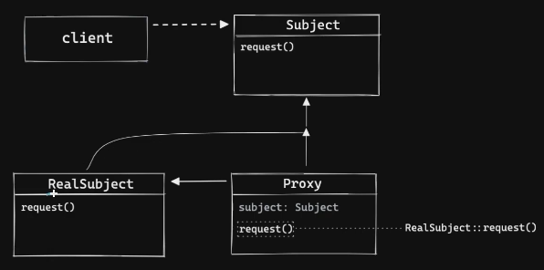
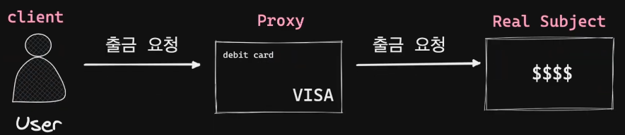
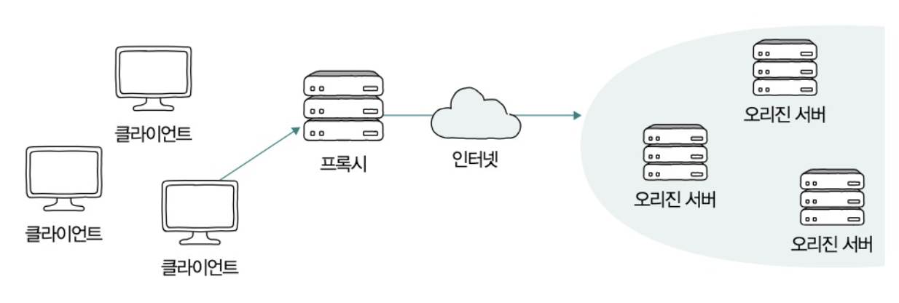
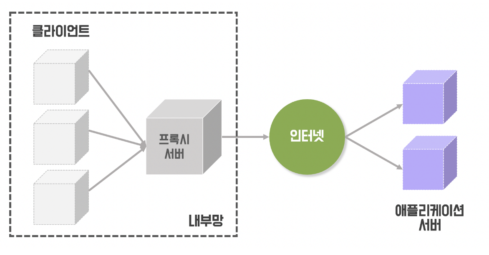
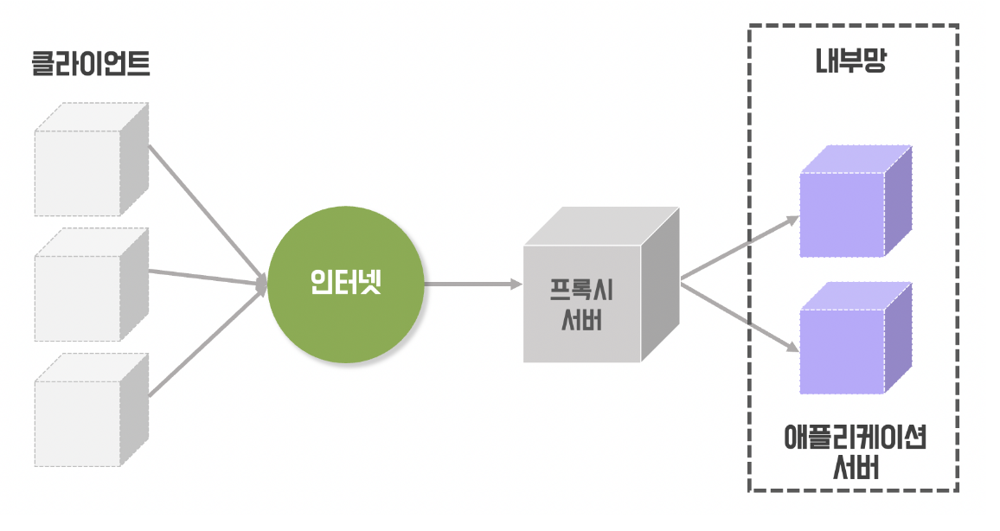

# Proxy Pattern (프록시 패턴)

<br/>
<br/>

# Proxy Pattern

- GoF(Gang of Four) 디자인 패턴 분류 중 **구조 패턴**
  - 구조 패턴 : 객체 간의 관계를 조직화하여 더 큰 구조를 만드는 패턴
- 특정 객체에 대한 접근을 제어하는 대리자(Proxy)를 제공하는 것

  <br/>
  <br/>

# ① Why? (의도, Intent)\*\*\*

> "이 패턴은 **어떤 문제(불편함)**를 해결하기 위해 등장했는가?"

---

**:: >** 실제 객체에 대한 접근을 제어하고 싶다.

if ) Client → 실제 객체(RealSubject) 직접 사용(참조)

1. 비용 문제
   - 실제 객체가 메모리를 많이 차지하거나, 생성하는데 시간이 오래 걸린다면, **당장 필요하지 않은데 미리 만들어 둬야해서** 프로그램 시작이 느려지거나 자원이 낭비됨.
   - ex ) DB 커넥션 등
2. 보안/권한 문제
   - 실제 객체(RealSubject)의 특정 기능을 **어떤 Client는 사용하게 하고**, **어떤 Client는 막아야 하는** 경우
   - 실제 객체(RealSubject) 안에 넣으면 **핵심 로직과 보안 로직이 뒤섞여** 코드 가시성이 떨어짐
3. 반복 작업 문제
   - 실제 객체(RealSubject)의 모든 메서드가 **호출될 때마다 전/후에 항상 똑같은 작업을 수행**해야하는 경우
   - 모든 메서드에 중복되는 코드가 많아지고, 유지보수가 어려워짐
   - ex ) 로그 남기기, 트랜잭션 시작/종료

<aside>

Client가 실제 객체(RealSubject)를 직접 부르지 못하게 함.

대리자 (가짜 객체) Proxy를 만들어서 Client에게 주고,

이 Proxy는 호출될 때,

1. 필요한 시점에만 RealSubject를 만들거나
2. 권한을 검사하거나
3. 공통 작업을 대신 처리한 뒤

실제 객체(RealSubject)에게 실제 요청을 전달해주면 됨.

::> 실제 객체(RealSubject)의 코드는 수정하지 않으면서 (→ OCP 원칙), 그 객체에 대한 접근을 제어하고 부가 기능을 덧붙이는 유연함을 제공 가능함.

</aside>

---

<br/>
<br/>

# ② What? (구조, Structure)

> "그 문제를 해결하기 위해, **어떤 역할(클래스)들이 등장**하며 **서로 어떻게 상호작용**하는가?"

---



- `Subject`(Interface) ⇒ Client가 사용하는 공통 인터페이스
  - RealSubject와 Proxy가 모두 이 인터페이스를 구현
- `RealSubject`(실제 주체) ⇒ 실제 작업 수행 객체
  - 리소스 사용이 많거나, 생성 비용이 비싼 경우 등
- `Proxy` ⇒ `Client`의 요청을 받아 `RealSubject`에 대해 참조
  - 실제 객체에 대한 접근을 제어하거나, 추가적인 기능을 사전(pre) 및 사후(post)에 부여 가능
- `Client` → 프록시 객체
  - 프록시 객체를 통해 실제 객체의 기능을 사용

### `Proxy` is - a `Subject`

- `Proxy` 는 `Subject` 인터페이스를 구현함
- `Client` 는 `Subject` 타입으로 `Proxy` 객체를 받을 수 있음
  - `Client`는 `RealSubject`를 사용하는지, `Proxy`를 사용하는지 몰라도 됨
    → (LSP, 리스코프 치환 원칙)

### `Proxy` has - a `RealSubject`

- `Proxy`는 `RealSubject`를 멤버 변수로 포함함.
- `Proxy`는 부가 기능을 수행한 뒤 실제 작업(핵심 로직)을 `RealSubject` 에게 위임함

<br/>
<br/>

---

<br/>
<br/>

# ③ How? (구현, Implementation)

> "그래서 이걸 **코드로 어떻게 구현**하는가?"

---

## Code Sample (Java)

### Subject.java

```java
// Subject.java
public interface Subject{
    String request();    // 로직을 실행하는 메서드
}
```

### RealSubject.java

```java
// RealSubject.java
public class RealSubject implements Subject{

    @Override
    public String request() {
        System.out.println("[RealSubject] : 핵심 로직 실행");
        return "핵심 로직 결과";
    }
}
```

### Proxy.java

```java
// ServiceProxy.java
public class Proxy implements Subject {

    // 실제 주체(RealService)에 대한 참조
    private Subject realSubject;

    public Proxy(Subject realSubject) {
        this.realSubject = realSubject;
    }

    @Override
    public String request() {
        // [부가 기능 - Pre]
        System.out.println("[Proxy] : 작업을 시작하기 전 작업 수행(pre)");

        // [핵심 기능 위임]
        String result = realSubject.request(); // realSubject의 메서드 호출

        // [부가 기능 - Post]
        System.out.println("[Proxy] : 작업이 완료된 후 작업 수행(post)");

        return result;
    }
}
```

### Client

```java
// Client.java
public class Client {
    public static void main(String[] args) {
        // 1. 실제 객체를 생성
        Subject realSubject = new RealSubject();

        // 2. 프록시 객체를 생성하고, 실제 객체를 주입
        Subject proxy = new Proxy(realSubject);

        // 3. Client는 인터페이스(IService) 타입으로 프록시를 사용
        System.out.println("[Client] : 프록시의 request()를 호출");
        String result = proxy.request();

        System.out.println("[Client] 받은 결과 : " + result);
    }
}
```

### 실행 결과

```
[Client] : 프록시의 request()를 호출
[Proxy] : 작업을 시작하기 전 작업 수행(pre)
[RealSubject] : 핵심 로직 실행
[Proxy] : 작업이 완료된 후 작업 수행(post)
[Client] 받은 결과 : 핵심 로직 결과
```



- 예제 Code

  ### IAccount.java

  ```java
  // IAccount.java
  public interface IAccount {
      String withdraw(int amount);    // 핵심 로직
  }
  ```

  ### RealBankAccount.java

  ```java
  // RealBankAccount.java
  public class RealBankAccount implements IAccount {

      @Override
      public String withdraw(int amount) {
          // (실제로는 DB에서 잔액을 차감하는 로직이 실행됩니다)
          System.out.println("   [RealBankAccount] : 계좌 원장에서 " + amount + "원 출금을 처리합니다.");
          return "핵심 작업: " + amount + "원 출금 완료";
      }
  }
  ```

  ### DebitCardProxy.java

  ```java
  // 체크 카드
  // DebitCardProxy.java
  public class DebitCardProxy implements IAccount {

      // 실제 주체(RealBankAccount)에 대한 참조
      private IAccount realBankAccount;

      public DebitCardProxy(IAccount realBankAccount) {
          this.realBankAccount = realBankAccount;
      }

      @Override
      public String withdraw(int amount) {
          // [부가 기능 - Pre] : 출금 요청 전, 카드 인증 및 한도 체크
          System.out.println("[DebitCardProxy] : PIN 인증 및 유효성 검사 수행 (pre-check)");

          // (부가 기능이 통과되었다고 가정)
          // [핵심 기능 위임] : 실제 계좌에 출금 요청
          String result = realBankAccount.withdraw(amount);

          // [부가 기능 - Post] : 출금 완료 후, 내역 로깅
          System.out.println("[DebitCardProxy] : VISA 망에 거래 내역 로깅 (post-check)");

          return result;
      }
  }
  ```

  ### User.java

  ```java
  // User.java
  public class User {
      public static void main(String[] args) {
          // 1. 실제 객체를 생성 (은행 계좌 개설)
          IAccount realAccount = new RealBankAccount();

          // 2. 프록시 객체를 생성하고, 실제 객체를 연결 (체크 카드 발급)
          IAccount debitCard = new DebitCardProxy(realAccount);

          // 3. Client(User)는 프록시(카드)를 통해 출금을 요청합니다.
          System.out.println("[User] : ATM에서 50,000원 출금을 요청합니다.");
          String result = debitCard.withdraw(50000);

          System.out.println("[User] 받은 결과 : " + result);
      }
  }
  ```

  ### 실행 결과

  ```
  [User] : ATM에서 50,000원 출금을 요청합니다.
  [DebitCardProxy] : PIN 인증 및 유효성 검사 수행 (pre-check)
  [RealBankAccount] : 계좌 원장에서 50000원 출금을 처리합니다.
  [DebitCardProxy] : VISA 망에 거래 내역 로깅 (post-check)
  [User] 받은 결과 : 핵심 작업: 50000원 출금 완료
  ```

---

<br/>
<br/>

# ④ When? (장단점, Consequences)

> "이 패턴을 적용했을 때의 **장점과 단점(Trade-off)**은 무엇인가?
> **언제 사용하고, 언제 사용하지 말아야** 하는가?"

---

<br/>

## TRADE-OFF

> **`RealSubject`의 코드를 건드리지 않고** 기능을 제어하거나 추가하는 **유연성**을 얻는 대신,
> **`Proxy`라는 추가적인 클래스**와 `Subject` 인터페이스를 도입해야 하므로 구조가 한 단계 **복잡**해진다.

### 장점

1. **SRP (단일 책임 원칙) 준수**

   - `RealSubject`는 자신의 **핵심 비즈니스 로직**에만 집중 가능
     - 사용자의 특성에 따라 분기처리를 하지 않음, 부가 기능은 프록시 객체에 위임하여 다중 책임을 회피함
   - 관심사 분리 (Separation of Concerns)

     - `Proxy`는 트랜잭션, 보안, 로깅 같은 **부가 기능(횡단 관심사)을 전담 처리함**

     ⇒ 이로 인해 코드의 책임이 명확하게 분리됨

2. **OCP (개방-폐쇄 원칙) 준수**

   - `RealSubject`(핵심 로직)의 코드를 **단 한 줄도 수정하지 않고** `Proxy`에서 부가 기능(보안, 로깅, 캐싱, 지연 로딩 등)을 추가하거나 제거 가능

     ⇒ 이는 기능 확장에 열려있고, 기존 코드 수정에는 닫혀있음을 의미함

3. **접근 제어 용이**

   - 클라이언트가 `RealSubject`에 직접 접근하는 것을 막고, `Proxy`를 통해서만 접근하도록 강제할 수 있음

     ⇒ 코드의 결합도, 종속성 문제 해결

4. **성능 최적화 가능**

   - 생성 비용이 비싼 `RealSubject`의 생성을 실제 필요한 시점까지 미룰 수 있음
   - 자주 요청되는 결과를 `Proxy`가 캐싱하여 `RealSubject`의 부하를 줄일 수 있음

     ⇒ 성능상의 이점이 존재함

### 단점

1. **구조의 복잡성 증가**
   - 단순히 `RealSubject`만 호출하면 될 것을, `Subject` 인터페이스를 만들고, 이를 구현하는 `Proxy` 클래스를 추가로 작성해야 함
   - 클래스 수가 늘어나고 구조가 복잡해짐
2. **성능 저하 가능성 (Overhead)**
   - 클라이언트의 요청은 항상 `Proxy`라는 중간 계층을 한 번 더 거쳐야 함
   - 대부분의 경우 이 오버헤드는 무시할 수 있을 만큼 작지만, 극도로 높은 성능이 요구되는 작업에서는 이조차 부담이 될 수 있음
3. **흐름 추적의 어려움**
   - 특히 Spring AOP처럼 프록시 객체가 런타임에 동적으로 생성되는 경우, 개발자가 코드를 눈으로만 따라갈 때 `Client`가 `RealSubject`를 호출하는 것처럼 보여도 실제로는 `Proxy`가 중간에 동작함
   - 디버깅 시 이 프록시의 존재를 인지해야만 정확한 흐름 파악이 가능함

---

<br/>
<br/>

# 적용 사례 분석

<br/>

## Spring AOP

### GameService.java

```java
import org.springframework.stereotype.Service;

@Service
public class GameService {

	public void startGame() {
	System.out.println("이 자리에 오신 여러분을 진심으로 환영합니다.");
	}

}
```

### PerfAspect.java

```java
import org.aspectj.lang.ProceedingJoinPoint;
import org.aspectj.lang.annotation.Around;
import org.aspectj.lang.annotation.Aspect;
import org.springframework.stereotype.Component;

@Aspect
@Component
public class PerfAspect {

	@Around("bean(gameService)")
	public void timestamp (ProceedingJoinPoint point) throws Throwable {
		long before = System.currentTimeMillis();
		point.proceed();
		System.out.println(System.currentTimeMillis() - before);
	}
}
```

### App.java

```java
import org.springframework.boot.ApplicationRunner;
import org.springframework.boot.SpringApplication;
import org.springframework.boot.WebApplicationType;
import org.springframework.boot.autoconfigure.SpringBootApplication;
import org.springframework.context.annotation.Bean;

@SpringBootApplication
public class App {

	public static void main(String[] args) {
		SpringApplication app = new SpringApplication(App.class);
		app.setWebApplicationType(WebApplicationType.NONE);
		app.run(args);
	}

	@Bean
	public ApplicationRunner applicationRunner(GameService gameService) {
		return args -> gameService.startGame();
	}
}
```

### 실행 흐름

```json
[Client: ApplicationRunner]
        |
        | gameService.startGame() 호출
        V
[Proxy: GameService$$...Proxy]
        |
        | Advice(timestamp) 호출
        V
[Aspect: PerfAspect]
        |
        | 1. long before = ...; (Before)
        |
        | 2. point.proceed() --> 원본 메서드 호출
        |       V
        |    [Target: Real GameService]
        |       |
        |       | "환영합니다" 출력 (핵심 로직)
        |       |
        |    <--| 컨트롤 리턴
        |
        | 3. 시간 출력 (After)
        V
[호출 종료]
```

1. 애플리케이션 시작 및 빈 등록
   1. `@SpringBootApplication` 에 포함된 `@ComponentScan`이 `@Component` , `@Service` , `@Aspect` 등이 붙은 클래스를 찾아 빈으로 등록
   2. `BeanPostProcessor` (`AnnotationAwareAspectJAutoProxyCreator`)가 `gameService` 라는 이름의 빈을 생성하려고 할 때, 등록된 모든 `Aspect` (`PerfAspect`)를 확인함
   3. PerfAspect 의 Pointcut `(@Around(”bean(gameService)”)` 이 현재 만들고 있는 `gameService` 빈과 일치하는지 검사함
   4. Spring이 CGLIB 라이브러리를 사용해 **JDK 동적 프록시를 사용하여** `GameService` 클래스를 상속하는 프록시(가짜 클래스) 객체를 생성함
      1. 해당 프록시 객체는 내부에 원본 `GameService` 객체에 대한 참조(`target`)와 적용할 `PerfAspect` 에 대한 정보를 함께 가짐
2. 애플리케이션 로딩이 완료되고 `ApplicationRunner` 가 실행
   1. 프록시 객체는 `GameService` 를 상속받았으므로, `GameService` 타입에 해당되며, `ApplicationRunner`에 의존성 주입됨
3. `Client` 가 `gameService.startGame()` 을 호출 (프록시 객체 실행)
4. 원본 로직을 바로 실행하지 않고, 연결된 `Aspect` 의 `Advice` 를 호출함
5. 원본 메서드 호출

---

<br/>

## Proxy Server

- 네트워크 / 인프라 레벨의 Proxy 패턴



- 프록시 서버가 어디에 위치하느냐에 따라 **포워드 프록시**와 **리버스 프록시**로 나뉨
- 각각의 경우 위치뿐만 아니라 용도와 역할이 서로 달라짐

<br/>

## 1. Forward Proxy (포워드 프록시)




> 대리 대상 : 클라이언트 (클라이언트가 프록시의 존재를 명확히 암, 자체 설정)
> 요청의 EndPoint : 클라이언트가 지정한 각 애플리케이션 서버의 Endpoint(도메인)

- 클라이언트에서 서버로 리소스를 요청할 때 직접 요청하지 않고 프록시 서버를 거쳐서 요청함
- 이 경우 서버에서 받는 IP는 클라이언트의 IP가 아닌 프록시 서브의 IP이기 때문에 서버는 클라이언트가 누군지 알 수 없음
- 즉, **서버에게 클라이언트가 누구인지 감춰주는 역할**을 한다. 이러한 특징 때문에 **기업 사내망**에서 주로 사용됨

### **포워드 프록시의 특징/역할**

- **캐싱**
  - 첫 번째 요청 이후부터는 동일한 요청이 들어올 경우, 프록시 서버에 캐싱된 내용을 전달해줌으로써 성능을 향상시킬 수 있다.
  - 웹 서비스에서 요청이 발생할 때마다 `1) 요청 → 2) 요청 전송 → 3) 요청 접수 → 4) 응답 생성 → 5) 응답 전송 → 6) 응답 수신` 과 같은 과정을 반복해서 거친다.
  - 요청이 한 번 뿐일 때는 괜찮지만, 중복되는 요청을 매번 처리하기에는 심한 자원낭비가 생기고, 웹 서버의 부하가 증가할 것이다.
  - 이를 위해 포워드 프록시는 정적 데이터를 저장해두고 동일한 요청의 경우 웹서버 까지 가지 않고 포워드 프록시에서 처리할 수 있는 **캐싱 역할**을 수행한다.
- **접근 제어/필터링**
  - 보안이 중요한 사내망에서, 정해진 사이트에만 연결 할 수 있도록 설정하는 등 웹 사용 환경을 제한할 수 있다. 보안에 위배되는 사이트에 접근 요청 시, 요청을 차단하고 "접근 금지" 페이지를 클라이언트에게 반환한다.
- **IP 우회**
  - 위에 언급했듯이 클라이언트 측에서 프록시 서버를 거쳐 웹 서비스를 이용할 경우, 서버 측에서는 요청을 받을 때 클라이언트의 IP가 아닌 프록시 서버의 IP를 전달받게 된다.
  - 즉, 서버 측에 클라이언트의 정보를 숨길 수 있게 되는 것이다.
- 사용 예시
  - Squid(스퀴드, 오픈소스), HAProxy(로드 밸런서로 많이 쓰이지만, 포워드 프록시 기능 지원), 기업의 보안 게이트웨이 솔루션(Enterprise)

<br/>

## 2. Reverse Proxy (리버스 프록시)




> 대리 대상 : Origin Server (오리진 서버) (클라이언트가 프록시 서버의 존재를 모름, 서버 측이 설정)
> 요청의 Endpoint : Proxy Server의 Endpoint (Proxy Server의 도메인)

- 포워드 프록시와 반대의 개념
- 클라이언트가 서버를 요청할 때 리버스 프록시를 호출하고, 리버스 프록시가 서버로부터 응답을 전달받아 다시 클라이언트에게 전송하는 역할을 수행함
- 클라이언트는 오리진 서버를 직접 호출하는 것이 아니라 프록시 서버를 통해 호출하기 때문에 리버스 프록시는 오리진 서버를 감추는 역할을 함

### **리버스 프록시의 특징/역할**

- **로드밸런싱(Load Balancing)**
  - 리버스 프록시 뒤에 여러 개의 WAS를 둠으로써, 사용자 요청을 분산할 수 있다.
  - End-point 마다 호출 서버를 설정할 수 있어 역할에 따라 서버의 트래픽을 분산할 수도 있다.
- **보안**
  - 보안 상의 이유로 서버에 직접 접근하는 것을 막기 위해 네트워크에 리버스 프록시를 구성하여 접근하도록 한다.
  - 클라이언트의 악의적인 요청을 프록시 서버가 먼저 차단하여 오리진 서버에 전달을 막을 수 있다.
- 캐싱
  - 자주 사용되는 정적 파일(이미지, CSS, JavaScript 등)을 캐시에 저장하여 빠르게 제공할 수 있다.
  - 서버의 부하를 줄이고 응답 시간을 단축시켜 웹 서비스의 성능을 향상시킬 수 있다.
- SSL 암호화
  - 각 클라이언트에 대한 SSL(또는 TLS) 통신의 암호화 및 암호해독은 오리진 서버에서 계산 비용이 큰 편이다.
  - 리버스 프록시에서 모든 요청을 해독하고 나가는 모든 응답을 암호화하여 오리진 서버의 리소스를 확보할 수 있다.

---

<br/>

# 참고

**Official Document**

[https://docs.spring.io/spring-framework/reference/core/aop/introduction-proxies.html](https://docs.spring.io/spring-framework/reference/core/aop/introduction-proxies.html)

[https://www.cloudflare.com/ko-kr/learning/cdn/glossary/reverse-proxy/](https://www.cloudflare.com/ko-kr/learning/cdn/glossary/reverse-proxy/)

[https://www.squid-cache.org/](https://www.squid-cache.org/)

[https://docs.nginx.com/nginx/admin-guide/web-server/](https://docs.nginx.com/nginx/admin-guide/web-server/)

**Blog**

[https://sujinhope.github.io/2021/06/13/Network-프록시(Proxy)란,-Forward-Proxy와-Reverse-Proxy.html](<https://sujinhope.github.io/2021/06/13/Network-%ED%94%84%EB%A1%9D%EC%8B%9C(Proxy)%EB%9E%80,-Forward-Proxy%EC%99%80-Reverse-Proxy.html>)

[https://blog.naver.com/alice_k106/221190043948](https://blog.naver.com/alice_k106/221190043948)

**Youtube**

[https://www.youtube.com/watch?v=tes_ekyB6U8](https://www.youtube.com/watch?v=tes_ekyB6U8)

[https://www.youtube.com/watch?v=4pnOhP-nfmM](https://www.youtube.com/watch?v=4pnOhP-nfmM)
