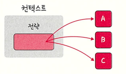

# 전략 패턴




전략 패턴은 객체의 행위를 바꾸고 싶은 경우,

 해당 객체를 직접 수정하지 않고 전략이라고 부르는 캡슐화한 알고리즘을 컨텍스트 안에서 바꿔주면서 상호 교체할 수 있게 하는 패턴입니다.

즉, 실행 중에 전략을 선택하여 객체의 동작을 실시간으로 바뀌도록 할 수 있는 행위 패턴입니다.

---

## 핵심 아이디어: 전략을 분리하여 주입

전략 패턴의 핵심은 무엇을 하는지(Context)와 어떻게 하는지(Strategy)를 분리하는 것입니다.

- Context는 어떻게 동작할지에 대한 구체적인 로직을 직접 갖지 않습니다.
- 대신 ‘어떻게’에 해당하는 동작들을 별도의 클래스(Strategy)로 캡슐화
- Context는 이 Strategy 인터페이스만 알고 있으며, 실행 시점에 Client가 원하는 구체적인 Strategy 구현체를 주입해 줍니다.

---

## 전략 패턴이 필요한 상황 (문제점)

전략 패턴이 없다면, 조건문을 사용하여 객체의 동작을 분기 처리합니다.
예를 들어, 로봇의 이동 방식을 `moveType`이라는 상태 값으로 관리한다면 코드는 다음과 같아집니다.

Java

```jsx
class Robot {
    private String name;
    private int moveType; // 1: 걷기, 2: 날기

    public Robot(String name, int moveType) {
        this.name = name;
        this.moveType = moveType;
    }

    public void setMoveType(int moveType) {
        this.moveType = moveType;
    }

    public void performMove() {
        System.out.print(name + " : ");
        if (moveType == 1) {
            System.out.println("걷다");
        } else if (moveType == 2) {
            System.out.println("날다");
        }
        // 새로운 이동 방식이 추가된다면 이 부분이 계속 늘어난다.
        // else if (moveType == 3), 
      
    }
}

public class ProblemTest {
    public static void main(String[] args) {
        Robot robot1 = new Robot("robo1", 1); // 걷는 로봇
        Robot robot2 = new Robot("robo2", 2); // 나는 로봇

        robot1.performMove();
        robot2.performMove();

        System.out.println("--- 이동 방식 변경 ---");
        robot2.setMoveType(1); // 나는 로봇을 걷게 변경
        robot2.performMove();
    }
}
```

---

## 전략 패턴의 구조 (Structure)

전략 패턴은 크게 4개의 역할로 구성됩니다.

### 1. Strategy (전략 인터페이스)

- 모든 구체적인 전략들이 구현해야 하는 공통 인터페이스입니다.
- Context는 이 인터페이스를 통해서만 전략을 실행합니다.

```jsx
// 이동 전략 인터페이스
interface MoveStrategy {
    void move();
}
```

### 2. Concrete Strategy (전략 알고리즘 구현체)

- Strategy 인터페이스를 실제로 구현한 클래스입니다.
- '어떻게'에 해당하는 실제 알고리즘 로직이 여기에 들어갑니다.

```jsx
// 구체적인 이동 전략
class WalkStrategy implements MoveStrategy {
    @Override
    public void move() {
        System.out.println("걷다");
    }
}

class FlyStrategy implements MoveStrategy {
    @Override
    public void move() {
        System.out.println("날다");
    }
}
```

### 3. Context (주체)

- 전략을 사용하는 주체가 되는 객체입니다.
- Context는 구체적인 전략이 무엇인지는 알 필요 없이, 오직 Strategy 인터페이스의 메서드만 호출합니다.

```jsx
class Robot {
    private String name;
    private MoveStrategy moveStrategy;

    public Robot(String name) {
        this.name = name;
    }

    public void setMoveStrategy(MoveStrategy moveStrategy) {
        this.moveStrategy = moveStrategy;
    }

    public void performMove() {
        System.out.print(name + " : ");
        moveStrategy.move(); // 전략에 위임
    }
}
```

### 4. Client (클라이언트)

- Context 객체를 생성하고, 어떤 구현체를 사용할지 결정하여 Context에 주입(설정)하는 역할을 합니다.

```jsx
public class StrategyTest {
    public static void main(String[] args) {
        Robot robot1 = new Robot("robo1");
        Robot robot2 = new Robot("robo2");

        robot1.setMoveStrategy(new WalkStrategy());
        robot2.setMoveStrategy(new FlyStrategy());

        robot1.performMove();  
        robot2.performMove();    

        System.out.println("--- 이동 전략 변경 ---");
        robot2.setMoveStrategy(new WalkStrategy());
        robot2.performMove();  
    }
}
```


---

## 언제 사용하면 좋을까?

- 알고리즘 변형이 빈번하게 일어나는 경우
- 하나의 클래스에서 서로 다른 여러 동작을 가져야 하고, 이들을 런타임에 교체해야 할 때
- 복잡한 `if-else` 또는 `switch` 문을 사용하여 알고리즘을 선택하는 로직을 대체하고 싶을 때

## 전략을 주입하는 두 가지 방식 (필드 vs 파라미터)

전략 패턴을 구현할 때, Context가 전략을 ‘필드(멤버 변수)'로 가질 수도 있고, 행위를 실행하는 '메서드의 파라미터'로 받을 수도 있습니다. 둘 다 유효한 방식이며, 상황에 따라 선택합니다.

### 1. 필드(멤버 변수) 방식

- **설명:** Context 객체가 '현재 전략'을 상태로서 가집니다.
- **코드 예시:**Java
    
    ```jsx
    class Robot {
        private MoveStrategy moveStrategy;
    
        public void setMoveStrategy(MoveStrategy moveStrategy) {
            this.moveStrategy = moveStrategy;
        }
        public void performMove() {
            this.moveStrategy.move(); 
        }
    }
    ```
    
- 클라이언트 사용:
    
    ```jsx
    robot.setMoveStrategy(new WalkStrategy());
    robot.performMove();
    robot.performMove();
    ```
    

### 2. 메서드 파라미터 방식

- **설명:** Context 객체가 전략을 소유하지 않습니다. **전략의 선택과 실행을 Client가 매번** 정해서 주입합니다.
- **코드 예시:** Java
    
    ```jsx
    class Robot {
        public void performMove(MoveStrategy moveStrategy) {
            moveStrategy.move(); 
        }
    }
    ```
    
- 클라이언트 사용:
    
    ```jsx
    robot.performMove(new WalkStrategy()); // 걷기 전략을 주입해 실행
    
    robot.performMove(new FlyStrategy()); // 날기 전략을 주입해 실행
    ```
    

---

### 비교: 필드 방식 vs. 파라미터 방식

| **구분** | **필드(멤버 변수) 방식** | **메서드 파라미터 방식** |
| --- | --- | --- |
| **전략의 소유** | **Context**가 현재 전략을 '소유' (상태 O) | **Client**가 전략을 선택 (Context는 상태 X) |
| **특징** | `setStrategy()`로 전략을 '교체' | `performMove()` 호출 시 전략을 '전달' |
| **Client의 역할** | 처음에 전략을 설정/변경 | **매번** 실행할 전략을 명시 |
| **적합한 예시** | **게임 캐릭터** (현재 장착한 무기/이동수단) | **계산기 유틸리티** (덧셈/뺄셈 일회성 실행) |

---

## 실제 사용 사례

- Java sort 시 Comparator → 정렬 시 전략
- Spring Security: PasswordEncoder → 비밀번호 인코딩, 디코딩에 대한 전략
- 결제 시스템 → 결제 방법에 대한 전략
- node.js passport → 인증 방법에 대한 전략