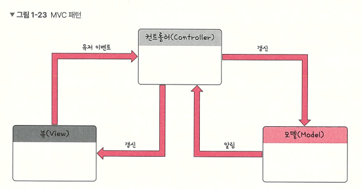

# MVC 패턴

컨트롤러(controller)는 하나 이상의 모델과 하나 이상의 뷰를 잇는 다리 역할을 하며 이벤트 등 메인 로직을 담당한다. 또한 모델과 뷰의 생명주기를 관리하며, 모델이나 뷰의 변경 통지를 받으면 이를 해석하여 각각의 구성 요소에 해당 내용에 대해 알려준다. 

따라서, 뷰(view)는 변경이 일어나면 컨트롤러에게 이를 전달해야 한다. 그럼 컨트롤러는 이를 바탕으로 모델을 생성하거나 갱신한다.

- Model은 데이터를 보관하며 View를 참조한다. 외부에서는 프로퍼티로 접근 가능하며 set을 할 때 View를 업데이트 해준다.
    
    [ Model의 규칙 ]
    
    1. 사용자가 편집하길 원하는 모든 데이터를 가지고 있어야 한다.
    2. 뷰나 컨트롤러에 대해서 어떤 정보도 알지 말아야 한다.
    3. 변경이 일어나면 변경 통지에 대한 처리 방법을 구현해야 한다.
- View는 화면에서 변화하는 UI를 모두 참조한다. 그리고 외부에서는 해당 UI를 가져올 수만 있게 한다.
    
    [ View의 규칙 ]
    
    1. 모델이 가지고 있는 정보를 따로 저장해서는 안된다.
    2. 모델이나 컨트롤러와 같이 다른 구성요소들을 몰라야한다.
    3. 변경이 일어나면 변경 통지에 대한 처리 방법을 구현해야만 한다.
    
    (이후 MVP, MVVM에서도 View는 동일하게 동작한다.)
    
- Controller는 Model과 View를 참조한다. View에서 들어온 사용자의 입력을 여기서 처리한다. 사용자의 “이벤트”를 처리하는 부분이다.
    
    [ Controller의 규칙 ]
    
    1. 모델이나 뷰에 대해 알고 있어야 한다.
    2. 모델이나 뷰의 변경을 모니터링 해야 한다.

⇒ Angular.js(1.x), Spring에서 사용

## MVC의 장점

- 사용자와 프로그램(데이터) 사이의 간극 완화
- 유지보수가 용이한 소프트웨어 설계
    - 비즈니스 로직과 화면에 출력하는 로직을 분리하여 각각의 관심사에 따라 시스템을 관리할 수 있음
    - 객체와 구성 요소 간 결합도를 낮추어 유지보수가 편리한 시스템을 설계할 수 있도록 도움
    - 따라서 View를 다른 곳에서 재사용할 수 있고, 기능이나 화면의 추가가 유리해져 확장성 높임
- 테스트가 용이하도록 구현
    - 비즈니스 로직과 UI가 분리되었기에 테스트 작성이 용이
- 개발자 간 커뮤니케이션 원활

## MVC의 단점

- Model과 View의 완전한 의존성 분리 불가
- Controller의 역할 과잉 가능성
    - 규모가 크고 복잡한 프로젝트의 경우, 한 Controller 안에 너무 많은 Model과 View가 들어갈 수 있음. 이에 Controller가 하는 역할이 너무 많아져 유지보수가 어려워질 수 있음.

⇒ 그러나 아직 규모가 크지 않거나 비교적 간단한 프로그램을 만든다면 MVC 패턴은 오히려 좋은 선택이 될 수 있다.