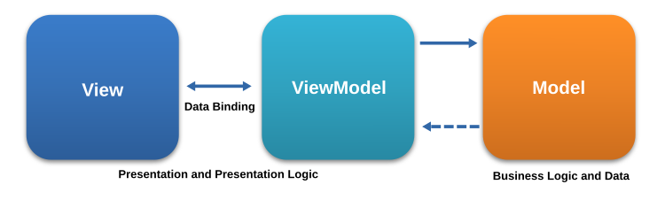
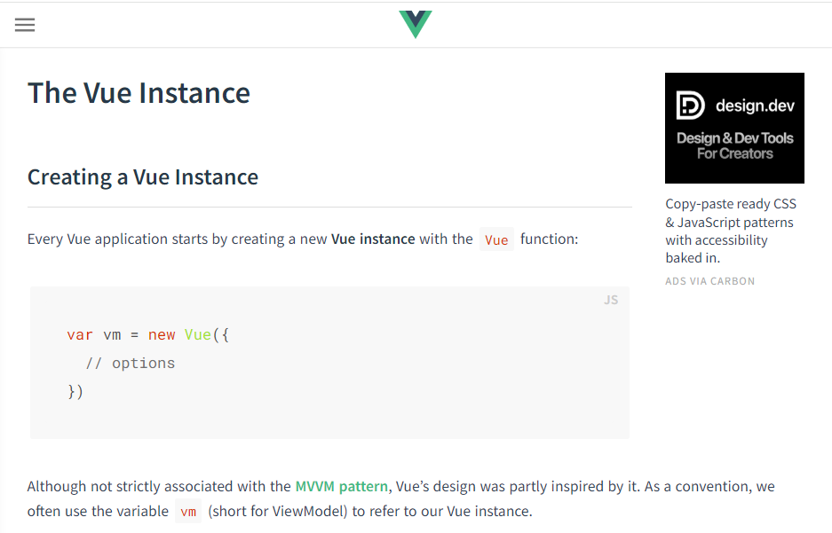
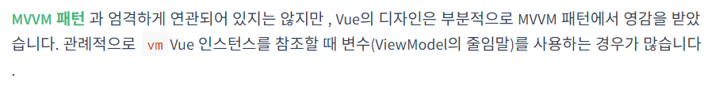
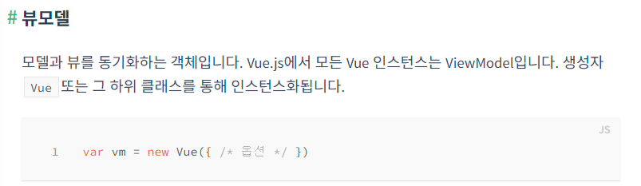
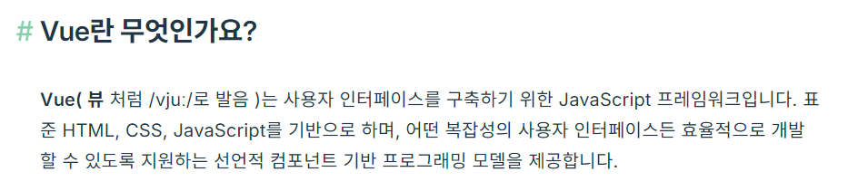
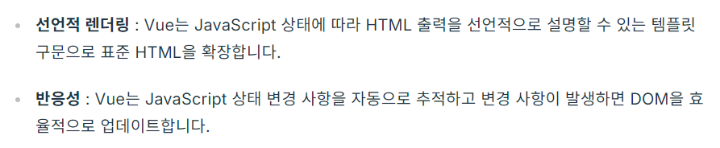

# Vue는 MVVM 패턴과 관련이 없다?

- [[Vue.js] Vue는 MVVM 패턴과 관련이 없지만 [글쓰는 개발자:티스토리]](https://blinders.tistory.com/111)

---

# 왜 이 주제를 선택하게 되었는가?

- SSAFY의 Frontend 과정이 Vue.js를 따르고 있는데, 마침 Vue.js가 MVVM을 따른다고 했기 때문
- 그래서 이 주제를 띄워두고 조사하고 있는 중 하이쌤이 Vue는 MVVM 패턴을 따르지 않은지 오래됐다고 함.. MVVM을 공식 문서에서 빼버린지도 오래 됐다… (주제를 잃어버림)
- 이렇게 된 거 Vue는 왜 MVVM 패턴이 아닌지에 대해 조사하기로 결정

# Vue.js란 무엇인가?

Vue는 사용자 인터페이스를 구축하기 위한 JavaScript 프레임워크다. 표준 HTML, CSS, JavaScript를 기반으로 하며, 어떤 복잡성의 사용자 인터페이스든 효율적으로 개발할 수 있도록 지원하는 선언적 컴포넌트 기반 프로그래밍 모델을 제공한다.

핵심 특징으로는 반응형 데이터 바인딩과 컴포넌트 기반 구조 등이 있다. 이로 인해 DOM 조작을 직접 많이 하지 않고도 UI 상태 변화에 대응할 수 있다.

## 선언적 컴포넌트?

### 선언형 vs 명령형

- 명령형
    - 개발자가 어떻게 동작할지 처리 과정을 단계별로 명시
    - 흐름 제어, 상태 변경, 반복 등 모든 절차를 개발자가 직접 제어
    - 코드의 목적보다 실행 방식에 집중하게 되며, 로직이 복잡해질수록 버그 가능성이 증가
- 선언형
    - 개발자는 무엇을 하고 싶은지만 정의
    - 실제 처리 흐름은 프레임워크 또는 시스템이 내부적으로 알아서 수행
    - 결과 중심의 사고로 상태와 출력 간의 관계를 기술하는 데 집중

<aside>
💡

**JavaScript 기반 예제로 살펴보기**

---

```jsx
// 💻 명령형 방식
const numbers = [1, 2, 3, 4];
const doubled = [];

for (let i = 0; i < numbers.length; i++) {
  doubled.push(numbers[i] * 2);
}
```

- `i`라는 인덱스를 선언하고 배열을 순회하며 어떤 요소를 어떻게 계산하고 어떤 배열에 넣을지를 직접 명시함

```jsx
// 💻 선언형 방식 (Declarative)
const numbers = [1, 2, 3, 4];
const doubled = numbers.map((n) => n * 2);
```

- “각 요소를 2배한 배열을 만들어줘”라는 목적만 기술하여 반복문, 인덱스, push 등은 내부에서 추상화되어 처리함
</aside>

### Vue의 선언적 컴포넌트

UI가 데이터 상태를 기반으로 자동으로 갱신되도록 의도만 선언하는 컴포넌트. 개발자는 무엇을 보여줄 지만 정의하고 어떻게 업데이트할지는 Vue가 담당한다.

---

**🚫 명령형 방식 - DOM을 직접 조작하는 예시**

```html
<div id="app"></div>

<script>
  const items = ['🍎 사과', '🍌 바나나', '🍊 오렌지'];

  const app = document.getElementById('app');
  const ul = document.createElement('ul');

  items.forEach(item => {
    const li = document.createElement('li');
    li.textContent = item;
    ul.appendChild(li);
  });

  app.appendChild(ul);
</script>
```

“어떤 HTML을 만들고 어떤 순서로 넣을지”를 직접 명령해야 한다. 데이터가 바뀌면 DOM도 직접 새로 갱신해야 한다.

✅ **Vue 선언적 컴포넌트 방식**

```html
<template>
  <ul>
    <li v-for="item in items" :key="item">{{ item }}</li>
  </ul>
</template>

<script>
export default {
  name: 'FruitList',
  data() {
    return {
      items: ['🍎 사과', '🍌 바나나', '🍊 오렌지']
    }
  }
}
</script>
```

“데이터(items)가 이렇게 있으면 화면에는 이런 구조로 보여줘.”라고 무엇을 보여줄지만 선언했을 뿐, DOM 조작은 Vue가 내부적으로 자동 처리한다.

## 데이터 바인딩?

자바스크립트의 데이터(Model)과 화면(View, UI)을 자동으로 연결하는 것을 뜻한다. 즉, 데이터를 HTML에 직접 넣는 대신, Vue가 데이터의 변경을 감지해서 자동으로 갱신해준다.

### 리액트와는 어떤 차이일까?

| 구분 | **Vue** | **React** |
| --- | --- | --- |
| 철학 | **선언적 + 반응형(Reactive)** | **선언적 + 단방향 데이터 흐름(Unidirectional)** |
| 데이터 흐름 | 양방향(`v-model`) 가능 | 기본적으로 **단방향(부모 → 자식)** |
| 바인딩 방식 | 반응형 시스템이 자동으로 DOM 갱신 | 상태(state) 변경 시 **리렌더링으로 UI 갱신** |

데이터와 UI를 연결한다는 점에서 같지만, 접근 방식이 다르다.

Vue는 데이터가 변하면 Vue가 DOM을 자동으로 갱신하지만, React는 데이터(state)가 변경되면 해당 컴포넌트를 리렌더링 한다.

즉, React는 바인딩이라기보단 렌더링 기반의 업데이트이다. DOM의 특정 부분만 “바인딩”하지 않고, 전체 컴포넌트의 결과(JSX)를 다시 계산해서 가상 DOM으로 비교 후 변경된 부분만 실제 DOM에 반영한다.

> 따라서, Vue는 바인딩 중심, React는 렌더링 중심이다.
> 

# Vue와 MVVM의 관계

## MVVM이란?



- ViewModel
    - View와 Model 사이에서 중재자 역할
    - View에서 발생하는 이벤트를 감지하고 해당 이벤트에 맞는 비즈니스 로직을 수행 (커맨드)
    - Model과 상호작용하여 데이터를 가져오거나 업데이트하고, View에 데이터를 업데이트하는 역할을 함 (데이터 바인딩)

⇒ 따라서 ViewModel은 View를 직접 참조하지 않음

## Vue와 ViewModel

그런데 이 ViewModel의 설명만 보면 너무나도 Vue의 특징과 유사하다.. (똑같다고 느낄 정도) 

근데 왜 하이쌤은 Vue는 MVVM이 아니라고 하셨을까??

# Vue는 진짜 MVVM이 아닐까?


> [https://012.vuejs.org/guide/#ViewModel](https://012.vuejs.org/guide/#ViewModel)






Vue.js의 이전 버전의 공식 문서를 보자.. 여기서는 MVVM 패턴에 대한 언급이 나온다. Vue의 디자인이 부분적으로 MVVM 패턴에 많은 영향을 받은 것을 확인할 수 있다. 

그러나? 

MVVM 패턴과 엄격하게 연관되어 있지 않다고 선을 긋는다… -.-



심지어 이전 버전에서는 ViewModel에 대한 설명도 있다. Vue가 ViewModel에서 따온 이름인 것을 유추할 수도 있다!!

## 그렇담 하이쌤 말씀은 틀렸는가?

그건 또 아니다.. 엄밀히 따지자면 하이쌤은 2.X 이하 버전에서는 MVVM이라고 명시했으나, Vue 3로 업데이트한 이후로 MVVM이라는 단어가 없어졌다고 했으니 틀린 말씀을 하신 건 아니다…

근데? 하이쌤 말씀이 어느 정도는 틀린 부분이 있긴 하다.

Vue는 MVVM 패턴이 아니라고 하셨기 때문이다!!

Vue는 너무나도 ViewModel을 따르고 있는 것 같아 보인다(이름도 여기서 따온 것 같다). Vue의 특징이 MVVM의 ViewModel과 너무나도 유사하다. 그러나 MVVM 패턴을 엄격하게 따른 것은 아니고, ViewModel에서 많은 아이디어를 얻은 것은 확실하다.

## 그러나 Vue 3에서는…





> [https://vuejs.org/guide/introduction?utm_source=chatgpt.com](https://vuejs.org/guide/introduction?utm_source=chatgpt.com)

MVVM 패턴에 대한 언급이 싹 사라졌다. 대신 선언적 렌더링과 데이터 바인딩에 대한 언급만 있다. MVVM에 대한 강조는 사라졌다.. 

Vue 3라는 대규모 업데이트에서 Composition API가 생겼고, 이로 인해 상태, 로직, 뷰의 관계가 함수 단위로 분해되고 재조합되는 구조라서 ViewModel이라는 중간 계층으로서의 존재감이 약해졌다. 또한, 여전히 데이터 바인딩은 존재하지만, 그게 곧 MVVM인 것은 아니다.

이로 인해 MVVM의 철학이 더 이상의 Vue의 핵심 철학이 아니게 된 것이다.

## 결론

따라서 Vue 3라는 대거 업데이트 이후 MVVM 패턴에 개념이 많이 희미해졌으나, MVVM 패턴에서 많은 영감을 받은 것을 맞다!! 라는 것이 결론.. 

### 참고 자료

---

> https://sangmin802.github.io/Study/Think/abstract%20painting/

> https://velog.io/@rimmz/React-%EC%84%A0%EC%96%B8%ED%98%95Declarative-%EC%BD%94%EB%93%9C-%EC%9D%B4%ED%95%B4%ED%95%98%EA%B8%B0