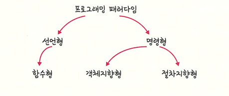

# 프로그래밍 패러다임

---

### 프로그래밍 패러다임 (Programing Paradigm)

> 프로그래머에게 프로그래밍의 관점을 갖게 해주는 역할을 하는 개발 방법론
> 

> 절차지향, 객체지향, 함수형 크게 3가지의 관점으로 나누어지게 된다.
> 



---

# 1. 선언형과 함수형 프로그래밍

---

> ‘무엇을’ 풀어내는가에 집중하는 패러다임.
함수형 프로그래밍(Funcftional Programming) 은 선언형 패러다임의 일종이다.
> 

```jsx
Const list = [1, 2, 3, 4, 5, 11, 12]
const ret = list.reduce((max, num) => num > max ? num : max, 0)
console.log(ret) // 12
```

reduce()는 ‘배열’ 만 받아서 누적한 결괏값을 반환하는 **순수 함수.**

### 순수함수

> 출력이 입력에만 의존하는 것
> 

### 고차 함수

> 함수가 함수를 값처럼 매개변수로 받아 로직을 생성할 수 있는 것
함수를 인자로 받거나, 함수를 반환하는 ‘함수를 다루는 함수’ 라고 생각
> 

```java
List<Integer> list = List.of(1,2,3,4);

list.stream()
    .filter(x -> x % 2 == 0) // 이게 함수(람다)가 인자로 들어가는 형태
    .map(x -> x * 10)
    .forEach(System.out::println);

```

→ filter, map, forEach가 전부 고차함수
함수를 넘겨주고 그걸 내부에서 실행하는 함수이기 때문에.

<aside>
💡

이때 고차 함수를 쓰기 위해서는 해당 언어가 일급 객체라는 특징을 가지고 있어야 한다.

</aside>

### 일급 객체

> 변수에 담고, 인자로 넘기고, 반환할 수 있는 대상이어야 한다.
> 
1. 변수나 메서드에 함수를 할당 할 수 있다.  Ex : var a = (어떤 대상)
2. 함수 안에 함수를 매개변수로 담을 수 있다. Ex : f(어떤 대상)
3. 함수가 함수를 반환할 수 있다. Ex : return 어떤 대상

→ 이 3가지가 핵심 조건

---

# 2. 객체지향 프로그래밍

> OOP, Object - Oriented Programming
객체들의 집합을 프로그램의 상호 작용을 표현하며 데이터를 객체로 취급하여 객체 내부에 선언된 메서드를 활용하는 방식
대표적인 언어 (Java)
> 

<aside>
💡

객체(Object)
→ 데이터 + 그 데이터를 다루는 행동(메서드)를 하나로 묶어놓는 단위.

속성(그 객체가 가지는 데이터) + 메서드 ( 그 데이터를 이용해서 할 수 있는 행동)

Ex ) ‘자동차’ 객체 = 색깔(속성<데이터>) + 시동 걸기 (메소드 <행동>)

</aside>

### 객체로 묶는 이유?

- 절차형은 데이터 따로, 함수 따로 흩어져서 관리 됨 → 코드가 커지고 유지보수도 힘들어진다.
- 이걸 그냥 묶어서 “이 객체가 자기 데이터는 자기가 관리한다”라는 개념으로 시작

→ 하지만 설계야 많이 소요되고 처리 속도도 다른 패러다임에 비해 상대적으로 느린 단점

### 객체지향 프로그래밍 특징

### OOP IS A PIE

<aside>
💡

Abstraction 추상화

Ploymorphism 다형성

Inheritance 상속성

Encapsilation 캡슐화

</aside>

### Abstraction(추상화)

> 불필요한 복잡한 구현은 숨기고, 본질적인 특징만 드러내는 것
상황 / 타입 따라 다르게 동장
> 

<aside>
💡

### 비유

자동차 운전할 때 엔진 내부 연소 과정, 기어비, 전자제어를 몰라도

**핸들/브레이크/엑셀** 로 조작 가능

내부 복잡한 로직 → 숨김

필요 API / 인터페이스 → 외부 제공

</aside>

> **예시**
> 

```jsx
interface Payment {
    void pay(int amount);
}

class CardPayment implements Payment {
    public void pay(int amount) {
        System.out.println("Pay with card: " + amount);
    }
}

class KakaoPayment implements Payment {
    public void pay(int amount) {
        System.out.println("Pay with Kakao Pay: " + amount);
    }
}
```

→ Payment 인터페이스가 추상화
→ “결제한다” 라는 본질적인 동작만 표현

### Ploymorphism (다형성)

> 같은 이름(같은 형태)의 메소드가 상황 / 타입에 따라 다르게 동작하는 것
하나의 인터페이스로 여러 형태의 동작을 구현하는 OOP 특징
> 

> 예시
> 

```jsx
class Animal {
    void sound() {
        System.out.println("animal sound");
    }
}

class Dog extends Animal {
    @Override
    void sound() {   // 부모 메서드 재정의
        System.out.println("woof");
    }
}

class Cat extends Animal {
    @Override
    void sound() {
        System.out.println("meow");
    }
}

public class Main {
    public static void main(String[] args) {
        Animal a = new Dog();   // 상속 → 부모타입 참조, 자식객체 생성
        a.sound(); // woof

        a = new Cat();
        a.sound(); // meow
    }
}
```

### 오버로딩( Overloading)

> 같은 이름을 가진 메서들를 여러개 두는 것
컴파일 중에 발생하는 정적 다형성
> 

```java
class Calculator {
    // 1개 int 더하기
    int add(int a) {
        return a;
    }

    // 2개 int 더하기
    int add(int a, int b) {   // 매개변수 개수가 다름
        return a + b;
    }

    // 2개 double 더하기
    double add(double a, double b) {  // 매개변수 타입이 다름
        return a + b;
    }

    // 3개 int 더하기
    int add(int a, int b, int c) {    // 파라미터 개수 다름
        return a + b + c;
    }
}
```

사용자 입장에서는 add() 라는 동일한 이름을 호출하지만
전달하는 매개변수에 따라 다른 메서드가 선택되어 실행된다.

### 오버라이딩 (Overriding)

> 상위 클래스로부터 상받은 메서드를 하위 클래스가 재정의 하는 것
런타임 다형성의 핵심
> 

```java
class Animal {
    void sound() {
        System.out.println("animal sound");
    }
}

class Dog extends Animal {
    @Override
    void sound() {        // 오버라이딩
        System.out.println("woof woof");
    }
}

class Cat extends Animal {
    @Override
    void sound() {
        System.out.println("meow meow");
    }
}

public class Main {
    public static void main(String[] args) {
        Animal a = new Dog();
        a.sound();  // woof woof  ← 부모 타입으로 참조하지만 실제 객체 타입(Dog)에 따라 실행
    }
}
```

### 조건

1. 메서드 이름은 부모 메서드와 동일해야 한다.
2. 매개변수(파라미터)는 동일해야 한다.
- 참조 타입은 Animal (부모)
- 실제 객체 타입은 Dog (자식)
- 실행은 Dog의 sound() → **다형성**

### Inheritance (상속성)

> 부모 클래스의 속성과 메서드를 자식 클래스가 물려받아 재사용하고 확장하는 것
> 

```jsx
class Parent {
    String name = "parent";
    void printName() {
        System.out.println(name);
    }
}

class Child extends Parent {   // Parent 상속
    int age = 10;
    void printAge() {
        System.out.println(age);
    }
}

public class Main {
    public static void main(String[] args) {
        Child c = new Child();
        c.printName(); // Parent 기능 사용 가능
        c.printAge();  // Child 기능
    }
}

```

- Super : 부모 참조
- Overrideng : 부모 메서드를 자식 클래스에서 재정의
- IS - A : 개념적 포함 관계

### Encapsulation (캡슐화)

> 데이터 + 행동(메소드)를 하나의 객체 안에 묶고 외부로부터 보호하는 것
”내부 구현은 숨기고, 필요한 것만 공개한다.”
> 

### 왜 쓰는가?

- 객체 내부 상태를 마음대로 못 바꾸게 막기 위해
- 변경이 있어도 외부 코드가 영향을 덜 받게 하기 위해 (유지보수성 높이기 위해)
- 보안 , 안정성, 일관성 높이기 위해

### 어떻게 쓰지?

> 접근 제어자 사용
> 
- private : 클래스 내부에서만
- protected : 같은 패키지 + 상속 관계에서
- public : 어디서든 접근 가능

> 외부는 직접 변화 금지 → 메서드를 통해서만 접근하도록 유도 (getter / setter)
> 

```java
class BankAccount {
    private int balance;   // 외부에서 직접 접근 불가

    public BankAccount(int balance) {
        this.balance = balance;
    }

    public int getBalance() {   // 허용된 방식으로만 읽게 함
        return balance;
    }

    public void deposit(int amount) {    // 행동을 통해 상태 변화
        if (amount > 0) this.balance += amount;
    }

    public void withdraw(int amount) {
        if (amount > 0 && amount <= balance) this.balance -= amount;
    }
}
```

---

### 설계 원칙

> SOLID 원칙
> 

### S : SRP (Single Responsibility Principle) 단일책임 원칙

> 모든 클래스는 각각 하나의 책임만 가져야 하는 원칙
> 

? ‘책임’? 이라는 단어는 매우 주관적인 평가

### 단일 모듈은 변경의 이유가 하나, 오직 하나 뿐 이어야 한다.

변경의 이유가 하나라고 정의하게 됨으로써 객관적으로 파악이 가능해졌다.

서로 다른 책임을 분리하면 응집도가 높아지는 효과가 생기고 코드의 가독성과 재사용성이 높아져 유지보수성이 쉬워진다.

### O : OCP(Open Closed Principle) 개방 - 폐쇄 원칙

> 유지 보수 사항이 생긴다면 코드를 쉽게 확장할 수 있도록 하고 수정할 때는 닫혀 있어야하는 원칙
> 

### L : LSP(Liskov Substitution Principle) 리스코프 치환 원칙

> 프로그램의 정확성을 깨뜨리지 않는 원칙
> 

### I : Interface Segregation Principle 인터페이스 분리 원칙

> 하나의 일반적인 인터페이스보다 구체적인 여러 개의 인터페이스를 만들어야 하는 운칙
> 

### D : Dependency Inversion Principle 의존 역전 원칙

> 자신보다 변하기 쉬운 것에 의존하던 것을 추상화된 인터페이스나 상위 클래스를 두어 변하기 쉬운 것의 변화에 영향받지 않게 하는 원칙
> 

[모든 개발자가 알아야 할  SOLID 의 진실 혹은 거짓](./oop/solid.md)

---

# 절차형 프로그래밍 (PP)

> Procedural Programming : 위에서부터 아래로 물 흐르듯이 동작하는 언어
종류 : C, Pascal 등
> 

> 장점
> 
1. 코드 실행 흐름이 직관적이다.
2. 컴퓨터 자원 사용이 효율적이다.
3. 작은 규모/ 단순 작업에 매우 빠르게 개발 가능

> 단점
> 
1. 유지보수 어려움
2. 재사용 어려움
3. 확장성 낮음
4. 전역 변수 의존 경향성이 높다.

### 왜 절차지향이 자원 사용과 실행 시간이 빠를까?

1. 프로그램 흐름이 단순하다? → 실행 경로가 명확하다.
- 함수 호출 순서 그대로 실행한다.
- 추가적인 객체 생성 / 해제/ 동적 바인딩 같은 추가 과정이 없다.
- 절차가 정해지면 CPU 입장에서 계산하기가 매우 단순하다.

1. 데이터는 구조체 / 전역 메모리 형태 → 직접 접근이 가능하다.
- 객체 wrapping, getter/setter, 접근제어 같은 overhead 가 없다.
- 필요한 메모리 주소를 바로 조작이 가능하다. (C pointer 처럼)

1. 실행 중에 불필요한 런타임 개입이 거의 없다.

1. 단순한 함수 호출 기반
- 컴파일러가 static  최적화 하기에 매우 유리하다.

<aside>
💡

절차형 언어는 프로그램을 단순한 “데이터 처리 절차의 연속” 으로 구현하므로, 불필요한 추상화/ 객체 관리 오버헤드가 없어서 컴퓨터 자원을 매우 얇게 써서 최대 성능을 뽑을 수 있다.

</aside>