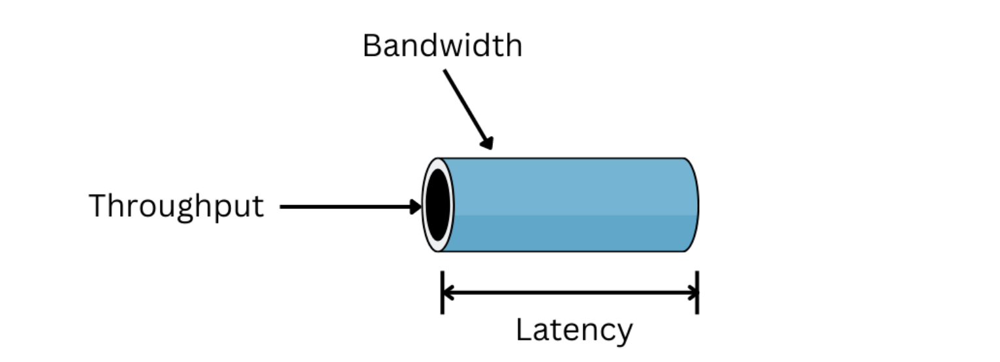
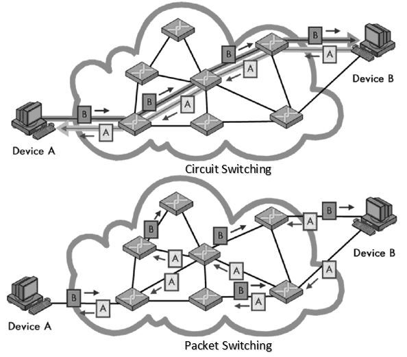
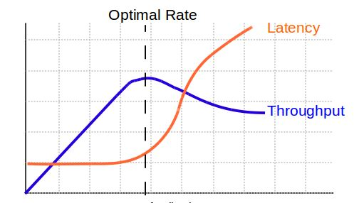

# Throughput vs Latency

# 네트워크 성능 지표

| 용어 | 의미 | 단위 | 비유 |
| --- | --- | --- | --- |
| **Bandwidth (대역폭)** | 네트워크가 초당 보낼 수 있는 **최대 데이터량** | Mbps, Gbps | 도로의 차선 수 |
| **Throughput (처리량)** | 실제로 측정된 **실제 전송 속도** | Mbps | 실제 교통량 |
| **Latency (지연시간)** | 데이터가 목적지까지 도달하는 **시간 지연** | ms | 신호등 대기 시간 |

**Bandwidth**는 이론 상의 속도에 가깝고, 실제로 전송했을 때의 속도가 **Throughput**이다. 그리고 네트워크 패킷이 소스에서 목적지까지 도달하는 데 걸리는 시간을 **Latency**라고 한다.

⇒ 즉, 인터넷 속도가 빠르다는 것은 이 세 가지 요소가 모두 작용하는 것!!

# 네트워크 전송 방식

네트워크 상에서 호스트와 호스트 간에 data를 주고 받는 방식에는 회선 교환 방식(circuit switching)과 패킷 교환 방식(packet switching)이 있다.

## Circuit Switching

- 사전  setup이 필요 (circuit 설정이 가장 중요)
- 무조건 bandwidth를 나눠야 하기 때문에 중간에 다른 호스트가 끼어들 수 없다.
- 따라서 속도와 성능이 일정해 예측이 가능하다.
    - 다만 circuit을 독점해서 사용하는 방식이므로, 점유하고 있는 circuit에서 정보를 보내지 않는 시간동안은 회선이 낭비되게 된다.
- 전화 회선에서 주로 쓰이는 방식

## Packet Switching

→ 데이터를 packet 단위로 쪼개서 전송하는 방식

- bandwidth 나누는 것 없이 공유하여 사용한다.
- 호스트가 얼마나 들어오든 상관이 없다. ⇒ 딱히 자원을 할당해놓지 않기 때문
- 패킷의 헤더에는 출발지(source)와 도착지(destination) 정보가 있다.
    - 라우팅 알고리즘을 이용해 경로를 설정하고 중간 라우터들을 거쳐 최종 목적지에 도달하게 된다.
    - 이러한 과정에서 패킷은 다음 라우터로 이동하기 위해 큐에서 대기(queueing)하는데 이때 수용할 수 있는 큐의 범위를 초과하게 되면 손실(loss)이 발생하게 된다. (overflow)
- 개별적인 성능 보장이 안됨에도 사용하는 이유는 traggic이 한 번에 올라가는 일이 잘 없기 때문이다.
- 또한, 회선 교환보다 구현이 간단하고 비용이 적게 든다.

## 패킷의 지연과 손실

패킷이 전송되는 실제 환경에서는 여러 가지 요인들로 인해 지연이 발생한다. 패킷이 지연되는 요소는 아래와 같이 크게 4가지로 구분된다.

**1) Processing delay**

**2) Queueing delay**

**3) Transmission delay**

**4) Propagation delay**

즉, 패킷이 전송될 때 발생되는 총 지연은 **Nodal delay** = Processing delay + Queueing delay + Transmission delay + Propagation delay이다.

### Processing delay

- router 자체의 processsing delay
- 패킷 내 데이터의 에러 체크와 어느 경로가 더 빠른지 계산할 때 발생하는 delay
- 매우 짧은 시간 동안 발생하며, 라우터 내의 하드웨어의 성능에 따라 좌지우지 된다.

⇒ 💡 해결책: 더 좋은 Router로 변경

### Queueing delay

- 라우터에 패킷들이 한 번에 많이 들어올 경우, 패킷을 queue 형태로 보관하여 차례로 처리한다.
- 이때, 전송을 위해 output link에서 기다리는 동안 발생하는 delay
- 라우터의 혼란 정도에 의존하며 상황에 따라 가변적이라 예측이 어렵다.

⇒ 💡 해결책: 스케쥴링 기법을 달리 사용 (어려움..)

### Transmission delay

- queue에서 빠져나와 라우터의 output link를 통해 빠져나가기 전까지 발생하는 delay
- 즉, 전송하려는 패킷을 output link로 밀어내는 데 걸리는 시간이다.
- link의 bandwidth에 따라 결정된다.

⇒ 💡 해결책: Bandwidth를 넓힌다. router를 교체 

### Propagation delay

- 실제 link를 타고 전송이 될 때의 delay
- 거리와 link의 매체가 결정하는 delay로, 다른 delay에 비해 매우 짧은 시간이 걸린다.

⇒ 사실상 해결 불가능..

# Throughput vs Latency

> 처리량 = 파이프의 굵기
> 
> 
> 지연시간 = 물이 흐르기 시작해서 나오는 데 걸리는 시간
> 
- **“Throughput이 높다고 Latency가 짧은 건 아니다.”**
- 이유:
    - 병목 구간이 생기면 대기열(queue)이 쌓여서 **지연 증가**
    - TCP의 혼잡 제어로 인해 **처리량 조절 → 지연시간 변화**
- **TCP와 UDP 비교 예시**
    - TCP는 신뢰성 확보 위해 지연이 길어질 수 있음
    - UDP는 지연이 짧지만 패킷 손실 가능

| 상황 | 처리량 | 지연시간 | 예시 |
| --- | --- | --- | --- |
| 대용량 파일 다운로드 | 높음 | 상관없음 | Throughput 중요 |
| 온라인 게임 / 화상통화 | 낮아도 됨 | 짧아야 함 | Latency 중요 |

# 인터넷 속도를 빠르게 하려면?

- **CDN(Content Delivery Network):**
    
    → 데이터를 가까운 서버에서 전송해 Latency 감소 (물리적인 거리 줄이기)
    
    - 전 세계 곳곳에 캐시 서버를 두고, 사용자는 가장 가까운 서버에서 콘텐츠를 받는다.
    - 유튜브, 넷플릭스가 끊김없이 빠른 이유
- 네크워크 경로 및 장비 최적화

# 🔍 **결론**

> “빠른 네트워크”란 단순히 처리량이 높은 게 아니라, 상황에 맞는 성능(Throughput vs Latency) 을 최적화하는 것입니다.
> 
> 
> 즉, **‘빠름’의 정의는 사용 목적에 따라 다르다**.
> 

### 참고 자료

- https://valuefactory.tistory.com/987