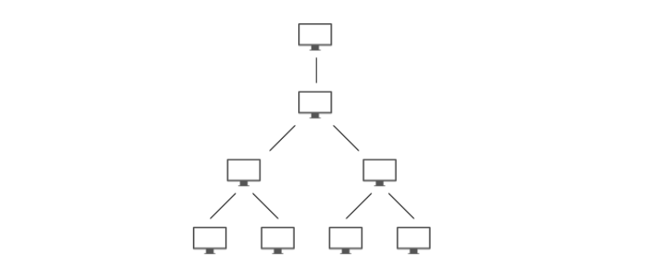
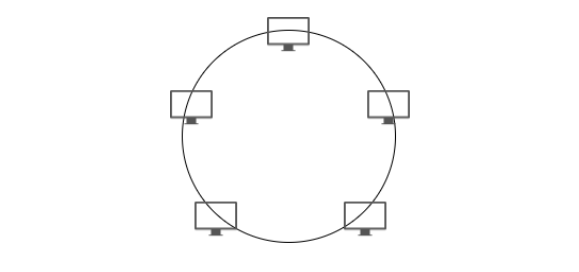
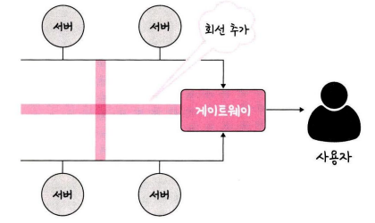
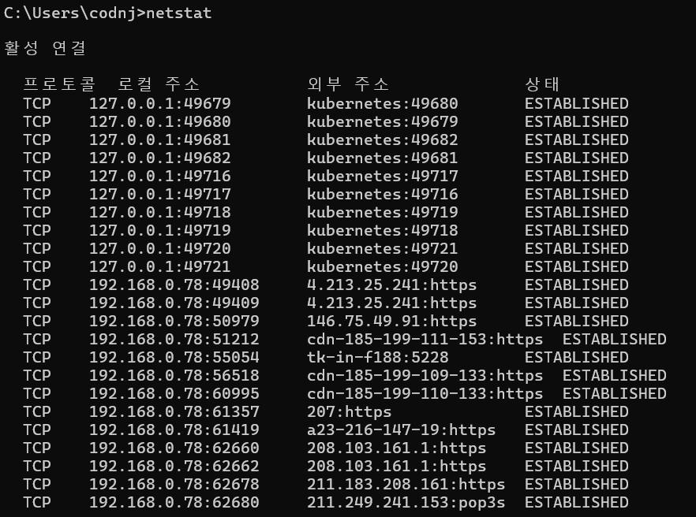
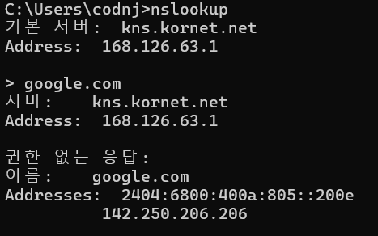

# 1. 네트워크의 기초

네트워크란 노드(node)와 링크(link)가 서로 연결되어 있으며 리소스를 공유하는 집합을 의미한다. 여기서 노드란 서버, 라우터, 스위치 등 네트워크 장치를 의미하고 링크는 유선 또는 무선을 의미한다.

# 처리량과 지연 시간

좋은 네트워크란 많은 처리량을 가지며 지연 시간이 적은 네트워크를 말한다.

## 처리량

처리량(throughput)은 링크 내에서 성공적으로 전달된 데이터의 양을 말하며 보통 얼마큼의 트래픽을 처리했는지를 나타낸다. ‘많은 트래픽을 처리한다 = 많은 처리량을 가진다’는 의미이다.

- 단위는 bps(bits per second), 초당 전송 또는 수신되는 비트 수라는 의미
- 처리량은 사용자들이 많이 접속할 때마다 커지는 트래픽, 네트워크 장치 간의 대역폭, 네트워크 중간에 발생하는 에러, 장치의 하드웨어 스펙에 영향을 받는다.
    - 트래픽이 많아졌다 = 흐르는 데이터가 많아졌다
    - 처리량이 많아졌다 = 처리되는 트래픽이 많아졌다

> **대역폭**
> 
> 주어진 시간 동안 네트워크 연결을 통해 흐를 수 있는 최대 비트 수

## 지연 시간

지연 시간(latency)이란 요청이 처리되는 시간을 말하며 어떤 메시지가 어떤 메시지가 두 장치 사이를 왕복하는 데 걸린 시간을 말한다. 

지연 시간은 매체 타입(무선, 유선), 패킷 크기, 라우터의 패킷 처리 시간에 영향을 받는다.

# 네트워크 토폴로지와 병목 현상

## 네트워크 토폴로지

### 트리 토폴로지

트리 토폴로지는 노드들이 부모-자식 계층 구조로 연결되어 있다. 중앙 허브에 연결된 노드는 다른 노드와 선으로 연결되어 있어, 연결된 두 개의 노드는 하나의 연결만을 상호 공유한다.

- 장점
    - 노드의 추가와 삭제가 쉬워 유연하고 네트워크 확장이 매우 쉽다.
    - 성능에 이상이 생긴 경우 각각의 가지에 개별적으로 접근할 수 있기 때문에 네트워크 장애를 해결하는 과정이 복잡하지 않다.
- 단점
    - 중앙 허브에 문제 발생 시 전체 통신망에 영향을 끼친다.
    - 특정 노드에 트래픽이 집중될 때 하위 노드에 영향을 끼칠 수 있다.

### 버스 토폴로지

버스 토폴로지는 네트워크 상의 모든 장치가 하나의 케이블로 연결되어 있다. 네트워크의 한쪽 끝에서 다른 쪽 끝으로 한 방향으로 연결되어 있기 때문에 “선형 토폴로지” 또는 “백본 토폴로지”라고도 불린다.

네트워크 상의 데이터 흐름 역시 케이블의 경로를 따라 한 방향으로 흘러간다. 근거리 통신망(LAN)에서 사용한다.

- 장점
    - 비용이 적게 들고 네트워크 배치가 단순해 중앙 통신 회선에 노드를 추가하거나 삭제하기 쉽다.
    - 소규모 네트워크에 적합하다.
- 단점
    - 하나의 케이블만 사용하므로 장애가 발생하는 경우 전체 너트워크가 멈추게 되며, 복구하는 데 시간과 비용이 많이 든다.
    - 스푸핑이 가능한 문제점이 있다.

> **스푸핑**
> 
> 스푸핑은 LAN 상에서 송신부의 패킷을 송신과 관련 없는 다른 호스트에 가지 않도록 하는 스위칭 기능을 마비시키거나 속여서 특정 노드에 해당 패킷이 오도록 처리하는 것을 말한다. 
> 
> 스푸핑을 적용하면 올바르게 수신부로 가야 할 패킷이 악의적인 노드에 전달되게 된다.

### 스타 토폴로지

스타(star, 성형) 토폴로지는 중앙에 있는 노드에 모두 연결된 네트워크 구성을 말한다. 가장 흔하게 쓰이는 네트워크 토폴로지로, 한 장소에서 전체 네트워크를 편리하게 관리할 수 있다.

네트워크 안의 각각의 노드에서 보낸 정보가 목적지에 닿기 위해서는 반드시 중앙 노드를 지나야 한다.

- 장점
    - 각 노드가 중앙 허브와 독립적으로 연결되어 있어서 노드 하나에 장애가 발생하더라도 나머지 네트워크는 영향을 받지 않고 가능하다.
    - 전체 네트워크를 오프라인으로 하지 않고서 장치를 추가, 제거 또는 수정할 수 있다.
    - 네트워크 디자인이 단순하기 때문에 장애가 발생하거나 성능에 이상이 생긴 경우 쉽게 찾아낼 수 있어 관리가 쉽다. (중앙 노드가 아닐 경우)
- 단점
    - 중앙 허브에 장애가 생기면 나머지 네트워크가 모두 멈춘다.
    - 설치 비용과 운영 비용이 비싸다.

### 링형 토폴로지

링형 토폴로지는 각각의 노드가 양 옆의 두 노드와 연결하여 전체적으로 고리처럼 하나의 연속된 길을 통해 통신을 하는 망 구성 방식이다.

데이터는 노드에서 노드로 이동을 하고, 각각의 노드는 양 옆에 두 개의 이웃 노드가 꼭 존재한다.

- 장점
    - 노드 수가 증가되어도 네트워크 상의 손실이 거의 없고 충돌이 발생되는 가능성이 적고 노드의 고장을 쉽게 발견할 수 있다.
    - 비용 효율적이며 설치 비용이 저렴하다.
- 단점
    - 네트워크 구성 변경이 어렵고 회선에 장애가 발생하면 전체 네트워크에 영향을 크게 끼친다.

### 메시 토폴로지

메시 토폴로지는 망형 토폴로지라고도 하며 그물망처럼 연결되어 있는 구조이다. 메시 토폴로지의 데이터는 라우팅과 플러딩의 두 가지 다른 방법으로 전송된다. 

- 라우팅 방식: 노드는 출발지부터 목적지까지의 최단 거리를 논리적으로 결정하여 데이터를 전송한다.
- 플러딩 방식: 정보는 네트워크 안의 모든 노드로 보내져 논리적으로 최단 거리를 결정할 필요가 없다.

- 장점
    - 한 단말 장치에 장애가 발생해도 여러 개의 경로가 존재하므로 네트워크를 계속 사용할 수 있다.
    - 트래픽도 분산 처리가 가능하다.
- 단점
    - 노드의 추가가 어렵고, 구축 비용과 운영 비용이 비싸다.

## 병목 현상

병목 현상 발생

적절한 회선 추가를 통해 병목 현상 해결

>💡
>
> 병목(bottleneck) 현상은 전체 시스템의 성능이나 용량이 하나의 구성 요소로 인해 제한을 받는 현상을 말한다. 예를 들어 병의 몸통보다 병의 목 부분 내부 지름이 좁아서 물이 상대적으로 천천히 쏟아지는 것에 비유할 수 있다.

</aside>

# 네트워크 분류

## LAN

근거리 통신망을 의미하며 같은 건물이나 캠퍼스 같은 좁은 공간에서 운영된다. 전송 속도가 빠르고 혼잡하지 않다.

## MAN

대도시 지역 네트워크를 나타내며 도시 같은 넓은 지역에서 운영된다. 전송 속도는 평균이며 LAN보다는 더 많이 혼잡하다.

## WAN

광역 네트워크를 의미하며 국가 또는 대륙 같은 더 넓은 지역에서 운영된다. 전송 속도는 낮으며 MAN보다 더 혼잡하다.

# 네트워크 성능 분석 명령어

애플리케이션 코드 상에는 전혀 문제가 없는데 사용자가 서비스로부터 데이터를 가져오지 못하는 상황이 발생되기도 하며, 이는 네트워크 병목 현상일 가능성이 있다. 네트워크 병목 현상의 주된 원인은 다음과 같다.

- 네트워크 대역폭
- 네트워크 토폴로지
- 서버 CPU, 메모리 사용량
- 비효율적인 네트워크 구성

이때는 네트워크 관련 테스트와 네트워크와 무관한 테스트를 통해 ‘네트워크로부터 발생한 문제점’인 것을 확인한 후 네트워크 성능 분석을 해봐야 한다. 이때 사용되는 명령어들을 알아보겠다.

## ping

ping(Packet INternet Groper)은 네트워크 상태를 확인하려는 대상 노드를 향해 일정 크기의 패킷을 전송하는 명령어이다. 이를 통해 해당 노드의 패킷 수신 상태와 도달하기까지의 시간 등을 알 수 있으며 해당 노드까지 네트워크가 잘 연결되어 있는지 확인할 수 있다. 

ping은 TCP/IP 프로토콜 중에 ICMP 프로토콜을 통해 동작하며, 이 때문에 프로토콜을 지원하지 않는 기기를 대상으로는 실행할 수 없거나 네트워크 정책상 ICMP나 traceroute를 차단하는 대상의 경우 ping 테스팅은 불가능하다.

ping [IP 주소 또는 도메인 주소]로 실행한다.

앞의 그림은 ping [www.google.com](http://www.google.com) -n 12라는 명령어를 구동한 모습이다. -n 12 옵션을 넣어서 12번의 패킷을 보내고 12번의 패킷을 받는 모습을 볼 수 있다.

## netstat

netstat 명령어는 접속되어 있는 서비스들의 네트워크 상태를 표시하는 데 사용되며 네트워크 접속, 라우팅 테이블, 네트워크 프로토콜 등 리스트를 보여준다. 주로 서비스의 포트가 열려 있는지 확인할 때 쓴다.

앞의 그림을 통해 지금 내가 접속하고 있는 사이트 등에 관한 네트워크 상태 리스트를 볼 수 있는 것을 알 수 있다.

| 항목 | 의미 |
| --- | --- |
| **프로토콜** | TCP / UDP 같은 통신 방식 (대부분 TCP) |
| **로컬 주소 (Local Address)** | 내 컴퓨터의 IP 주소와 포트 번호 |
| **외부 주소 (Foreign Address)** | 통신 중인 상대방(서버)의 IP 주소와 포트 번호 |
| **상태 (State)** | 연결 상태 (`ESTABLISHED`, `LISTENING`, `TIME_WAIT` 등) |

## nslookup

nslookup은 DNS에 관련된 내용을 확인하기 위해 쓰는 명령어다. 특정 도메인에 매핑된 IP를 확인하기 위해 사용한다.

앞의 그림은 google.com의 DNS를 확인하는 모습이다.

## tracert

→ 윈도우에서는 tracert, 리눅스에서는 traceroute.

이것은 목적지 노드까지 네트워크 경로를 확인할 때 사용하는 명령어이다. 목적지 노드까지 구간들 중 어느 구간에서 응답 시간이 느려지는지 등을 확인할 수 있다. 

앞의 그림은 구글에 도달하기까지의 경로 추적을 하는 모습이다.

이외에도 ftp를 통해 대형파일을 전송하여 테스팅하거나 tcpdump를 통해 노드로 오고 가는 패킷을 캡처하는 등의 명령어가 있다.

# 네트워크 프로토콜 표준화

IEEE802.3은 유선 LAN 프로토콜로, 유선으로 LAN을 구축할 때 쓰이는 프로토콜이다. 이를 통해 만든 기업이 다른 장치라도 서로 데이터를 수신할 수 있다.

예를 들어 웹을 접속할 때 쓰이는 HTTP가 있다. ‘서로 약속된’ 인터페이스인 HTTP라는 프로토콜을 통해 노드들은 웹 서비스를 기반으로 데이터를 주고받을 수 있다.

### 참고 자료

- https://moosongsong.github.io/junior-be-interview/03_%EB%84%A4%ED%8A%B8%EC%9B%8C%ED%81%AC/%EC%B2%98%EB%A6%AC%EB%9F%89%20%EC%A7%80%EC%97%B0%EC%8B%9C%EA%B0%84.html#%E1%84%82%E1%85%A6%E1%84%90%E1%85%B3%E1%84%8B%E1%85%AF%E1%84%8F%E1%85%B3

- https://www.edrawsoft.com/kr/for-beginners/what-is-network-topology.html?srsltid=AfmBOooWiPtj-B4TbpsMuziUFipmVw1_KNmvgjwLJ5WE8KlYJrI13B_J