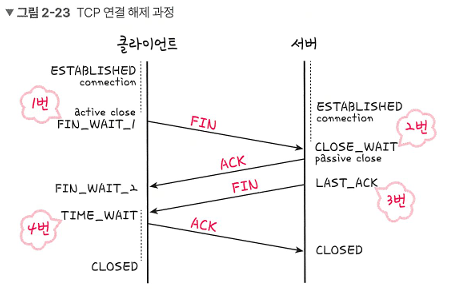

## 4-Way Handshake 문제점

### CLOSE_WAIT 상태 누적으로 인한 문제점



#### 문제 상황

4-Way Handshake 과정에서 서버가 클라이언트의 연결 종료 요청(FIN)을 받고 ACK를 보낸 후 **CLOSE_WAIT 상태**에 진입하게 된다.

**CLOSE_WAIT 상태란?**
- 클라이언트의 연결 종료 요청을 받았지만, 서버는 아직 자신의 데이터를 모두 보내지 못한 상태
- 서버 프로그램이 close() 호출을 완료해야 다음 단계로 넘어갈 수 있음

#### 주요 원인

1. **애플리케이션 버그 또는 설계 결함**
   - 서버 프로그램이 연결을 제대로 close()하지 않는 경우
   - CPU 사용률이 지나치게 높아 close() 호출이 지연되는 경우

2. **서버 성능 저하 (CPU 사용률 증가)**
   - 서버가 많은 처리 작업으로 바쁜 상태
   - 소켓 종료 처리가 뒤로 밀리는 상황

3. **하위성 차단**
   - 방화벽이나 보안 장비가 통신을 차단
   - 네트워크 장애로 인한 패킷 손실

#### 문제점

**1) 메모리 및 시스템 낭비**
- CLOSE_WAIT 상태의 소켓이 누적되면 서버의 **파일 디스크립터(FD)**가 고갈된다.
- 새로운 연결 요청을 받을 수 없게 되어 서비스 장애 발생

**2) 서비스 장애**
- 더 이상 새로운 클라이언트를 받을 수 없음
- 기존 연결도 처리되지 못해 전체 서비스가 마비될 수 있음

**3) 네트워크 리소스 낭비**
- 불필요한 소켓이 계속 유지되어 시스템 자원 낭비

#### 해결 방법

**1) 애플리케이션 수정**
- 연결이 종료될 때 명시적으로 `close()` 또는 `shutdown()` 호출
- 타임아웃 설정으로 오래된 연결 자동 종료

**2) 서버 성능 최적화**
- CPU 사용률 감소를 위한 코드 최적화
- 멀티스레딩/비동기 I/O 활용

**3) 모니터링 및 알람 설정**
- CLOSE_WAIT 소켓 수를 주기적으로 모니터링
- 임계값 초과 시 알람 발생 및 자동 재시작

**4) 소켓 옵션 조정**
```python
# Python 예시
socket.setsockopt(socket.SOL_SOCKET, socket.SO_LINGER, struct.pack('ii', 1, 0))
```

**5) 시스템 파라미터 튜닝**
- `tcp_fin_timeout` 값 조정
- 파일 디스크립터 제한 증가

---
