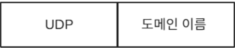
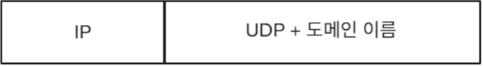
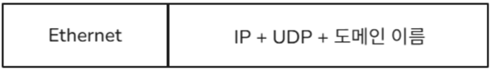

## 웹사이트 접속부터 데이터 전송까지의 흐름(TCP)

### 1. 연결 준비

#### 1) URL 입력 및 DNS 조회

브라우저에 URL을 입력하면 DNS 조회를 통해 해당 도메인 이름에 해당하는 IP주소를 찾는다.

#### 2) HTTP 요청 생성

브라우저(클라이언트)는 서버에 접속하기 위해 HTTP 요청 메시지를 만든다. (예: GET /index.html)

만들어진 요청 메시지가 실제 데이터(페이로드)가 된다.  

 

#### 3) 전송 계층 선택 (TCP vs UDP)

HTTP는 기본적으로 TCP를 사용한다.

전송 계층에서 이 HTTP 요청 데이터에 TCP 헤더를 붙여 세그먼트를 만든다.  

 

---

### 2. 연결 및 데이터 전송

이제 인터넷 계층과 데이터 링크 계층을 거쳐 데이터가 실제로 이동을 한다.

#### 3-Way Handshake

데이터 전송 전에 클라이언트와 서버는 신뢰성 있는 연결을 설정한다.

1. **SYN 단계**: 클라이언트는 서버에 클라이언트의 ISN을 담아 SYN을 보낸다.
2. **SYN+ACK 단계**: 서버는 클라이언트의 요청을 받고 연결을 수락한다는 SYN을 서버의 ISN을 담아 보내며, 클라이언트의 ISN+1을 승인번호로 보내는 ACK가 결합된 세그먼트를 전송한다.
3. **ACK 단계**: 클라이언트는 서버의 ISN+1한 값인 승인번호를 담아 ACK를 서버에 보낸다.

#### 패킷화 및 전송

##### 1) 인터넷 계층 (IP)

- 전송 계층에서 온 TCP 세그먼트에 IP 헤더를 붙여 IP 패킷을 만든다. 여기에는 **출발지/목적지 IP 주소**가 포함한다.
- 라우팅을 통해 이 패킷이 목적지(서버)로 전달될 경로를 결정한다.

##### 2) 링크 계층

- IP 패킷에 이더넷 헤더와 트레일러를 붙여 프레임을 만든다. 여기에는 **출발지/목적지 MAC 주소**가 포함된다.
- 이 프레임은 물리적 매체(케이블, Wi-Fi 등)를 통해 네트워크 상을 이동다.

##### 3) 데이터 전송 및 수신

- 프레임은 여러 라우터를 거치면서 최종 목적지 서버에 도달한다.
- 서버는 받은 프레임을 해체하여 IP 패킷, TCP 세그먼트, 최종적으로 HTTP 요청 데이터를 복원한다.
- 서버는 요청을 처리하고, HTTP 응답을 생성하여 위와 동일한 과정을 역순으로 거쳐 클라이언트에게 전송한다.

#### TCP를 이용한 연결 해제: 4-Way Handshake

데이터 교환이 끝난 후에는 연결을 종료한다.

1. **FIN (Finish)**: 클라이언트가 연결 종료를 요청하는 FIN 세그먼트를 보낸다.
2. **ACK**: 서버가 종료 요청을 받았다고 응답한다.
3. **FIN**: 서버도 자신의 데이터를 다 보냈음을 알리고 연결 종료를 요청하는 FIN 세그먼트를 보낸다.
4. **ACK**: 클라이언트가 서버의 종료 요청을 받았다고 응답한한다. (이후 일정 시간 대기 후 종료)

## DNS 흐름 상세 분석

### DNS의 흐름(UDP)

#### 1) 전송 계층 (UDP, 3계층): 데이터그램 생성

클라이언트의 애플리케이션 계층에서 DNS 요청이 전송 계층으로 내려오면, **출발지/목적지 포트 번호**를 포함한 UDP 헤더를 부착하여 UDP 데이터그램을 만든다.

- **예시**: 클라이언트 포트 (랜덤), 서버 포트 (DNS 기본 포트: 53)

#### 2) 인터넷 계층 (2계층): 패킷 및 라우팅

UDP 데이터그램에 IP 헤더를 붙여 IP 패킷을 만듭니다. 출발지/목적지 IP 주소가 포함된다.

- **출발지 IP**: 클라이언트 IP
- **목적지 IP**: DNS 서버 IP

#### 3) 링크 계층 (1계층): 프레임화 및 물리적 전송

IP 패킷이 이더넷 헤더와 트레일러를 붙여 프레임이 된다. 출발지/목적지 MAC 주소가 포함되며, 이후 프레임이 케이블이나 무선(Wi-Fi)을 통해 전송된다.

#### 4) 데이터 전송 및 수신 (라우팅 과정)

IP 패킷(프레임 형태)은 여러 라우터를 거치면서 최종 목적지인 DNS 서버에 도달하게 된다. MAC 주소와 재송신은 다음 홉(Hop, 다음 라우터)의 주소로 강제된다.

#### 5) 서버 수신 및 역순 처리

DNS 서버에 도착한 프레임은 디캡슐화되어:
- 페이로드(DNS 요청 데이터)를 포트 번호 53에 연결된 DNS 애플리케이션으로 전달한한다.

#### 6) 응답 전송 (역방향)

DNS 서버는 요청을 처리하고 'IP 주소 응답 데이터'를 생성하여 UDP호름으로 클라이언트에게 전송된된다.

---

### TCP vs UDP 비교

| 구분 | TCP | UDP |
|------|-----|-----|
| 연결 방식 | 연결지향형 | 비연결지향형 |
| 신뢰성 | 높음 (재전송, 순서 보장) | 낮음 (순서 보장 안 함) |
| 속도 | 상대적으로 느림 | 빠름 |
| 패킷 교환 방식 | 가상회선 | 데이터그램 |
| 사용 예시 | HTTP, FTP, 이메일 | DNS, 스트리밍, 게임 |
| 헤더 크기 | 20바이트 이상 | 8바이트 |
| 연결 설정 | 3-Way Handshake | 없음 |
| 연결 해제 | 4-Way Handshake | 없음 |
