# 패킷이란?

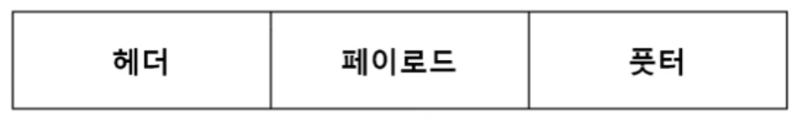  
네트워크 상에서 전달되는 데이터를 통칭하는 말로 네트워크에서 전달하는 데이터의 형식화된 블록

## 패킷의 구성요소

- **헤더**: 수신자, 송신자 등 메타정보를 포함
- **데이터**: 전송하고자 하는 실제 내용
- **푸터**: 대개 사용되지 않지만, 때때로 추가되는 제어 정보

## 여러 프로토콜을 이용해서 패킷을 만드는 과정

패킷은 여러 프로토콜의 조합으로 생성된다.

### 캡슐화 (Encapsulation)

데이터가 전송될 때, 상위 계층에서 하위 계층으로 내려가면서 프로토콜을 하나씩 붙이는 과정

각 계층은 상위 계층에서 받은 데이터에 자신의 헤더를 덧붙인다.

  

### 디캡슐화 (Decapsulation)

데이터를 받을 때, 하위 계층부터 차례대로 확인하며 데이터를 추출하는 과정

  

---

## PDU란?

**PDU**: 네트워크의 어떠한 계층에서 계층으로 데이터가 전달될 때 한 덩어리의 단위

패킷이 전달되는 형태는 그 계층에 따라 다르고 이름이 달라진다.

  
  
  

- **4계층 (애플리케이션)**: 메시지
- **3계층 (전송)**: 세그먼트(TCP), 데이터그램(UDP)
- **2계층 (인터넷)**: 패킷
- **1계층 (링크)**: 프레임(데이터 링크 계층), 비트(물리 계층)

---

# TCP/IP 4계층  

## 4계층: 애플리케이션 계층

FTP/HTTP/SSH/SMTP/DNS 등 응용 프로그램이 사용되는 프로토콜 계층이며 웹 서비스, 이메일 등 서비스를 실질적으로 사람들에게 제공하는 층이다.

1. **FTP**: 장치와 장치 간의 파일을 전송하는 데 사용되는 표준 통신 프로토콜
2. **SSH**: 보안되지 않은 네트워크에서 네트워크 서비스를 안전하게 운영하기 위한 암호화 네트워크 프로토콜
3. **HTTP**: World Wide Web을 위한 데이터 통신의 기초이자 웹 사이트를 이용하는 데 쓰는 프로토콜
4. **SMTP**: 전자 메일 전송을 위한 인터넷 표준 통신 프로토콜
5. **DNS**: 도메인 이름과 IP 주소를 매핑해주는 서버

---

## 3계층: 전송 계층

송신자와 수신자를 연결하는 통신 서비스를 제공하며 연결 지향 데이터 스트림 지원, 신뢰성, 흐름 제어를 제공할 수 있으며 애플리케이션과 인터넷 계층 사이의 데이터가 전달될 때 중계 역할을 한다.

대표적으로 TCP와 UDP가 있다.

### 1) TCP: 연결지향형

패킷 사이의 순서를 보장하고 연결지향 프로토콜을 사용해서 연결을 하여 신뢰성을 구축해서 수신 여부를 확인하며 '가상회선 패킷 교환 방식'을 사용한다.

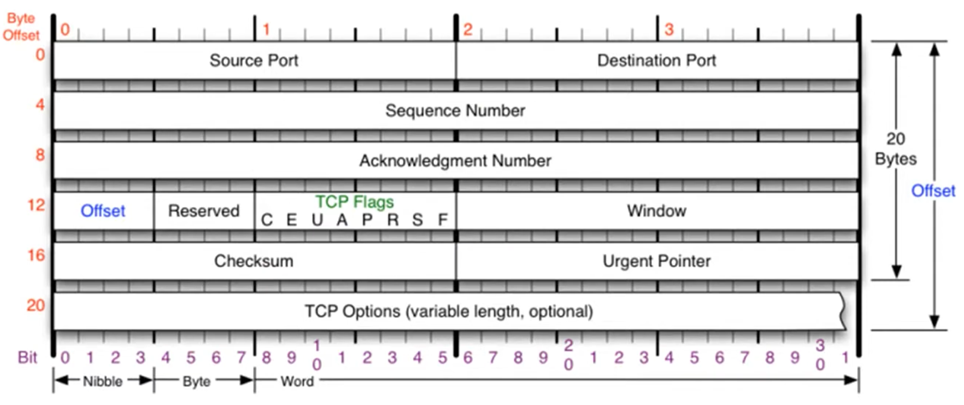

#### TCP 헤더 필드

- **Offset**: TCP 헤더의 길이를 나타낸다.
- **Reserved**: 미래 사용을 위해 예약된 필드. TCP 프로토콜이 확장되거나 새로운 기능이 추가될 경우 사용될 수 있도록 남겨둔 공간이다. 
- **Checksum**: 오류 검증. 전송 중 TCP 헤더와 데이터(페이로드), 그리고 일부 의사 헤더(Pseudo-header)에 오류가 발생했는지 확인하는 데 사용됨
- **Window**: 수신자가 현재 수용할 수 있는 버퍼 공간의 크기를 송신자에게 알려준다. 흐름 제어에 사용됨
- **TCP Flags**: 현재 TCP 세그먼트가 어떤 목적으로 사용되는지, 그리고 연결의 어느 단계에 있는지 나타낸다.

#### TCP Flags
TCP 헤더에 포함되어 통신의 제어 및 상태 관리를 담당한다.  

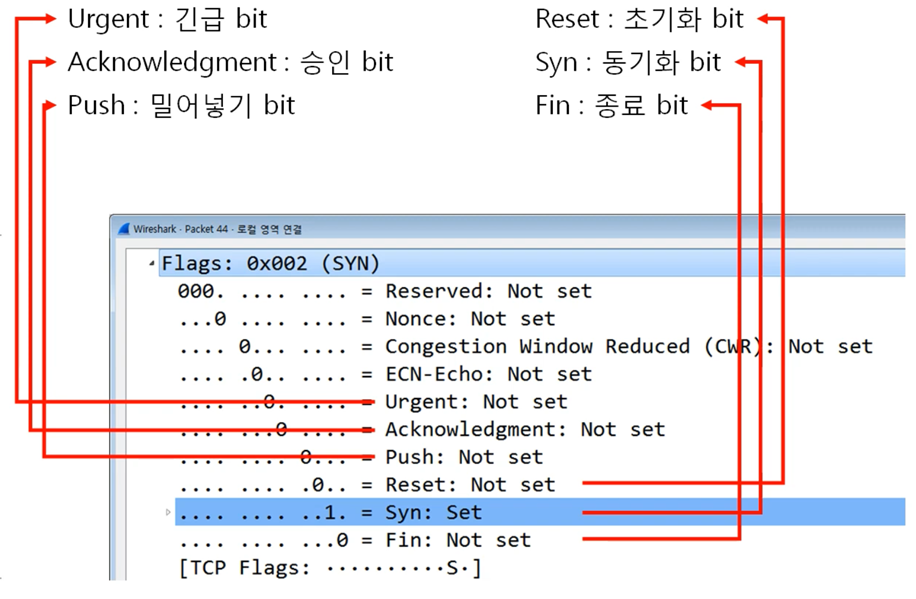

- **Urgent**: 이 플래그가 1로 설정되면, 현재 세그먼트 내에 우선순위가 높은 데이터가 포함되어 있음을 수신 측에 알린다.  
&nbsp;&nbsp;&nbsp;&nbsp;이는 일반적으로 데이터 흐름을 무시하고 긴급 데이터를 먼저 처리하도록 요구할 때 사용된다.
  - *Urgent Pointer*: 세그먼트 내에서 긴급 데이터가 끝나는 지점의 바이트 위치를 표시한다.
- **Acknowledgement**: TCP에서 중요하고 많이 사용되는 플래그, 1로 설정되면, Acknowledgement Number(확인 응답 번호) 필드 값이 유효하다는 것을 의미하며,  
  **수신 측이 송신 측에게 특정 순서 번호까지의 데이터를 성공적으로 잘 받았다는 응답을 보낼 때 사용된다.**
- **Push**: 이 플래그가 설정되면, 송신 애플리케이션이 데이터를 즉시 전송하기를 원하고,  
&nbsp;&nbsp;&nbsp;수신 애플리케이션은 버퍼에 쌓아두지 않고 즉시 상위 계층(애플리케이션)으로 전달해 줄 것을 요구한다.  
&nbsp;&nbsp;&nbsp;Push 플래그는 대기 메커니즘을 무시하고 즉시 데이터 전달을 강제하여 실시간성이 중요한 환경에서 유용하다.  
   * TCP버퍼 : 내가 받을 수 있는 공간  
   * 일반적으로 TCP는 효율성을 위해 버퍼에 데이터가 일정 크기만큼 쌓이거나 타임아웃이 발생할 때까지 기다렸다가 패킷을 전송한다.
- **Reset**: 비정상적인 상황이 발생하여 현재의 TCP 연결을 즉시 중단하고 리셋할 것을 요청한다.  
&nbsp;&nbsp;&nbsp;연결을 시도했으나 해당 포트가 열려 있지 않거나 연결 상태가 불안정할 때 발생한다.  
&nbsp;&nbsp;&nbsp;연결이 정상적으로 닫히는 FIN과는 달리, 강제적이고 즉각적인 연결 종료를 의미하며, 상대방에게 통신을 계속할 수 없음을 알린다.  
- **Syn**: TCP 연결을 시작할 때 사용되는 플래그이다. 3-Way Handshake 과정에서 가장 먼저 전송되며, 연결을 요청하는 용도로 사용된다.  
&nbsp;&nbsp;&nbsp;이 플래그를 통해 송신 측은 자신의 Sequence Number (순서 번호)를 전달하고, 수신 측은 이를 수락하며 동기화 과정을 시작한다.  
- **Fin**: 데이터 교환을 모두 마친 후, 현재의 TCP 연결을 정상적으로 종료할 때 사용되는 플래그이다.  
&nbsp;&nbsp;&nbsp;양방향 통신 중 한쪽 방향의 데이터 송신을 끝내겠다는 의미이기 때문에 연결을 완전히 종료하기 위해서는 양쪽 모두 FIN을 보내고 ACK를 받는 4-Way Handshake 과정을 거친다.

#### 가상회선 패킷 교환 방식

각 패킷에는 가상회선 식별자가 포함되며 모든 패킷을 전송하면 가상회선이 해제되고 패킷들은 전송된 '순서대로' 도착하는 방식이다.
(가상회선 패킷 교환방식)

#### TCP 연결 성립 과정 (TCP 3-Way Handshake)

TCP를 이용한 데이터 통신을 할 때 프로세스와 프로세스를 연결하기 위해 가장 먼저 수행되는 과정으로 신뢰성을 확보한다.


1. **SYN 단계**: 클라이언트는 서버에 클라이언트의 ISN을 담아 SYN을 보낸다.
2. **SYN+ACK 단계**: 서버는 클라이언트의 요청을 받고 연결을 수락한다는 SYN을 서버의 ISN을 담아 보내며, 클라이언트의 ISN+1을 승인번호로 보내는 ACK가 결합된 세그먼트를 전송합니다.
3. **ACK 단계**: 클라이언트는 서버의 ISN+1한 값인 승인번호를 담아 ACK를 서버에 보낸다.

**용어 정리**
- *SYN*: SYNchronization의 약자, 연결 요청 플래그
- *ACK*: ACKnowledgement의 약자, 응답 플래그
- *ISN*: Initial Sequence Numbers의 약어, 초기 네트워크 연결을 할 때 할당된 32비트 고유 시퀀스 번호

#### TCP 연결 해제 과정 (TCP 4-Way Handshake)


1. **FIN (Finish)**: 클라이언트가 연결을 닫으려고 할 때 연결 종료를 요청하는 FIN으로 설정된 세그먼트를 보낸다.   
                         그리고 클라이언트는 FIN_WAIT_1 상태로 들어가고 서버의 응답을 기다린다.
2. **ACK**: 서버는 클라이언트로 ACK라는 승인 세그먼트를 보낸다. 그리고 CLOSE_WAIT 상태에 들어간다.  
                클라이언트는 세그먼트를 받으면 FIN_WAIT_2 상태에 들어간다.
3. **FIN**: 서버는 ACK를 보내고 일정 시간 이후에 클라이언트에 자신의 데이터를 다 보냈음을 알리고  
              연결 종료를 요청하는 FIN이라는 세그먼트를 보낸다.
4. **ACK**: 클라이언트는 TIME_WAIT 상태가 되고 다시 서버로 ACK를 보내서 서버는 CLOSED 상태가 된다.   
               이후 클라이언트는 어느 정도의 시간을 대기한 후 서버의 종료 요청을 받았다고 응답하고 클라이언트와 서버의 모든 자원의 연결이 해제된다.

#### 굳이 왜 일정 시간(TIME_WAIT) 뒤에 닫을까?

1. **지연 패킷이 발생할 경우를 대비하기 위해서이다.**
패킷이 뒤늦게 도달하고 이를 처리하지 못한다면 데이터 무결성 문제가 발생한다.
예를 들어 전체 데이터가 100일 때 일부 데이터인 50만 들어오는 현상이 발생할 수도 있다는 것.

2. **두 장치가 연결이 닫혔는지 확인하기 위해서이다.**
만약 LAST_ACK 상태에서 닫히게 되면 다시 새로운 연결을 하려고 할 때 장치는 줄곧 LAST_ACK로 되어 있기 때문에 접속 오류가 나타나게 된다.

---

### 2) UDP: 비연결지향형

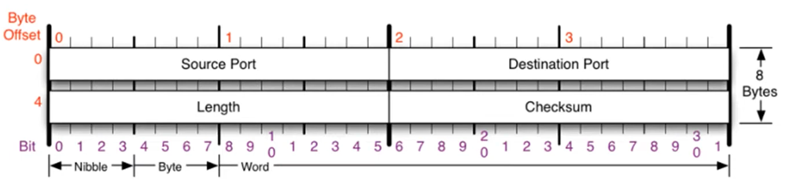

순서를 보장하지 않고 수신 여부를 확인하지 않으며 단순히 데이터만 주는 '데이터그램 패킷 교환 방식'을 사용한다.

#### 데이터그램 패킷 교환 방식

패킷이 독립적으로 이동하며 최적의 경로를 선택하여 가는데, 하나의 메시지에서 분할된 여러 패킷은 서로 다른 경로로 전송될 수 있으며 도착한 '순서가 다를 수' 있는 방식을 뜻한다.

(데이터그램 패킷 교환 방식 교재)

#### UDP의 특징

UDP의 전송 방식은 너무 단순해서

1. 서비스의 신뢰성이 낮고,
2. 데이터그램 도착 순서 보장하지 않고, 중복, 누락 가능성이 있기 때문에

일반적으로 오류의 검사와 수정이 필요 없는 프로그램에서 수행할 것으로 가정한다.

#### UDP 프로토콜을 사용하는 프로그램

1. 도메인을 물으면 IP를 알려주는 **DNS 서버**
2. UDP로 파일을 공유하는 **tftp 서버**
3. 라우팅 정보를 공유하는 **RIP 프로토콜**

---

### 포트번호

전송 계층에서는 포트번호를 사용한다.

특정 프로세스와 특정 프로세스가 통신을 하기 위해 사용한다.

하나의 포트는 하나의 프로세스만 사용 가능하지만 하나의 프로세스가 여러 개의 포트를 사용하는 것은 가능하다.

포트 번호는 일반적으로 정해져 있지만 무조건 지켜야 하는 것은 아니다.

예를 들어 일반적으로 웹 서비스는 80번 포트를 사용하지만 웹 서비스가 항상 80번 포트를 사용해야만 하는 것은 아니다.

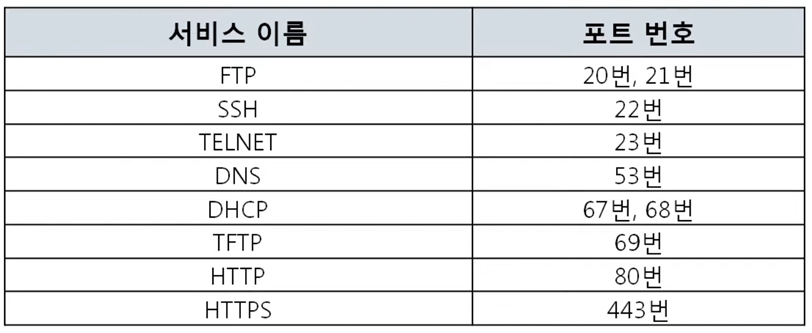
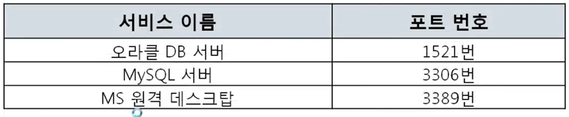


1. 전 세계적으로 유명한 **Well-Known 포트**
2. 조금은 유명한 **Registered 포트**
3. 일반 사용자들이 사용하는 **Dynamic 포트**

#### 예시

'네이버 웹툰을 본다'했을 때 웹 브라우저라고 하는 프로그램이 네이버 웹 서버 프로그램이랑 서로 연결되는 것이다.

이때 네이버 웹 서버가 사용하는 프로그램이 http이다.

```
크롬 (웹 브라우저 프로그램) <-> HTTP (네이버 웹 서버 프로그램)
다이나믹 포트 <-> HTTP 포트 (80번)
```

---

## 2계층: 인터넷 계층

장치로부터 받은 네트워크 패킷을 IP 주소로 지정된 목적지로 전송하기 위해 사용되는 계층이다.

IP, ICMP, ARP 등이 있으며 다른 네트워크 대역 즉, 멀리 떨어진 곳에 존재하는 네트워크까지 어떻게 데이터를 전달할지 제어하는 일을 담당

**대표적인 장비**: 라우터

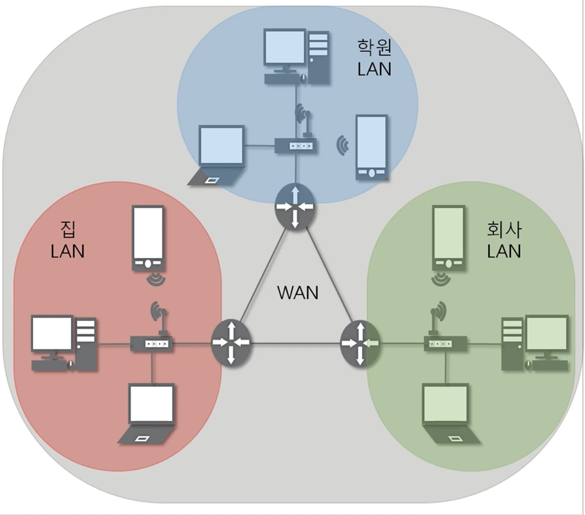

1. **IP 주소**: WAN에서 통신할 때 사용하는 주소
2. **ARP 프로토콜**: IP주소를 이용해서 MAC 주소를 알아온다.
3. **IPv4 프로토콜**: WAN에서 통신할 때 사용하는 프로토콜
4. **ICMP 프로토콜**: 서로가 통신되는지 확인할 때 사용

### 사설IP와 공인 IP

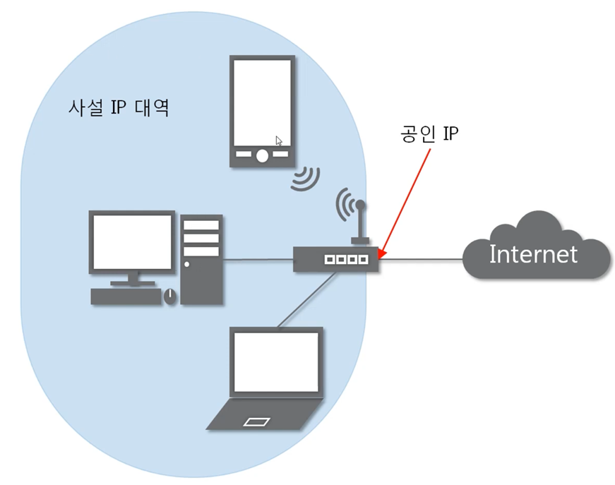

- **공인 IP**: 인터넷 네트워크 통신망이랑 통신할 때 사용하는 IP주소
- **사설 IP**: 같은 네트워크 대역 안에서 사용하는 IP 주소
- **NAT**: 네트워크 주소를 사설에서 공인으로 바꾸는 것

실제 인터넷 세상에서는 공인 IP로만 통신

외부 네트워크 대역에서는 사설IP 대역이 보이지 않는다.

---

## 1계층: 링크 계층

전선, 광섬유, 무선 등으로 실질적으로 데이터를 전달하며 장치 간에 신호를 주고받는 '규칙'을 정하는 계층이다.

> **참고**: 물리 계층과 데이터 링크 계층으로 나누기도 한다.

1. **물리 계층**: 무선 LAN과 유선 LAN을 통해 0과 1로 이루어진 데이터를 보내는 계층
2. **데이터 링크 계층**: '이더넷 프레임'을 통해 에러 확인, 흐름 제어, 접근 제어를 담당하는 계층

---

# 웹사이트 접속부터 데이터 전송까지의 흐름

## 1. 연결 준비

### 1) URL 입력 및 DNS 조회

브라우저에 URL을 입력하면 DNS 조회를 통해 해당 도메인 이름에 해당하는 IP주소를 찾는다.

### 2) HTTP 요청 생성

브라우저(클라이언트)는 서버에 접속하기 위해 HTTP 요청 메시지를 만든다. (예: GET/index.html)

만들어진 요청 메시지가 실제 데이터(페이로드)가 된다.

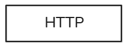 

### 3) 전송 계층 선택 (TCP vs UDP)

HTTP는 기본적으로 TCP를 사용한다.

전송 계층에서 이 HTTP 요청 데이터에 TCP 헤더를 붙여 세그먼트를 만든다.

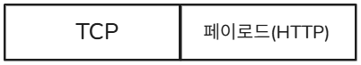 

---

## 2. 연결 및 데이터 전송

이제 인터넷 계층과 데이터 링크 계층을 거쳐 데이터가 실제로 이동을 한다.

### 3-Way Handshake

데이터 전송 전에 클라이언트와 서버는 신뢰성 있는 연결을 설정한다.

1. **SYN 단계**: 클라이언트는 서버에 클라이언트의 ISN을 담아 SYN을 보낸다.
2. **SYN+ACK 단계**: 서버는 클라이언트의 요청을 받고 연결을 수락한다는 SYN을 서버의 ISN을 담아 보내며, 클라이언트의 ISN+1을 승인번호로 보내는 ACK가 결합된 세그먼트를 전송합니다.
3. **ACK 단계**: 클라이언트는 서버의 ISN+1한 값인 승인번호를 담아 ACK를 서버에 보낸다.

### 패킷화 및 전송

#### 1) 인터넷 계층 (IP)

- 전송 계층에서 온 TCP 세그먼트에 IP 헤더를 붙여 IP 패킷을 만든다. 여기에는 **출발지/목적지 IP 주소**가 포함된다.
- 라우팅을 통해 이 패킷이 목적지(서버)로 전달될 경로를 결정한다.

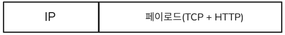

#### 2) 링크 계층

- IP 패킷에 이더넷 헤더와 트레일러를 붙여 프레임을 만든다. 여기에는 **출발지/목적지 MAC 주소**가 포함된다.
- 이 프레임은 물리적 매체(케이블, Wi-Fi 등)를 통해 네트워크 상을 이동한다.

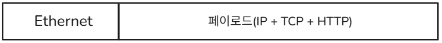

#### 3) 데이터 전송 및 수신

- 프레임은 여러 라우터를 거치면서 최종 목적지 서버에 도달한다.
- 서버는 받은 프레임을 해체하여 IP 패킷, TCP 세그먼트, 최종적으로 HTTP 요청 데이터를 복원한다.
- 서버는 요청을 처리하고, HTTP 응답을 생성하여 위와 동일한 과정을 역순으로 거쳐 클라이언트에게 전송한다.

### TCP를 이용한 연결 해제: 4-Way Handshake

데이터 교환이 끝난 후에는 연결을 종료한다.

1. **FIN (Finish)**: 클라이언트가 연결 종료를 요청하는 FIN 세그먼트를 보냅니다.
2. **ACK**: 서버가 종료 요청을 받았다고 응답합니다.
3. **FIN**: 서버도 자신의 데이터를 다 보냈음을 알리고 연결 종료를 요청하는 FIN 세그먼트를 보냅니다.
4. **ACK**: 클라이언트가 서버의 종료 요청을 받았다고 응답합니다. (이후 일정 시간 대기 후 종료)
