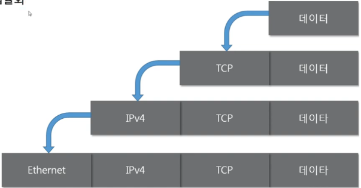
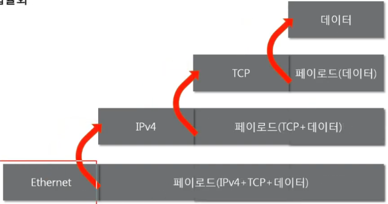
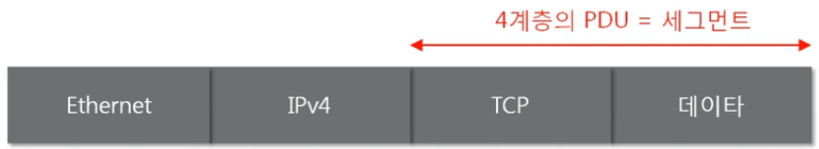
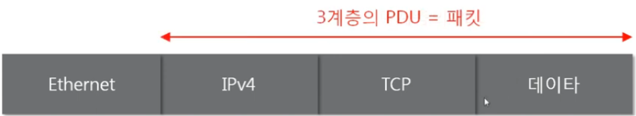

## 패킷의 기본 개념

### 패킷이란?
네트워크 상에서 전달되는 데이터를 통칭하는 말로, 네트워크에서 전달하는 데이터의 형식화된 블록을 의미한다.

### 패킷의 구성요소
- **헤더(Header)**: 수신자, 송신자 등 메타정보를 포함
- **데이터(Data)**: 전송하고자 하는 실제 내용
- **푸터(Footer)**: 대개 사용되지 않지만, 때때로 추가되는 제어 정보

### 캡슐화(Encapsulation)
데이터가 전송될 때, 상위 계층에서 하위 계층으로 내려가면서 각 계층의 프로토콜 헤더를 하나씩 붙이는 과정

**특징:**
- 각 계층은 상위 계층에서 받은 데이터에 자신의 헤더를 덧붙임
- 상위 계층 → 하위 계층 방향으로 진행

 

### 디캡슐화(Decapsulation)
데이터를 받을 때, 하위 계층부터 차례대로 헤더를 확인하며 데이터를 추출하는 과정

**특징:**
- 하위 계층 → 상위 계층 방향으로 진행
- 각 계층의 헤더를 제거하며 원본 데이터 복원

  

### PDU(Protocol Data Unit)
네트워크의 어떠한 계층에서 계층으로 데이터가 전달될 때 한 덩어리의 단위로 패킷이 전달되는 형태는 그 계층에 따라 다르고 이름이 달라진다.

  
  
 

**계층별 PDU 명칭:**
- **애플리케이션 계층**: 메시지(Message)
- **전송 계층**: 세그먼트(Segment, TCP) / 데이터그램(Datagram, UDP)
- **인터넷 계층**: 패킷(Packet)
- **링크 계층**: 프레임(Frame, 데이터 링크) / 비트(Bit, 물리)
