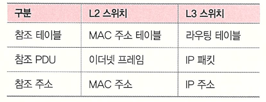
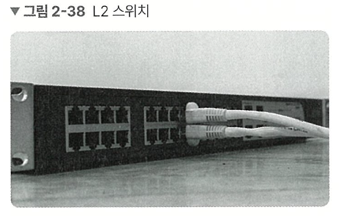
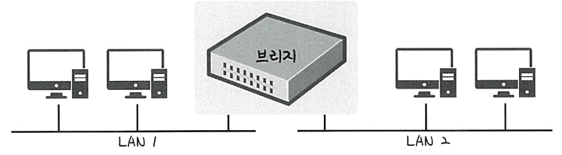
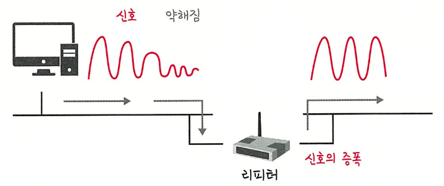
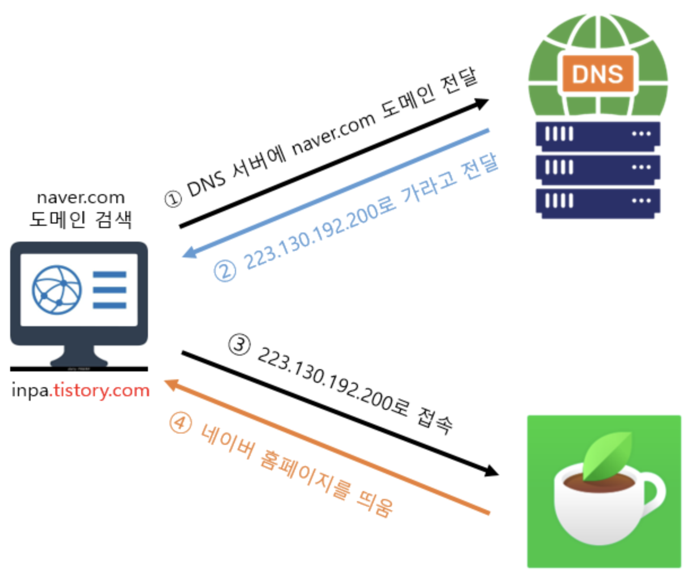

# 네트워크 기기의 처리 범위

상위 계층을 처리하는 기기는 하위 계층을 처리할 수 있지만 그 반대는 불가

예) 애플리케이션 계층 처리 기기는 그 밑의 모든 계층의 프로토콜을 처리할 수 있지만 물리 계층은 해당 계층만 처리할 수 있음

- 애플리케이션 계층: L7 스위치
- 인터넷 계층: 라우터, L3 스위치
- 데이터 링크 계층: L2 스위치, 브리지
- 물리 계층: NIC, 리피터, AP

# 애플리케이션 계층 처리 기기

## L7 스위치

- 스위치: 여러 장비를 연결, 데이터 통신을 중재하며 목적지가 연결된 포트로만 전기 신호를 보내 데이터를 전송하는 통신 네트워크 장비
- 로드밸런서라고도 함, 서버의 부하를 분산하는 기기
- 클라이언트로부터 오는 요청들을 뒤쪽의 여러 서버로 나누는 역할. 시스템이 처리할 수 있는 트래픽 증가를 목표로 함
- **URL, 서버, 캐시, 쿠키들을 기반으로 트래픽 분산**
- 바이러스, 불필요한 외부 데이터 등을 걸러내는 필터링 기능
- 응용 프로그램 수준의 트래픽 모니터링도 가능
- 정기적 **\*헬스 체크**를 이용하여 장애가 발생한 서버가 있다면 트래픽 분산 대상에서 제외

### \*헬스 체크

- 정상적인 서버 또는 비정상적인 서버를 판별
- 전송 주기와 재전송 횟수 등을 설정한 이후 반복적으로 서버에 요청을 보내는 것
- 단, 서버에 부하가 되지 않을 만큼 요청 횟수가 적절해야함
- TCP, HTTP 등 다양한 방법으로 요청을 보냄 → 요청 정상 = 정상 서버
  - 예) TCP 요청을 보냈는데 3 way handshake가 정상적으로 일어나지 않음 = 정상 아님

## L4 스위치

- 로드밸런서로 사용
- 전송 계층을 처리하는 기기
- 스트리밍 관련 서비스에서는 사용할 수 없음
- 메세지를 기반으로 인식하지 못하고 IP와 포트 기반으로(특히 포트) 트래픽 분산

NOTE: 클라우드 서비스(AWS 등)에서 L7 스위치를 사용한 로드밸런싱은 ALB(Application Load Balancer) 컴포넌트로, L4 스위치를 이용한 로드밸런싱은 NLB(Network Load Balancer) 컴포넌트로 함

| 구분              | **ALB (Application Load Balancer)**                                           | **NLB (Network Load Balancer)**                                |
| ----------------- | ----------------------------------------------------------------------------- | -------------------------------------------------------------- |
| OSI 계층          | L7 (Application)                                                              | L4 (Transport)                                                 |
| 지원 프로토콜     | HTTP/1.1, **HTTP/2**, **HTTP/3(QUIC)**, **gRPC**                              | **TCP**, **UDP**, TLS                                          |
| 라우팅 기능       | **호스트/경로 기반**, 헤더/쿼리/메서드 조건, 가중 라우팅, 리다이렉트/고정응답 | 포트/프로토콜 단위 **연결 분산** (애플리케이션 레벨 규칙 없음) |
| 대상(Target) 타입 | **Instance**, **IP**, **Lambda**(서버리스 백엔드)                             | **Instance**, **IP**                                           |
| 세션 고정(Sticky) | **L7 쿠키 기반**(ALB 쿠키/앱 쿠키)                                            | **소스 IP 기반** 스티키(옵션)                                  |
| TLS 처리          | **종단(termination)** 일반적, SNI/추가 인증서, 리다이렉트(80→443)             | **패스스루** 또는 **종단** 모두 가능                           |
| 헬스체크          | HTTP/HTTPS 경로 기반(상태코드)                                                | TCP 레벨 기본, 선택적 HTTP/HTTPS                               |
| WebSocket/gRPC    | **지원**(HTTP/1.1 업그레이드, HTTP/2 gRPC)                                    | L4 수준 연결이므로 프로토콜 자체 인지 X                        |
| 정적 IP/EIP       | DNS 이름만(정적 IP 없음)                                                      | AZ별 **정적 IP** 혹은 **Elastic IP** 할당 가능                 |
| 보안 연계         | **AWS WAF 연동** 가능                                                         | WAF 직접 연동 **불가**(앞단에 ALB/CloudFront 권장)             |
| 로깅/추적         | 액세스 로그, X-Forwarded-\* 헤더 제공                                         | 액세스 로그, **Proxy Protocol v2** 지원                        |
| 성능/지연         | L7 처리로 약간의 오버헤드                                                     | **초저지연/초고처리량**(IoT/실시간/게임 등)                    |
| 사용 사례         | 마이크로서비스, API 게이트웨이 성격, A/B 테스트, 서버리스                     | 고성능 TCP/UDP, 게임/VoIP, 고정 IP 필요, 내부 시스템 LB        |

## 로드밸런서를 이용한 서버 이중화

- 서버 이중화 = 대표적인 로드밸런서의 대표적인 기능
- 서비스를 안정적으로 운용하기 위해서는 2대 이상의 서버는 필수 → 에러가 발생하여 서버 1대가 종료되더라도 서비스는 안정적으로 운용되어야 하기 때문
- 로드밸런서는 2대 이상의 서버를 기반으로 가상 IP를 제공하고 이를 기반으로 안정적인 서비스 제공

# 인터넷 계층 처리 기기

## 라우터

- 여러 네트워크를 연결하고 그 사이에서 데이터를 가장 효율적으로 전달해주는 장치
- 데이터(패킷)가 목적지까지 갈 때 여러 경로 중에서 가장 빠르고 효율적인 길을 선택
- LAN과 LAN, LAN과 WAN 사이 등 서로 다른 네트워크 사이에 위치
- 빠르고 효율적인 데이터 전달, 네트워크 분리 및 관리 용이

## L3 스위치

- L2 스위치의 기능과 라우팅 기능을 갖춘 장비
- L3 스위치를 (하드웨어 기반) 라우터라고 해도 무방함
- 라우터는 소프트웨어 기반의 라우팅과 하드웨어 기반의 라우팅으로 나누어짐
  

# 데이터 링크 계층 처리 기기

## L2 스위치



- 장치들의 MAC 주소를 MAC 주소 테이블을 통해 관리
- 연결된 장치로부터 패킷이 왔을 때 패킷 전송을 담당
- IP 주소를 이해하지 못함 = IP 주소를 기반을 라우팅 불가
- 단순히 패킷의 MAC 주소를 읽어 스위칭하는 역할
- 목적지가 MAC 주소 테이블에 없다면 전체 포트에 연결하고 MAC 주소 테이블의 주소는 일정 시간 이후 삭제하는 기능도 있음

## 브리지(Bridge)

- 두 개의 근거리 통신망(LAN)을 상호 접속할 수 있도록 하는 통신망 연결 장치
- 포트와 포트 사이의 다리 역할
- 장치에서 받아온 MAC 주소를 MAC 주소 테이블로 관리
- 통신망 범위를 호가장하고 서로 다른 LAN 등으로 이루어진 ‘하나의’ 통신망을 구축할 때 쓰임
  

# 물리 계층 처리 기기

## NIC(Network Interface Card)

- LAN 카드라고도 함, 각 카드에는 고유의 식별번호인 MAC 주소 있음
- 2대 이상의 컴퓨터 네트워크를 구성하는 데 사용
- 네트워크와 빠른 속도로 데이터를 송수신할 수 있도록 컴퓨터 내에 설치하는 확장 카드

## 리피터

- 들어오는 약해진 신호 정도를 증폭하여 다른 쪽으로 전달하는 장치
- 이를 통해 패킷이 더 멀리 갈 수 있음
- 광케이블이 보급됨에 따라 현재는 잘 쓰이지 않음
  

## AP(Access Point)

- 패킷을 복사하는 기기
- 유선 LAN을 연결한 후 다른 장치에서 무선 LAN 기술(와이파이 등)을 사용하여 무선 네트워크 연결을 할 수 있음

## 라우터 vs 스위치 vs 허브

| 구분                   | **허브 (Hub)**                               | **스위치 (Switch)**                      | **라우터 (Router)**                            |
| ---------------------- | -------------------------------------------- | ---------------------------------------- | ---------------------------------------------- |
| **계층 (OSI)**         | **2계층 (물리)**                             | **2계층 (데이터링크)**                   | **3계층 (네트워크)**                           |
| **기능 요약**          | 모든 장치에 신호를 **그냥 뿌림 (Broadcast)** | 목적지를 찾아서 **필요한 장치에만 전달** | **서로 다른 네트워크 간** 데이터 전송 (길찾기) |
| **주소 인식**          | ❌ 없음                                      | ✅ MAC 주소                              | ✅ IP 주소                                     |
| **네트워크 연결 범위** | 같은 네트워크 내 장치 연결                   | 같은 네트워크 내 장치 연결 (더 효율적)   | 다른 네트워크 연결 (예: 가정 → 인터넷)         |
| **성능**               | 느림 (불필요한 트래픽 많음)                  | 빠름 (필요한 곳에만 전달)                | 빠름 + 복잡 (라우팅 기능)                      |
| **대표 위치**          | 옛날 공유기 내부 / 단순 연결기               | 사무실, 캠퍼스 LAN 내부                  | 인터넷 게이트웨이, 외부망 연결                 |
| **예시 비유**          | “확성기” – 말하면 모두가 들음                | “선택 호출기” – 필요한 사람만 들음       | “내비게이션” – 목적지로 가는 길 안내           |

# DNS, NAT, DHCP, CDN, Load Balancing

## DNS (Domain Name System)

- 컴퓨터는 142.250.190.36과 같은 IP주소로 통신
- DNS는 “이름 → IP”를 알려주는 전화번호부 역할
  

웹브라우저 접속시 DNS 흐름

1. 도메인 주소들을 가지고 있는 네임서버(DNS 서버)에 접속
2. 네임서버에 접속한 도메인(naver.com)과 연결된 IP 정보(223.130.192.200)를 확인하고, IP를 사용자 PC에 전달
3. 사용자 PC는 전달받은 서버의 IP 주소로 접속
4. 서버의 IP로 연결된 브라우저에 서버의 내용(홈페이지)을 출력

[더 자세한 DNS] [https://inpa.tistory.com/entry/WEB-🌐-DNS-개념-동작-완벽-이해-★-알기-쉽게-정리](https://inpa.tistory.com/entry/WEB-%F0%9F%8C%90-DNS-%EA%B0%9C%EB%85%90-%EB%8F%99%EC%9E%91-%EC%99%84%EB%B2%BD-%EC%9D%B4%ED%95%B4-%E2%98%85-%EC%95%8C%EA%B8%B0-%EC%89%BD%EA%B2%8C-%EC%A0%95%EB%A6%AC)

## NAT (Network Address Translation)

- 사설 IP ↔ 공인 IP 변환 기술
- IPv4 주소는 한정되어 있고 모든 기기에 공인 IP를 줄 수 없으므로 공유기 (NAT 장치)가 대신 변환해줌
- 집 안의 PC, 스마트폰은 보통 사설 IP(192.168.x.x) 사용함. 인터넷 접속 시 공유기가 이 주소를 공인 IP(e.x. 203.0.x.x)로 바꿔서 전송 → 응답 오면 다시 내부 시설 IP로 매핑하여 되돌려줌
- 예시 → 공유기가 포트 번호를 매핑하여 여러 내부 기기를 구분 (Port Forwarding)

| 구분      | 내부        | 외부               |
| --------- | ----------- | ------------------ |
| 노트북 IP | 192.168.0.2 | 203.0.113.45:40001 |
| 공유기 IP | 192.168.0.1 | 203.0.113.45       |
| 서버 IP   | -           | 8.8.8.8            |

## DHCP (Dynamic Host Configuration Protocol)

- 자동으로 IP, 게이트웨이, DNS 등을 할당하는 프로토콜
- 기기가 네트워크에 연결될 때 IP 주소 사용을 요청하면 DHCP 서버가 자동으로 IP를 임대(lease)
- 동작 순서 (DORA) → 자동으로 IP, 서브넷, 게이트웨이, DNS 정보까지 세팅되어 편리

1. Discover – 클라이언트가 “누가 DHCP 서버인가요?” 브로드캐스트
2. Offer – DHCP 서버가 “이 IP 써보세요” 제안
3. Request – 클라이언트가 “그 IP 주세요” 요청
4. Acknowledge – 서버가 승인 후 임대 완료

## CDN

- 데이터 사용량이 많은 애플리케이션의 웹 페이지 로드 속도를 높이는 상호 연결된 서버 네트워크
- 사용자가 멀리 있는 원본 서버로 접속하면 느림 → 전 세계 엣지 서버(Edge Server)에 콘텐츠 복제(Cache) 저장 → 접속시 DNS가 가장 가까운 엣지 서버 IP로 안내
- 지리적 거리를 단축하여 응답 속도 향상
- 트래픽을 분산하여 원본 서버 부하 감소
- 한 엣지 장애 시 다른 엣지로 우회하여 장애 대응
- 대표 서비스: Cloudflare, AWS CloudFront, Akamai, Fastly

[더 자세한 CDN] https://aws.amazon.com/ko/what-is/cdn/

## Load Balancing

- 트래픽 폭주 시 한 서버만 터지지 않도록 부하를 여러 서버로 균등 분산(Scale-out)

| 구분                    | 설명                                                |
| ----------------------- | --------------------------------------------------- |
| **L4 로드밸런서 (NLB)** | IP/Port 기준, TCP/UDP 연결 단위로 분산              |
| **L7 로드밸런서 (ALB)** | HTTP 경로, 헤더, 쿠키 등 **애플리케이션 레벨** 분산 |
| **DNS 라운드 로빈**     | DNS가 여러 IP를 번갈아 응답하여 부하 분산           |

- 로드밸런서의 기본 기능

| 기능명                                | 설명                                                                       | 주요 목적                                        | 세부 특징                                                                                                               |
| ------------------------------------- | -------------------------------------------------------------------------- | ------------------------------------------------ | ----------------------------------------------------------------------------------------------------------------------- |
| **Health Check**                      | 서버의 상태를 주기적으로 점검하여 정상/비정상을 판단                       | 장애 서버로 트래픽을 보내지 않고 Fail-over 수행  | - **L3(ICMP)**: 서버 IP 응답 확인 - **L4(TCP)**: 포트(TCP Handshake) 상태 확인 - **L7(HTTP)**: 실제 웹 페이지 응답 확인 |
| **Tunneling**                         | 클라이언트–서버 사이에 보이지 않는 가상의 통신 경로 생성                   | 특정 구간만 안전하게 데이터 캡슐화하여 전달      | 패킷 encapsulation/decapsulation 처리                                                                                   |
| **NAT (Network Address Translation)** | 요청/응답 과정에서 IP 주소를 변환                                          | 내부 사설 IP ↔ 외부 공인 IP 변환으로 트래픽 전달 | - **SNAT**: 사설→공인 IP로 변경 - **DNAT**: 공인→사설 IP로 변경 - 하나의 VIP로 여러 서버 연결                           |
| **DSR (Direct Server Routing)**       | 요청은 로드밸런서를 통해 전달하지만 응답은 서버가 직접 클라이언트에게 보냄 | 로드밸런서 부하 감소, 처리량 증가                | 서버가 클라이언트 MAC 주소로 직접 응답                                                                                  |

### 관련 예상 면접 질문 및 답변

<details>
<summary>1. 서버에 부하가 발생하여 로드밸런서를 도입했지만, 여전히 응답이 느릴 때 예상 가능한 원인과 해결 방법은?</summary>

### **예상 가능한 원인**

1. 백엔드 서버 자체의 처리 병목
   - DB 쿼리 지연
   - CPU/메모리 부족
   - 동기 IO 블로킹
2. 로드밸런서의 Health Check 설정 오류
   - 지나치게 잦은 L7 체크 → 서버 부하 가중
   - Health Check 타임아웃/임계값 오류로 사실상 장애 서버가 계속 포함됨
3. 로드밸런싱 알고리즘 문제
   - Round Robin 사용 → 서버 성능이 다른 경우 비효율
   - 특정 서버로 트래픽이 쏠리는 현상(세션 고정 Sticky Session 설정 등)
4. 서버 수 증가로 인한 DB Bottleneck
   - WAS는 늘렸는데 DB는 단일 인스턴스일 때 자주 발생
5. 네트워크 단의 병목
   - LB → 서버 구간의 대역폭 문제
   - 스위치/방화벽 등의 처리 지연

### 가능한 해결 방법

- 백엔드 성능 분석 및 최적화(APM, Slow Query 분석, 캐싱 적용)
- Health Check 주기 완화 및 레벨(L4/L7) 조정
- 서버 성능에 맞게 로드밸런싱 알고리즘 변경(Weighted RR, Least Connection)
- DB Scale-out(읽기 Replica), 캐시 도입(Redis, CDN 등)
- LB ↔ 서버 구간 네트워크 구성 점검 및 증설

</details>

<details>
<summary>2.로드밸런서를 쓰고 있는데 특정 서버로 트래픽이 쏠려 장애가 발생한다면, 어떤 문제가 있고 어떻게 해결할 수 있는가?</summary>

### 추정 원인

1. 세션 스티키(Session Persistence) 때문에 특정 서버로 지속적 요청 몰림
2. Health Check 오탐/미탐으로 비정상 서버를 계속 사용
3. 서버 스펙이 서로 다르지만 동일 가중치로 분배 중(Weighted RR 미사용)
4. 로드밸런서의 Connection Table/Hash 충돌

### 해결 방안

- Session Sticky OFF + 세션 스토리지 외부화(Redis, DB)
- Health Check 기준 강화(타임아웃, 실패 횟수, L7 체크)
- 서버 성능 기반 가중치 적용(Weighted Least Connection)
- Consistent Hashing 재구성 및 LB 설정 검증
</details>

<details>
<summary>3.로드밸런서를 적용했는데 클라이언트 IP가 서버에 제대로 전달되지 않아 로그 분석이 어려운 상황. 왜 발생하며 어떻게 해결할까?</summary>
### 발생 원인
    
1. SNAT 사용으로 인해 백엔드 서버에서 보이는 IP가 모두 LB의 IP로 변함
2. 프록시(L7 LB) 사용 시 기본적으로 원본 IP가 보존되지 않음
3. DSR 모드/리버스 프록시 환경에서 헤더 전달 누락

### 해결 방법

- X-Forwarded-For / X-Real-IP 헤더 활성화
  (L7 LB → 서버로 원본 IP 전달)
- 프록시 프로토콜(PROXY Protocol v1/v2) 활성화
  (특히 NLB, HAProxy 환경에서 사용)
- 서버 애플리케이션에서 원본 IP 파싱 처리 추가
  예: Spring Boot → `ForwardedHeaderFilter` 사용

</details>

<details>
<summary>위의 답변들에서 모를만한 개념 약식 설명</summary>

## Round Robin

은 요청을 서버 A → B → C → A → B → C… 이런 식으로 단순 순환하면서 균등하게 분배하는 방식

### 문제가 생기는 경우

### **① 서버 간 스펙이 다를 때**

예를 들어:

| 서버 | CPU    | 메모리 | 처리 가능 요청 수 |
| ---- | ------ | ------ | ----------------- |
| A    | 8 Core | 32GB   | 초당 300 req      |
| B    | 4 Core | 16GB   | 초당 150 req      |
| C    | 2 Core | 8GB    | 초당 50 req       |

Round Robin은 A/B/C 모두에게 **똑같은 개수의 요청**을 보냄.

👉 처리 능력이 낮은 C 서버는 쉽게 Saturate(포화)가 됨.

그 결과:

- C 서버 응답이 느려짐
- 전체 서비스의 응답 속도도 느려짐
- 장애 서버처럼 보일 수도 있음

즉, **서버 성능 차이를 고려하지 않는다는 것이 문제**.

---

### ✔ 해결 방법

### **① Weighted Round Robin**

서버 성능에 비례하여 가중치를 주어 요청을 분배.

예)

- A: weight 6 → 60% 트래픽
- B: weight 3 → 30% 트래픽
- C: weight 1 → 10% 트래픽

이렇게 하면 C가 포화되지 않고 전체 응답속도도 안정됨.

## Sticky Session(=Session Affinity)

클라이언트가 처음 연결된 서버에 계속 붙어서 그 서버로만 요청을 보내는 방식.

예)

- 유저 1 → 서버 A
- 유저 2 → 서버 B
- 유저 3 → 서버 B
- 유저 4 → 서버 B

### ✔ 문제가 발생하는 이유

1. **유저별 처리량이 다름**

   쇼핑몰에서

- 어떤 유저는 페이지 하나 보고 나감
- 어떤 유저는 장바구니, 결제, 조회 등 요청이 훨씬 많음

→ 특정 서버로 과부하가 쏠리게 됨.

1. **초기 몇 명의 무거운 사용자들이 특정 서버에 몰릴 수 있음**

   결국 균등하게 분산되지 않아 로드밸런서의 목적이 무너짐.

2. **서버 스케일 아웃 시 문제 발생**

   새로 증설한 서버가 트래픽을 거의 못 받음.

---

### ✔ Sticky Session 문제 해결 방법

### **방법 1) Sticky Session OFF**

세션 상태을 서버에 저장하지 않고 분산되도록 함.

하지만 세션이 서버에 저장되면 문제가 생기므로…

---

### **방법 2) 세션 저장소를 외부로 분리**

대표적으로 다음 사용:

- **Redis** (가장 많이 사용)
- Memcached
- DB Session Store

즉,

- 웹 서버는 stateless
- 세션 데이터는 Redis 등 외부 저장소에서 관리

이렇게 하면 어느 서버로 가도 세션 유지됨 → Sticky Session 필요 없음.

---

### **방법 3) Token 기반(JWT) 세션 설계**

- 서버가 세션을 저장하지 않음
- 클라이언트가 JWT를 보관
- 서버는 JWT 검증만 수행

→ 완전한 Stateless 구조로 확장성 높음.

## Connection Table

로드밸런서(L4/L7)는 “이 연결(세션)이 지금 어느 서버로 가야 하는지”를 기억해야 해.

그래서 내부에 **Connection Table(연결 테이블)** 을 두고,

보통 아래 같은 정보(키)를 기준으로 저장해둔다.

> src IP, src Port, dst IP, dst Port, Protocol → 어느 백엔드 서버

즉,

클라이언트가 다시 패킷을 보내면,

로드밸런서는 이 테이블을 보고

> “아, 이 연결은 전에 서버 2번으로 보냈었지”
>
> 하고 동일 서버로 라우팅해주는 구조야.

이 테이블이 있어야:

- 같은 세션이 계속 같은 서버로 가고
- NAT(SNAT/DNAT) 정보도 복원할 수 있어
  (원래 어떤 IP/Port였는지)

## Hash 기반 분산 & Hash 충돌

Connection Table을 만들 때, 매번 “전체 테이블을 선형 탐색”하면 너무 느리니까 보통 **해시(Hash)** 를 사용.

### 🔹 Hash를 쓰는 이유

- `5-튜플(출발지/목적지 IP/Port, 프로토콜)`을 해시 함수에 넣고
- 해시 값으로 **버킷 인덱스**를 만들어서
- 거기에 “이 연결은 서버 X번”이라는 정보를 저장

예시 느낌:

```
hash(src IP, src Port, dst IP, dst Port, proto) = 12345
→ 12345 % 1024 = 57번 버킷
→ 57번 버킷에 "이 연결 = 백엔드 서버 #2" 저장

```

### 🔹 Hash 충돌이란?

**서로 다른 연결**인데

해시 결과가 우연히 **같은 버킷**으로 떨어지는 것.

```
연결 A → hash(...) = 57
연결 B → hash(...) = 57  (다른 연결인데 값이 같음)
```

이 경우:

- 같은 버킷 안에 여러 엔트리(연결 정보)가 쌓이게 되고
- 이걸 체이닝(링크드 리스트) 등으로 관리하면
- 그 버킷 조회할 때마다 리스트를 쭉 훑어야 해서 **탐색 비용 증가**

연결 수가 많아지고 충돌이 많으면:

- Connection Table 조회가 점점 느려짐
- LB 자체의 CPU 사용률 상승, 지연 증가
- 결과적으로 **전체 응답이 느려지는 현상**으로 이어질 수 있음

## SNAT 사용 시: 왜 백엔드에서 LB IP만 보이는가?

### 💡 SNAT가 하는 일

**SNAT (Source NAT)** = 패킷의 **출발지 IP/포트**를 바꾸는 것.

흐름을 그려보면:

```
[클라이언트] 1.2.3.4:50000  →  [LB] 9.9.9.9:80  →  [서버] 10.0.0.10:8080

```

1. 클라이언트 → LB 로 들어올 때
   - src: **1.2.3.4:50000**
   - dst: 9.9.9.9:80 (LB의 VIP)
2. LB → 서버로 보낼 때 SNAT 적용
   - LB는 src IP를 자기 IP(예: 192.168.0.100)로 바꿈
   - src: **192.168.0.100:40000** (LB 내부 IP + 포트)
   - dst: 10.0.0.10:8080 (백엔드 서버)

👉 **서버 입장**에서는:

> “어? 이 요청의 출발지는 항상 192.168.0.100인데?”
>
> → 그래서 로그에 **LB IP만** 보이는 거야.

### 왜 굳이 이렇게 바꾸냐?

- 서버가 응답을 **다시 LB로 보내도록** 하기 위해서야.
- SNAT을 안 쓰면, 서버가 응답을 **클라이언트에게 직접 보내버릴 수도** 있음 (라우팅/게이트웨이 설정에 따라).
- 특히 여러 서버가 있고, 라우팅이 복잡한 환경에서는
  “요청은 LB를 통해 들어오고, 응답도 LB를 통해 나가야” 세션/연결 추적이 깔끔해져.

즉, **SNAT은 라우팅을 단순하게 만들지만, 그 부작용으로 원본 IP가 서버에서 안 보임.**

## L7 프록시(리버스 프록시)에서 원본 IP가 사라지는 이유

L4와 다르게 **L7 로드밸런서/리버스 프록시**(Nginx, Apache, Envoy, AWS ALB 등)는

**TCP 연결 자체를 중간에서 끊고 다시 맺는 구조**야.

### 흐름 구조

```
[클라이언트] ──(TCP #1)──> [L7 LB] ──(TCP #2)──> [백엔드 서버]

```

- TCP 연결 #1: 클라이언트 ↔ LB
- TCP 연결 #2: LB ↔ 서버

서버 입장에서는 **TCP #2**만 보니까,

그 연결의 출발지는 항상 LB야.

즉, SNAT을 안 썼어도 L7 프록시인 순간:

- 서버 OS는 `remote_addr`를 LB IP로 인식
- 애플리케이션도 아무 설정 안 하면 LB IP를 클라이언트로 착각

그래서 L7 프록시는 **원본 IP를 별도의 방법으로 “추가해서 넘겨주는 것”이 필수**

</details>
