# ARP

 

# ARP(Address Resolution Protocol)

---

- IP 주소로부터 MAC 주소를 구하는 IP와 MAC 주소의 다리 역할을 하는 프로토콜
- 컴퓨터 - 컴퓨터 간의 통신은 흔히 IP 주소를 기반으로 통신한다고 알려져 있지만, 정확히는 IP 주소에서 ARP를 통해 MAC 주소를 찾아 MAC 주소를 기반으로 통신한다.

 

## ARP Header(28 Byte)

---

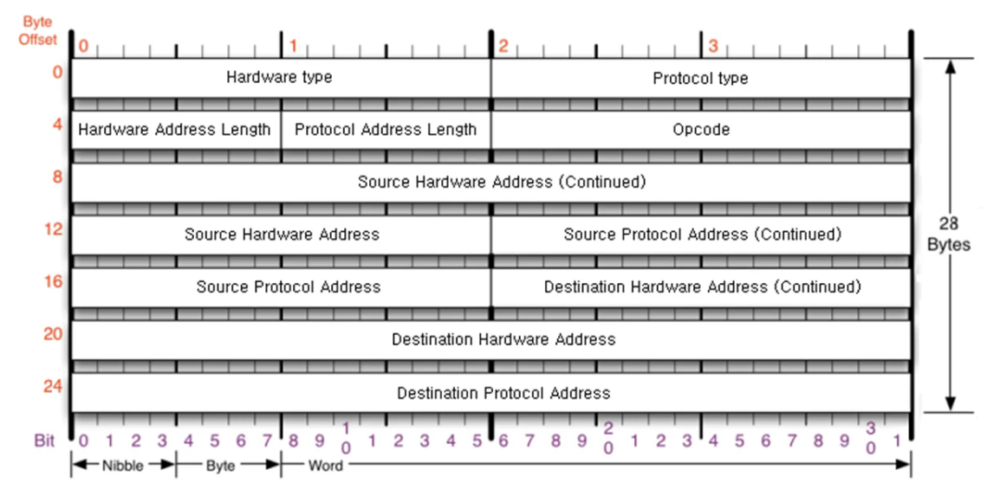

| 필드명                                 | 크기    | 설명                                                          |
| -------------------------------------- | ------- | ------------------------------------------------------------- |
| **Hardware Type**                      | 2바이트 | 어떤 2계층 네트워크를 사용하는지 지정 (예: Ethernet은 1)      |
| **Protocol Type**                      | 2바이트 | 어떤 3계층 프로토콜 주소를 매핑할지 지정 (IPv4는 0x0800)      |
| **Hardware Address Length (HLEN)**     | 1바이트 | 하드웨어 주소(MAC)의 길이 (이더넷은 6바이트)                  |
| **Protocol Address Length (PLEN)**     | 1바이트 | 프로토콜 주소(IP)의 길이 (IPv4는 4바이트)                     |
| **Opcode**                             | 2바이트 | 동작 유형 (1=Request, 2=Reply)                                |
| **Source Hardware Address (SHA)**      | 6바이트 | ARP를 보낸 장치의 MAC 주소                                    |
| **Source Protocol Address (SPA)**      | 4바이트 | ARP를 보낸 장치의 IP 주소                                     |
| **Destination Hardware Address (THA)** | 6바이트 | 대상 장치의 MAC 주소 (Request 시 0으로 채움, Reply 시 채워짐) |
| **Destination Protocol Address (TPA)** | 4바이트 | 대상 장치의 IP 주소 (누구의 MAC을 알고 싶은지)                |

- **Source Hardware Address :** 요청 출발지의 MAC 주소
- **Source Protocol Address :** 요청 출발지의 IP 주소
- **Destination Hardware Address :** 요청 목적지의 MAC 주소
- **Destination Protocol Address :** 요청 목적지의 IP 주소
- **Hardware Type : Ethernet - 0001 (거의 이것만 볼거임)**
- **Protocol Type : IPv4 - 0800 (거의 이것만 볼거임, ARP - 0806)**
- **Opcode :** 1 - 요청, 2 - 응답

 
 

## ARP / RARP

---

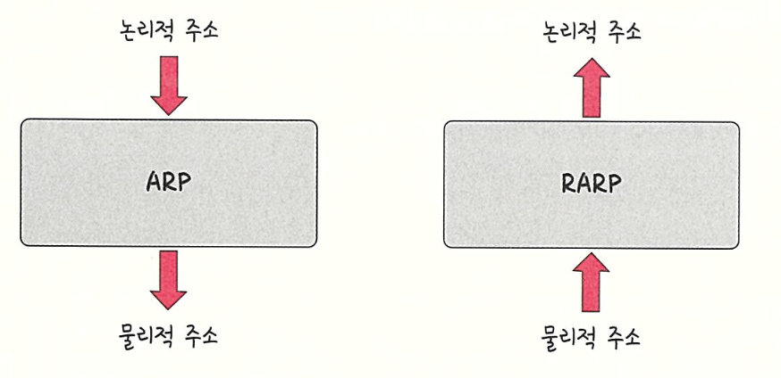

- ARP : 가상 주소인 IP 주소를 실제 주소인 MAC 주소로 변환
- RARP : 실제 주소인 MAC 주소를 가상 주소인 IP 주소로 변환

 
 

## ARP Process

---

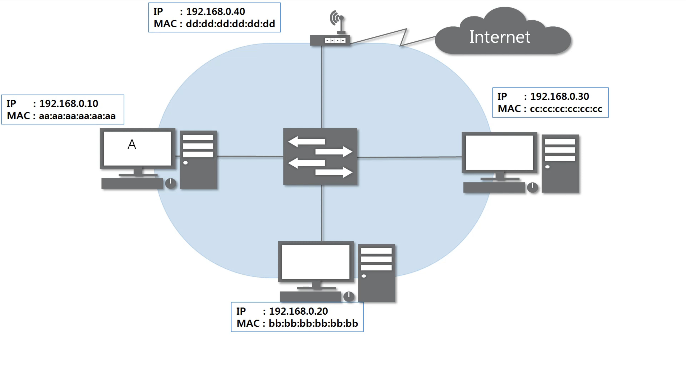

- 현재 A, B, C 컴퓨터가 존재함

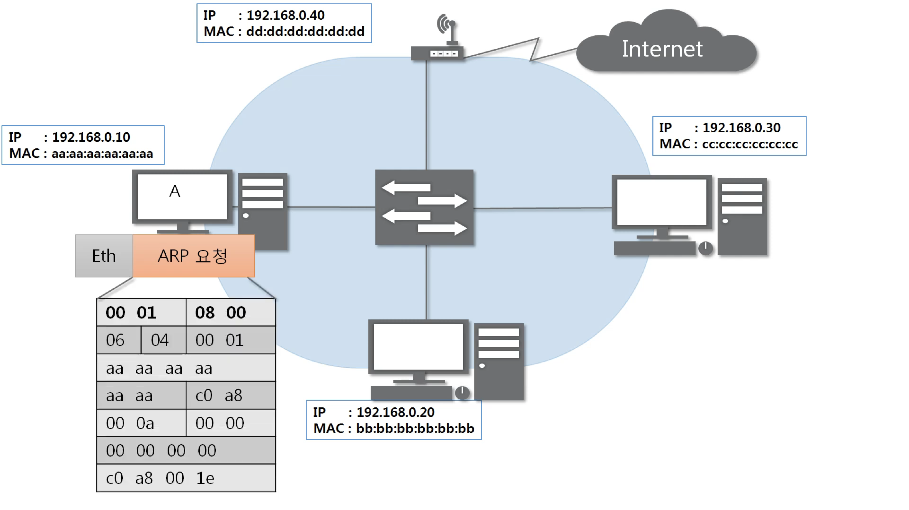

- L3 ARP 패킷에 목적지 MAC 주소 없이 구성

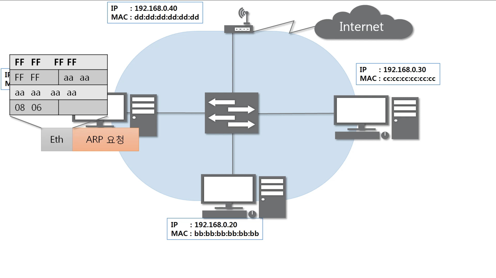

- L2 Ethernet 프레임에 목적지 MAC 주소는 FF:FF:FF:FF:FF:FF(1로 채움 = 브로드캐스트 주소)로 구성

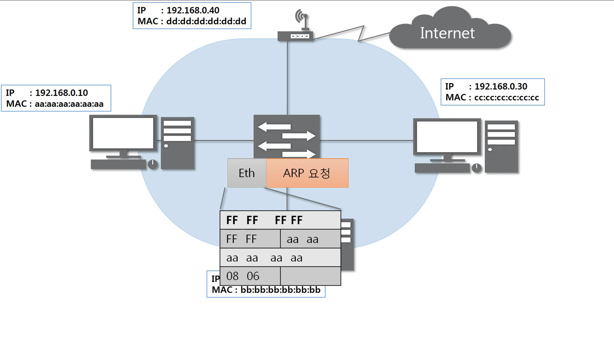

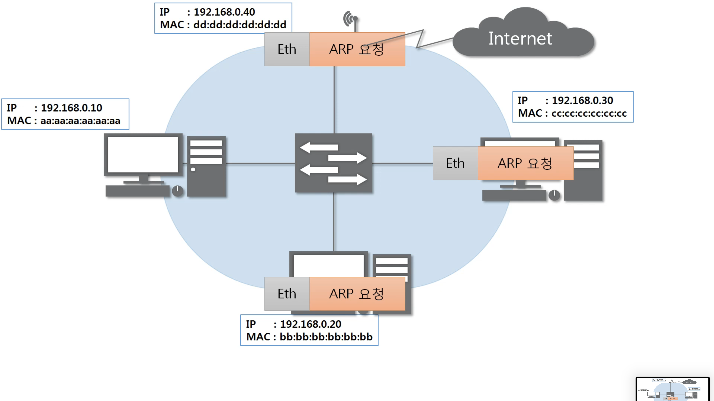

- 스위치를 통해 같은 네트워크 대역에 있는 모든 곳에 전송 (스위치에서 디캡슐레이션)

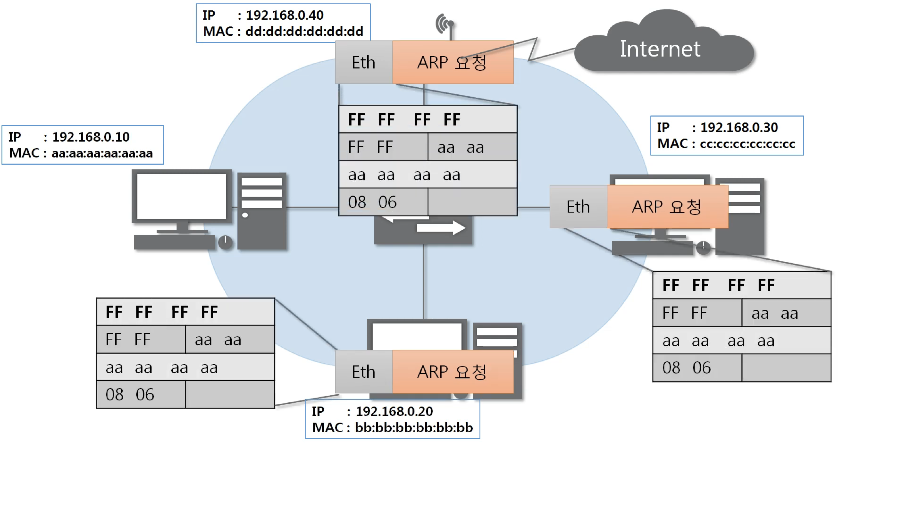

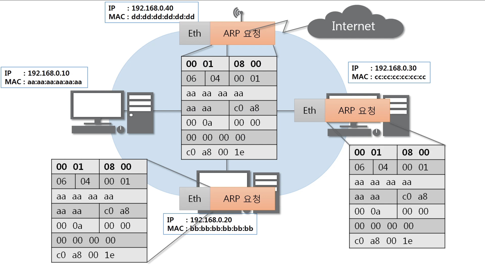

- 각 장치에서 디캡슐레이션(2계층의 브로드캐스트 주소 확인, 3계층의 목적지 IP 주소 확인)

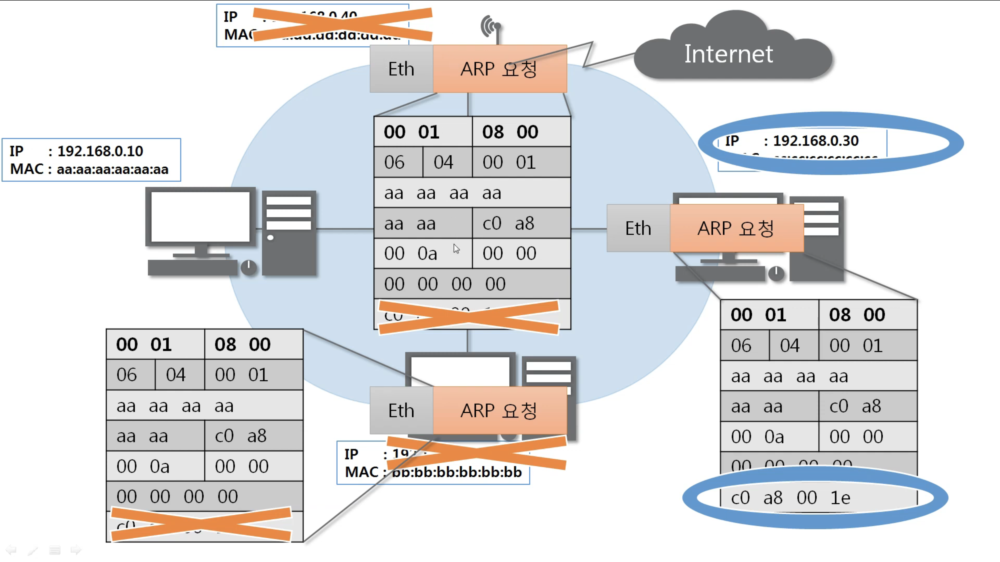

- 목적지 IP 주소가 본인의 IP주소와 다른 경우 패킷을 버림

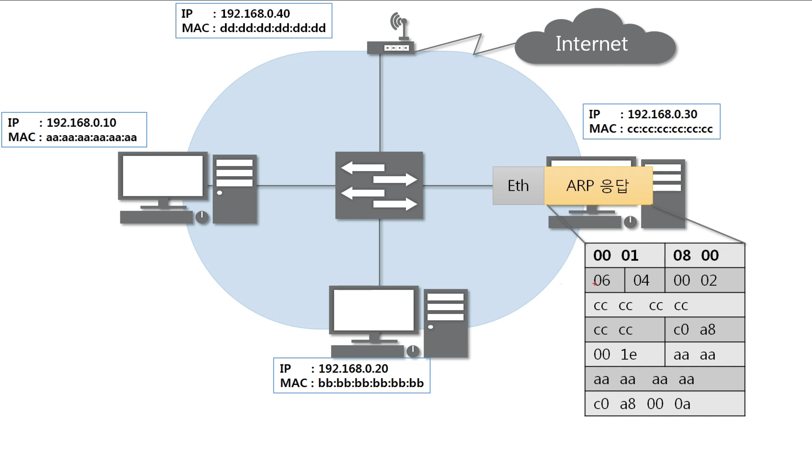

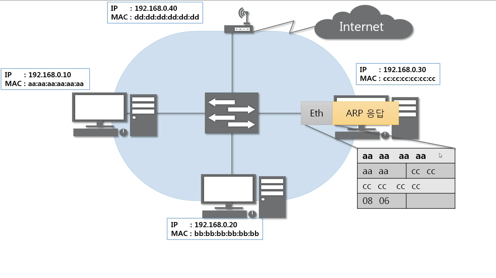

- 본인의 IP 주소와 같은 경우 응답 ARP 패킷 생성 (Opcode=2, Reply)
- 출발지 MAC 주소에 본인의 MAC 주소 입력
- Ethernat \*\*\*\*세그먼트에 출발지 MAC 주소에 본인의 MAC 주소 입력

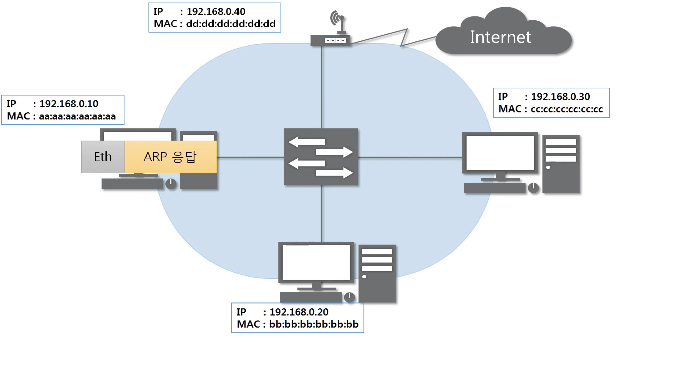

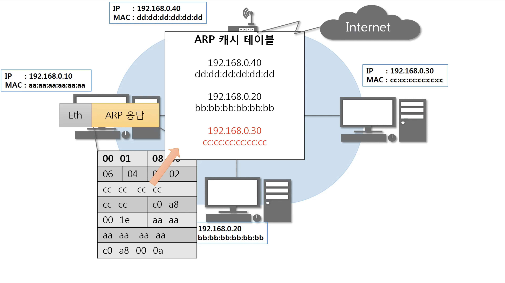

- 응답을 받은(원 요청) 장치의 ARP 캐시 테이블에 목적지의 IP : MAC 을 저장 (Caching)

 

> ARP는 같은 네트워크 대역에서만 사용함 (인터넷 통신X)
>
> 실제 요청 시에 이 과정을 엄청나게 빠른 속도로 진행함
>
> ARP Cache Table은 일정시간 동안 저장됨
>
> cmd에서 arp -a 로 확인할 수 있음
