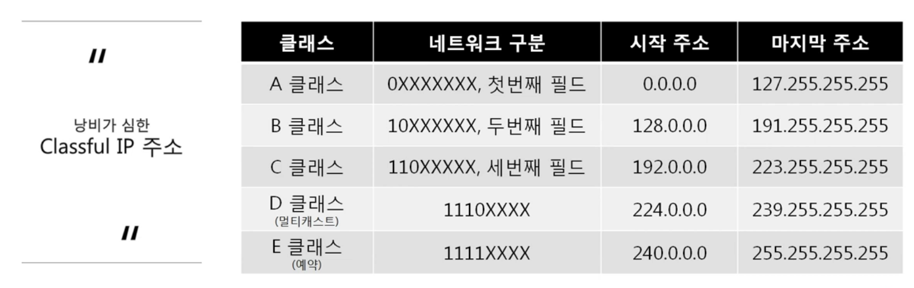
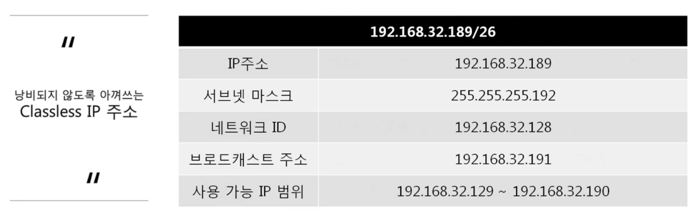
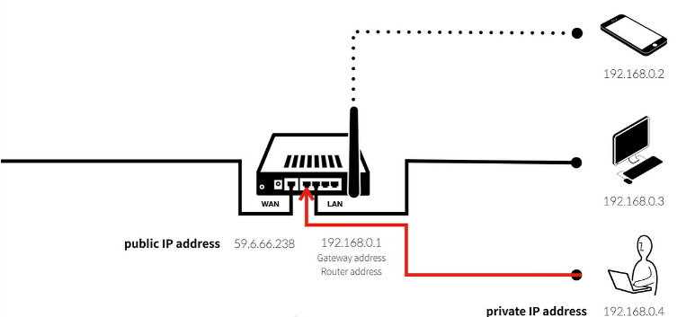
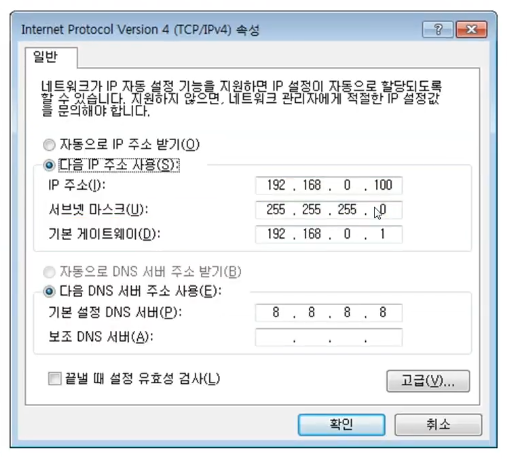
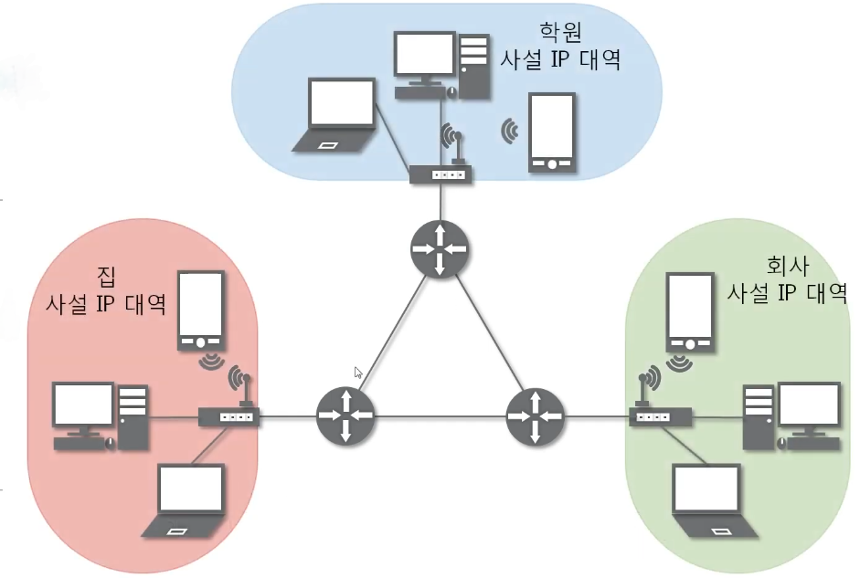

# IP 주소 체계

</br>

# IP 주소 체계

</br>

## Classful IP 주소

---

- 클래스 기반 주소 체계



- IP 주소를 A/B/C 클래스 단위로 고정 분할하여 사용
- IP 주소의 상위 비트로 어떤 클래스인지 자동 결정
- 각 클래스 별로 네트워크 / 호스트 비트 수가 정해져 있었음
  - 브로드캐스트 주소
    - 특정 네트워크에 속한 모든 호스트들이 듣게 되는 주소를 의미함
    - 호스트를 구분하는 주소 부분을 모두 1로 채움(192.168.2.0 네트워크 대역 중 192.168.2.255)
  - 게이트웨이 주소
    - 서로 다른 네트워크를 연결해주는 장비/호스(라우터)의 주소 (일반적으로 브로드캐스트 주소 - 1)
  - 사용 가능 IP 범위 : 네트워크 ID + 1 ~ 브로드캐스트 주소 -1 까지

2진수 표현 시

```
00000000.00000000. 00000000. 00000000 ~ 11111111.11111111.11111111.11111111

A 클래스 (0.0.0.0 ~ 127.255.255.255) [네트워크 : 128개 / 호스트 : 1,677만개]

0 0000000.00000000. 00000000. 00000000
~ 0 1111111.11111111.11111111. 11111111


B 클래스 (128.0.0.0 ~ 191.255.255.255) [네트워크 : 16,384개 / 호스트 : 65,534만개]

10 000000.00000000. 00000000.00000000
~ 10 111111.11111111. 11111111. 11111111


C 클래스 (192.0.0.0 ~ 223.255.255.255) [네트워크 : 2,097,152개 / 호스트 : 254만개]

110 00000.00000000. 00000000.00000000
~ 110 11111.11111111.11111111. 11111111


D 클래스 (224.0.0.0 ~ 239.255.255.255)

1110 0000.00000000. 00000000.00000000
~ 1110 1111.11111111.11111111.11111111


E클래스 (240.0.0.0 ~ 255.255.255.255)

1111 0000. 00000000.00000000. 00000000
~ 1111 1111.11111111.11111111. 11111111
```

- 네트워크 수 : IP 주소를 분배 받는 조직의 수
- 호스트 : 한 네트워크 안의 실제 장비 수

> 고정 크기로 인한 주소 낭비가 심각함
> IP 주소 자원이 전 세계적으로 고갈 조짐이 발생

</br>
</br>

## Classless IP 주소

---



- 클래스의 구분 없이, 네트워크 부분을 임의의 비트 수(/n)으로 지정
- CIDR(Classless Inter-Domain Routing) 표기법 도입
  - ex) 192.168.0.0/26 → 32비트 중 상위 26비트는 네트워크, 하위 6비트는 호스트
- 서브넷 마스크를 자유롭게 조정해서 필요한 크기만큼만 네트워크를 나눌 수 있음
  </br>

### 서브넷 마스크

---

**서브넷 마스크**

- 클래스풀한 네트워크 대역을 나눠주는데 사용하는 값
- 어디까지가 네트워크 대역을 구분하는데 사용하고 어디서부터 호스트를 구분하는데 사용하는지 지정
- (32bit = 4byte)
  - 255.255.255.192 -> 11111111.11111111.11111111.11000000
  - 2진수로 표기했을 때 1로 시작, 1과 1사이에는 0이 올 수 없다는 규칙을 가지고 있다.
- ex) 192.168.100.68 / 255.255.255.192 와 같이 IP주소와 서브넷 마스크를 쓰면? - 192.168.100.0와 같이 **C클래스**에 해당하는 네트워크를 192.168.100.0, 192.168.100.64, 192.168.100.12B, 192.168.100.192와 같이 **4개의 작은 네트워크 대역으로 나눈 것**이고 해당 IP 주소는 **2번째 네트워크에 해당**하는 것이다.
  </br>

**서브넷팅**

211.100.10.0/24 네트뭐크를 각 네트뭐크 당 60개의 호스트가 사용할 수 있는 네트뭐크 대역으로 포개면?

| 11010011.01100100.00001010. 00 000000   | 211.100.10.0/26   |
| --------------------------------------- | ----------------- |
| 11010011.01100100.00001010. 01 000000   | 211.100.10.64/26  |
| 11010011.01100100.00001010. 10 000000   | 211.100.10.128/26 |
| 11010011.01100100.00001010. 11 000000   | 211.100.10.192/26 |
| 11111111. 11111111. 11111111. 11 000000 |                   |

> 실제 필요량 만큼 호스트 수를 2^n개의 기준으로 나누어서 네트워크를 나누어 사용함
> 그러나 이마저도 2^n 이기에 낭비되는 자원이 발생
> ex) 20개의 IP주소가 필요한 경우 → 2^4(=16)으로 충당이 안되니 2^5(=32)개 할당 → 12개 낭비

→ 실제로는 Classless IP 주소 체계와 [사설 IP, 공인 IP]를 함께 사용 중임

>

</br>
</br>

## 일반적인 IP 주소 (사설 IP와 공인 IP)

- 사설 IP와 공인 IP
  - 공인 IP : 실제 인터넷 네트워크 통신망에서 통신할 때 사용하는 IP 주소
  - 사설 IP : 같은 네트워크 대역 내에서 사용하는 IP 주소
  - **공인 IP 1개 당 2^32개의 사설 IP**를 가짐
- 사설 IP를 사용하고 있는 기기들이 네트워크 통신을 할 때, 공인 IP로 변환하여 외부 인터넷 통신을 함
- 실제 인터넷 환경에서는 공인 IP로만 통신하고, 외부 네트워크 대역에서는 사설 IP 대역이 보이지 않음
- **NAT (Network Address Translation)**



- IP 패킷의 TCP/UDP 포트 숫자와 소스 및 목적지의 IP 주소 등을 재기록 하면서 라우터를 통해 네트워크 트래픽을 주고 받는 기술
- 사설 네트워크에 속한 여러 개의 호스트가 하나의 공인 IP 주소를 사용하여 인터넷에 접속하기 위한 변환 작업을 실행함
- 정확하게는 **특정 IP를 특정 IP로 변환하는 기술**



> IP 주소와 서브넷 마스크는 내부 통신을 구분하는 주소 체계이고
> 게이트웨이 주소, DNS서버 주소는 외부 통신을 위한 주소 체계이다.
>
> </br>


