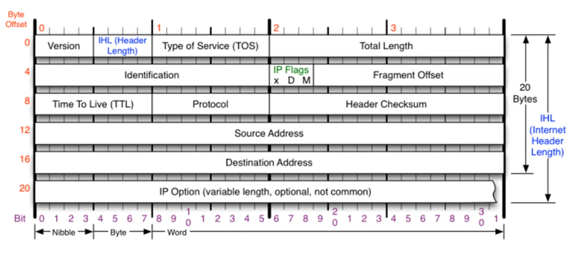
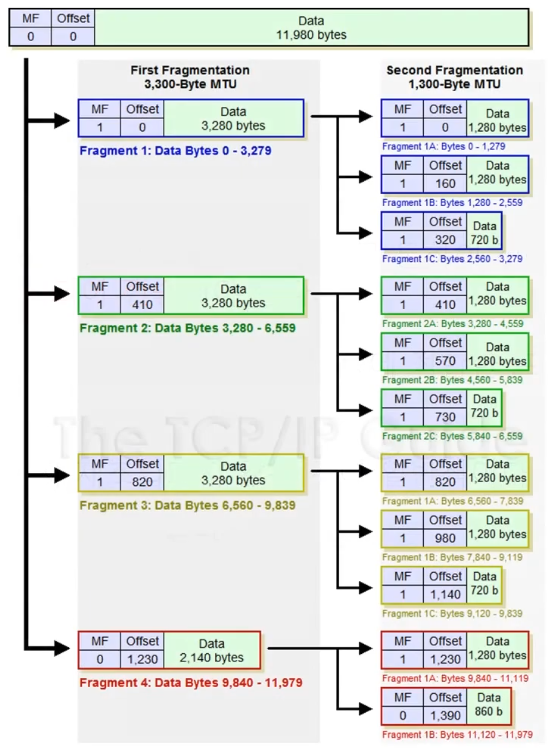
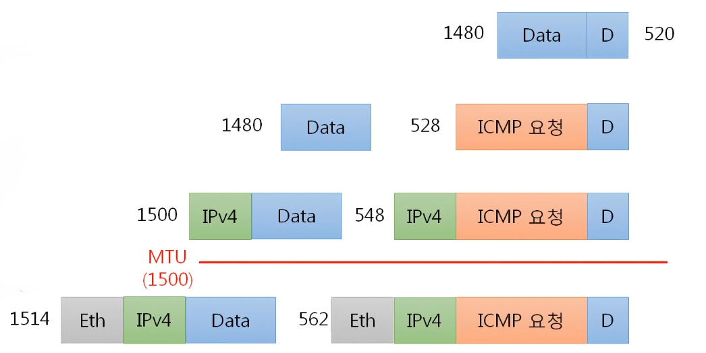
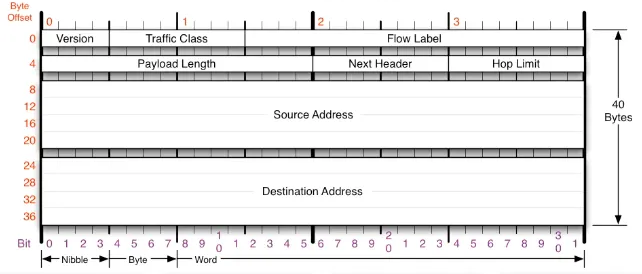
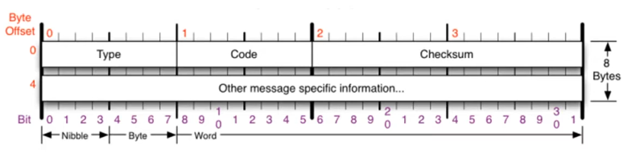

# IPv4, IPv6, ICMP

 

# IPv4, IPv6, ICMP

 
 
 

# IPv4

---

- 네트워크 상에서 데이터를 교환하기 위한 프로토콜
- 데이터가 정확하게 전달될 것을 보장하지 않는다(단순히 멀리 있는 곳에 전송하는 역할).
- 중복된 패킷을 전달하거나 패킷의 순서를 잘못 전달할 가능성도 있다.(악의적으로 이용 ⇒ DoS 공격)
- 데이터의 정확하고 순차적인 전달은 그보다 상위 프로토콜인 TCP에서 보장한다.
- 최소 20Bytes ~ 최대 60Bytes

| 필드명                                | 크기                                                                                       | 설명                                                                                                       |
| ------------------------------------- | ------------------------------------------------------------------------------------------ | ---------------------------------------------------------------------------------------------------------- |
| **Version (버전)**                    | 4비트                                                                                      | IP 프로토콜의 버전 번호(항상 4로 고정)                                                                     |
| **IHL (Header Length)**               | 4비트                                                                                      | IP 헤더의 전체 길이를 4바이트(32비트) 단위로 표시( byte/ 4한 값)                                           |
| **Type of Service (TOS)**             | 1바이트                                                                                    | 데이터 패킷의 우선순위나 서비스 품질(QoS)을 지정하는 데 사용(지금은 사용 거의 안함, 0으로 채움)            |
| **Total Length**                      | 2바이트                                                                                    | IP 헤더와 데이터를 모두 포함한 패킷 전체의 총 길이(바이트 단위)                                            |
| **Identification (식별자)**           | 2바이트                                                                                    | 하나의 원본 패킷이 여러 개로 단편화(fragmentation)되었을 때, 동일한 패킷임을 식별하는 고유 ID              |
| **IP Flags (플래그)**                 | 3비트                                                                                      | 패킷의 단편화 가능 여부(DF)나 더 많은 조각이 있는지(MF)를 제어                                             |
| **Fragment Offset (단편 오프셋)**     | 13비트                                                                                     | 단편화된 조각이 원본 데이터의 어느 위치에 해당하는지 상대적인 сме 위치 **( (MTU - IPv4패킷)/8 )**          |
| **Time To Live (TTL)**                | 1바이트                                                                                    | 패킷이 네트워크 내에서 무한정 순환하는 것을 막기 위해, 라우터를 지날 때마다 1씩 감소하는 값(0이 되면 폐기) |
| **Protocol (프로토콜)**               | 1바이트                                                                                    | 헤더 뒤에 오는 데이터(페이로드)가 어떤 상위 계층 프로토콜(예: TCP=6, UDP=17)인지 명시                      |
| **Header Checksum (헤더 검사합)**     | 2바이트                                                                                    | 전송 중 IP 헤더에 오류가 발생했는지 검사하기 위한 값                                                       |
| **Source Address (송신자 주소)**      | 4바이트                                                                                    | 패킷을 보낸 사람의 IP 주소                                                                                 |
| **Destination Address (수신자 주소)** | 4바이트                                                                                    | 패킷을 받을 대상의 IP 주소                                                                                 |
| **IP Option (IP 옵션)**               | 0~4                                                                                        |
| 바이트                                | (선택 사항) 보안, 경로 추적 등 특수한 처리가 필요할 때 사용되는 가변 길이의 추가 정보 필드 |

 
 

## IPv4의 조각화

---

- 실제 데이터가 전송될 때에는 큰 데이터를 전송하는 패킷이 조각화 되어 전송된다.
- 큰 IP 패킷들이 적은 MTU(Maximum Transmission Unit -일반적으로 1500 Byte)를 갖는 링크를 통하여 전송되려면 **여러 개의 작은 패킷으로 쪼개어/조각화 되어 전송**돼야 한다.
- 즉, 목적지까지 패킷을 전달하는 과정에 통과하는 각 라우터마다 전송에 적합한 프레임으로 변환이 필요하다.
- 일단 조각화되면, 최종 목적지에 도달할 때까지 재조립되지 않는 것이 일반적이다.
- IPv4에서는 발신지 뿐만 아니라 중간 라우터에서도 IP 조각화가 가능
- IPv6에서는 IP 단편화가 발신지에서 만 가능
- 재조립은 항상 최종 수신지에서 만 가능함

- 위 사진은 예시이며, 실제 조각화는 1회 일어난다 (조각화 된 조각을 또 조각화하지는 않음)
- 조각화 된 패킷은 각자 IP Protocol이 인캡슐레이션 되어 있다.
- 데이터를 나누는 크기는 MTU의 크기에서 IPv4 프로토콜의 크기(일반적으로 20byte)를 뺀 값
- 조각화 된 패킷의 IPv4 Identification (식별자) 는 같은 값을 가진다.
- MF(More Flagment) - IP Flags (플래그)의 MF가 1은 조각화 된 패킷이 더 존재함을 나타냄
- Fragment Offset (단편 오프셋) - (데이터의 크기 / 8)\*idx 의 값을 저장한다.
  - 여기서 idx는 조각화 된 패킷의 순서이다.
  - ex ) Data : 3280 Bytes인 경우 ⇒ 첫번째 offset : 0 / 두번째 offset : 410 / 세번째 offset : 820

- 조각화 하는 MTU의 제한에 맞추는 기준은 ‘Frame’이다. (패킷이 아님)
- 조각화 된 프레임에 2계층 Eth 헤더가 붙은 패킷의 크기는 1514Bytes가 된 경우이며, 실제로 MTU는 1500Bytes, 최대 크기로 조각화 된 패킷의 크기가 1514Bytes인 패킷을 많이 찾아볼 수 있다.

 
 

# IPv6

---

- IPv4의 주소 고갈 문제를 해결하기 위한 차세대 IP 주소 체계
- IPv4의 주소 공간을 4배 확장한 것으로 128bit 체계의 16진수로 표기. 4개의 16진수를 콜론(:)으로 구분

| **필드명**              | **크기**  | **설명**                                                                    |
| ----------------------- | --------- | --------------------------------------------------------------------------- |
| **Version** (버전)      | 4 비트    | IP 프로토콜의 버전 번호(항상 6으로 고정)                                    |
| **Traffic Class**       | 1 바이트  | 패킷의 우선순위나 서비스 품질(QoS)을 지정 (IPv4의 TOS와 유사)               |
| **Flow Label**          | 20 비트   | 실시간 전송 등 특별한 처리가 필요한 패킷들의 '흐름(flow)'을 식별하는 레이블 |
| **Payload Length**      | 2 바이트  | 기본 헤더(40바이트)를 **제외한** 순수 페이로드(데이터)의 길이 (바이트 단위) |
| **Next Header**         | 1 바이트  | 바로 뒤에 오는 헤더의 종류를 명시                                           |
| **Hop Limit**           | 1 바이트  | 패킷이 무한 순환하는 것을 막기 위해 라우터를 지날 때마다 1씩 감소           |
| (IPv4의 TTL과 동일)     |
| **Source Address**      | 16 바이트 | 패킷을 보낸 송신자의 128비트 IP 주소                                        |
| **Destination Address** | 16 바이트 | 패킷을 받을 수신자의 128비트 IP 주소                                        |

 
 

## IPv4 vs IPv6

| **구분**            | **IPv4**                                     | **IPv6**                                      |
| ------------------- | -------------------------------------------- | --------------------------------------------- |
| **주소 크기**       | **32비트** (약 43억 개)                      | **128비트** (2^128개)                         |
| **주소 표기**       | 10진수와 점 (예: `192.168.0.1`)              | 16진수와 콜론 (예: `2001:0db8::1`)            |
| **헤더 구조**       | **가변 크기** (20~60B), **헤더 체크섬** 포함 | **고정 크기** (40B), **헤더 체크섬 없음**     |
| **주소 변환 (NAT)** | **필수적** (주소 고갈로 NAT/PAT 사용)        | **불필요** (모든 기기에 공인 IP 할당 가능)    |
| **주소 자동 설정**  | **DHCP** (서버가 IP를 할당/관리)             | **SLAAC** (기기 스스로 주소 생성) / DHCPv6    |
| **주소 유형**       | 유니캐스트, **브로드캐스트**, 멀티캐스트     | 유니캐스트, 멀티캐스트, **애니캐스트**        |
| **단편화**          | **라우터**가 처리 (경로 중간에서 처리)       | **송신 호스트**가 처리 (경로상 라우터 부담 X) |
| **DNS 레코드**      | **A** 레코드                                 | **AAAA** 레코드                               |

**헤더 구조 (성능)**

- IPv4는 헤더 크기가 가변적이고, 라우터를 지날 때마다 **헤더 체크섬**을 다시 계산해야 해서 라우터에 부담을 줌
- IPv6는 헤더 크기가 **40바이트로 고정**되어 있고 **체크섬이 없음**(상위 계층이 검사). 라우터가 헤더를 매우 빠르게 처리할 수 있어 **성능 향상**에 유리함

**주소 변환 (NAT) (구조적 차이)**

- IPv4의 **NAT**는 '공유기(라우터) 뒤에 숨는' 방식. 보안상 이점도 있지만, 기기 간 **End-to-End (E2E) 직접 통신**을 어렵게 만듬. (예: P2P, IoT)
- IPv6는 NAT가 필요 없어 모든 기기(IoT 기기, 휴대폰 등)가 고유한 공인 IP를 갖고 **서로 직접 통신**하는 구조가 기본임

**주소 자동 설정 (편의성)**

- IPv4는 DHCP 서버가 IP를 할당/관리해줘야 함.
- IPv6의 **SLAAC**는 기기가 네트워크에 연결되면 **스스로 주소를 생성**합. 네트워크 관리 부담이 줄어듬

**브로드캐스트 vs. 애니캐스트**

- IPv4의 **브로드캐스트**는 네트워크 내 모두에게 패킷을 보냄 (네트워크 트래픽 유발)
- IPv6는 브로드캐스트를 없애고 **애니캐스트**를 도입함. 애니캐스트는 '동일한 주소를 가진 여러 기기 중 **가장 가까운 1대**'와 통신하는 방식 (예: 가장 가까운 DNS 서버 찾기)

 
 

# ICMP

---

**ICMP (Internet Control Message Protocol, 인터넷 제어 메시지 프로토콜)**

- 네트워크 컴퓨터 위에서 돌아가는 운영체제에서 오류 메시지를 전송 받는 데 주로 쓰인다.
- 프로토콜 구조의 Type과 Code를 통해 오류 메시지를 전송 받는다.
- 상대방과의 통신이 정상적으로 가능한가/아닌가를 판단하는 데에 사용

| 필드명                                  | 크기    | 설명                                                       |
| --------------------------------------- | ------- | ---------------------------------------------------------- |
| **Type**                                | 1바이트 | ICMP 메시지의 종류                                         |
| **Code**                                | 1바이트 | 'Type' 필드에 대한 세부 정보를 제공하는 하위 분류 코드     |
| **Checksum**                            | 2바이트 | 전체 ICMP 메시지(헤더 및 데이터)의 오류를 검사하기 위한 값 |
| **Other message specific information…** | 4바이트 | 메시지의 Type 및 Code에 따라 내용이 달라지는 필드          |

**타입 & 코드**

| **구분**                  | **Type** | **Code/Name**           |
| ------------------------- | -------- | ----------------------- |
| 정상(응답)                | 0        | Echo Reply              |
| 정상(요청)                | 8        | Echo                    |
| 실패(전송 도달 실패)      | 3        | Destination Unreachable |
| 실패(전송 도달-응답 실패) | 11       | Time Exceded            |
| 보안                      | 5        | Redirect                |
