# Routing Table_2

## 네트워크 통신 과정

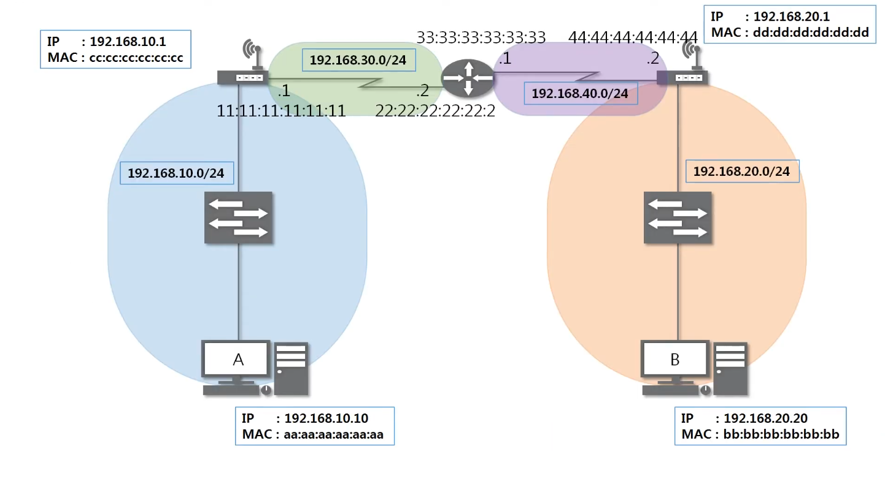

- 4개의 네트워크 대역에서 A → B로 요청을 전달하는 과정을 살펴보자(ICMP 요청)

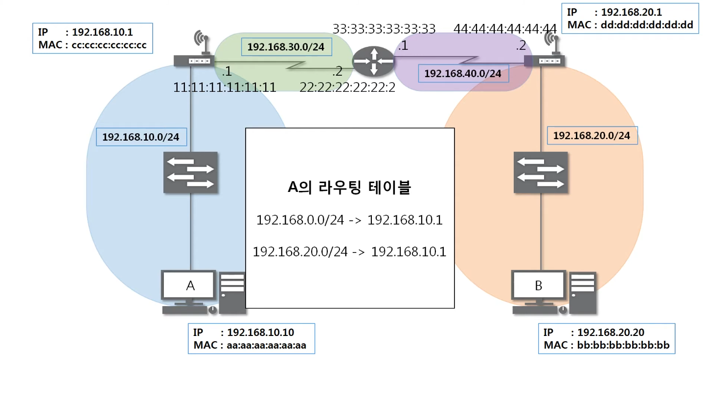

- A가 자기 자신의 라우팅 테이블을 확인함
- A는 B의 네트워크 대역이 본인에게 반드시 있어야 통신 가능함
  - 본인 네트워크 대역의 게이트웨이로 목적지 설정

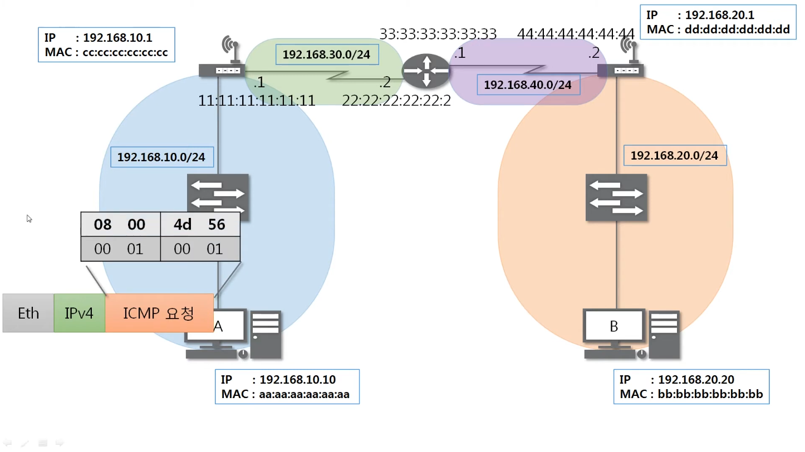

- ICMP 08 : 정상 요청

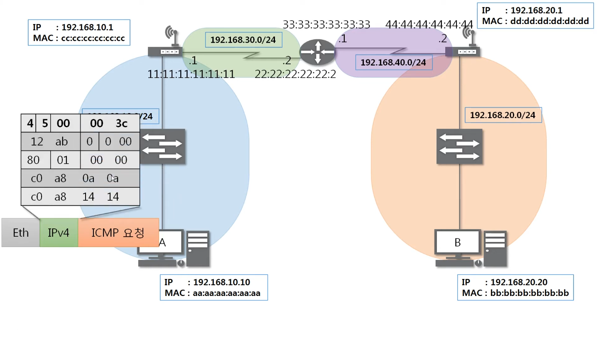

- IPv4 - 아래 두 줄 중 ( 첫 줄 : 출발지 IP , 둘째 줄 : 도착지 IP )

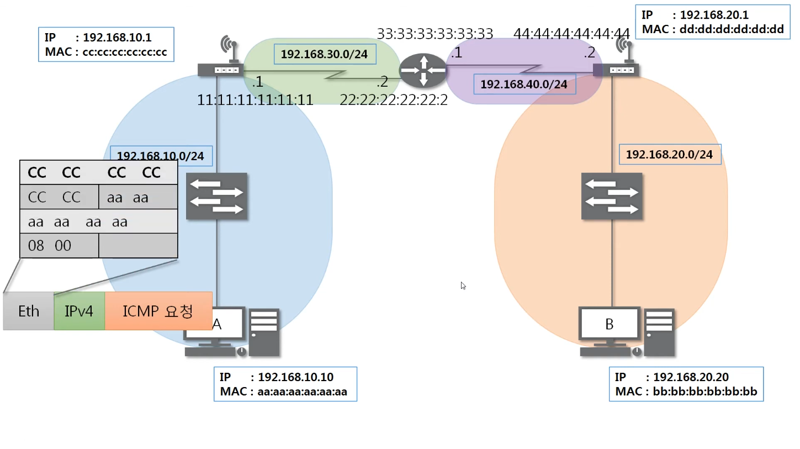

- Eth - 목적지 MAC 주소는 게이트웨이의 MAC주소이다.

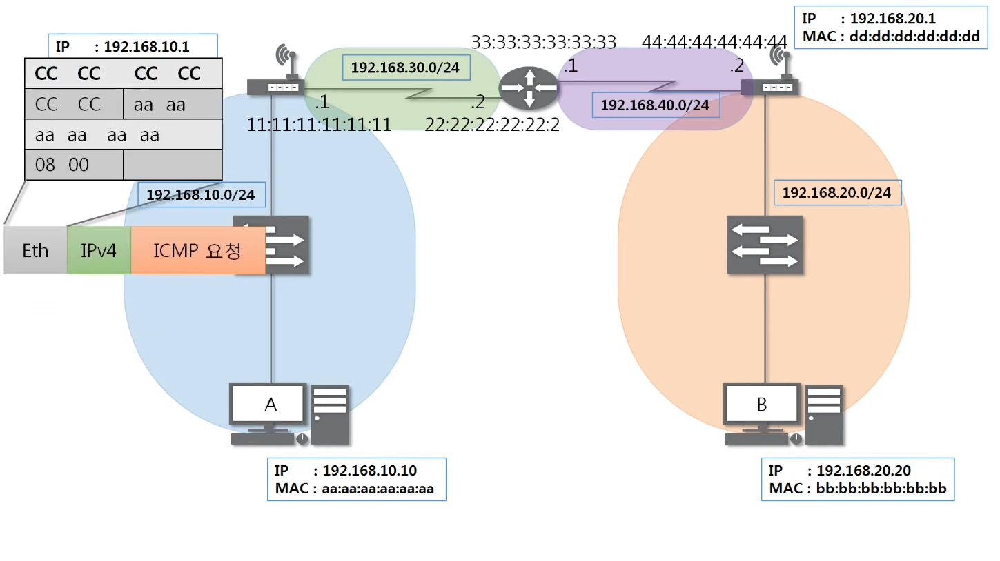

- 스위치(L2) - 2계층까지(Eth) 헤더를 까서 목적지 MAC주소 확인 후 전달

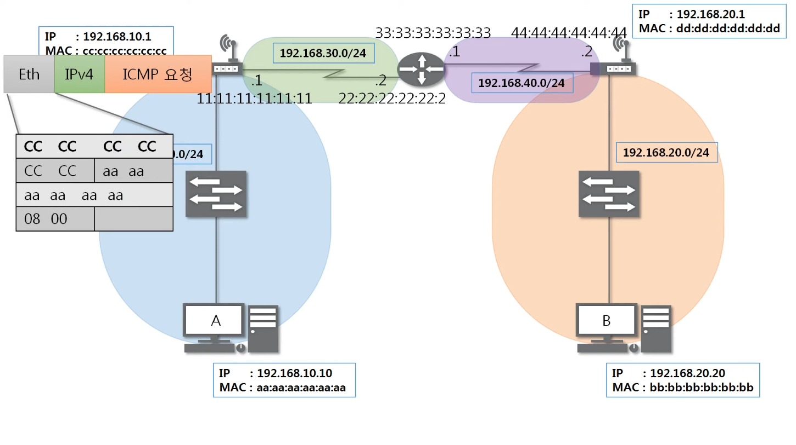

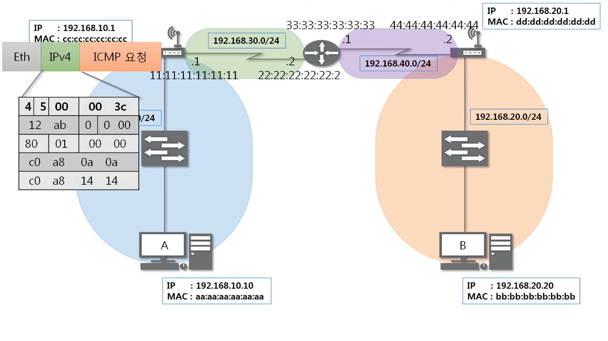

- 게이트웨이에서 2계층(Eth) 헤더를 까서 목적지 MAC주소 확인
- 3계층(IPv4) 헤더를 까서 목적지 IP주소 확인

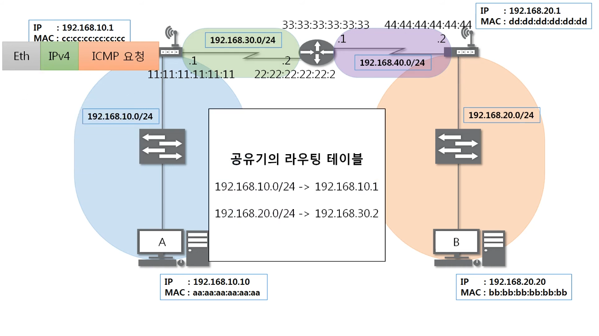

- 목적지 IP가 자신의 IP와 다른 경우, 라우팅 테이블을 확인하여 전달할 곳을 확인
- 2계층(Eth) 헤더를 목적지, 출발지를 새로 설정하여 다시 생성함

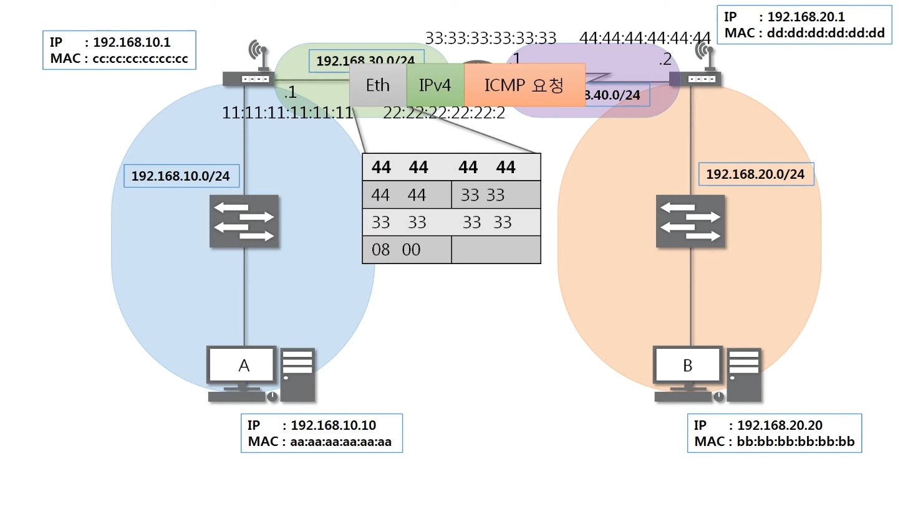

- 앞선 내용을 반복적으로 수행한다.
  - 2계층 헤더(Eth)를 디캡슐레이션하여 목적지 MAC 주소 파악 → 나에게 온 요청인지 확인
  - 3계층 헤더(IPv4)를 디캡슐레이션하여 목적지 IP 주소 파악 → 내 라우팅 테이블에서 목적지 확인
  - 2계층 헤더(Eth)의 목적지 MAC 주소, 출발지 MAC 주소 변경하여 새로 인캡슐레이션함

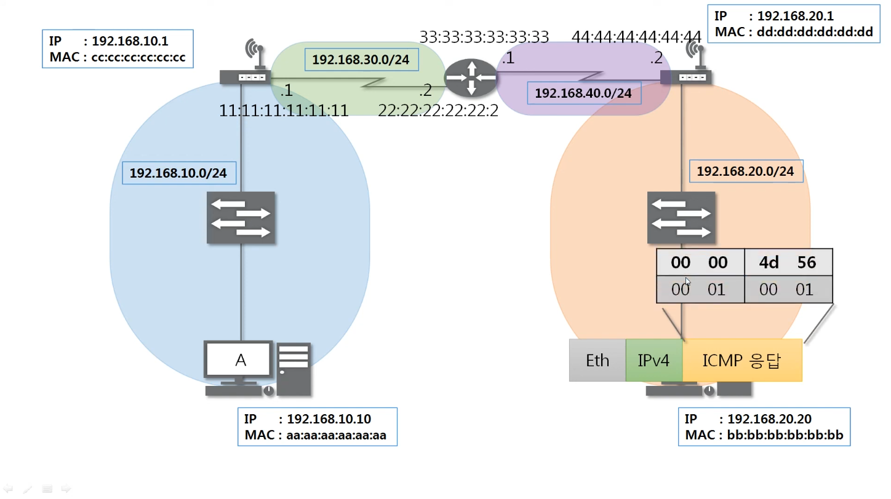

- B컴퓨터에서 ICMP 요청이 도달한 경우, ICMP 응답을 생성하여 같은 방식으로 응답을 전송함

> 실제 요청에서는 ARP Protocol과 함께 이루어진다.
> 각각의 기기의 도착지의 MAC 주소를 모르는 경우, ARP 통신으로 MAC주소를 알아 낸 이후, 실제 요청이 진행된다.

 

### 핵심

**[L2 수신]**

- 프레임(Ethernet)이 라우터 인터페이스에 도착하면, 라우터는 2계층 헤더의 **목적지 MAC 주소**를 확인함.
- 이 주소가 자신의 인터페이스 MAC 주소와 일치하면, 프레임을 수락하고 2계층 헤더를 디캡슐레이션(제거)

**[L3 처리]**

- 캡슐이 벗겨진 3계층 패킷(IPv4)의 **목적지 IP 주소**를 확인함.
- 이 IP를 **라우팅 테이블**과 비교하여, 이 패킷을 어느 인터페이스(출구)로 내보내야 하는지, 그리고 다음 홉(next-hop)의 IP 주소는 무엇인지 결정

**[L2 송신]**

- 결정된 출구 인터페이스에서 3계층 패킷(IPv4)을 새로운 2계층 헤더로 인캡슐레이션(포장)

 

> 이 과정에서 3계층(IPv4) 헤더의 **출발지/목적지 IP 주소**는 **절대 변하지 않는다.**
> 반면 2계층(Ethernet) 헤더의 **출발지/목적지 MAC 주소**는 라우터를 거칠 때마다 **계속 바뀐다.**
