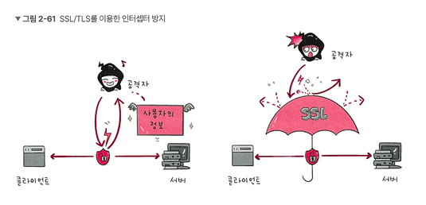

# HTTPS

## 1. HTTPS의 등장 배경

### 1.1 HTTP란 무엇인가?

- HTTP 는 클라이언트와 서버가 서로 데이터를 주고받기 위해 사용하는 통신 규칙입니다.
- "이 웹페이지를 보여줘"라고 요청하고, "알았어, 여기 웹페이지 데이터야"라고 응답하는 웹의 가장 기본적인 언어입니다.
- **가장 큰 특징:** 이 모든 요청과 응답이 **'평문(Plain Text)', 즉 암호화되지 않은 텍스트**로 오고 간다는 것입니다.

> 💡 비유: 엽서(Postcard)
>
> HTTP 통신은 내용을 누구나 볼 수 있는 '엽서'를 주고받는 것과 같습니다. 배달부(네트워크 중간자)는 물론, 엽서를 중간에 가로채는 누구나 그 내용을 훤히 들여다볼 수 있습니다.

### 1.2 문제점 1: 도청

엽서의 내용을 누구나 읽을 수 있듯이, HTTP는 **도청**에 극도로 취약합니다.

- **원리:** 네트워크 장비(라우터 등)나 같은 네트워크(특히 공용 Wi-Fi)에 접속한 공격자가 **'패킷 스니핑(Packet Sniffing)'** 도구를 사용하면, 오고 가는 HTTP 패킷을 그대로 엿볼 수 있습니다.
- **치명적 사례: 공용 Wi-Fi에서의 로그인**

  1. 사용자가 스타벅스 같은 공용 Wi-Fi에 접속해 HTTP로 만들어진 사이트(예: `http://www.shoppingmall.com`)에 로그인합니다.
  2. 이때 전송되는 로그인 패킷은 다음과 같이 평문으로 전송됩니다.

     POST /login HTTP/1.1 ...

     username=my_id&password=my_password123

  3. 해커는 이 패킷을 가로채 **사용자의 아이디와 비밀번호를 즉시 탈취**할 수 있습니다.

### 1.3 문제점 2: 변조

엽서의 내용을 읽는 것을 넘어, 중간에 **내용을 고쳐 쓰는 것**도 가능합니다.

- **원리:** HTTP는 데이터가 원본 그대로인지, 중간에 누가 고치지 않았는지 검증할 **'무결성(Integrity)'** 보장 장치가 없습니다.
- '중간자 공격'을 통해 공격자가 서버의 응답을 가로채 악성코드를 심거나 내용을 조작한 뒤, 사용자에게 전달할 수 있습니다.
- **사례 1: 악성코드 유포**
  1. 사용자가 정상적인 프로그램(`A.exe`)을 다운로드합니다.
  2. 해커가 응답을 가로채, 이를 악성코드가 심긴 `B.exe` 파일로 바꿔치기합니다.
  3. 사용자는 `A.exe`를 다운로드한 줄 알고 `B.exe`를 실행하여 감염됩니다.
- **사례 2: 광고 강제 삽입**
  - 일부 통신사(ISP)나 공용 Wi-Fi 제공자가 HTTP 사이트 응답에 **자사의 광고 스크립트를 강제로 삽입**하여, 원치 않는 광고를 사용자에게 노출시킵니다.

### 1.4 문제점 3: 위장

통신 상대방이 **"내가 접속하려는 그 서버가 맞는지"** 증명할 방법이 없습니다.

- **원리:** HTTP는 서버가 자신이 누구인지 '인증(Authentication)'하는 절차가 없습니다.
- **사례: 가짜 은행 사이트 (파밍/피싱)**
  1. 해커가 DNS 정보를 속이거나(파밍) 피싱 링크를 보내, 사용자를 실제 은행 사이트와 똑같이 생긴 **가짜 서버(해커 서버)**로 접속하도록 유도합니다.
  2. 사용자는 주소창이 `http://`인 것을 인지하지 못하고, 평소처럼 아이디와 비밀번호, 보안카드 번호를 입력합니다.
  3. 이 모든 정보는 해커의 서버로 전송되어 금융 정보가 그대로 탈취당합니다.

---

## 2. HTTPS란 무엇인가?: 문제 해결의 3가지 열쇠

### 2.1. 정의: HTTP over SSL/TLS

- HTTPS (HyperText Transfer Protocol Secure)는 HTTP에 'S'(Secure)가 붙은 것입니다.
- 이 'S'의 실체는 **SSL (Secure Sockets Layer)** 또는 TLS (Transport Layer Security)라는 보안 계층(Secure Layer)입니다.
- **핵심:** 기존의 HTTP는 애플리케이션 계층에서 바로 TCP 계층으로 데이터를 보냈지만, HTTPS는 **애플리케이션 계층(HTTP)과 전송 계층(TCP) 사이**에 **SSL/TLS 계층**을 끼워 넣습니다.
- **동작:**
  1. 애플리케이션 계층(HTTP)에서 만든 평문 메시지를
  2. SSL/TLS 계층에서 **암호화하고, 변조되지 않았는지 봉인**합니다.
  3. 이 암호화된 덩어리(데이터)를 전송 계층(TCP)에 전달하여 인터넷으로 보냅니다.

### 2.2. 목표 1: 암호화 (Confidentiality) → (도청 엿보기 문제 해결)

- **정의:** 통신 채널 자체를 **암호화**합니다.
- **해결:** 데이터가 암호화된 상태(무작위 문자열처럼 보이는 상태)로 전송됩니다.
- **결과:** 공격자가 중간에 패킷을 스니핑(도청)하더라도, 아이디, 비밀번호, 카드 번호 같은 민감한 내용을 **전혀 알아볼 수 없습니다.**

> 💡 비유: 엽서 → 잠긴 철제 금고
> 평문 엽서(HTTP) 대신, 내용을 넣고 열쇠로 잠근 철제 금고(HTTPS)를 보내는 것과 같습니다. 중간에 누군가 금고를 가로채도 열쇠가 없으면 절대 열어볼 수 없습니다.

### 2.3. 목표 2: 무결성 (Integrity) → (변조 문제 해결)

- **정의:** 전송된 데이터가 **원본 그대로**인지, 중간에 **변조되지 않았는지**를 보장합니다.
- **해결:** 데이터와 함께 '이 데이터는 변조되지 않았음'을 증명하는 '서명(HMAC 등)'을 함께 보냅니다.
- **결과:** 만약 공격자가 중간에 데이터를 1비트라도 수정하면, 서명값이 일치하지 않게 됩니다. 브라우저는 "데이터가 변조되었습니다!"라고 경고하며 **연결을 즉시 차단**합니다. 광고 강제 삽입이나 악성코드 바꿔치기가 불가능해집니다.

### 2.4. 목표 3: 인증 (Authentication) → (위장 문제 해결)

- **정의:** 내가 통신하고 있는 **상대방(서버)이 정말 내가 접속하려던 그 서버가 맞는지** 신원을 확인(인증)합니다.
- **해결:** 서버는 'SSL/TLS 인증서'라는 것을 클라이언트(브라우저)에게 제시해야 합니다.
- **결과:** 이 인증서는 신뢰할 수 있는 제3자(CA)가 발급한 '서버용 신분증'입니다. 브라우저는 이 신분증을 검증하여, 내가 접속한 사이트가 `www.google.com`이 맞는지, 아니면 해커가 만든 가짜 피싱 사이트인지 즉시 구별할 수 있습니다. (가짜 사이트는 이 인증서를 가질 수 없습니다.)

---

## 3. HTTPS의 핵심 원리 (1): "신뢰"는 어떻게 만들어지는가?

### 3.1. 문제: "신뢰의 딜레마"

- HTTPS가 '인증'을 통해 위장 문제를 해결한다고 했습니다.
- 하지만 근본적인 딜레마가 남습니다.
  - **서버:** "내가 `google.com`이 맞습니다."
  - **클라이언트(브라우저):** "당신이 `google.com`이라는 것을 **어떻게 증명**할 거죠?"
- 내가 `google.com`이라고 주장하는 가짜 서버(해커)도 똑같이 "내가 `google.com`이다"라고 말할 것입니다. 인터넷처럼 얼굴 없는 공간에서 어떻게 진짜와 가짜를 구별할 수 있을까요?

### 3.2. 해결책: 공인된 제3자, CA (Certificate Authority)

- **개념:** 이 딜레마를 해결하기 위해 '신뢰할 수 있는 공인된 제3자(Trusted Third Party)'를 도입했습니다. 이것이 바로 CA (Certificate Authority, 인증 기관)입니다.
- **비유:**
  - 현실 세계에서 '나'의 신원을 증명해주는 것은 정부(행정안전부)가 발급한 '주민등록증'입니다.
  - 웹 세계에서 '서버'의 신원을 증명해주는 것은 **CA**가 발급한 'SSL/TLS 인증서'입니다.
- **신뢰의 근원 (Root CA):**
  - Microsoft, Apple, Google(Android), Mozilla(Firefox) 등 브라우저나 OS(운영체제) 개발사들은, **전 세계적으로 신뢰할 수 있다고 검증된 CA들의 목록**을 미리 브라우저/OS에 내장해 둡니다.
  - 이 최상위 CA를 'Root CA'라고 부릅니다. (예: Sectigo, DigiCert, Let's Encrypt 등)
  - 브라우저는 **이 'Root CA'가 보증(서명)한 인증서'만** 신뢰합니다.

### 3.3. 핵심 도구: SSL/TLS 인증서 (Certificate)

- **정의:** 서버가 CA로부터 발급받은 '공식 서버 신분증'입니다.
- **역할:**
  1. **인증:** 이 서버가 `www.google.com`이 맞음을 증명합니다.
  2. **공개키 전달:** 통신을 암호화하는 데 필요한 '서버의 공개키(Public Key)'를 안전하게 전달합니다.

### 인증서의 내용물 상세 분석

인증서(.crt, .pem 파일)를 열어보면 다음과 같은 핵심 정보가 들어있습니다.

- `Subject (주체)`: 이 인증서의 **소유자** 정보 (예: 도메인 이름 `www.google.com`)
- `Issuer (발급자)`: 이 인증서를 발급해 준 **CA**의 정보 (예: `Google Trust Services LLC`)
- `Valid from/to (유효 기간)`: 인증서가 유효한 기간 (이 기간이 지나면 브라우저는 경고를 띄웁니다.)
- `Subject's Public Key (주체의 공개키)`: **[매우 중요]** 이 서버의 **공개키**입니다. (이 키로 클라이언트가 대칭키를 암호화하여 서버에 보냅니다.)
- `Digital Signature (디지털 서명)`: **[가장 중요]** 이 인증서가 **위조되지 않았음**을 발급자인 **CA가 보증**하는 전자 '도장'입니다.

### 3.4. 디지털 서명 (Digital Signature)의 원리

"이 인증서가 진짜 CA가 발급한 것인지, 아니면 해커가 위조한 것인지"는 **디지털 서명**을 통해 검증합니다.

> [CA가 인증서를 발급하는 과정 (서명 생성)]
>
> 1. CA는 서버의 정보(`Subject`, `Public Key` 등)를 모아 인증서 원본을 만듭니다.
> 2. 이 원본을 **해시 함수(SHA-256 등)로 돌려** 짧은 '지문(Digest)'을 만듭니다.
> 3. 이 '지문'을 CA의 비밀키(Private Key)로 **암호화**합니다.
> 4. 이 암호화된 지문이 바로 \**`디지털 서명(Digital Signature)`*입니다.
> 5. `인증서 원본` + `디지털 서명`을 합쳐 서버에게 전달합니다.

> [브라우저가 인증서를 검증하는 과정 (서명 검증)]
>
> 1. 브라우저는 서버로부터 `인증서 원본` + `디지털 서명`을 받습니다.
> 2. 브라우저는 이 인증서를 발급한 CA(Issuer)를 확인하고, **OS/브라우저에 내장된 '해당 CA의 공개키(Public Key)'**를 찾습니다.
> 3. **[검증 1]** `디지털 서명`을 **CA의 공개키**로 **복호화**합니다. → `원본 지문(A)`이 나옵니다.
> 4. **[검증 2]** 함께 받은 `인증서 원본`을 **똑같은 해시 함수(SHA-256 등)로 돌려** `새로운 지문(B)`을 계산합니다.
> 5. **[최종 비교]** `지문(A)`와 `지문(B)`가 **일치하는지 확인**합니다.
>
> **결과:**
>
> - **일치하면:** 이 인증서는 **이 CA가 발급한 것이 확실**하며, 중간에 **전혀 변조되지 않았음**을 의미합니다. → **신뢰! (자물쇠 표시)**
> - **불일치하면:** 해커가 인증서를 위조했거나(CA의 비밀키가 없으므로 서명 위조 불가), 중간에 변조되었음을 의미합니다. → **경고! (위험 사이트)**

---

## 4. HTTPS의 핵심 원리 (2): "암호화"는 어떻게 이루어지는가?

### 4.1. 두 가지 암호화 방식의 이해

### (1) 대칭키 (Symmetric Key) 암호화

- **원리:** 데이터를 **암호화할 때 사용하는 열쇠**와 **복호화할 때 사용하는 열쇠**가 **완전히 동일**합니다.
- **비유:** 집 현관문 열쇠 (잠글 때 쓴 열쇠 = 열 때 쓸 열쇠)
- **대표 알고리즘:** AES-128, AES-256 (현재 가장 널리 쓰임)
- **장점:**
  - **✅ 매우 빠름:** 암호화/복호화 연산 속도가 압도적으로 빠릅니다.
- **단점:**
  - **🚨 치명적인 키 배송 문제 (Key Distribution Problem):**
    - "이 열쇠(대칭키)를 어떻게 상대방에게 안전하게 전달할 것인가?"
    - 만약 열쇠를 전달하는 과정(네트워크)에서 해커가 열쇠를 훔쳐본다면(도청), 모든 암호화가 무용지물이 됩니다.

[Symmetric Key Cryptography diagram 이미지](https://encrypted-tbn1.gstatic.com/licensed-image?q=tbn:ANd9GcQRkLrvagUv7-jA1jfzLPWCdszkWTHt9rxnhwF7ZkGWh3t8zLWu5Vgscfr97O84URDgMEePtyjOjrlWFWKQv4HeeVQLIscj7SXVpCKMVnkOAp7CMHQ)

Shutterstock

### (2) 비대칭키 (Asymmetric Key) 암호화 (공개키 방식)

- **원리:** 암호화/복호화에 서로 다른 두 개의 열쇠(한 쌍)를 사용합니다.
  - **공개키 (Public Key):** 누구나 가져갈 수 있도록 **공개**하는 열쇠. 이 열쇠로는 **암호화**만 할 수 있습니다.
  - **비밀키 (Private Key):** 서버(나)만 **비밀**리에 간직하는 열쇠. 이 열쇠로만 복호화(해독)할 수 있습니다.
- **비유:** 우체통
  - **공개키:** 누구나 편지를 넣을 수 있는 '우체통 투입구'
  - **비밀키:** 오직 집주인만 가진 '우체통 열쇠' (투입구로 편지를 다시 꺼낼 순 없음)
- **대표 알고리즘:** RSA, 디피-헬만(DH)
- **장점:**
  - **✅ 키 배송 문제 완벽 해결:**
    - '공개키(투입구)'는 인터넷에 대놓고 뿌려도 안전합니다.
    - 클라이언트는 서버의 공개키로 데이터를 암호화해서 보내기만 하면 됩니다. 해커가 중간에 가로채도 '비밀키(우체통 열쇠)'가 없으면 절대 열어볼 수 없습니다.
- **단점:**
  - **🚨 매우 느림:** 연산 과정이 매우 복잡하여, 대칭키 방식보다 **수백~수천 배 느립니다.** 웹사이트의 모든 데이터를 이걸로 암호화하는 것은 현실적으로 불가능합니다.

[Asymmetric Key (Public Key) Cryptography diagram 이미지](https://encrypted-tbn0.gstatic.com/licensed-image?q=tbn:ANd9GcSJR7S9oCcP3cuVgBdZ11CbXQqR8bEkFDXU5nHbl9IewRg3-q-c14XTdeb733uIWK6vorsG2QXveI5xG0sPLq4tgvldDcPaby_g6ZyHNHSXueYlpcU)

Shutterstock

---

### 4.2. HTTPS의 하이브리드 전략 (최적의 조합)

HTTPS는 이 두 방식의 장점만을 기가 막히게 조합합니다.

> "느리지만 안전한" 비대칭키로 "빠르지만 키 전달이 문제인" 대칭키를 안전하게 전달하자!

### 1단계: 키 교환 (Key Exchange) - (비대칭키 사용)

- **목표:** 실제 통신에 사용할 '대칭키(세션 키)'를 해커에게 들키지 않고 안전하게 **생성 및 공유**합니다.
- **동작:**
  1. 클라이언트(브라우저)는 검증한 서버의 **인증서**에서 '서버의 공개키'를 꺼냅니다.
  2. 클라이언트는 이번 통신에만 사용할 **임시 대칭키(세션 키)를 하나 생성**합니다.
  3. 이 **세션 키**를 '서버의 공개키'로 **암호화**하여 서버에게 보냅니다.
  4. 서버는 암호화된 메시지를 자신의 '비밀키'로 복호화하여 **세션 키**를 얻어냅니다.
- **결과:** 이제 클라이언트와 서버, **단 둘만이** 이번 통신에 사용할 비밀 '세션 키'를 안전하게 공유했습니다. (비대칭키의 역할은 여기까지!)

### 2단계: 데이터 전송 (Data Transfer) - (대칭키 사용)

- **목표:** 실제 HTTP 요청/응답 데이터를 **빠르게** 암호화하여 주고받습니다.
- **동작:**
  1. 클라이언트와 서버는 1단계에서 방금 공유한 '세션 키(대칭키)'를 사용합니다.
  2. 이 대칭키(예: AES-256)를 이용해 **매우 빠른 속도**로 HTTP 데이터를 암호화하고 복호화하며 통신합니다.
- **결과:** '안전(비대칭키)'과 '속도(대칭키)'라는 두 마리 토끼를 모두 잡았습니다.

---

## 📚 5. SSL/TLS 핸드셰이크: "보안 세션" 수립의 전 과정

핸드셰이크(Handshake, 악수)는 클라이언트(브라우저)와 서버가 **암호화된 데이터를 주고받기 전에, 서로 '보안 규칙'을 정하고 '신원을 확인'하는 협상 과정**입니다.

### 5.1. 핸드셰이크의 3가지 목표

1. **암호화 규약 합의 (Cipher Suite):**
   - "우리 어떤 암호화 알고리즘(AES? RSA?) 쓸까?"
   - "데이터 무결성은 뭘로(SHA-256?) 검증할까?"
   - ...등을 서로가 지원하는 목록(Cipher Suite) 중에서 합의합니다.
2. **서버 인증 (Authentication):**
   - "당신이 진짜 `google.com` 맞아요?"
   - 서버가 클라이언트에게 `인증서`(3장)를 제시하고, 클라이언트는 이를 검증합니다.
3. **세션 키 생성 (Key Exchange):**
   - "이제부터 우리 둘만 이 열쇠(대칭키)로 대화하자."
   - `비대칭키`(4장) 기술을 이용해, 실제 통신을 암호화할 `대칭키(세션 키)`를 안전하게 생성하여 공유합니다.

---

### 5.2. [구] TLS 1.2 핸드셰이크 (2-RTT)

오랫동안 표준이었던 방식으로, 2번의 왕복(2-RTT)이 필요해 속도가 느렸습니다.
(※ TCP 연결에 필요한 1-RTT까지 포함하면, 실제 데이터 전송까지 **총 3-RTT** 소요)

### ➡️ 왕복 1 (Round Trip 1)

1. **Client → Server : `ClientHello`**
   - "안녕하세요. 제가 쓸 수 있는 암호화 방식(Cipher Suite) 목록과 랜덤 데이터(A)를 드릴게요."
2. **Server → Client : `ServerHello`, `Certificate`, `ServerHelloDone`**
   - `ServerHello`: "반가워요. 그 목록 중에서 **이걸로(Cipher Suite) 합시다.** 여기 제 랜덤 데이터(B)입니다."
   - `Certificate`: **[인증]** "그리고 제가 진짜라는 증거로 **제 인증서(공개키 포함)를 드릴게요.**" (3장 원리)
   - `ServerHelloDone`: "제가 할 말은 일단 끝났습니다."

### ⬅️ 왕복 2 (Round Trip 2)

1. **Client → Server : `ClientKeyExchange`, `ChangeCipherSpec`, `Finished`**
   - **[암호화]** (클라이언트는 받은 인증서를 검증.)
   - `ClientKeyExchange`: "인증서 잘 받았어요. 이제 **세션 키를 만듭시다.**"
     - 클라이언트는 `랜덤 데이터(A)` + `랜덤 데이터(B)`를 조합해 **'세션 키'**를 생성합니다.
     - 이 '세션 키'를 아까 받은 서버의 공개키(비대칭키)로 **암호화**해서 보냅니다. (4장 원리)
   - `ChangeCipherSpec`: "좋아요. 저도 지금부터 방금 보낸 '세션 키'로 암호화해서 말할게요."
   - `Finished`: "제 쪽 협상은 끝났습니다. (이 메시지는 '세션 키'로 암호화된 첫 메시지)"
2. **Server → Client : `ChangeCipherSpec`, `Finished`**
   - (서버는 `ClientKeyExchange`로 받은 암호화된 메시지를 자신의 **비밀키**로 복호화하여 '세션 키'를 확보.)
   - `ChangeCipherSpec`: "나도 이제부터 그 '세션 키'로 암호화해서 말할게요."
   - `Finished`: "나도 협상 끝났습니다. (이것도 '세션 키'로 암호화됨)"

**결과:** 총 2번의 왕복(2-RTT) 후, 클라이언트와 서버는 동일한 '세션 키(대칭키)'를 공유하게 됩니다. 이제부터 이 키로 빠르고 안전하게 통신합니다.

---

### 5.3. [현] TLS 1.3 핸드셰이크 (1-RTT)

TLS 1.2의 느린 속도(2-RTT)를 개선한 **현재의 표준**입니다. 불필요한 과정을 과감히 생략하여 **1-RTT**로 단축시켰습니다.
(※ TCP 연결 1-RTT 포함 **총 2-RTT** 소요)

### ➡️ 왕복 1 (Round Trip 1)

1. **Client → Server : `ClientHello` (+ KeyShare)**
   - **[핵심]** "안녕하세요. 제가 쓸 수 있는 암호화 방식(Cipher Suite) 목록입니다."
   - "그리고 시간 아까우니, **제가 사용할 키 교환 방식(예: 디피-헬만)의 키 공유 데이터({KeyShare})를 미리 보낼게요.**" (TLS 1.2에 없던 과정)
2. **Server → Client : `ServerHello`, `{KeyShare}`, `EncryptedExtensions`, `Certificate`, `CertificateVerify`, `Finished`**
   - **[핵심]** (서버는 클라이언트가 미리 보낸 `KeyShare`를 보고 **'세션 키'를 즉시 생성**합니다.)
   - `ServerHello`: "반가워요. 그걸로 합시다. **여기 제 키 공유 데이터({KeyShare})입니다.**" (이 순간, 서버와 클라이언트 모두 '세션 키' 생성이 완료됨)
   - **(이하 모든 메시지는 방금 생성된 '세션 키'로 즉시 암호화됨)**
   - `EncryptedExtensions`: "암호화된 확장 기능입니다."
   - `Certificate`: **[인증]** "이건 제 인증서입 니다."
   - `CertificateVerify`: "제가 그 인증서의 주인임을 증명합니다."
   - `Finished`: "제 쪽 협상은 이걸로 끝입니다."
3. **Client → Server : `Finished`**
   - (클라이언트는 서버의 응답을 받고 인증서를 검증한 뒤, 서버의 `KeyShare`로 '세션 키' 생성을 완료.)
   - **(이 메시지도 '세션 키'로 암호화됨)**
   - `Finished`: "저도 끝났습니다." (이후 바로 암호화된 HTTP 요청 데이터 전송 가능)

**결과:** 단 1번의 왕복(1-RTT) 만에 '인증'과 '세션 키 생성'이 모두 완료됩니다. TLS 1.2 대비 연결 속도가 획기적으로 빨라졌습니다.

---

### 5.4. 사이퍼 슈트 (Cipher Suite)란?

핸드셰이크의 첫 단계(`ClientHello`)에서 합의하는 **'암호화 알고리즘 세트'**입니다. 이 세트 하나가 보안 통신에 필요한 모든 기술을 정의합니다.

- **예시:** `TLS_ECDHE_RSA_WITH_AES_128_GCM_SHA256`
- **분석:**
  - `TLS`: 프로토콜
  - `ECDHE`: **[키 교환]** '세션 키'를 어떻게 생성할 것인가? (디피-헬만 방식)
  - `RSA`: **[인증]** 서버 인증서를 검증할 때 어떤 비대칭키 기술을 쓸 것인가? (RSA 인증서)
  - `AES_128_GCM`: **[데이터 암호화]** 실제 데이터는 어떤 '대칭키' 방식으로 암호화할 것인가? (AES-128)
  - `SHA256`: **[무결성]** 데이터가 변조되지 않았는지 어떤 '해시' 방식으로 검증할 것인가? (SHA-256)

---

### 5.5. PFS (Perfect Forward Secrecy)와 디피-헬만 (ECDHE)

TLS 1.3이 강제하는 매우 중요한 현대 보안 개념입니다.

- **문제 제기:** 만약 해커가 서버의 **'비밀키(Private Key)'**를 탈취하면 어떻게 될까요?
  - (TLS 1.2의 구형 방식인) `RSA 키 교환`을 사용했다면, 해커는 암호화된 '세션 키'를 복호화할 수 있습니다.
  - 즉, 해커가 **과거에 녹화(수집)해 둔 모든 HTTPS 통신 내용**을 **전부 해독**할 수 있게 됩니다. (최악의 시나리오)
- **해결책: PFS (완전 순방향 비밀성)**
  - **"만약 서버의 비밀키가 유출되더라도, 과거의 통신 내용은 절대 해독할 수 없어야 한다."**
- **구현: 디피-헬만 키 교환 (ECDHE)**
  - `RSA 키 교환`이 서버의 '공개키/비밀키'로 '세션 키'를 암호화해 **전달**하는 방식이라면,
  - `디피-헬만(ECDHE)`은 서버와 클라이언트가 각자 "임시 키(Ephemeral Key)"를 만들고, 이 임시 키의 일부(공개키)만 교환한 뒤, "수학적 계산"을 통해 양쪽이 **동일한 '세션 키'를 각자 '생성'**해내는 방식입니다.
  - **핵심:** '세션 키' 자체가 네트워크로 전송되지 않으며, 통신이 끝나면 '임시 키'는 폐기됩니다.
  - **결과:** 나중에 서버의 (인증서) 비밀키가 유출되어도, '임시 키'는 이미 사라졌기 때문에 과거의 '세션 키'를 절대 복원할 수 없습니다.

---

## 6. HTTP와 HTTPS: 와이어샤크로 패킷 뜯어보기

### 6.1. HTTP 패킷 분석

                                 요청

                        응답

HTTP 사이트(`http://`)에 접속하며 와이어샤크로 패킷을 캡처하면, 1장에서 배운 **'평문 통신'**의 취약점을 그대로 목격할 수 있습니다.

- **필터:** 와이어샤크에서 `http`라고 필터링합니다.
- **보이는 것:**
  1. **Request (요청):** `GET /r/gsr1.crl HTTP/1.1`, `Host: c.pki.goog`등 클라이언트가 서버에 요청한 **모든 내용이 평문**으로 보입니다.
  2. **Response (응답):** `HTTP/1.1 200 OK`, `Content-Type` 및 서버가 보낸 **HTML 소스 코드 전체**가 그대로 노출됩니다.
  3. **[치명타] 로그인 패킷:** 만약 로그인 폼이 있는 HTTP 사이트라면, 폼을 전송하는 패킷(`POST /login`)을 열었을 때 **아이디와 비밀번호가 평문**으로 노출됩니다.
- **결론:** '도청(Eavesdropping)'이 100% 가능함을 눈으로 증명합니다.

### 6.2. HTTPS 패킷 분석

핸드셰이크 과정

https 의 데이터

- **보이는 것:**
  1. **TCP 3-Way Handshake:** 가장 먼저 `[SYN]`, `[SYN, ACK]`, `[ACK]` 패킷이 오가며 TCP 연결을 수립합니다.
  2. **SSL/TLS Handshake:**
     - `ClientHello` (클라이언트가 `TLSv1.3` 지원 목록을 보냄)
     - `ServerHello`, `Certificate`, `Finished` (서버가 사용할 암호화 방식, `인증서`, `키 교환 정보`를 보냄)
     - 이 패킷들은 암호화되기 전이므로, '인증서를 보냈구나' 정도는 **확인할 수 있습니다.**
  3. **[핵심] `Application Data` (암호화된 데이터):**
     - 핸드셰이크가 끝난 후, 실제 HTTP 요청/응답(예: `GET /login`, `POST /login`)이 오고 갑니다.
     - 하지만 와이어샤크에는 이 모든 패킷이 **`Application Data`\*라는 이름으로 표시되며, **내용물은 완벽하게 암호화된 '알 수 없는 쓰레기 값'\*\*으로 보입니다.
- **결론:**
  - 'TLS 핸드셰이크'가 실제로 일어남을 확인했습니다.
  - **'암호화(Encryption)'** 덕분에, `Application Data`를 도청해도 아이디, 비밀번호 등 **어떤 유의미한 정보도 얻을 수 없음**을 증명합니다.
