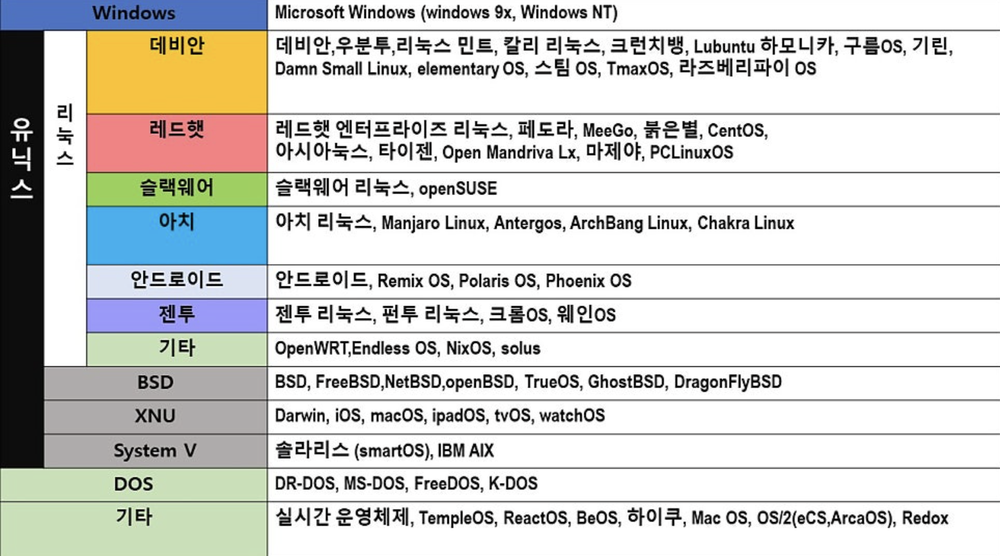

# 운영체제 종류 및 왜 리눅스인가?

---

- 목차

### 운영체제 종류

---

| **비교 항목** | **🐧 리눅스 (Linux)** | **🖥️ 유닉스 (Unix)** |
| --- | --- | --- |
| **개발 시기** | 1991년 (리누스 토르발스) | 1969년 (켄 톰슨, 데니스 리치) |
| **라이선스** | **오픈소스 (GNU GPL)** | **상용 (Proprietary)** / 일부 BSD 계열 |
| **비용** | 대부분 무료 (기술 지원은 유료) | 고가 (하드웨어 + OS 라이선스) |
| **소스 코드** | **공개** (누구나 수정/배포 가능) | **비공개** (벤더사만 수정 가능) |
| **사용자** | 개발자, 일반 사용자, 서버, 클라우드 | 대기업, 은행, 정부 기관 (안정성 중시) |
| **하드웨어** | 범용성 높음 (x86, ARM 등 모든 플랫폼) | 전용 하드웨어 위주 (SPARC, POWER 등) |
| **대표 예시** | Ubuntu, CentOS, RedHat, Android | IBM AIX, HP-UX, Solaris, macOS* |

---

<aside>
💡

리눅스의 점유율이 25년 사상 최대 5%를 찍고 있다.

</aside>

### 서버 시장을 리눅스가 지배하는 이유

<aside>
💡

전 세계 상위 100만개 웹 서버 중 약 96% 이상이 리눅스 기반”

</aside>

### 1. 압도적인 경제성 (TCO 절감)

> 라이선스 비용이 0원
> 
- Windows Server 같은 경우 CPU 코어 수나 접속 유저 수 (CAL) 에 따라 라이선스 비용을 지불해야 한다. 하지만 오픈 소스 기반의 리눅스는 무료

### 2. 안정성과 가용성

> 재부팅이 필요 없는 운영체제
> 
- 서버는 꺼지면 안되잖아요? 리눅스는 커널 패치가 있더라도 재부팅을 하지 않아도 된다.

> 리눅스 무중단 운영의 비밀
> 
1. Live kernel patching (함수의 주소를 바꿔치기 해서 실행중에 코드를 수정)
1. 커널이 실행 중인 메모리 공간에 새로운 패치 코드를 로드
2. 기존에 결함이 있는 함수가 호출될 때, 가로채서 새로운 함수로 점프
3. 운영체제는 멈추지 않고 새로운 코드로 실행

2. 파일 시스템의 차이 : Inode 와 파일 잠금
- 윈도우 (Loccking)
 > 실행 중인 프로그램의 실팽 파일 이나 라이브러리를 수정 / 삭제 하려고 하면 OS 가 파일을 잠가버려 업데이트가 불가능하다. 그래서 재부팅 후 설치를 요구하는 이유
    
    >리눅스는 파일  이름이 아니라 Inode(고유 번호)로 파일 관리 즉 참조
    
    | **구분** | **윈도우 (Windows)** | **리눅스 (Linux)** |
    | --- | --- | --- |
    | **보안 패치** | 대부분 **재부팅 필수** (시스템 파일 잠금 때문) | **라이브 패칭** 기술로 재부팅 없이 적용 가능 |
    | **프로그램 업데이트** | 종종 재부팅 요구 | **서비스 재시작(`systemctl restart`)**만으로 충분 |
    | **드라이버 설치** | 재부팅 필요한 경우 많음 | **커널 모듈** 로딩으로 즉시 적용 가능 |
    | **재부팅 이유** | 파일 잠금 해제 및 레지스트리 갱신 | 주로 하드웨어 교체나 매우 중대한 커널 변경 시 |
3. GUI 가 없는 “Headless” 환경
Headless 모드 : 리눅스 서버는  모니터 없이 검은 화면에 글자만 나오는 CLI (Command Line Interface) 환경에서 돌아간다. > 그래픽 자원을 사용하지 않는다.

4. 강력한 보안성
- 리눅스는 다중 사용자를 가정하고 설계 되어 , 파일 및 디렉토리에 대한 권리가 엄격하다.
- 오픈 소스 기반이기 때문에 보안 취약점 발견 시 벤더 사 (윈도우의 MS) 의 공식 패치를 기다릴 필요 없어 즉각적인 대응이 가능하다.

<aside>
💡

그렇다면 왜 리눅스는 일반 시장에서는 성공하지 못했나?

→ 윈도우랑 비교하면 윈도우는 설정해야될 값들이 너무 많다
 (불친절한 CLI, 와 드라이버를 버전별로 일일이 잡아줘야한다는 단점이 존재.)

→ 하지만 윈도우는개발자가 아닌 일반 사용자들이라도 알아서 OS 가 처리하니깐 리눅스의 점유율이 일반 데스크탑 시장에서는 낮은 것이다.

</aside>