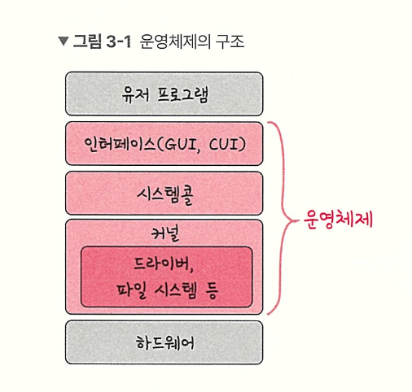

# 운영체제

---

- 목차
    
    

# 운영체제 (Operating System)

---

- 컴퓨터 사용자와 컴퓨터 하드웨어 사이에서 중계 역할을 하면서, 프로그램 실행을 관리하고 제어하는 시스템 소프트웨어
- 프로그램의 일종이지만 컴퓨터가 직접적인 대상인 시스템 소프트웨어

> 디바이스 드라이버 (Device Driver)
> 
- 하드웨어를 제어하기 위한 소프트웨어
- Nvidia Graphic Driver라고 생각하면 된다.

> 커널 (Kernel)
> 
- 운영체제의 핵심 부분, 좁은 의미의 운영체제
- 운영체제의 핵심 기능을 수행
- 커널 기능을 이용하기 위해서는 반드시 System Call 을 해야한다.

### System Call

- 커널의 기능을 사용하기 위한 유일한통로

> 운영체제가 커널에 접근하기 위한 인터페이스
유저 프로그램이 운영체제의 서비스를 받기 위해 커널 함수를 호출할 때 사용
> 

- 커널과 응용프로그램 사이의 인터페이스를 의미
- 사용자 공간의 코드에서 커널 서비스를 요청하는 과정

1. 응용프로그램이 커널 기능( 예 ) 파일 읽기) 이 필요하면 시스템 콜 호출
2. CPU 모드가 유저 모드에서 커널 모드로 전환
3. 커널이 요청된 작업을 수행하고 결과 반환
4. 다시 유저 모드로 복귀

***응용 프로그램에서 커널 기능을 사용할 수 있는 유일한 방법***

---

# MODE BIT

> 시스템 콜이 작동될 때 유저모드와 커널 모들르 구분하는 비트
1 or 0 의 값을 가지는 플래그 변수
> 

0 : 커널 모드 → 운영체제가 실행 중

1 : 유저 모드 → 사용자 프로그램이 실행 중

| **구분** | **유저 모드 (User Mode)** | **커널 모드 (Kernel Mode)** |
| --- | --- | --- |
| **접근 권한** | 제한적 접근 | **모든 시스템 자원 접근 가능** |
| **실행 코드** | 사용자 애플리케이션 코드 | 운영체제(커널) 코드 |
| **명령어** | 일반 명령만 수행 가능 | **특권 명령(Privileged Instruction)** 수행 가능 |
| **동작 시점** | 일반 프로그램 실행 시 | 시스템 콜, 인터럽트, 트랩 발생 시 |

> 유저모드
> 
- 유저가 접근할 수 있는 영역을 제한적으로 두며 컴퓨터 자원에 함부로 침범하지 못하는 모드

> 커널 모드
> 
- 모든 컴퓨터 자원에 접근할 수 있는 모드

### 흐름

1. 사용자 프로그램 실행 (Mode Bit : 1)
2. 시스템 콜 호출 (Trap 발생)
3. 하드웨어가 ModeBit 을 0으로 변경 (커널 모드 전환)
4. 커널이 요청된 작업 수행
5. 작업 완료 후 Mode Bit을 1로 변경 (유저모드 복귀)

> 트랩
> 
- 운영체제를 깨우는 소프트웨어적 신호

→ 프로그램 실행 중에 소프트웨어적으로 발생하는 인터럽트 혹은 예외 상황

### 트랩의 발생 원인 2가지

1. **시스템 콜 요청 (의도적)**: 프로그래머가 파일 읽기, 쓰기 등을 위해 운영체제의 서비스를 요청할 때 (ex. `INT 0x80` 명령어).
2. **오류/예외 발생 (비의도적)**: 프로그램 실행 중 0으로 나누기(Divide by Zero), 잘못된 메모리 주소 접근(Segmentation Fault) 등 치명적인 오류가 발생했을 때 운영체제가 이를 처리하도록 함.

| **구분** | **트랩 (Trap)** | **하드웨어 인터럽트 (Hardware Interrupt)** |
| --- | --- | --- |
| **별칭** | **소프트웨어 인터럽트** | 하드웨어 인터럽트 |
| **발생 주체** | **실행 중인 프로그램 (소프트웨어)** | 외부 하드웨어 장치 (타이머, 키보드, 디스크 등) |
| **발생 시점** | **동기적 (Synchronous)** 명령어 실행 직후 발생 | **비동기적 (Asynchronous)** 프로그램 실행과 상관없이 불시에 발생 |
| **목적** | 시스템 콜 호출, 예외 처리 | 입출력 완료 알림, 타이머 알림 |

---