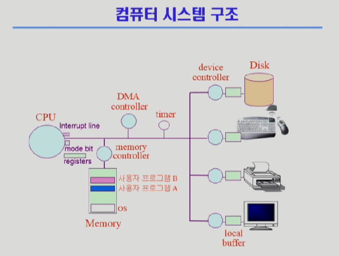
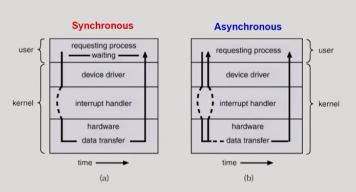
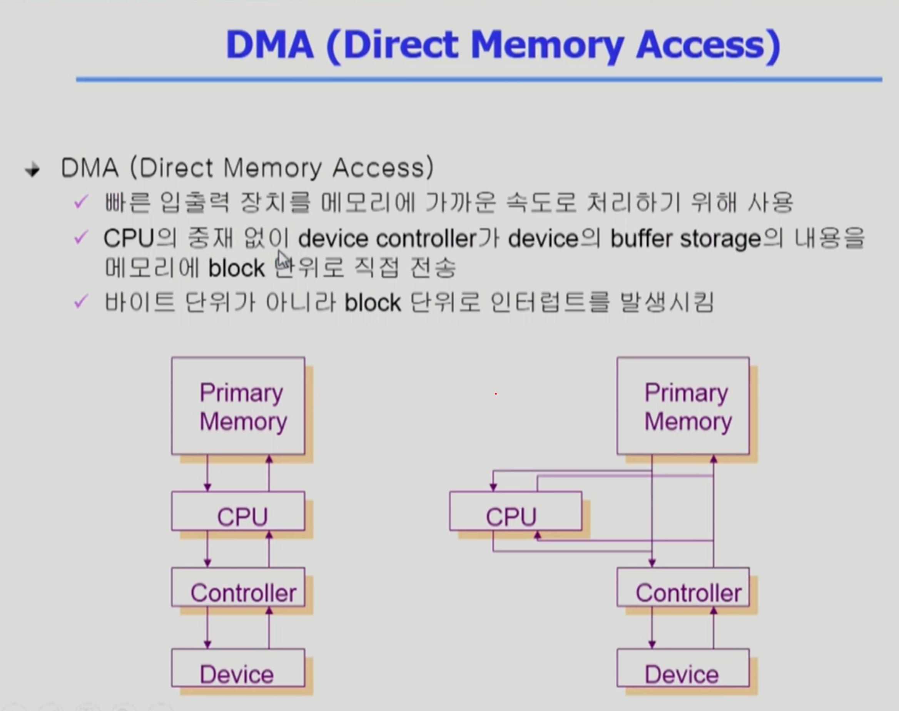
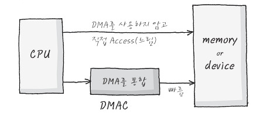
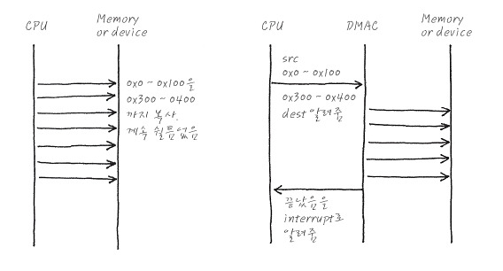

# 컴퓨터 시스템 구조

---

- 목차
    
    

<aside>
💡

사용자 프로그램 A 가 디스트의 데이터를 필요로 할 경우

### 1. 요청 (Software Interrupt / System Call)

- **CPU**에서 실행 중이던 사용자 프로그램 A 가 파일을 읽기 위해  OS 에 요청
(이때 System Call (Software Interrupt) 발생
- CPU의 모드 비트는 커널 모드(0) 으로 바꾸고, OS 코드를 실행
Disk Controller 에게 데이터를 읽으라고 명령을 내린다.

### 2. 위임 및 다른 작업 수행 (Asynchronous)

- Disk Controller는 CPU의 명령을 받아 Disk에서 데이터를 읽기 시작
- 이때 CPU는 단순히 A 작업을 기다리지 않고 프로그램 B로 문맥 교환 (Context Switching)을 통해 다른 작업 수행 (CPU가 노는 시간이 없다.)

### 3. 장치 작업 및 버퍼링

- Disk에서 읽혀진 데이터는 곧바로 메인 메모리로 가지 않고, 일단 Device Controller 옆에 Local Buffer로 임시 저장

### 4. 데이터 전송 (DMA Controller의 개입)

- 원래는 CPU가 데이터를 옮겨야 하지만, 효율성을 위해 DMA(Direct Memory Access)가 Local Buffer에 쌓인 데이터를 Memory로 직접 전송. 
(CPU를 거치지 않고 메모리에 직접 접근)

### 5. 완료 알림 (Hardware Interrupt)

- 데이터 전송이 모두 끝나면, **Disk Controller** (혹은 DMA 컨트롤러)가 CPU에 있는 Interrupt line 에 전기적 신호를 보내 **하드웨어 인터럽트**를 발생.
- 데이터 준비 끝!

### 6. 인터럽트 처리 (ISR)

- **CPU**는 사용자 프로그램 B를 실행하다가 인터럽트 신호를 감지합니다.
- 하던 일을 잠시 멈추고, 다시 OS의 인터럽트 처리 루틴(ISR)으로 이동합니다.
- OS는 메모리에 올라온 데이터를 확인하고, 사용자 프로그램 A가 다시 실행될 수 있도록 상태를 '준비(Ready)' 상태로 변경
</aside>

# CPU

> 메모리에서 명령(Instruction)을 하나씩 읽어서 실행하는 역할.
IO 가 일어나면 CPU 가 접근하지 않고 Device Controller 에게 명령ㅇ르 시킨다.
> 
- CPU는 메인 메모리와 Local Buffer에 접근이 가능
- CPU가 자신의 작업을 하던 중간에 인터럽트 라인에 신호가 들어오면 하던 일을 멈추고 인터럽트와 관련된 일을 처리

### 레지스터 (Register)

> 메모리보다 더 빠른 CPU 내부 저장소
PC (Program Counter) : CPU는 PC 레지스터가 가리키는 메모리 위치에서 인스터럭션을 읽어서 수행
> 

### Timer

> 특정 프로그램이 CPU를 독점하는 것을 막기 위한 하드웨어
> 

<aside>
💡

1. 컴퓨터를 시작하고 처음에 운영체제가 CPU 자원을 가지고 있음.
2. 운영체제는 사용자 프로그램에세 CPU자원을 Timer에 값을 세팅하고 넘겨 줌
3. 타이머는 매 클럭 틱 때마다 1초씩 감소
4. 시간이 지나 Timer의 값이 0이 되면 Timer Interrupt 발생
5. 다른 프로그램에게 CPU 자원 인가
</aside>

# Device Controller

> 일종의 작은 CPU, 각 하드웨어 장치를 제어하는 역할
> 
- 제어 정보를 위해 Control Register, Status REgister 를 가짐
- Local Buffer를 가짐 (일종의 Data Register)

### Local Buffer

> Device Controller 가 데이터를 임시로 저장하는 작업 공간 (CPU의 메인메모리 느낌)
> 

# Interrupt (인터럽트)

> CPU가 프로그램을 실행하고 있을 때, 입출력 하드웨어 등의 장치나 예외 상황이 발생하여 처리가 필요할 경우 CPU에게 알리는 이벤트
인터럽트 당한 시점의 레지스터와 PC(Program Counter)를 저장 후 CPU의 제어를 인터럽트 처리 루틴 (Interrupt Service Routine : ISR ) 에 넘긴다.
> 

| **비교 항목** | **하드웨어 인터럽트 (Hardware Interrupt)** | **소프트웨어 인터럽트 (Software Interrupt)** |
| --- | --- | --- |
| **발생 주체** | **외부 하드웨어 장치** (키보드, 마우스, 디스크 등) | **실행 중인 프로그램** (CPU 내부, 소프트웨어) |
| **발생 시점** | **비동기적 (Asynchronous)** : 현재 명령어 실행과 무관하게 언제든 발생 | **동기적 (Synchronous)** :특정 명령어 실행 직후 또는 실행 중에 발생 |
| **주요 목적** | 하드웨어의 상태 변화 알림, I/O 처리 요청 | 시스템 콜(System Call) 요청, 예외(Exception) 처리 |
| **전달 경로** | 하드웨어 라인 -> 인터럽트 컨트롤러 -> CPU | 소프트웨어 명령(Assembly) -> CPU 내부 로직 |
| **예시** | 키보드 입력, 마우스 이동, 디스크 읽기 완료 | 0으로 나누기, 디버깅 중단점, 파일 열기 요청 |

# **동기식 입출력과 비동기식 입출력**

| **비교 항목** | **(a) 동기식 입출력 (Synchronous)** | **(b) 비동기식 입출력 (Asynchronous)** |
| --- | --- | --- |
| **핵심 개념** | 요청한 작업이 **끝날 때까지 기다림** | 요청만 해두고 **기다리지 않고 다른 일을 함** |
| **사용자 프로세스 상태** | **Waiting (대기) 상태** : (이미지의 `waiting` 구간 참고) | **Running (실행) 상태 유지** : (대기 구간 없이 계속 실행됨) |
| **제어권 반환 시점** | I/O 작업이 **완전히 완료된 후** 리턴 | I/O 요청을 **보내자마자 즉시** 리턴 |
| **CPU 효율성** | 데이터가 올 때까지 해당 프로세스는 CPU를 쓰지 않고 놂 (비효율적일 수 있음) | 데이터가 오기 전까지 CPU로 다른 연산을 수행함 (효율적) |
| **구현 난이도** | 직관적이고 구현이 단순함 (순서대로 코딩) | 복잡함 (콜백 함수, 시그널 처리 등 필요) |
| **완료 알림 방식** | 함수가 리턴되면 작업 끝 | 작업이 끝나면 **인터럽트**를 통해 별도로 알려줌 |
| **현실 비유** | 카페에서 커피 나올 때까지 **진동벨만 보고 서 있기** | 커피 주문하고 자리에 앉아서 **책 읽다가 진동벨 울리면 가기** |
|  |  |  |

# DMA (Direct Memory Access)

> 직접 메모리에 접근할 수 있는 컨트롤러
CPU 의 개입 업싱 하드웨어 장치들이 시스템 메모리에 직접 접근하여 데이터를 주고 받는 기술
> 

### 문제

 i/o device로 인한 cpu로의 interrupt가 너무 많아진다면 => cpu가 효율적으로 동작을 할 수 없다.

⇒ DMA도 메모리에 접근할 수 있게 해서 IO 작업들을 메모리에 쌓고, 어느 정도 쌓였으면 cpu에 interrupt를 걸어 작업을 하도록 한다.

`CPU가 데이터를 전송할 때 모든 것을 신경쓰면 처리하는 작업이 더디기 대문에 DMA 가 대신 한다고 생각`

### DMA? DMAC?

- `DMA : CPU와 상관 없이 데이터를 전송하는 것`
- `DMAC(DMA Controller) : CPU가 Control하는 DMA`

### DMA

- Source와 destination, 그리고 전송할 바이트만 주면 알아서 data를 전송 
> Processor가 전혀 신경을 안씀
- Data 가 끝나면 HW Interrupt로 CPU에게 완료를 알려주는 구조
> Device를 Memory Address 처럼 Control할 수 있기 때문에 가능