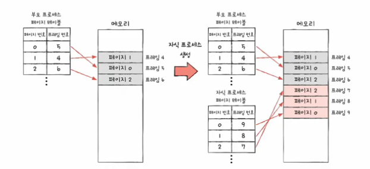
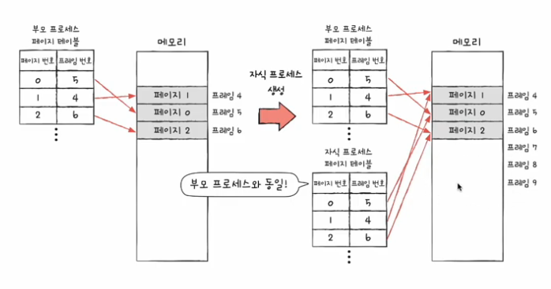
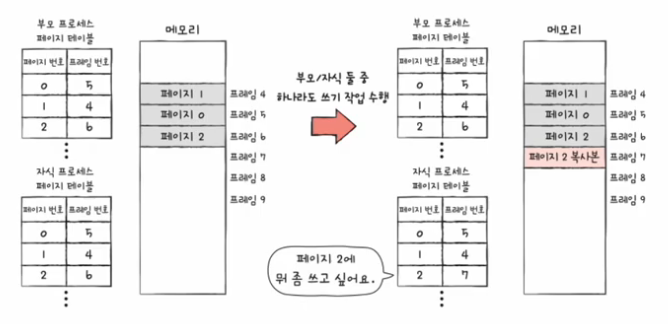

# Copy On Write

## 1. 개념

CoW(Copy-on-write)는 컴퓨터 프로그래밍 및 운영 체제에서 데이터 복사를 최적화하기 위해 사용되는 전략. fork 요청이 있을 때 전체 데이터를 복제하는 대신 기존 데이터에 대한 새 참조를 생성. 그리고 실제 복사는 데이터가 수정될 때만 발생

---

## 2. 등장 배경

### 기존 방식의 문제점

- **상황:** 4GB 메모리를 사용하는 프로세스를 `fork()` 한다고 가정
- **문제:** 부모의 모든 메모리 공간(Code, Data, Heap, Stack)을 자식에게 물리적으로 똑같이 복사해야 함.
  - **생성 시간 지연:** 4GB를 복사하는 동안 CPU와 I/O가 낭비됨
  - **메모리 낭비:** 자식 프로세스가 곧바로 `exec()`을 호출하거나 읽기만 한다면, 복사한 4GB는 아무 쓸모 없는 데이터가 됨
  - **OOM 위험:** 프로세스 생성만으로 메모리가 기하급수적으로 증가하여 시스템 다운 가능성

### COW의 해결책

- 필요할때까지 복사를 미룸
- 대부분의 자식 프로세스는 데이터를 읽기만 하거나, 곧바로 다른 프로그램으로 변환(`exec`)된다는 점에 착안

---

## 3. 동작 원리

### 1단계: 프로세스 생성 직후 (`fork`)

- 운영체제는 자식 프로세스를 위한 페이지 테이블(Page Table)만 생성한다.
- 부모와 자식의 페이지 테이블 엔트리(PTE)는 **동일한 물리 메모리 프레임**을 가리킨다.
- 해당 메모리 영역의 권한을 Read-Only(읽기 전용)으로 설정한다.

### 2단계: 읽기 작업 (`Read`)

- 데이터를 수정하지 않고 읽기만 할 때는 아무 일도 일어나지 않는다.
- 부모와 자식은 계속 같은 물리 메모리를 공유하며 자원을 절약한다.

### 3단계: 쓰기 작업 시도 (`Write`)

- 부모나 자식 중 누군가 공유된 메모리에 데이터를 쓰려고 시도한다.
- **Page Fault 발생:** MMU(Memory Management Unit)가 CPU에 인터럽트를 건다
  1. OS는 이것이 불법 접근인지, COW 상황인지 판단한다.
  2. COW 상황임이 확인되면, 새로운 물리 메모리 페이지(프레임)를 하나 할당받는다.
  3. 기존 페이지의 내용을 새로운 페이지에 복사한다.
  4. 페이지 테이블을 갱신하여 새 페이지를 가리키게 하고, 권한을 **Read/Write**로 변경한다.
- 프로세스는 중단되었던 쓰기 작업을 재개한다.
