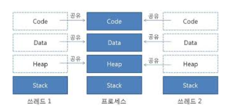
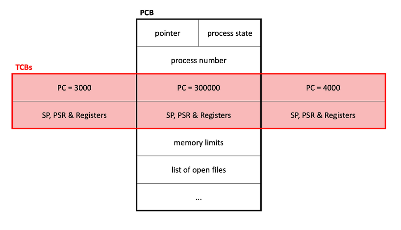
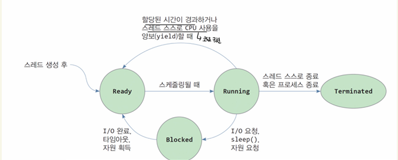
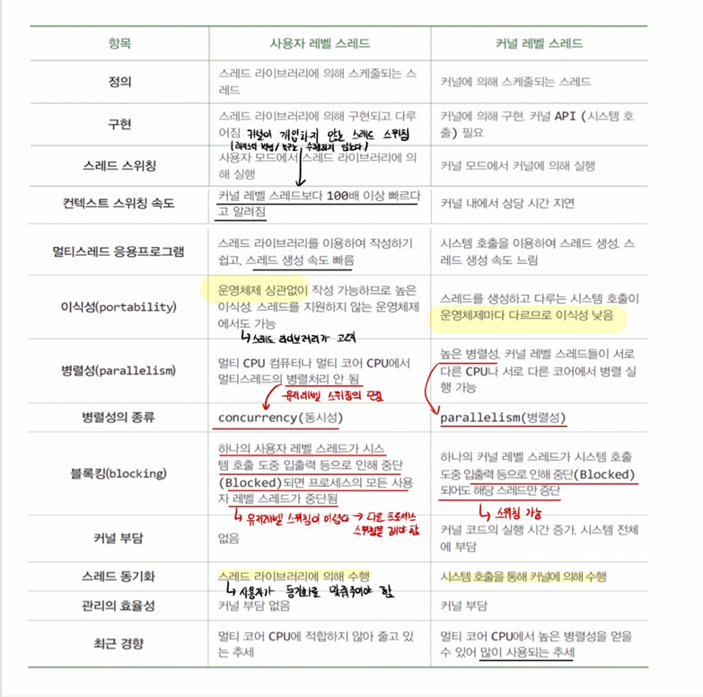
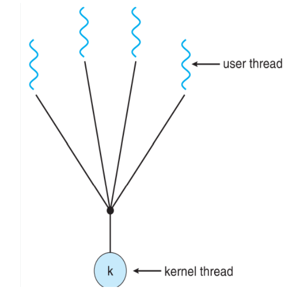
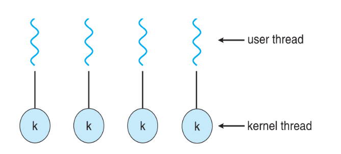
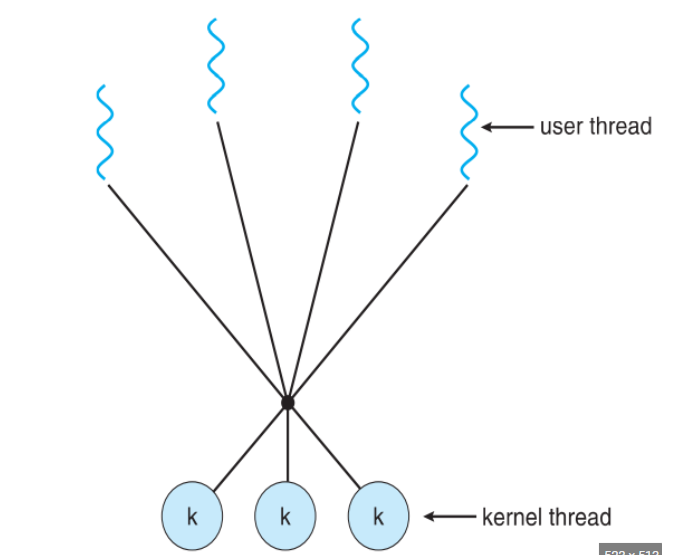

# 스레드

# 1. 스레드의 등장배경

### 프로세스의 문제점

1. 통신 오버헤드 → 각 프로세스는 독립적으로 격리되어 있다. 각 프로세스는 메모리 공유가 불가능하기 때문에 IPC 라는 복잡한 통신 방법을 통해 데이터를 주고 받아야 한다.
2. 생성 오버헤드 → 프로세스 전체를 복사해서 새롭게 프로세스를 만든다는 것은 운영체제 입장에서 부담이 큼
3. 문맥 교환 오버헤드 → 한 프로세스를 처리하다가 다른 프로세스로 옮길때마다 문맥 교환이 일어나는데 이 부분에서도 오버헤드가 발생

즉, 요청 하나가 들어올 때 마다 프로세스를 새로 생성해서 요청을 처리 → 비효율

**스레드는 왜 프로세스보다 효율적인가?**

**1. 생성/종료가 빠름**

- **이유:** 프로세스처럼 메모리 전체(Code, Data, Heap)를 복사할 필요 없이, Stack과 TCB(스레드 제어 블록)만 생성하면 되기 때문.

**2. 컨텍스트 스위칭이 빠름**

- **이유:** 메모리 주소 공간(Address Space)을 공유하기 때문.
- **상세:** 스위칭 시 가상 메모리 매핑(Page Table)을 바꿀 필요가 없고, 무엇보다 **CPU 캐시(Cache)를 비우지 않아도 돼서** 성능 저하가 적음.

**3. 통신이 빠르고 쉬움**

- **이유:** 별도의 통신 기법(IPC) 없이, 공유 메모리(Data, Heap)에 변수를 쓰고 읽는 것만으로 즉시 데이터 교환이 가능함.

# 2. 스레드의 개념

## A. 정의

- **기본 정의:** 프로세스 내에서 실행되는 **실행 흐름의 단위**.
- **특징:** 하나의 프로세스는 최소 1개 이상의 스레드(Main Thread)를 가진다.

## B. 자원 공유

### 1. 공유 영역

프로세스의 주소 공간 내에서 모든 스레드가 함께 사용하는 영역.

- **Code:** 실행할 프로그램 코드 (모든 스레드가 같은 함수를 호출 가능).
- **Data:** 전역 변수, 정적 변수
- **Heap:** 동적 할당 메모리
- **Files:** 열린 파일 목록 등 OS 자원

### 2. 독립 영역

각 스레드가 독립적인 실행 흐름을 갖기 위해 따로 가져야 하는 것들.

- **Stack:** 함수 호출 기록, 지역 변수, 리턴 주소
- **PC (Program Counter):** 현재 코드의 몇 번째 줄을 실행 중인지 가리키는 레지스터 값. (독립적인 실행 위치).
- **Register Set:** CPU 연산에 사용되는 값들.

→ PC 와 Register Set 등은 TCB에 저장

## C. TCB

프로세스에 PCB가 있다면 스레드에는 TCB가 존재

**내용물:** Thread ID, PC, Register 값, Stack Pointer, 상태 정보

## D. 생명 주기

프로세스와 거의 동일 → 다른 스레드를 기다리는 상황이 많음

### 1. 생성 (New)

- **상황:** 스레드가 막 만들어진 상태
- **작업:** 운영체제(또는 라이브러리)가 **TCB**를 생성하고, **스택 공간**을 할당함. 아직 스케줄러의 명단(Ready Queue)에는 없음

### 2. 준비 (Runnable / Ready)

- **상황:** 모든 준비를 마치고 **Ready Queue**에 줄 서 있는 상태
- **특징:** CPU만 주면 즉시 실행할 수 있음

### 3. 실행 (Running)

- **상황:** 스케줄러에게 선택받아(Dispatch) **CPU를 점유**하고 코드를 실행 중인 상태.
- **특징:**
  - **Time Slice 만료 시:** 다시 `Ready` 상태로 쫓겨남
  - **작업 완료 시:** `Terminated` 상태로 이동
  - **대기 필요 시:** `Blocked` 상태로 이동

### 4. 대기 (Blocked / Waiting)

스레드가 실행을 멈추고 **무언가를 기다리는 상태**

- **I/O 대기:** 파일 읽기, 네트워크 수신 등을 기다림
- **동기화 대기 (Lock Waiting):** 다른 스레드가 쓰고 있는 자원(임계 구역)이 비워지기를 기다림. (Mutex, Semaphore)
- **조인 대기 (Join Waiting):** 다른 스레드가 끝날 때까지 기다림

### 5. 종료 (Terminated / Dead)

- **상황:** 스레드의 할 일(함수 실행)이 끝났거나 강제로 종료된 상태
- **작업:** 할당받았던 스택과 TCB가 회수됨

### 프로세스 상태와의 결정적 차이

- **프로세스:** 하나가 `Blocked` 되어도 다른 프로세스는 상관없음
- **스레드:**
  - **커널 수준 스레드:** 하나가 `Blocked` 되어도 다른 스레드는 잘 돌아감. (OS가 개별 관리).
  - **사용자 수준 스레드:** 하나가 `Blocked` 되면, **같은 프로세스 내의 모든 스레드가 멈출 수 있음**

# 3. 스레드의 종류

### A. 사용자 레벨 스레드

### 1. 개념 및 특징

- **관리 주체:** 사용자 영역의 **스레드 라이브러리**
- **커널의 인식:** 커널은 스레드의 존재를 **전혀 모른다.** 그저 하나의 프로세스로만 인식한다.
- **구현:** 라이브러리가 사용자 공간에 스레드 테이블(TCB)을 만들고 직접 스케줄링한다.

### 2. 장점

- **빠른 속도:** 스레드 생성과 스위칭이 **사용자 모드**에서만 일어난다. (커널 모드 전환 오버헤드 0).
- **이식성:** 운영체제가 스레드를 지원하지 않아도 라이브러리만 있으면 어디서든 사용 가능하다.

### 3. 단점

- **블로킹 문제 :** 하나의 스레드가 시스템 콜(I/O 등)을 호출하다가 대기(Block) 상태가 되면, 커널은 **프로세스 전체를 대기**시킨다. (나머지 스레드도 다 멈춤).
- **멀티 코어 활용 불가:** 커널은 이걸 1개의 프로세스로만 보므로, CPU 코어를 하나만 할당한다

### B. 커널 레벨 스레드

### 1. 개념 및 특징

- **관리 주체:** **운영체제 커널**
- **커널의 인식:** 커널이 각 스레드를 개별 실행 단위로 인식하고 관리한다.
- **구현:** 커널 공간에 각 스레드별 TCB를 생성하고, 스케줄러가 스레드 단위로 스케줄링한다.

### 2. 장점

- **동시성 보장:** 하나의 스레드가 대기(Block) 상태가 되어도, 커널은 다른 스레드를 계속 실행시킨다.
- **멀티 코어 활용:** 커널이 각 스레드를 서로 다른 CPU 코어에 배정하여 **병렬 실행**이 가능하다.

### 3. 단점

- **오버헤드:** 스레드 생성 및 스위칭 시 시스템 콜이 필요하므로, 사용자 수준 스레드보다 느리다.

### C. 순수 커널 스레드

**순수 커널 스레드**는 사용자 프로세스와 전혀 상관없이, **운영체제(OS)가 자신이 해야 할 일(백그라운드 작업)을 수행하기 위해 독자적으로 만든 스레드**다.

### 특징

1. **Only Kernel Mode:** 평생 **커널 모드**에서만 실행된다.
2. **No User Address Space:** 사용자 주소 공간(Code, Data, Heap)을 가지지 않는다. 오직 **커널 주소 공간**만 접근한다.
3. **High Priority:** 시스템의 안정성을 위해 일하므로, 일반 사용자 스레드보다 우선순위가 높은 경우가 많다.

# 4. 멀티 스레딩 모델

사용자 수준 스레드(ULT)와 커널 수준 스레드(KLT)를 연결하는 방식

## A. 다대일 모델

**여러 개의 사용자 스레드를 하나의 커널 스레드에 연결**

- **구조:** 사용자 스레드 N개 : 커널 스레드 1개.
- **특징:**
  - 스레드 관리는 사용자 공간의 라이브러리가 담당하므로 효율적이다.
- **단점:**
  - **블로킹 문제:** 하나의 사용자 스레드가 시스템 콜(I/O)로 인해 봉쇄(Block)되면, 유일한 커널 스레드도 같이 멈춘다. 즉, **프로세스 전체가 멈춘다.**
  - **병렬 불가:** 커널 스레드가 1개뿐이라서, 멀티 코어 환경이라도 한 번에 하나의 스레드만 실행된다.

## B. 일대일 모델 (현대 OS의 표준)

**사용자 스레드 하나당 커널 스레드 하나를 연결**

- **구조:** 사용자 스레드 1개 : 커널 스레드 1개.
- **특징:**
  - 사용자 스레드를 만들면 커널 스레드도 같이 만들어진다.
  - **동시성 우수:** 하나의 스레드가 Block 되어도 다른 스레드는 잘 돌아간다.
  - **병렬성 우수:** 멀티 코어 환경에서 여러 스레드를 진짜로 동시에 돌릴 수 있다.
- **단점:**
  - **오버헤드:** 사용자 스레드 생성 시 커널 스레드도 생성해야 하므로 비용이 든다.
  - **개수 제한:** 커널 스레드를 무한정 만들 수 없으므로, 생성 가능한 스레드 수에 제약이 있다.
- **예시:** **Windows, Linux (대부분의 현대 운영체제)**

## C. 다대다 모델

**여러 개의 사용자 스레드를 그보다 적거나 같은 수의 커널 스레드에 연결**

- **구조:** 사용자 스레드 N개 : 커널 스레드 M개 (N >= M).
- **특징:**
  - 다대일과 일대일의 단점을 보완하기 위해 고안됨.
  - 필요한 만큼 커널 스레드를 생성하여 병렬성을 확보하면서도, 너무 많이 생성하는 오버헤드는 줄임.
- **현실:** 구현이 너무 복잡해서 현대 OS에서는 잘 쓰이지 않음. (결국 일대일 모델로 정착됨).

# 5. 프로세스와 스레드 비교표

| **비교 기준** | **프로세스 (Process)**                              | **스레드 (Thread)**                                       |
| ------------- | --------------------------------------------------- | --------------------------------------------------------- |
| **정의**      | 실행 중인 프로그램 (자원 할당의 단위)               | 프로세스 내의 실행 흐름 (CPU 스케줄링의 단위)             |
| **자원 공유** | **독립적** (Code, Data, Heap, Stack 모두 따로 가짐) | **공유함** (Code, Data, Heap 공유, **Stack만 독립**)      |
| **생성 속도** | 느림 (메모리 전체 복사 필요 - `fork`)               | **빠름** (자원 공유, 스택만 생성)                         |
| **문맥 교환** | **비용 높음** (캐시 초기화, 주소 공간 변경 등)      | **비용 낮음** (레지스터 교체만 하면 됨, 캐시 유지)        |
| **통신 방법** | **IPC** (파이프, 소켓 등 시스템 콜 필요 - 느림)     | **공유 메모리** (변수 직접 접근 - 빠름)                   |
| **안정성**    | **높음** (하나가 죽어도 다른 프로세스 영향 없음)    | **낮음** (하나가 메모리 잘못 건드리면 프로세스 전체 사망) |
