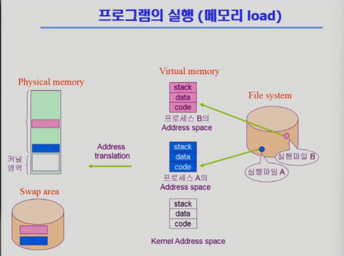

# 프로그램 실행 과정

## 1. 프로그램 실행 흐름

## (Step 0) 실행 버튼을 누르는 순간 과정

## Step 1. 복제 요청

- **상황:** 부모 프로세스(예: 쉘)가 새로운 프로그램을 실행하기 위해 `fork()`를 호출.
- **동작:**
  - 시스템 콜이 발생하여 **CPU가 커널 모드로 전환**됨
  - 커널은 부모 프로세스의 **PCB를 즉시 복제**하여 자식 PCB를 생성
- **결과:** 부모와 똑같은 쌍둥이 자식 프로세스 생성 완료.

## Step 2. 자식 프로세스의 시작

- **상황:** `fork()` 시스템 콜이 끝나고 **사용자 모드**로 복귀.
- **동작:**
  - 부모와 자식 프로세스 둘 다 `fork()` 함수에서 리턴됨.
  - **자식 프로세스:** `if (pid == 0)` 조건문 내부로 진입.

## Step 3. 덮어쓰기 요청

- **상황:** 자식 프로세스가 **`exec("새로운프로그램")`** 시스템 콜을 호출.
- **동작:**
  - 다시 **CPU가 커널 모드로 전환**됨.
  - 커널은 자식 프로세스의 기존 메모리 매핑(부모와 공유하던 것)을 모두 끊어버림.

### Step 1. 로드 및 초기화 (Load)

- 파일 시스템의 실행 파일(`exe`)을 읽어 메모리에 로드
- 가상 주소 공간 생성 (User 영역 초기화 + Kernel 영역 매핑)
- 커널의 Data 영역에 해당 프로세스의 **PCB(Process Control Block)** 생성

### Step 2. 사용자 모드 실행 (User Mode)

- CPU가 **사용자 모드**로 동작.
- `User Code`를 실행하며, 함수 호출 시 `User Stack`을 사용
- 동적 메모리 필요 시 `Heap` 영역 사용

### Step 3. 시스템 콜 요청 (System Call)

- 파일 I/O, 프로세스 제어 등 특권 명령 필요 시 커널에 요청
- **트랩(Trap)/인터럽트** 발생 → CPU 제어권이 커널로 넘어감

### Step 4. 모드 전환 (User → Kernel)

- CPU가 **커널 모드**로 전환
- 현재까지 실행하던 문맥(PC, Register 값 등)을 저장

### Step 5. 커널 모드 실행 (Kernel Mode)

- 공유된 `Kernel Code` (시스템 콜 핸들러) 실행
- 작업 도중 필요한 데이터 저장은 해당 프로세스 전용 `Kernel Stack`을 사용
- `PCB` 및 자원 테이블을 참조하여 하드웨어 제어 수행

### Step 6. 복귀 (Return)

- 커널 작업 완료 후 결과 반환
- 저장해둔 문맥 복원 및 CPU를 다시 **사용자 모드**로 전환
- 중단됐던 지점부터 `User Code` 실행 재개

---

## 2. 프로세스 주소 공간 (Process Address Space)

프로그램이 실행되면 운영체제는 해당 프로세스를 위해 **가상 메모리(Virtual Memory)** 상에 독자적인 주소 공간(32bit 기준 4GB)을 생성함

### A. 사용자 공간

프로세스마다 **독립적**으로 할당되는 사적 영역.

- **Code:** 실행할 기계어 코드
- **Data:** 전역 변수, 정적(Static) 변수. 프로그램 시작 시 할당됨.
- **Heap:** **동적 할당** 영역. 런타임에 크기 결정. 낮은 주소 → 높은 주소로 성장 (`malloc`, `new`)
- **Stack:** **사용자 스택**. 지역 변수, 함수 호출 정보 저장. 컴파일 타임에 크기 결정

### B. 커널 공간

모든 프로세스의 주소 공간 상위에 매핑되어 있는 영역

- **Code/Data:** OS 커널 코드와 전역 데이터. 모든 프로세스가 **공유**함
- **Kernel Stack:** 프로세스마다 할당된 커널 전용 스택. 문맥 교환 시 프로세스별 상태 저장을 위해 독립적으로 존재
