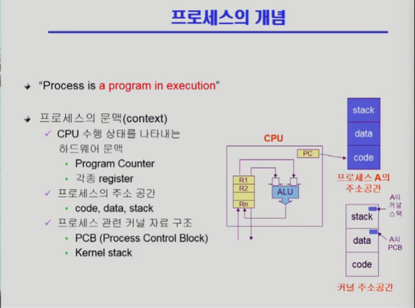
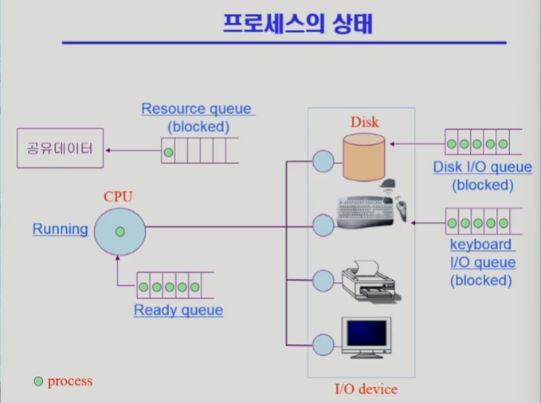
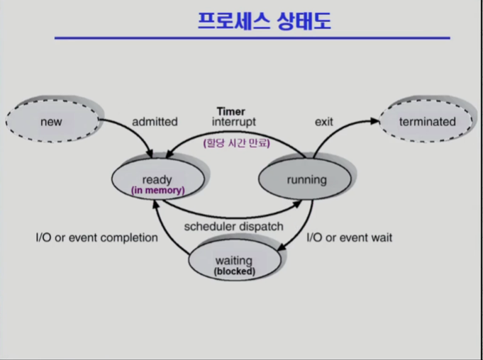
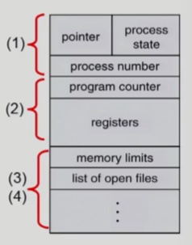
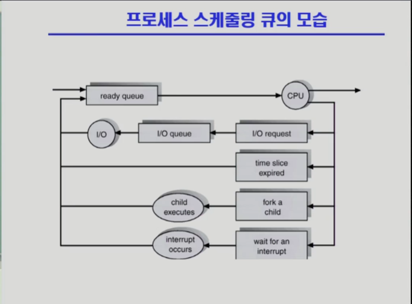
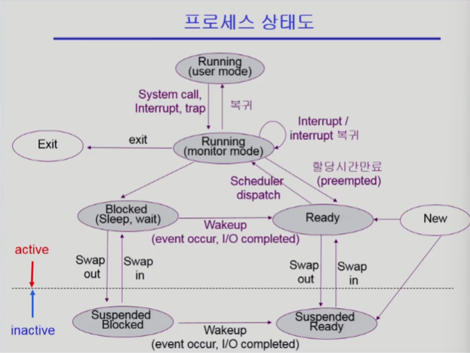

# 프로세스



## 1. 프로세스의 개념

- **정의:** **실행 중인 프로그램**
- **특징:**
  - 디스크에 정적으로 존재하는 프로그램이 메모리에 적재되어 CPU 할당을 받을 수 있는 동적인 상태로 변한 것.
  - 운영체제로부터 시스템 자원(주소 공간, 파일, 메모리 등)을 할당받는 작업의 단위.

---

## 2. 프로세스의 문맥 (Context)

프로세스가 현재 어떤 상태에 있고, 어디까지 실행됐는지를 나타내는 정보

### A. 하드웨어 문맥 (Hardware Context)

CPU가 현재 시점에 파악하고 있는 정보.

- **Program Counter (PC):** 다음에 실행할 기계어 코드의 주소.
- **Registers:** 범용 레지스터, 상태 레지스터 등에 저장된 현재 연산 값.

### B. 프로세스 주소 공간 (User Address Space)

메모리에 적재된 프로세스의 고유 영역.

- **Code:** 실행할 코드.
- **Data:** 전역 변수.
- **Stack:** 함수 호출 및 지역 변수.

### C. 커널 관련 자료 구조 (Kernel Data Structure)

운영체제가 프로세스를 관리하기 위해 커널 공간에 둔 정보.

- **PCB (Process Control Block):** 프로세스의 모든 상태 정보 저장.
- **Kernel Stack:** 프로세스가 시스템 콜을 수행할 때 사용하는 커널 스택.

---

## 3. 프로세스의 상태

프로세스는 실행되면서 상태가 변경됨





### 주요 상태

1. **Running (실행)**
   - CPU를 점유하고 기계어 명령(Instruction)을 수행 중인 상태.
   - 싱글 코어 기준, 매 시점 단 하나의 프로세스만 존재.
2. **Ready (준비)**
   - 메모리에 올라와 있고, CPU만 할당받으면 **즉시 실행 가능**한 상태.
   - **Ready Queue**에서 스케줄러의 선택을 기다림.
3. **Blocked (Wait, Sleep / 대기, 봉쇄)**
   - CPU를 할당해 줘도 **당장 명령을 수행할 수 없는** 상태.
   - **원인:** I/O 작업(디스크 읽기) 진행 중, 사용자 입력 대기 등.
   - 자신이 요청한 이벤트(I/O 완료)가 발생해야만 Ready 상태로 넘어감.

### 기타 상태

- **New:** 프로세스가 생성 중인 상태 (메모리 할당 등 초기화 단계)
- **Terminated:** 수행이 끝나고 자원을 반납하는 정리 단계

---

## 4. PCB (Process Control Block)

운영체제가 각 프로세스를 제어하기 위해 정보를 저장하는 자료구조. **커널 내의 Data 영역**에 존재.



### PCB에 저장되는 정보

1. **OS 관리 정보 (Process Management):**
   - **Process State:** 현재 상태(Ready, Running 등).
   - **Process ID (PID):** 프로세스 고유 식별 번호.
   - **Scheduling Info/Priority:** 스케줄링 우선순위, 큐 포인터.
2. **CPU 문맥 (Hardware Context):**
   - **Program Counter:** 다음에 실행할 명령어 주소.
   - **Registers:** 문맥 교환 시 백업해 둔 레지스터 값들.
3. **메모리 관리 정보 (Memory Management):**
   - **Memory Limits:** Code, Data, Stack의 시작/끝 주소 정보 (Page Table 정보 등).
4. **자원 사용 정보 (Resource Usage):**
   - **List of open files:** 현재 프로세스가 열고 있는 파일 식별자(Descriptor) 목록.

---

## 5. 문맥 교환 (Context Switch)

CPU 제어권을 실행 중이던 프로세스에서 다른 프로세스로 넘기는 과정.

### 동작 과정

1. **실행 중단:** 현재 실행 중인 프로세스(A)의 문맥(PC, Register 값 등)을 **A의 PCB에 저장**.
2. **복구:** 다음에 실행할 프로세스(B)의 문맥을 **B의 PCB에서 읽어와 CPU 레지스터에 복원**.
3. **실행 재개:** B 프로세스 실행 시작.

### 특징

- **오버헤드 :** 문맥 교환이 일어나는 동안 CPU는 유용한 작업을 하지 못함(시스템 관리 비용).
- **Cache Flush:** 문맥 교환 시 CPU 캐시 메모리가 초기화되어 성능 저하의 원인이 될 수 있음.

시스템 콜을 한다고 무조건 문맥 교환이 일어나는 것은 아님.

| **구분** | **Non-Blocking Call**                  | **Blocking Call**                           |
| -------- | -------------------------------------- | ------------------------------------------- |
| **예시** | `getpid()`, `time()`                   | `read()`, `write()`, `sleep()`              |
| **상황** | 커널 메모리만 보고 **즉시 응답 가능**. | 디스크/네트워크 등 **느린 장치 대기** 필요. |
| **결과** | **문맥 교환 X** (A 계속 실행)          | **문맥 교환 O** (A는 Blocked, B 실행)       |

---

## 6. 프로세스 스케줄링 큐의 종류와 흐름

프로세스는 일생 동안 다양한 큐(Queue)를 오가며 줄을 서게 된다.

### A. 큐의 종류 (Three Types of Queues)

1. **Job Queue:** 시스템에 들어온 **모든 프로세스**의 집합. (현재 메모리에 있든 디스크에 있든 총망라).
2. **Ready Queue:** 메모리 내에 있으면서, **CPU만 주면 즉시 실행 가능**한 프로세스들의 집합.
3. **Device Queue (I/O Queue):** I/O 장치(디스크, 키보드, 프린터 등)를 사용하기 위해 대기하는 프로세스들의 집합. 각 장치마다 별도의 큐가 존재함.

### B. 프로세스 스케줄링 과정



**프로세스는 Ready Queue와 Device Queue를 오가며 실행된다.**

1. **시작:** 프로세스는 처음에 **Ready Queue**에 들어가서 대기한다.
2. **실행:** 스케줄러에 의해 선택되면 **CPU**를 잡고 실행된다.
3. **분기:** 실행 중에 다음과 같은 사건이 발생하면 CPU를 내놓고 이동한다.
   - **① I/O 요청 (I/O Request):**
     - 데이터 입출력이 필요하면 **I/O Queue**로 이동.
     - I/O 작업이 끝나면 다시 **Ready Queue**로 복귀.
   - **② 할당 시간 만료 (Time Slice Expired):**
     - 타이머 인터럽트 발생 (Round Robin 등).
     - 강제로 CPU를 뺏기고 곧바로 **Ready Queue**로 이동 (줄의 맨 뒤로).
   - **③ 자식 프로세스 생성 (Fork a child):**
     - 자식 프로세스를 생성(`fork`)하고, 자식이 실행되는 동안 대기하거나 병행 실행됨.
     - 작업이 정리되면 **Ready Queue**로 복귀.
   - **④ 인터럽트 대기 (Wait for an interrupt):**
     - 특정 이벤트(인터럽트)를 기다리며 대기 상태로 전환.
     - 인터럽트가 발생하면 **Ready Queue**로 복귀.
4. **종료:** 위 과정을 반복하다가 프로세스가 끝나면(Terminate) 모든 큐에서 제거되고 자원을 반납한다.

---

## 7. 스케줄러 (Scheduler)

시스템 자원(CPU, 메모리)을 어떤 프로세스에게 할당할지 결정하는 커널의 핵심 코드

### A. 장기 스케줄러 (Long-term Scheduler / Job Scheduler)

- **역할:** 시작 프로세스(New) 중 어떤 것을 **Ready Queue**로 보낼지 결정.
- **기능:** 메모리에 올라가는 프로세스의 수를 제어함.
- **특징 (현대 OS):**
  - **Time Sharing System(시분할 시스템)에는 보통 존재하지 않음.**
  - 현대 운영체제는 프로세스가 생성되면 **무조건 Ready 상태**로 보내 메모리에 올림.

### B. 단기 스케줄러 (Short-term Scheduler / CPU Scheduler)

- **역할:** **Ready Queue**에 있는 프로세스 중 어떤 프로세스를 다음번에 **Running** 시킬지 결정.
- **기능:** 프로세스에게 CPU를 할당(Dispatch)하는 문제.
- **특징:**
  - 매우 빈번하게 호출됨 (ms 단위)
  - 속도가 매우 빨라야 함

### C. 중기 스케줄러 (Medium-term Scheduler / Swapper)

- **역할:** 메모리 공간이 부족할 경우, 여유 공간 마련을 위해 프로세스를 통째로 메모리에서 디스크(Swap Area)로 쫓아냄 (**Swap Out**).
- **기능:** 실행 중인 프로세스의 수(Degree of Multiprogramming)를 동적으로 조절
- **배경:**
  - 현대 시분할 시스템은 장기 스케줄러가 없기 때문에, 처음엔 다 메모리에 올려줌.
  - 그러다 메모리가 부족해지면 **중기 스케줄러**가 개입하여 일부를 쫓아내는 방식을 사용.

---

## 8. 프로세스 상태도

그렇다면 중기 스케줄러에 의해 메모리를 빼앗긴 프로세스의 상태는?



이 과정에서 **Suspended (Stopped)** 상태가 발생함.

- **Suspended:** 외부적인 이유(메모리 부족 등)로 프로세스의 수행이 정지되고 메모리에서 쫓겨난 상태

---

## 9. 프로세스 생성 (Process Creation)

### A. 기본 원칙

- **주체:** 부모 프로세스(Parent)가 자식 프로세스(Child)를 생성한다.
- **방법:** 프로세스가 직접 다른 프로세스를 만들 수 없으므로, **운영체제에게 시스템 콜(`fork()`)을 요청**하여 생성한다.
- **구조:** 이 과정이 반복되면 프로세스들은 **트리(Tree) 계층 구조**를 형성한다.
  - 최상위 조상: `init` 프로세스 (Linux 기준, PID 1.
    현대에는 `systemd` 프로세스가 최상위 조상)

### B. 자원의 공유 (Resource Sharing)

자식 프로세스가 실행되려면 CPU, 메모리 등의 자원이 필요하다. 이를 어떻게 조달할까?

1. **모든 자원 공유:** 부모와 자식이 모든 자원을 공유
2. **일부 공유:** 특정 자원만 공유
3. **공유하지 않음:** 부모와 자식이 별도의 자원을 가짐. (서로 경쟁 관계).

### C. 수행 모델 (Execution)

1. **공존 수행:** 부모와 자식이 CPU를 나누어 쓰며 동시에 실행됨.
2. **대기 수행:** 자식이 종료(`Terminated`)될 때까지 부모가 기다리는(`Blocked/Wait`) 모델. (예: 쉘 명령어 실행).

---

## ①: `fork()`

**부모의 주소 공간(Code, Data, Stack)을 그대로 복사하여 새로운 프로세스를 만든다.**

### 특징

- **복제:** 자식은 부모의 문맥을 그대로 물려받는다.
- **실행 시점:** 복제된 자식은 `fork()`가 호출된 **바로 다음 라인**부터 실행된다. (부모의 PC 레지스터까지 복사했기 때문).
- **구분 방법 :** 부모와 자식 코드가 같기 때문에, 리턴 값(`pid`)으로 서로를 구분한다.
  - **부모:** `pid > 0` (자식의 PID를 받음).
  - **자식:** `pid == 0` (자신은 복제본이므로 0을 받음).

### 코드 예시

```c
int main() {
    int pid;
    pid = fork(); // 여기서 프로세스가 2개로 갈라짐 (분기점)

    if (pid == 0) {
        // 자식 프로세스 실행 영역
        printf("Hello, I am child! \n");
    }
    else if (pid > 0) {
        // 부모 프로세스 실행 영역
        printf("Hello, I am parent! \n");
    }
}
```

---

## ②: `exec()`

**현재 프로세스의 메모리 공간을 새로운 프로그램으로 덮어씌운다.**

### 특징

- **초기화:** 기존의 Code, Data, Stack이 싹 지워지고, 새로운 프로그램의 코드로 채워진다.
- **실행 흐름:** `exec()`이 성공하면, 그 뒤에 있는 코드는 실행되지 않는다.
- **용도:** 자식이 부모와 다른 독자적인 프로그램(예: `date`, `ls`)을 실행하고 싶을 때 사용.

### 코드 예시

```c
int main() {
    printf("1. 이 문장은 출력됩니다.\n");

    // /bin/date 프로그램을 현재 프로세스에 덮어씌움
    execlp("/bin/date", "/bin/date", (char *) 0);

    // 아래 코드는 절대 실행되지 않음! (이미 프로세스는 date 프로그램으로 변했음)
    printf("2. 이 문장은 출력되지 않습니다.\n");
}
```

보통 fork()를 해서 자식을 만든 후, 자식 프로세스 쪽에서 exec()을 호출하여 새로운 프로그램을 실행하는 구조로 사용한다.

---

## 10. 프로세스 종료 (Termination)

### A. 자발적 종료 (`exit`)

- 프로세스가 마지막 명령을 수행하고 끝났을 때.
- 코드 상에서 `exit()` 시스템 콜을 호출했을 때
- **처리:** OS에게 끝남을 알리고 자신이 쓰던 자원을 반납함. 부모에게 상태값(Output Data)을 보냄.

### B. 비자발적 종료 (`abort`)

부모 프로세스가 자식의 수행을 강제로 중단시키는 경우.

1. **자원 남용:** 자식이 할당된 자원의 한계치를 넘어설 때.
2. **목적 상실:** 자식에게 시킨 작업이 더 이상 필요 없을 때.
3. **부모 종료:** 부모가 죽으면 자식도 다 죽어야 함. (**단계적 종료**).
   - _원칙:_ 프로세스 세계에서는 자식이 부모보다 오래 살 수 없다. 부모가 죽기 전에 자식들을 먼저 다 죽인다(`abort`).

> 고아와 좀비:
>
> - **좀비 프로세스 (Zombie):** 자식은 죽었는데(`exit`), 부모가 `wait()`로 처리를 안 해줘서 껍데기만 남은 상태.
> - **고아 프로세스 (Orphan):** 부모가 자식보다 먼저 죽어버린 상태. (이 경우 `init` 프로세스가 양부모가 되어 처리함). → 이 부분은 부모가 먼저 할 일을 마치고 종료하는 경우 ex) 보통 데몬 프로그램을 이렇게 만듦
