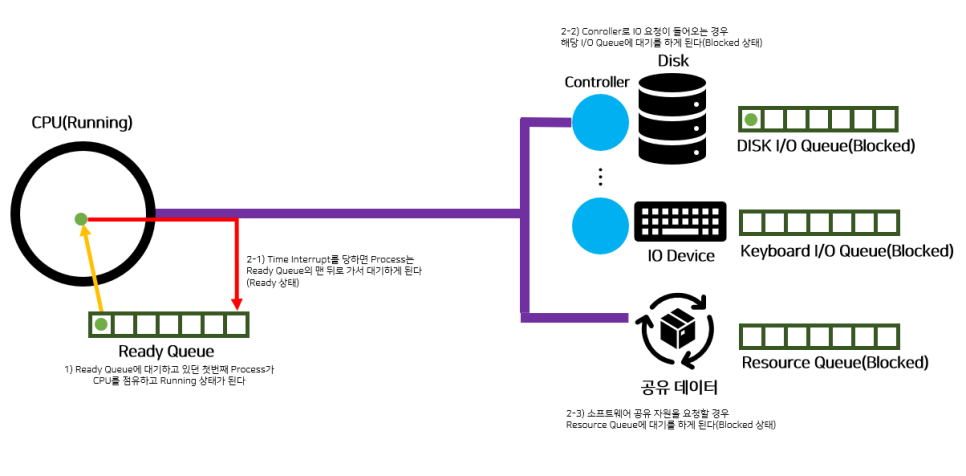
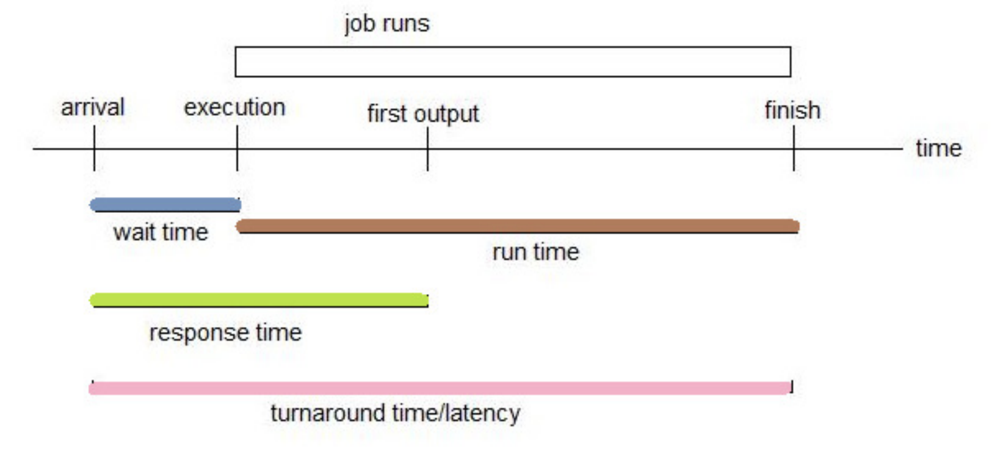
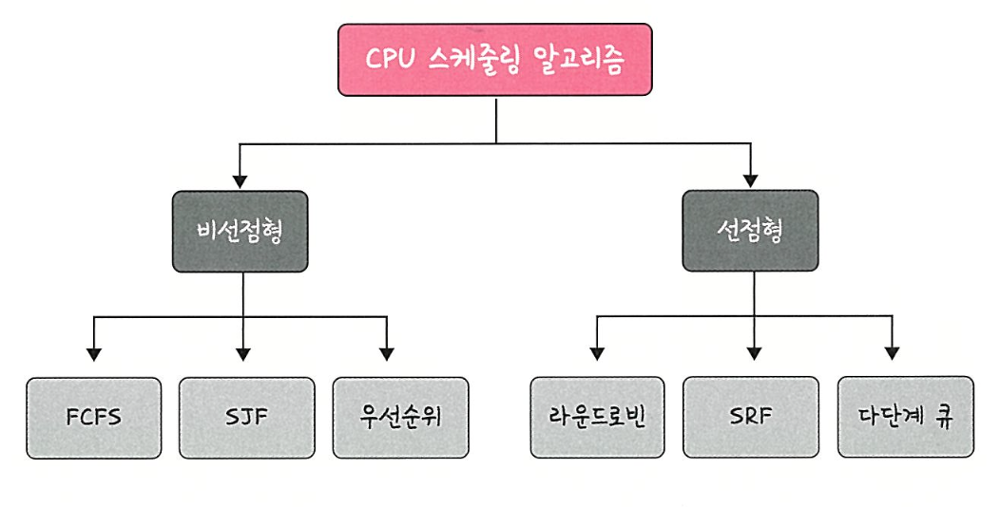

# CPU Scheduling Intro

 
 

# CPU 스케쥴링 개요

- CPU 스케쥴링은 왜 필요로 하는가?

- CPU burst : 프로그램이 CPU를 연속적으로 사용하는 시간
- I/O burst : 프로그램이 I/O 장치의 입출력이 이루어지는 시간

<aside>

하나의 프로세스의 일생에서는 CPU에서 기계어를 실행하는 작업(CPU burst)과 입출력 작업(I/O burst)을 반복하게 된다.

</aside>
 

## CPU-burst Time의 분포

- 평균적으로 Hyperexponential distribution (확률적 혼합된 분포) 형태를 띈다.
  (확률적 혼합된 분포 = 여러 개의 서로 다른 평균을 가진 지수 분포가 섞인)

- **CPU bound job**
  - 프로세스 진행 속도가 CPU 속도에 의해 제한됨을 의미함.
  - I/O 빈도가 낮고, CPU를 오래 사용하는 작업(=프로세스) [계산 위주의 작업들]
  - few very long CPU bursts
- **IO bound job**
  - 프로세스 진행 속도가 I/O 하위 시스템의 속도에 의해 제한됨을 의미함.
  - I/O 빈도가 높고, CPU를 적게 사용하는 작업(= 프로세스) [Interactive한 작업들]
  - many short CPU bursts

<aside>

- 이렇듯 여러 종류의 job(=process)이 섞여 있기 때문에 CPU 스케쥴링이 필요하다.
  - Interactive job에게 적절한 Response 제공 요망
  - CPU와 I/O 장치 등 시스템 자원을 골고루 효율적으로 사용

→ I/O Bound Job에 CPU를 우선적으로 할당 → 사용자와의 Interaction을 높임

</aside>
 
 

# CPU Scheduler & Dispatcher

- CPU Scheduler
  - Ready 상태의 프로세스 중에서 이번에 CPU를 줄 프로세스를 고른다.
  - 종류
    **장기 스케줄러 (Long-term Scheduler)**
    - 어떤 프로세스가 시스템의 자원을 차지할 것인가를 결정해 준비(Ready) 상태 큐로 보내는 작업
    - 수행 빈도가 적고 느림
      **중기 스케쥴러 (Mid-term Scheduler)**
    - 어떤 프로세스들이 CPU를 할당 받을 것인지 결정하는 작업
    - CPU를 할당받으려는 프로세스가 많을 경우, 프로세스를 일시 대기(Waiting)시킨 후 활성화해서 부하를 조절
    - 메모리 부족 시 swap out, 메모리가 남으면 swap in 결정
      단기 스케쥴러 (Short-term Scheduler)
    - 프로세스가 실행되기 위해 CPU를 할당받는 시기와 특정 프로세스를 지정하는 작업
    - 자주 수행되고 빠름
- Dispatcher
  - CPU의 제어권을 CPU scheduler에 의해 선택된 프로세스에게 넘긴다.
  - 이 과정을 context switch(문맥 교환)라고 한다.

 

- CPU 스케줄링이 필요한 경우는 프로세스에게 다음과 같은 상태 변화가 있는 경우

  1. Running > Blocked (예: I/O 요청하는 시스템 콜)
  2. Running > Ready (예: 할당시간만료로 timer interrupt)
  3. Blocked > Ready (예: I/O 완료후 인터럽트)
  4. Terminate

- 1, 4에서의 스케줄링은 **nonpreemptive ( = 강제로 빼앗지 않고 자진 반납 )**
- All other scheduling is **preemptive ( = 강제로 빼앗음 )**

 
 

# Scheduling Criteria

- **Performance Index ( = Performance Measure, 성능 척도 )**

### CPU utilization (이용률)

- **keep the CPU as busy as possible**
  - 전체 시간 중 CPU가 실제로 사용된 시간의 비율
  - 운영체제 입장에서 중요한 기준
  - (이용률이 높을수록 좋음)

### Throughput (처리량)

- **of processes that complete their execution per time unit**
  - 주어진 시간 내에 처리된 프로세스 또는 쓰레드의 수
  - CPU의 효율성을 측정하는 데 사용
  - (단위 시간 당 처리량이 높을수록 좋음)

### Turnaround time (소요시간, 반환시간)

- **mount of time to execute a particular process**
  - 프로세스 또는 쓰레드가 시스템에 도착한 후, 모든 작업이 완료되기까지 걸린 시간
  - 배치 처리 시스템에서 중요한 평가 기준
  - (시간은 모두 짧을수록 좋음)

### Waiting time (대기 시간)

- **amount of time a process has been waiting in the ready queue**
  - 쓰레드가 실행 준비 상태에서 대기하는 시간
  - CPU 사용 시점에서부터 모든 대기 시간의 합
  - 스케줄링 알고리즘이 효율적인지 판단하는 중요한 지표
  - (시간은 모두 짧을수록 좋음)

### Response time (응답 시간)

- **amount of time it takes from when a request was submitted until the first response is produced, not output (for time-sharing environment)**
  - 대화형 시스템에서 사용자의 명령 입력 후, 시스템이 응답하기까지 걸리는 시간
  - CPU 사용 시점에서 최초의 응답까지 소요된 시간
  - 사용자 경험에 큰 영향을 미치는 중요한 기준
  - (시간은 모두 짧을수록 좋음)

 
 

# CPU 스케쥴링 알고리즘

### 선점형 스케줄링

- 하나의 프로세스가 CPU를 차지하고 있을 때, 우선순위가 높은 다른 프로세스가 현재 프로세스를 중단시키고 CPU를 점유하는 스케줄링 방식
- 비교적 응답이 빠르다는 장점이 있지만, 처리 시간을 예측하기 힘들고 높은 우선순위 프로세스들이 계속 들어오는 경우 오버헤드를 초래
- 실시간 응답환경, Deadline 응답환경 등 우선순위가 높은 프로세스를 빠르게 처리해야 할 경우 등에 유용

### 비선점형 스케줄링

- 한 프로세스가 CPU를 할당받으면 작업 종료 후 CPU 반환 시까지 다른 프로세스는 PCU 점유가 불가능한 스케줄링 방식
- 모든 프로세스에 대한 요구를 공정하게 처리할 수 있지만, 짧은 작업을 수행하는 프로세스가 긴 작업 종료 시까지 대기해야할 수도 있다. (콘베이 현상)
- 처리시간 편차가 적은 특정 프로세스 환경에 용이
