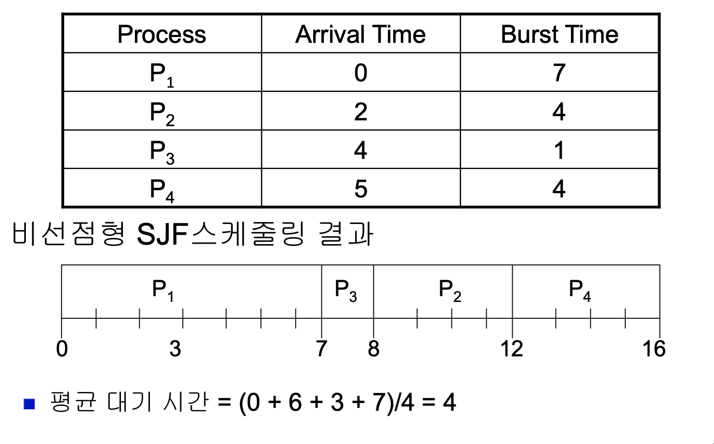
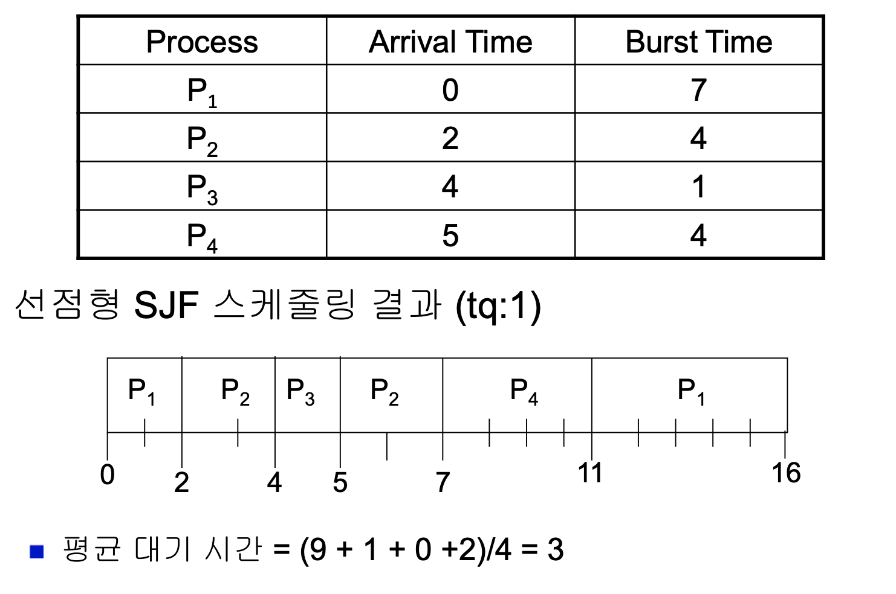
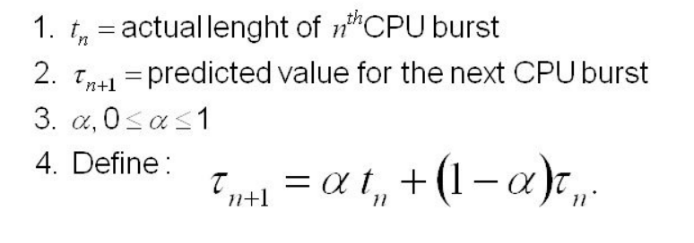
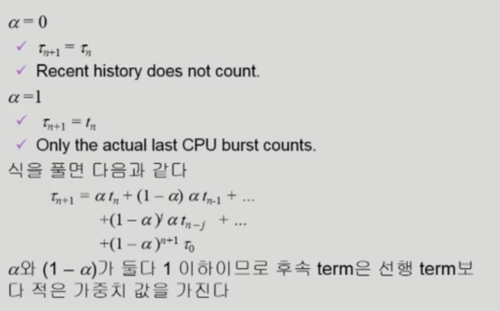

# SJF(Shortest-Job-First) Scheduling

 

# 최단 작업 우선 스케쥴링

- 각 프로세스에 다음 CPU burst 길이를 연관시킴
- CPU가 available 해지면, 다음 CPU burst 시간이 가장 짧은 프로세스에 CPU를 먼저 할당함
- **SJF is optimal( preemptive )** - 주어진 프로세스들에 대해 minimum average waiting time(최소의 평균 대기 시간)을 제공함
   
   

## 비선점형 방식 ( **Non-preemptive )**

---

- CPU를 사용 시, 해당 CPU burst가 완료될 때까지 CPU를 선점 당하지 않음
- 자발적 양보 시점에 다음 프로세스를 선택하여 수행함
   
   

## 선점형 방식 ( Preemptive )

---

- 타임퀀텀마다 CPU burst 시간이 가장 짧은 프로세스를 선택함
- 최소 잔여 시간 우선(Shortest remaining time first) 스케줄링이라고도 불림

<aside>

- **비현실적임.** CPU burst 시간을 미리 알 수 없음
  - 한 프로세스가 실행 중에는 많은 변수가 존재하기 때문에 CPU 점유 시간을 알려면 실제로 수행하여 측정하는 수 밖에 없다.
  - 실제 측정한 시간으로 예측해서 SJF를 사용할 수도 있지만, 이는 오버헤드가 매우 큰 작업으로 잘 사용되지 않는다.
- approximation : Shortest Remaining Time First Scheduling (SRTF) (근사치 SRTF)
- Starvation( 기아 상태 ) : long CPU burst job은 수행되기까지 오래 걸릴 수 있다.
</aside>
 

### 다음 CPU Burst Time의 예측

- 추정(estimate)만이 가능함
- 과거의 CPU burst time을 이용해서 추정 (exponential averaging)

1. tn - 실제 n 번째 cpu 사용 시간
2. n + 1번째 cpu 사용 예측 시간
3. n+1번째 cpu 사용 예측 시간 = n번쩨 실제 cpu 사용시간과 n번째 예측했던 cpu 사용 시간을 일정 비율씩 곱해서 더한 것

 

- 최근의 과거 가중치가 올라가고 예전 과거는 가중치를 적게 반영하는 것
- 만약 a(알파)가 0이라면 recent history doesn't count, 1이라면 only the actual last cpu burst counts.
