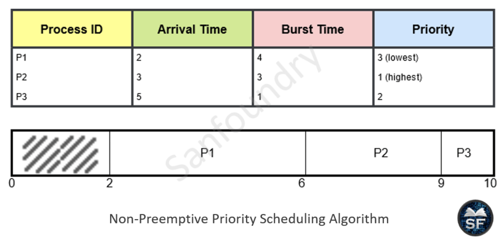
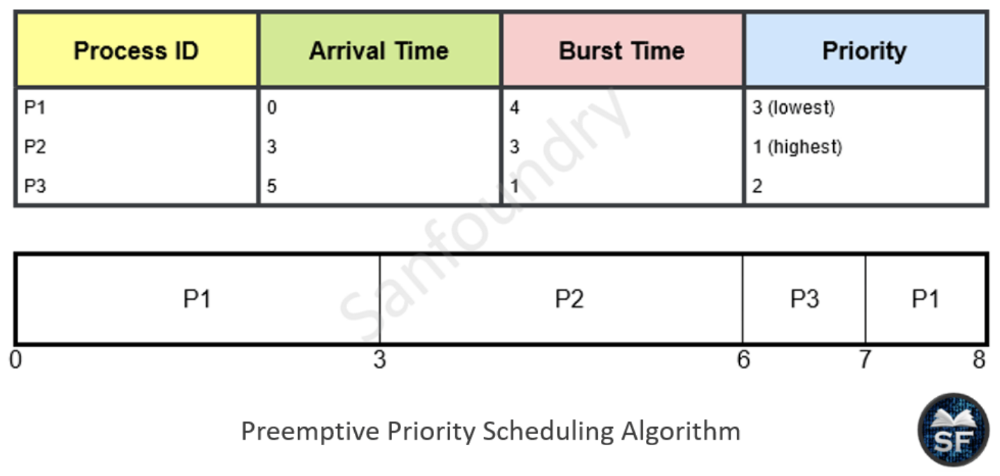

# Priority Scheduling

# 우선순위 스케쥴링

---

- CPU는 가장 높은 우선순위를 가진 프로세스에게 할당한다.
  - 우선순위는 내부적인 요인과 외부적인 요인으로 결정된다.
    - 내부적으로는 시간제한, 메모리 요구 비율 등
    - 외부적으로 프로세스의 중요성, 비용 등
- 우선순위가 같은 프로세스들은 다른 스케쥴링 알고리즘 사용한다. (FCFS 순서로 스케줄)
- 선점형이거나, 비선점형일 수 있다.
- SJF 알고리즘은 일반적인 우선순위 스케줄링 알고리즘의 특별한 경우이다.

## 비선점형 방식 ( **Non-preemptive )**

## 선점형 방식 ( P**reemptive )**

- 새로 도착한 프로세스의 우선순위가 현재 실행 중인 프로세스의 우선순위보다 높다면, CPU를 선점한다.

## Starvation(기아) 문제

- 낮은 우선순위 프로세스들이 CPU의 점유를 오랫동안 하지 못하는 현상
- 실제 컴퓨터 환경에서는 새로운 프로세스가 자주 ready queue에 들어온다.
  - 이러한 프로세스가 모두 우선순위가 높은 상태라면 이미 기다리고 있던 우선순위가 낮은 프로세스는 하염없이 기다리고만 있는 상태로 남아있을 수 있다.

### Aging (노화)

- Starvation(기아) 문제 해결 방법 중 하나
- 특정 프로세스가 지나치게 차별받는 것을 막기 위한 방식
- 오랫동안 시스템에서 대기하는 프로세스들의 우선순위를 점진적으로 높인다.
  - 아무리 낮은 우선순위를 가지고 있더라도 시간이 지나면 우선순위가 높아질 것
