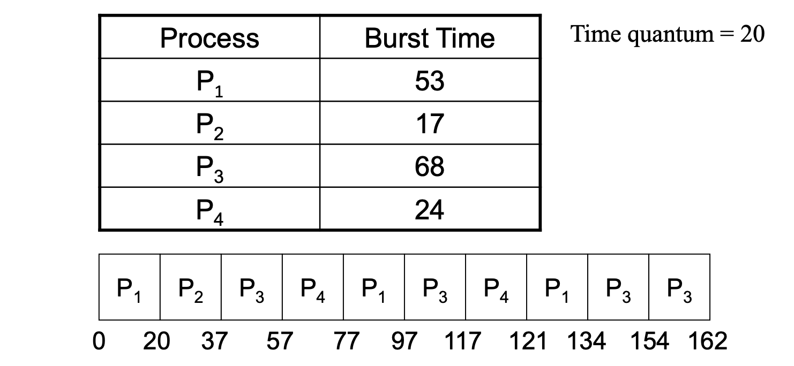
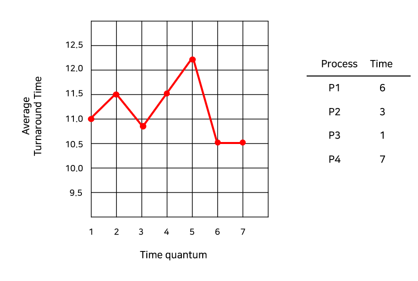

# RR(Round-Robin) Scheduling

 
 

# **라운드 로빈 스케쥴링**

- time-sharing system을 위해 설계
  - 시간 퀀텀(Time Quantum), 시간 조각(Time Slice)라고 하는 작은 단위의 시간을 정의하여 사용
  - 보통 time quantum은 10 – 100 ms
- 선점형 스케줄링 방식
- CPU를 시간 단위(time quantum)로 할당
- 현실에 가장 가까운 스케쥴링 방식

**동작**

- ready queue는 circular queue로 동작하며, CPU 스케줄러는 ready queue를 돌면서 한 번에 한 프로세스에게 한 번의 시간 조각(Time slice) 동안 CPU를 할당
- Time quantum을 수행을 한 프로세스는 Ready 큐의 끝으로 들어가 다시 할당을 기다림

 
 

## 선점형 스케쥴링 방식 ( Preemptive )

- Ready 큐 내의 프로세스 n개, Time quantum q
- 각각의 프로세스가 할당 받는 시간
  - 1/n 만큼의 CPU 시간을 q로 쪼개어 할당 받음.
- 각 프로세스의 다음 time quantum이 돌아오기까지의 대기시간
  - 최대 (n-1) x q [어떤 프로세스도 이 이상 기다리지 않는다.]

<aside>

- response time 이 짧다는 장점이 있다.
  - interactive 프로세스에 필요함
    - Long-Time-Job과 Short-Time-Job이 섞여 있을 경우 효과가 크다.
  - 일반적으로 SJF보다 average turnaround time/waiting time은 길지만, response time은 더 짧다.
- 성능이 Time Slice의 크기에 매우 많은 영향을 받는다.
  - Time Slice이 매우 클 때의 Round Robin 방식은 FCFS와 같아지게 된다.
  - Time Slice이 매우 작을 때의 Round Robin 방식은 매우 많은 Context Switch를 발생시킨다.
- 보통 Time slice의 크기가 Context Switch 시간에 비해 더 커야 한다. - 하지만 Time Slice의 크기가 너무 크게 되면 FCFS 방식이 되므로, CPU burst의 80%는 시간 할당량보다 짧아야 한다.
</aside>

 
 

## 할당 시간에 따른 평균 소요 시간 그래프

- 평균 소요 시간은 할당 시간이 커진다고 해서 반드시 증가하는 것은 아니다.
- 할당 시간 q가 클수록 FCFS의 방식과 유사하고, q가 작을수록 Context switch의 오버헤드가 커지기 때문에 적절한 할당 시간을 배정하는 것이 중요하다.
