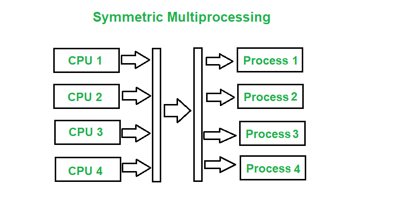
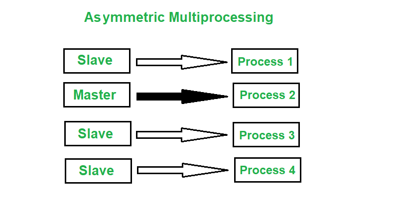
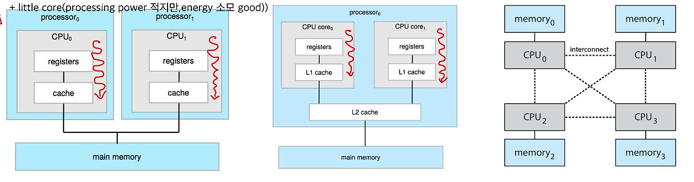
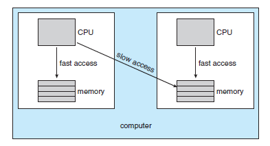

# Multiple-Processor Scheduling

 
 

# 다중 처리기 스케쥴링

- 특수한 경우의 프로세스 스케쥴링
  - CPU가 여러개인 환경 ( 하나의 컴퓨터에 여러개의 프로세서가 있는 경우 )
- CPU가 여러 개인 경우 스케출링은 더욱 복잡해짐
- **Homogeneous processorel 경우**
  - Queue에 한줄로 세워서 각 프로세서가 알아서 꺼내가게 할 수 있다.
  - 반드시 특정 프로세서에서 수행되어야 하는 (제약조건이 있는)프로세스가 있는 경우에 는 문제가 더 복잡해짐

 

## **Load sharing ( Load Balancing )**

- 일부 프로세서에 job이 몰리지 않도록 부하를 적절히 공유하는 메커니즘 필요
- 별개의 큐를 두는 방법 vs. 공동 큐를 사용하는 방법
- Load balancing의 push migration과 pull migration
  - push migration은 과부하인 processor에서 쉬고 있는 processor로 process를 이동시킨다.
  - pull migration은 쉬고 있는 processor이 바쁜 processor로 process를 pull 할 때 일어난다.

 

## **Symmetric Multiprocessing ( 대칭 다중 처리기 , SMP )**

- 각 프로세서가 각자 알아서 스케줄링 결정

**장점**

1. **리소스 활용도 높음 :** 모든 프로세서가 동일한 권한으로 작업 분담 → 성능 향상.
2. **확장성 우수 :** 프로세서를 더 추가하여 자연스럽게 성능확장 가능.
3. **장애 허용성 높음 :** 하나의 프로세서가 고장 나도 나머지가 계속 동작 → 전체 시스템 멈추지 않음.

---

**단점**

1. **스케줄링 복잡 :** 여러 프로세서에 공정하고 효율적으로 일을 나누는 것이 어려움.
2. **리소스 경합 증가 :** 여러 프로세서가 같은 메모리/버스를 공유 → 충돌 및 병목 가능성.
3. **하드웨어 비용 증가 :** 모든 CPU가 메모리를 공유하기 위한 고성능 버스/캐시 코히런시 장치 필요.

 

## **Asymmetric multiprocessing ( 비대칭 다중 처리기 )**

- 하나의 프로세서가 시스템 데이터의 접근과 공유를 책임지고 나머지 프로세서는 거기에 따름

**장점**

1. **제어가 간단함 :** 한 개의 마스터 프로세서가 스케줄링과 제어를 담당 → 구조 단순
2. **리소스 충돌 감소 :** OS와 직접 통신하는 프로세서가 마스터 하나뿐 → 경합 감소
3. **특수 목적 프로세서 존재 가능 :** 특정 작업을 특정 보조 프로세서에 고정 → 특수 작업 성능 향상

단점

1. **단일 장애 지점(Single Point of Failure) :** 마스터 프로세서가 죽으면 전체 시스템 마비.
2. **확장성 낮음 :** 프로세서를 추가해도 마스터가 병목이 되어 성능 향상 제한.
3. **리소스 활용 비효율 :**마스터의 스케줄링 결정이 비효율적이면 보조 프로세서들이 놀 수 있음.

 

## 처리기 친화성(Processor Affinity)

---

- 대부분의 SMP 시스템은 한 processsor에서 다른 processor의 이주를 피하고, 같은 processor에서 프로세스를 실행하고자 한다.
- 이 현상을 처리기 친화성(Processor Affinity)라고 하며, 프로세스가 현재 실행 중인 processor에 친화성을 가진다는 것을 의미한다.

**연성 친화성 (soft affinity)**

- 운영체제가 동일한 processor에서 프로세스를 실행시키려고 노력하는 정책을 가지고 있지만 보장하지 않을 때,  **연성 친화성(soft affinity)**를 가진다고 한다. ( 이에 다른 processor로의 이주가 가능하다.)

**강성 친화성 (hard affinity)**

- 몇몇 시스템은 **강성 친화성(hard affinity)**를 지원하는 system call을 제공한다.
  - 이 system call을 사용하여 프로세스는 자신이 실행될 processor 집합을 명시할 수 있다.

- 좌측부터 Multiple CPUs, Multithreaded cores, NUMA(Non-Uniform Memory Access) systems

 

**Multiple CPUs**

- processor chip이 여러 개인 경우 -> mother board를 cpu 여러 개 설치 가능하도록 설계

 

**Multithreaded cores**

- 하나의 processor 안에 여러 개의 core

 

**NUMA(Non-uniform Memory Access) 특성을 가지는 구조**

- CPU0가 자신의 메모리에 접근하는 것과 CPU1의 메모리에 접근하는 것은 **속도 차이가 큼**.
- 자신의 local 메모리에 접근 → fast access / 다른 CPU 메모리에 접근 → slow access
- locality (지역성)의 중요성 증가

<aside>

이렇듯

- 시스템의 main memory의 구조가 processor affinity issue에 영향을 줄 수 있다.
- 운영체제는 가능한 경우 "soft affinity"를 통해 **동일 CPU 또는 동일 NUMA node 안에서만 스케줄링하려고 노력**한다.
- “hard affinity”는 특수한 목적을 가진 경우에만 사용하게 된다. - hard affinity를 채택하면 특정 코어만 바쁘고, 다른 코어는 놀게된다. - NUMA locality는 좋아져도, 전체 처리량(throughput)이 나빠짐
</aside>

 

**Heterogeneous multiprocessing**

- 일반적으로는 core의 성능이 모두 비슷 -> Heterogeneous에서는 core의 특성이 다 다름
- ex) big little -> big core(processing power good) + little core(energy 소모 good)
