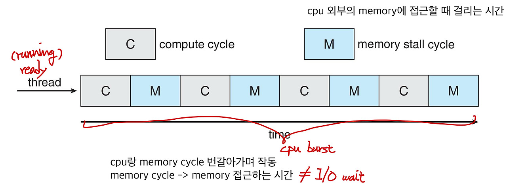
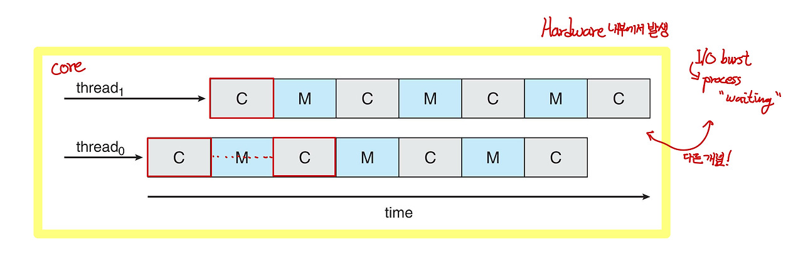
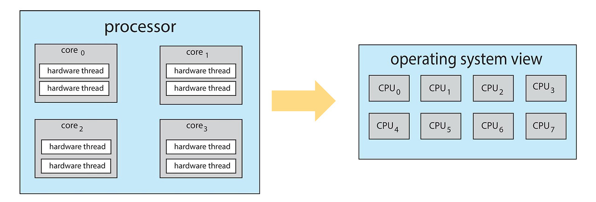
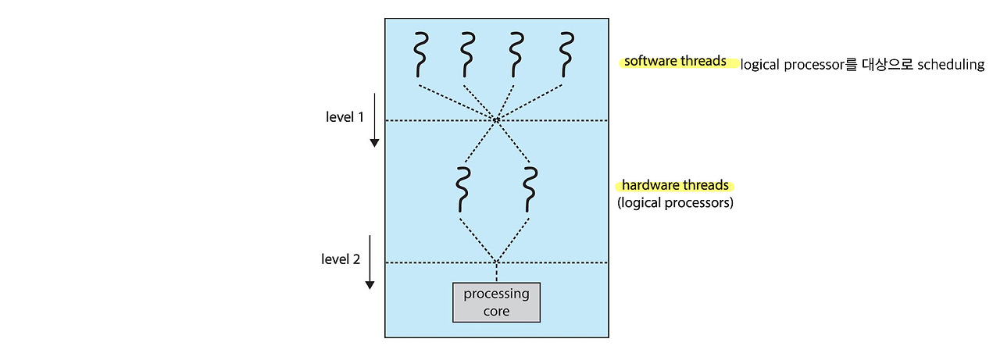

# Multicore Processor Scheduling

 
 

# 다중 코어 프로세서 스케쥴링

- 하나의 프로세서에 여러개의 코어가 있는 경우
  - **Multiple processor cores를 같은 physical chip 위에** 올리는 최근 트렌드
    -> 더 적은 power로 더 빠른 속도
  - 한 프로세서 내에 있는 코어들은 메모리를 공유함
  - Memory Stall : 메모리에서 데이터를 가져오는 동안 코어들이 잠시 동작을 멈추는 것
  - **Multiple (hardware) threads per core** 
    → **memory stall의 이점을 이용**
    -> memory stall 대기시간 동안 또다른 thread 진행
- 하나의 물리적인 chip 안에 여러 개의 processor core를 장착하는 구조를 multicore processor라고 함
- 이 방식을 사용하는 SMP 시스템은 기존 방식에 비해 속도가 빠르고 작은 전력을 소모함

 

### Multithreaded Multicore System

- 각 core가 1개보다 많은 threads 개수를 가짐
- 한 thread에서 memory stall 발생 -> another thread로 교체

 

- **Chip-multithreading(CMT)**: 각 core에 multiple hardware threads를 할당
  - intel의 **hyperthreading**
  - quad-core system: **core 당 2개의 hardware threads** > os는 **8개의 logical processors**로 인식

- Two levels of scheduling
  1. operating system은 logical CPU 위에서 어떤 software thread가 작동할지 결정
  2. 각 core가 어떤 hardware thread가 physical core 위에서 작동할지 결정

 

**Software Threads**

- single process 내부에서 concurrent하게 execution하는 programming contstruct
- os 혹은 runtime library에 의해 관리됨
- 같은 parent process의 memory space 공유

 

**Hardware Threads**

- hardware-supported multi-threading / Hyper-threading에서 언급되는 개념
- single CPU core 위에서 multiple threads가 **simutaneous**하게 execution하도록 함
- 각 core는 multiple hardware threads를 관리

 
 

**Software Threads vs Hardware Threads**

 

**Level of Operation**

- software threads: os 혹은 application level에서 존재하고, thread scheduler에 의해 관리됨
- hardware threads: cpu level에서 존재하고, single core 내에서 parallel execution 제공

**Resource Sharing**

- software threads: process의 같은 memory space를 공유(synchronization mechanism)
- headware threads: CPU resources의 특정 부분을 공유, core 내부에서 parallel execution의 이점을 가짐

**Performance Impact**

- software threads: 사용 가능한 cpu cores 개수와 hardware threads의 개수에 따라 성능 향상 어느정도 제약
- hardware threads: CPU performance와 직결됨
