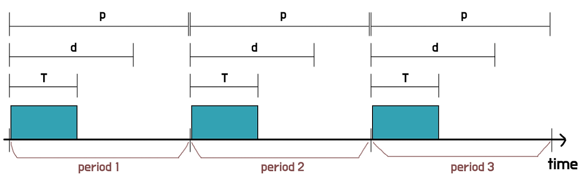
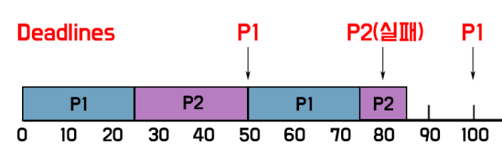
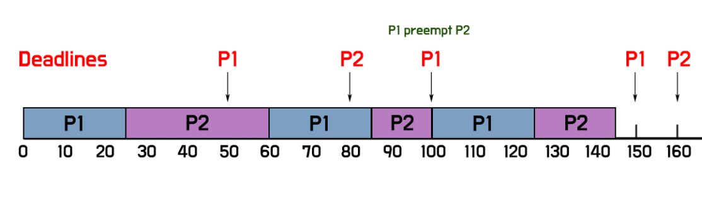

# Real-Time Scheduling

 
 

# **실시간 CPU 스케줄링**

- real-time task : 어떠한 마감기한(DeadLine)이 존재하고, 실시간으로 발생하는 event를 기다리고 이를 주어진 시간안에 처리해야한다.

 

## Soft real-time computing

- real-time task와 Non-real-time task들이 혼재되어 있는 상황에서, 시스템이 real-time task를 우선 처리 하지만, 무조건 deadline에 맞춰서 끝내준다는 보장이 없는 시스템 ( ex. os의 동영상 재생 )
- Soft real-time task는 일반 프로세스에 비해 높은 priority를 갖도록 해야 함
- 중요 프로세스가 그렇지 않은 프로세스들에 비해 우선권을 가진다는 것만 보장

 

## Hard real-time systems

- task들을 무조건 deadline에 맞춰서 끝내주는 시스템이다.
- deadline을 못맞추는것은 너무 치명적이어서, 못 맞출 경우 차라리 스케쥴을 안해주는게 더 나을 정도의 시스템 ( ex. 자율주행 자동차, 무기체계 )
- Hard real-time task는 정해진 시간 안에 반드시 끝내도록 스케줄링해야 함

**Real-Time System에서의 단위**

- 특정 프로세스가 주기를 가지고 반복적으로 들어온다고 가정하였을 때
  - 주기를 p, deadline을 d, 프로세싱되는 시간을 T
  - (0 <= T <= d <= p)가 성립한다.
- 이 때, **rate of the periodic process = 1/P**

 

### 1) RMS ( Rate Monotonic Scheduling )

- 각 프로세스 중 rate가 가장 높은 프로세스부터 스케줄링을 하는 기법 (필요시 preemptive 한다.)
  - rate를 가지고 static priority를 적용
- 프로세스가 들어온 순간마다 priority를 판단하는 것이 아니라, 처음부터 rate를 사용하여 priority를 정해주고, 해당 priority대로 스케쥴링 해주는 것
- RMS는 (rate가 가장높은 프로세스) = (주기(P)가 가장 짧은 프로세스)를 먼저 스케줄링하는 기법
- CPU Utilization = ∑ (Process time / period)
- 수학적 증명
  - **N개의 Process로 N(2^(1/N) - 1) 이상의 CPU utilization이면, RMS로는 스케줄링이 불가능하다.**

 

_예1) 성공 : P1은 주기가 50초, 20초동안 processing. / P2는 주기가 100초, 35초동안 processing_

**동작**

    P1, P2 arrived at 0

    → P1이 우선순위가 높음(=rate가 높음)으로 P1 먼저 스케쥴링

    → P1 End → P2 스케쥴링

    → P1 arrived at 50, P1이 우선순위가 높음(=rate가 높음)으로 P1이 preemption해서 스케쥴링

    → P1 End → 나머지 P2 스케쥴링

 

_예2) 실패 : P1은 50초 주기, 25초동안 processing. / P2는 80초 주기, 35초 동안 processing_

**동작**

    P1, P2 arrived at 0

    → P1이 우선순위가 높음(=rate가 높음)으로 P1 먼저 스케쥴링

    → P1 End → P2 스케쥴링

    → P1 arrived at 50, P1이 우선순위가 높음(=rate가 높음)으로 P1이 preemption해서 스케쥴링

    → P1 End → 나머지 P2 스케쥴링

    → P2의 다음 Period(주기)가 도달 → 이전 P2는 deadline을 맞추는데 실패

 

### 2) EDF ( Earliest Deadline First )

- Deadline이 가까워져 올 때, 가장 급한 프로세스 먼저 스케쥴링 해주는 기법
  - 남은 deadline을 가지고 dynamic priority를 적용
- 이론적으로 CPU Utilization을 100% 까지 끌어올릴 수 있는 효율적인 스케줄링 방식
  - 만약 EDF를 썼는데도 deadline을 못맞췄다는 것 = CPU Utilization을 풀로 썼는데도 못맞췄다는 뜻
- RMS처럼 static하게 priority를 주는 것이 아니라, task들이 들어오는 순간마다 deadline을 비교해보고, priority를 정하는 방식
- priority를 판단할 때 오직 deadline만을 이용하므로, CPU burst time을 모르는 경우에 유용하게 사용 가능

 

_예) P1은 주기가 50, processing이 25. / P2는 주기가 80, processing이 35_

**동작**

    P1, P2 arrived at 0

    → P1이 우선순위가 높음(=deadline이 더 급함)으로 P1 먼저 스케쥴링

    → P2가 스케쥴링 중인 50, P1 arrived [P2(30)이 P1(50)보다 deadline이 급함] ⇒ P2 스케쥴링 유지

    → P1이 스케쥴링 중인 80, P2 arrived [P1(20)이 P2(80)보다 deadline이 급함] ⇒ P1 스케쥴링 유지

    → P2가 스케쥴링 중인 100, P1 arrived [P1(50)이 P2(60)보다 deadline이 급함] ⇒ P1이 preemption
