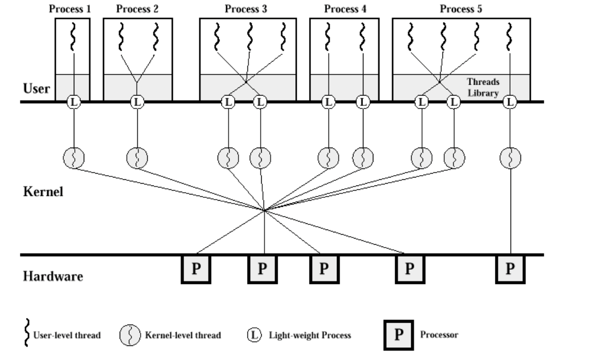

# Thread Scheduling

 
 

# 쓰레드 스케쥴링

- 운영체제가 프로세스를 스케쥴링하는 것처럼, 프로세스가 Thread를 스케쥴링 함
- 일부는 운영체제가 프로세스와 동일하게 직접 Thread를 스케쥴링 함
- Contention Scope( 경쟁 범위 )
  - PCS ( Process-Contention Scope, 프로세스 경쟁 범위 )
    - 동일한 프로세스에 속한 thread들 사이에서 CPU를 경쟁
  - SCS ( System-Contention Scope, 시스템 경쟁 범위 )
    - CPU 상에서 어느 kernel thread를 스케쥴 할 것인지를 결정하기 위해서 kenerl에 사용

 

## Local Scheduling

- User level thread에서 사용
- 사용자 수준의 thread library에 의해 어떤 thread를 스케줄할지 결정
- 사용자 프로세스가 직접 thread를 관리함
  - 운영체제는 thread의 존재를 모르는 경우
  - 운영체제가 프로세스를 Scheduling 하고, 어떤 쓰레드에게 CPU를 줄지는 해당 프로세스 내부에서 결정

 

## Global Scheduling

- Kernel level thread에서 사용
- 일반 프로세스와 마찬 가지로 커널의 단기 스케줄러가 어떤 thread를 스케줄할지 결정
  - Kernel level thread는 운영체제가 쓰레드의 존재를 인지함
    - 운영체제가 CPU Scheduling을 할 때, 직접 쓰레드를 스케줄 함
