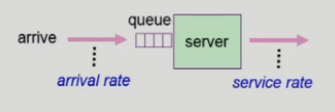

# Algorithm Evaluation

 
 

# 알고리즘 평가 방법

- 어떤 알고리즘이 좋은가를 평가하는 방법

### Queueing models

- 이론적 방식
- 확률 분포로 주어지는 arrival rate(도착율)와 service rate(처리율) 등을 통해 각종 performance index 값을 계산
- 결정론적 모델을 사용할 수 있는 정적인 집합이 존재하는 경우가 드물기 때문에, 결정할 수 있는 CPU와 입출력의 분포를 사용하는 방법

 

### Implementation (구현) & Measurement (성능 측정)

- 실제 시스템에 알고리즘을 구현하여 실제 작업(workload)에대해서 성능을 측정 비교
- 스케줄링 알고리즘을 완벽히 정확하게 평가하는 유일한 방법 = 실제 코드로 작성해 운영체제에 넣고 실행해 보는 것

 

### Simulation (모의 실험)

- 알고리즘을 모의 프로그램으로 작성후 trace를 입력으로 하여 결과 비교
- implementation & measurement가 어려울 때 해볼 수 있는 방식
- 컴퓨터 시스템의 모델을 프로그래밍 하는 것을 포함
- trace : simulation에 들어가는 input data (test case 같은 느낌)
