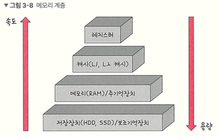

# 운영체제 메모리 관리

## 1. 메모리 계층 구조

메모리 계층은 레지스터, 캐시, 메모리, 저장장치로 구성된다.



- **레지스터**: CPU 안에 있는 작은 메모리, 휘발성, 속도 가장 빠름, 용량이 가장 적음
- **캐시**: L1, L2, L3 캐시를 지칭, 휘발성, 속도 빠름, 용량 적음
- **주기억장치(RAM)**: 프로그램 실행 시 데이터가 올라가는 공간
- **보조기억장치(HDD/SSD)**: 영구 저장 공간

## 2. 메모리 주소의 종류

### 2.1 논리적 주소 (Logical Address = Virtual Address)

- 프로세스마다 독립적으로 가지는 주소 공간
- 각 프로세스마다 0번지부터 시작
- **CPU가 보는 주소는 논리적 주소다**

### 2.2 물리적 주소 (Physical Address)

- 메모리에 실제로 올라가는 위치


### 2.3 주소 바인딩 (Address Binding)

물리적 주소를 결정하는 것을 주소 바인딩이라고 하며 운영체제가 아닌 하드웨어가 수행한다.

**변환 과정:**
```
Symbolic Address → Logical Address → Physical Address
```

- **Symbolic Address**: 프로그래밍할 때 사용하는 변수 이름


### 2.4 주소 바인딩 시점


#### 1) Compile Time Binding

- 물리적 메모리 주소가 컴파일 시 결정됨
- 시작 위치 변경 시 재컴파일 필요
- **절대 코드(Absolute Code)** 생성: 주소 변환이 필요 없는 코드
- 프로그램을 메모리에 올릴 때 논리적 주소가 곧 물리적 주소가 됨

**단점:**
- 매우 비효율적
- 여러 프로그램이 멀티태스킹되는 현대 운영체제에는 부적합
- 컴퓨터에 프로그램 하나만 돌아가는 환경에만 적합

#### 2) Load Time Binding

- Loader의 책임하에 물리적 메모리 주소 부여
- **재배치 가능 코드(Relocatable Code)** 생성: 물리적 메모리 위치가 바뀔 수 있는 코드
- 프로그램이 실행되는 시점에 물리적 주소가 정해지고 **실행 중에는 바뀌지 않음**

#### 3) Execution Time Binding (Run Time Binding)

- 수행이 시작된 이후에도 프로세스의 메모리 상 위치를 옮길 수 있음
- **CPU가 주소를 참조할 때마다 바인딩을 점검**해야 함 (실행 중 물리적 위치가 변할 수 있기 때문)
- 하드웨어 지원 필요 (MMU, base and limit registers)

**Load Time Binding vs Execution Time Binding:**

- **Load Time Binding**: 프로그램 시작 시 물리적 주소가 결정되고 종료까지 변하지 않음
- **Execution Time Binding**: 프로그램 실행 중에도 물리적 주소가 바뀔 수 있음

### :small_orange_diamond: CPU가 논리적 주소를 보는 이유

CPU는 하드웨어인데 물리적 주소가 아닌 논리적 주소를 보는 이유

CPU는 기계어를 실행하는데, 기계어에 있는 메모리 주소들이 논리적 주소이기 때문이다.  

**예시:**
- 명령어: `Jump 40`
- `40`은 논리적 주소
- 실제 실행 시 물리적 주소 `530`으로 변환됨

CPU가 논리적 주소를 보기 때문에 메모리 접근을 할 때마다 주소 변환을 해야 한다.

## 3. MMU (Memory-Management Unit)

### 3.1 MMU란?

논리적 주소를 물리적 주소로 매핑해주는 **하드웨어 장치**

### 3.2 MMU 동작 방식

사용자 프로세스가 CPU에서 수행되며 생성하는 모든 주소값에 대해 base register(=relocation register)의 값을 더한다.  
-> 논리적 주소 + base register의 값(물리적 메모리 시작 위치) = 물리적 주소

### 3.3 동적 재배치 (Dynamic Relocation)


**필요한 레지스터:**

- **Relocation Register (Base Register)**: 프로그램의 물리적 메모리 시작 위치
- **Limit Register**: 프로그램의 크기 (논리적 주소의 범위)
  - 다른 프로그램의 메모리를 접근하려는 악의적 시도를 막기 위함
  - CPU가 요청한 논리적 주소가 limit register보다 크면 차단

**주소 변환 과정:**

1. Virtual Memory: 프로그램의 논리적 메모리
2. 프로그램의 0번지가 물리적 메모리의 14000번지부터 올라가 있음
3. CPU가 346번지(논리적 주소) 요청
4. MMU는 논리적 주소가 limit register보다 작은지 체크
5. 범위를 벗어나면 trap 발생 → CPU가 운영체제에게 넘어감
6. 정상 범위이면 base register 값 + 논리적 주소로 주소 변환 : 346번지의 물리적 주소는 14346 (14000 + 346)
7. 변환된 물리적 주소로 메모리 접근

## 4. 메모리 관리 기법

### 4.1 Dynamic Loading

- 프로세스 전체를 메모리에 미리 올리지 않고 **해당 루틴이 호출될 때 메모리에 load**
- 메모리 사용률 향상
  - 프로그램의 모든 코드가 사용되는 것은 아님
  - 예외 상황 처리 코드는 일반적으로 사용되지 않음
  - 당장 필요한 부분만 메모리에 올리면 메모리 낭비가 줄어듬
- 가끔 사용되는 많은 양의 코드에 유용 (예: 오류 처리 루틴)
- 운영체제의 특별한 지원 없이 프로그램 자체에서 구현 가능

### 4.2 Overlays

- 메모리에 프로세스의 일부 중 실제 필요한 정보만 올림
- 프로세스 크기가 메모리보다 클 때 유용
- 운영체제 지원 없이 **사용자가 수작업으로 구현**
- 작은 공간의 메모리를 사용하던 초창기 시스템에서 사용

**Dynamic Loading vs Overlays:**
- 의미는 같지만 Overlays는 프로그래머가 수작업으로 구현

### 4.3 Swapping


- **Swapping**: 프로세스를 일시적으로 메모리에서 backing store로 쫓아내는 것
- **Backing Store (Swap Area)**: 디스크의 일부, 많은 프로세스 이미지를 담을 만큼 충분히 빠르고 큰 저장 공간
- **Swap in / Swap out**: 중기 스케줄러(swapper)가 swap out할 프로세스 선정
- Swap time은 대부분 transfer time (swap되는 양에 비례)

**바인딩 방식에 따른 제약:**

- **Compile Time / Load Time Binding**: 원래 메모리 위치로 swap in 해야 함
  - 예: 500-530번지에 있던 프로그램은 다시 500-530번지로만 올릴 수 있음
  - 비효율적
- **Execution Time Binding**: 빈 메모리 영역 아무 곳에나 올릴 수 있음
  - 예: 300번지에 있던 프로그램을 700번지에 올릴 수 있음
  - Swapping이 효율적으로 동작

### 4.4 Dynamic Linking

**Linking:** 내가 만든 프로그램과 라이브러리를 연결하는 작업

#### 1. Static Linking (Static Library)

- 라이브러리가 프로그램의 실행 파일 코드에 포함됨
- 실행 파일 크기가 커짐
- 동일한 라이브러리를 각 프로세스가 메모리에 올리므로 메모리 낭비
  - 예: printf 함수를 사용하는 프로그램 3개 → printf 라이브러리가 3번 메모리에 올라감

#### 2. Dynamic Linking (Shared Library)  

- 라이브러리가 **실행 시 연결(link)**됨
- 라이브러리가 실행 파일에 존재하지 않고 라이브러리의 위치 정보만 내 파일에 존재
- Stub : 라이브러리의 위치를 찾기 위한 코드
- 라이브러리가 이미 메모리에 있으면 그 루틴의 주소로 가고, 없으면 디스크에서 읽어옴
- 운영체제의 도움 필요
  
Static Linking을 하는 라이브러리 : Static Library  
Dynamic Linking을 하는 라이브러리 : Shared Library    

**Shared Library:**
- 리눅스: `.so` (shared object)
- 윈도우: `.dll` (dynamic linking library)

**장점:**
- 여러 프로그램이 하나의 라이브러리를 공유하여 메모리 절약
- 예: printf를 사용하는 프로그램 3개 → printf 라이브러리가 1번만 메모리에 올라감
