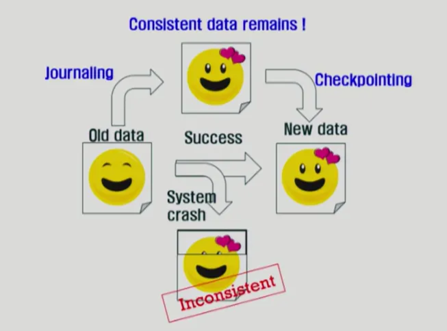

# 입출력 시스템

# 디스크 스케줄링

- FCFS (First Come First Served)
  
- SSTF(Shortest Seek Time First)
  
- SCAN
  
- C-SCAN
  
- N-SCAN
  - SCAN의 변형 알고리즘
  - 일단 arm이 한 방향으로 움직이기 시작하면 그 시점 이후에 도착한 job은 되돌아올 때 service
- LOCK과 C-CLOCK
  - SCAN이나 C-SCAN은 헤드가 디스크 끝에서 끝으로 이동
  - LOCK과 C-LOCK은 헤드가 진행 중이다가 그 방향에 더 이상 기다리는 요청이 없으면 헤드의 이동방향을 즉시 반대로 이동한다.
  

## 디스크 스케줄링 알고리즘의 결정

- SCAN, C-SCAN 및 그 응용 알고리즘은 LOCK, C-LOCK 등이 일반적으로 디스크 입출력이 많은 시스템에서 효율적인 것으로 알려져있음
- File의 할당 방법에 따라 디스크 요청이 영향을 받음
- 디스크 스케줄링 알고리즘은 필요할 경우 다른 알고리즘으로 쉽게 교체할 수 있도록 OS와 별도의 모듈로 작성되는 것이 바람직하다.

# Swap-Space Management

- Disk를 사용하는 두 가지 이유
  - memory의 volatile한 특성 → file system
  - 프로그램 실행을 위한 memory 공간 부족 → swap space(swap area)
- Swap-space
  - Virtual memory system에서는 디스크를 memory의 연장 공간으로 사용
  - 파일 시스템 내부에 둘 수도 있으나 별도 partition 사용이 일반적
    - 공간 효율성보다는 속도 효율성이 우선
    - 일반 파일보다 훨씬 짧은 시간만 존재하고 자주 참조됨
    - 따라서 block의 크기 및 저장 방식이 일반 파일 시스템과 다름

# RAID

⇒ Redundant Array of Independent Disks (여러 개의 디스크를 묶어서 사용)

- RAID의 사용 목적
  - 디스크 처리 속도 향상
    - 여러 디스크에 block의 내용을 분산 저장
    - 병렬적으로 읽어옴
  - 신뢰성 향상
    - 동일 정보를 여러 디스크에 중복 저장
    - 하나의 디스크가 고장(failure) 시 다른 디스크에서 읽어옴
    - 단순한 중복 저장이 아니라 일부 디스크에 parity를 저장하여 공간의 효율성을 높일 수 있다.

# 저널링

- 작업 중에 블루스크린이 뜬 경우…
- 작업한 내용과 최신 저장 내용에 불일치(Inconsistency) 문제가 발생함!!
  - 이를 해결하기 위해 저널링(journaling)을 사용…
  - Ext3, Ext4, ReiserFS, XFS, btrFS…
- Journaling
  - 5~30초 단위로 버퍼 캐시에서 수정된 내용을 저널 영역에 기록
- Checkpointing
  - 수정된 내용을 파일 시스템의 원래 위치에 반영 (ex. 5분 주기,,)

# Ext4

⇒ Ext4 = Ext2 + 저널링

## Ext4의 저널링 (메타데이터 저널링 모드)

- 메타데이터만 저널링
  - 저널링 주기가 도래하면 데이터를 파일 시스템에 저장한 후 메타 데이터를 저널 영역에 기록
  - 체크포인팅 주기가 도래하면 메타 데이터를 파일 시스템에 반영
  - 크래쉬 발생 시 파일 시스템 자체가 깨어지는 것 방지 (일부 데이터 훼손 가능)

## Ext4의 저널링 (데이터 저널링 모드)

- 메타 데이터와 일반 데이터를 모두 저널링
  - 저널링 주기가 도래하면 데이터와 메타 데이터를 저널 영역에 기록
  - 체크 포인팅 주기가 도래하면 데이터와 메타 데이터를 파일시스템에 반영
  - 크래쉬 발생 시 데이터 자체의 복구 보장
