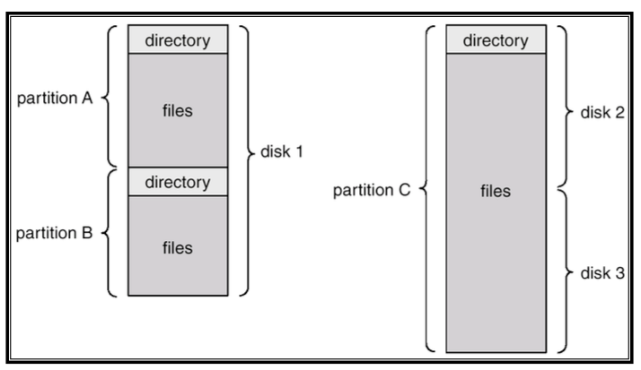

# Directory

- 파일의 수가 많아졌을 때 파일을 효율적으로 관리하기 위한 수단
- partition과 유사한 개념이다.

→ 하나의 disk를 여러 개의 paritition으로 사용할 수 있다. 물리적으로 여러 개의 disk를 하나의 partition으로 사용할 수 있다.

# Directory의 발전

## Single-level directory

- file이 흩어져 있어, 검색에 용이하지 않은 상태
- 제한된 이름 짓기와 그룹핑..
  - 같은 이름은 지을 수가 없다!!
  - 폴더가 없으므로 그룹핑도 불가능
- 모바일에서의 App과 환경이 유사

## Two-level directory

- 경로명의 개념
- 검색에 용이해짐
- 그룹핑을 할 수 있으나 충분하지는 않음

## Tree-structured directory

- 검색에 용이
- 그룹핑 가능
- 현재 디렉토리의 개념 > $ pwd
- 절대 경로와 상대 경로의 개념

## Acyclic graph directory

- 서브 디렉토리와 파일들이 서로 공유됨
- 두 개의 다른 이름 가질 수 있음(aliasing > 바로가기 처럼..)
- 원본 파일이 있고, 그 파일에 서로 다른 directory에서 접근이 가능함
- 원본 파일을 여러 directory에서 공유한다.
- window의 바로가기 기능 같은 것을 Linux에서는 link라고 한다…
  - soft link
    - 이름으로 link를 구현한다.
    - original file의 이름을 바꾸면 link file에서는 접근할 수 없다.
  - hard link
    - i-node(file control block)으로 link를 구현한다.
    - original file의 이름이 바뀌어도 link가 유지된다.

---

**비순환 그래프 디렉터리에서 고려할 사항**

- 가명 문제(Aliasing)
  - 파일이 여러 개의 경로명을 가질 수 있기 때문에 파일을 순회하거나 할 떼, 동일한 파일을 중복적으로 탐색하는 경우가 생길 수 있다.
- 할당 해제에 대한 문제
  - 공유 파일에 할당된 공간을 언제 반납할 것인가를 고려해야 한다.
  - 해당 파일을 가리키고 있는 어떤 포인터든 하나라도 삭제되면 해당 파일을 삭제할 수도 있을 것이고, 모든 포인터가 다 사라져야 파일을 삭제할 수도 있을 것이다.
  - 잘못 관리하여 포인터만 남아있게 되어 엉뚱한 파일을 가리키게 될 수도 있다.

## **General graph directory**

- 일반 그래프 디렉터리는 링크를 만드는데 어떠한 제약도 두지 않는 형태이다.
- directory 구조를 탐색할 때 무한 loop를 탐색할 수 있다. 따라서 이전에 방문한 node를 기억해서 재방문하지 않아야 한다

# 링크 (Link)

## 소프트 링크

- 심볼릭 링크(Symbolic link)라고도 한다.
- 원본 파일의 경로를 가리키는 바로가기와 같은 기능을 한다.
  - 따라서 링크한 원본 경로가 삭제되었을 경우 사용 불가능한 링크로 존재한다.
  - 소프트 링크가 걸린 파일을 이동시켜도 링크는 원본 파일을 가리키지 못한다.

## 하드 링크

- 원본 파일과 동일한 데이터 블록을 공유하여 파일의 내용을 공유한다.
  - 독립적인 데이터 블록을 가지는 복사본과는 다르다.
  - 원본 파일의 데이터 블록을 공유하기 때문에 추가적인 저장 공간을 사용하지 않는다.
  - 변경 사항이 동기화된다.
- 원본 파일이 삭제되어도 하드 링크는 계속 데이터에 접근할 수 있다.

## i-node

- 한 파일은 하나의 i-node를 가진다
- 파일에 대한 모든 정보를 가지고 있다
  - 파일 타입: 일반 파일, 디렉터리, 블록 장치, 문자 장치 등
  - 파일 크기
  - 접근 권한
  - 파일 소유자 및 그룹
  - 접근 및 갱신 시간
  - 데이터 블록에 대한 포인터(주소) 등

index-node의 줄임말로, Linux에서 소유권, 액세스 모드, 파일 유형, 파일 크기, 데이터 블록 위치 등 파일에 대한 메타 데이터를 저장하는 데이터 구조이다. 파일 시스템은 파일 이름과 i-node 번호를 연결하여 파일을 관리한다.
