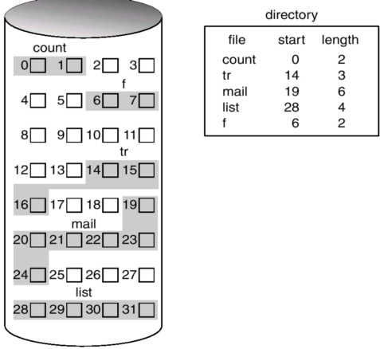
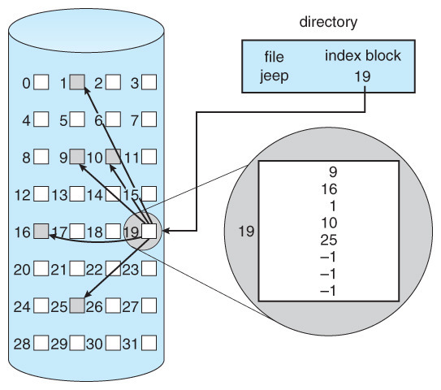

# 파일 시스템

http://www.kocw.net/home/search/kemView.do?kemId=1226304

- 메모리 > 주소를 통해 접근
- 파일 > 이름을 통해 접근
  - 비휘발성의 보조기억장치
- 디렉토리 > 파일의 메타데이터 중 일부를 보관하고 있는 일종의 특별한 파일

# Access Methods

⇒ 시스템이 제공하는 파일 정보의 접근 방식으로는 순차 접근, 직접 접근, 색인 접근으로 나뉜다.

- 순차 접근 (Sequential Access)
  - 가장 단순한 방법으로 파일의 정보가 레코드 순서대로 처리된다. 카세트 테이프를 사용하는 방식과 동일하다. 현재 위치에서 읽거나 쓰면 offset이 자동으로 증가하고, 뒤로 돌아가기 위해선 되감기 필요하다.
    
- 직접 접근 (Random Access)
  - 파일의 레코드를 임의의 순서로 접근할 수 있다. LP 판을 사용하는 방식과 동일하다. 읽기나 쓰기의 순서에 제약이 없으며 현재 위치를 유지할 수 있다면 이를 통해 순차 접근 기능도 구현할 수 있다.
- 색인 접근 (Index Access)
  - 파일에서 레코드를 찾기 위해 색인을 먼저 찾고 대응되는 포인터를 얻는다. 이를 통해 파일에 직접 접근하여 원하는 데이터를 얻을 수 있다. 따라서 크기가 큰 파일에서 유용하다.
    

# Allocation of File Data in Disk

## Contiguous Allocation

⇒ 연속 할당: 하나의 파일이 디스크 상에 연속으로 있는 기법

- 장점
  - 빠른 입출력
    - 어떤 파일을 읽고 싶다하면 파일 크기와 상관없이 시작 위치만 접근하면 모두 읽을 수 있기 때문
  - 직접 접근 가능 (Linked Allocation은 하드디스크임에도 불구하고 직접 접근이 안됨)
- 단점
  - 크기가 균일하지 않기 때문에 빈 자리가 생기나 활용되지 않음
    - 비어있는 공간임에도 불구하고 활용할 수가 없음
  - 파일이 수정되며 크기가 변동할 수 있는데 이를 반영하기 싶지 않음
    - 크기가 줄어들 수도, 커질 수도 있는데 처음부터 어떤 크기를 할당해야할까?
    - 내부 단편화가 발생함

## Linked Allocation

⇒ 빈 위치임에도 불구하고 바로 넣지 않고 아무데나 넣음

- 장점
  - 외부 단편화가 생기지 않음
- 단점
  - 직접 접근이 불가능 > 순차 접근으로 인한 시간 발생
  - 중간 위치가 고장나 pointer 가 유실되면 많은 부분을 잃음
- 변형
  - FAT(File-allocation-table) 파일 시스템
  - 포인터를 별도의 위치에 보관하여 reliability와 공간 효율성 문제 해결

## Indexed Allocation

⇒ index block을 접근하여 파일에 바로 접근

- 장점
  - 외부 단편화가 생기지 않음
  - 직접 접근 가능
- 단점
  - 작은 file이라해도 두개의 block이 필요하므로 공간 낭비가 있을 수 있음
  - 너무 큰 file인 경우엔 하나의 index block으로 모든 index를 저장할 수 없음
    해결 방안
  - linked scheme
  - multi-level index
