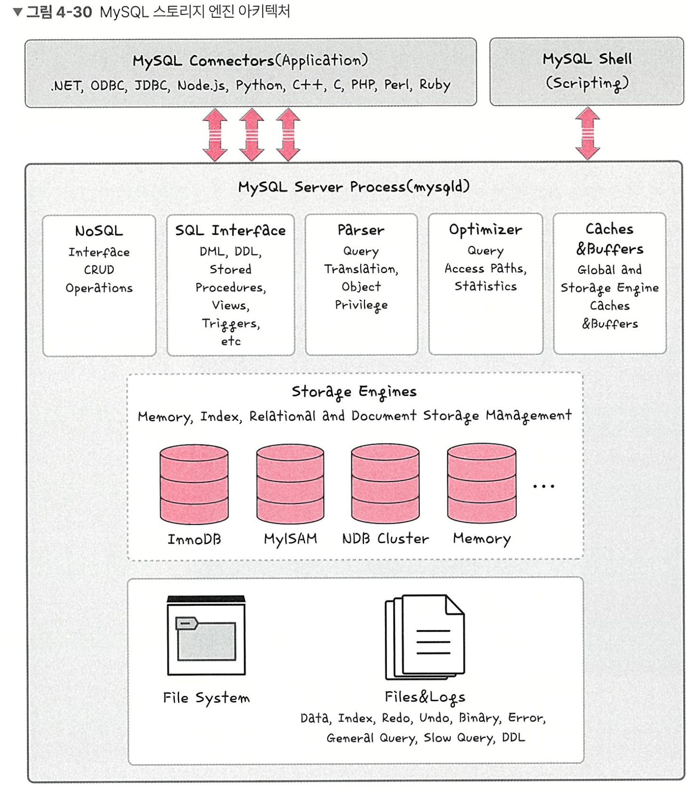
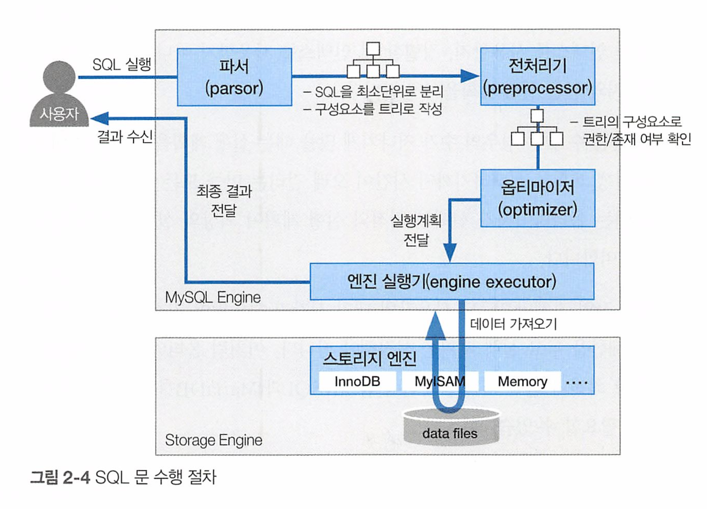

# RDBMS

행(실제 데이터의 한 단위)과 열(데이터의 속성)을 가지는 표 형식 데이터를 저장하는 형태의 데이터베이스

- SQL이라는 언어를 써서 조작
  - 예) MySQ:, PostgreSQL, Oracle, SQL Server, MSSQL 등이 있음
- 관계형 데이터베이스의 경우 표준 SQL은 지키기는 하지만, 각 제품에 특화시킨 SQL을 사용
  - 예) Oracle - PL/SQL, SQL Server - T-SQL, MySQL - SQL

수십 년간 금융, 결제, 예약 시스템 등 신뢰성이 중요한 모든 분야에서 표준으로 사용된 이유는, **ACID** 라는 4가지 특징을 통해 **데이터의 일관성과 안정성**을 강력하게 보장하기 때문

# MySQL

대부분의 운영체제와 호환되며 현재 가장 많이 사용하는 데이터베이스 (2021 스택 오버플로우 조서 결과)

→ 라고 책에서는 했지만 2025 StackOverflow 서베이 기준 PostgreSQL입니다 https://notavoid.tistory.com/267 벡터 DB의 유무가 큰 영향을 끼치지 않았을까 함

- C, C++ 기반
- MyISAM 인덱스 압축 기술
- B-tree 기반의 인덱스
- 스레드 기반의 메모리 할당 시스템
- 매우 빠른 조인
- 최대 64개의 인덱스 제공
- 대용량 데이터베이스를 위해 설계되어 있고 롤백, 커밋, 이중 암호 지원 보안 등의 기능 제공

### 스토리지 엔진이란?

데이터베이스의 심장과도 같은 역할

- 모듈식 아키텍처로 쉽게 스토리지 엔진을 바꿀 수 있음
- 웨어하우징, 트랜잭션 처리, 고가용성 처리에 강점
- 스토리지 엔진 위에는 커넥터 API 및 서비스 계층을 통해 MySQL 데이터베이스와 쉽게 상호 작용할 수 있음
- 쿼리 캐시를 지원, 입력된 쿼리 문에 대한 전체 결과 집합을 저장 → 사용자가 작성한 쿼리가 캐시에 있는 쿼리와 동일하면 서버는 단순히 구문 분석, 최적화 및 실행을 건너뛰고 캐시의 출력만 표시

## SQL문 처리 과정

DML문 기준의 처리 과정, 전체적인 흐름

주 구성요소

- SQL엔진: 데이터베이스의 논리적 계층으로, 클라이언트와 저장소 사이에서 작동, SQL 쿼리의 해석, 최적화, 실행을 담당하며, 데이터베이스의 논리적 데이터 구조를 관리 → 더 자세히는 이 곳 참고: https://news.hada.io/topic?id=20588
- 스토리지 엔진: 데이터의 물리적 저장, 검색을 처리하며, 다양한 스토리지 엔진 옵션(My SQL의 경우 InnoDB, MyISAM 등)이 존재
  - InnoDB: 트랜잭션 지원, ACID준수, 무결성 보장과 동시성 제어 중시 → 일반적으로 OLTP(online transaction processing) 환경이 많기에 InnoDB 엔진을 사용
  - MyISAM: 트랜잭션 지원x, 빠른 읽기 작업과 낮은 메모리 사용 중점
- 캐싱, 버퍼 풀 등 더 자세한 MySQL 아키텍처는 이곳을 참고: https://jeong-pro.tistory.com/239

### SQL 명령 수신

클라이언트 어플리케이션에서 SQL문을 DB 서버에 전송, 해당 서버는 SQL문을 받아 내부 프로세스 (파서, 옵티마이저 등)에 전달

### Parser

- SQL을 MySQL이 이해할 수 있는 최소 단위로 구성요소를 분리, 파싱 트리(Parse Tree) 형태로 변환하면서 문법적으로 올바른지 검사함 (렉싱, 파싱)
  - 트리의 최소 단위 : >, <, = 등의 기호, SQL 키워드
  - 트리에 허용되지 않는 문법 포함 시 에러 발생 & 실행 종료

### SQL rewrite 혹은 전처리(**preprocessor)** 단계

- 뷰(View)가 포함된 경우, 뷰를 실제 테이블로 치환하는 등 내부적으로 SQL을 재작성.
- 복잡한 서브쿼리를 내부적으로 다른 형태(Join, Inline View 등)로 변환할 수 있음
- 생성된 트리 결과를 토대로, SQL문의 "유효성" 검토 → 유효성 불만족 시 에러 발생
  - 이미 생성된 테이블, 뷰 등으로 구성되지 않았는지
  - 존재하지 않는 열을 포함하지 않았는지
  - 조회 권한이 없는 테이블을 조회하는지 등

### 옵티마이저를 통한 실행 계획 생성

1. 옵티마이저의 역할
   1. 파싱 트리를 입력받아 통계 정보(테이블, 인덱스, 컬럼 분포 등)를 활용하여 가능한 실행 계획들중 비용(cost)이 최소화되는 방법을 찾음
   2. DML 문도 SELECT와 비슷하게 내부적으로 어떤 인덱스를 사용할지, 어떤 순서로 데이터를 읽을지 등을 결정
2. 실행 계획(Execution Plan)
   1. SQL문을 효율적으로 실행하기 위한 단계별 연산(Access Method, Join Method, Index Scan 여부 등)이 정해짐
   2. 결과물은 DB 엔진이 실제로 수행할 플랜임

### 실행과 접근 단계: 접근 경로 및 버퍼 캐시

- 옵티마이저가 결정한 접근 방식(인덱스 접근, 풀 스캔 등)에 따라 실제 데이터를 읽거나 수정함
- DBMS는 디스크에 있는 데이터를 바로 수정하지 않고, 먼저 버퍼 캐시(Buffer Cache, SGC/Shared Buffer 등)에 데이터를 적재한 후 처리
- InnoDB(MySQL)나 PostgreSQL, Oracle 등 대부분의 DB 엔진은 버퍼 캐시를 통해 디스크 접근 횟수를 최소화하고 성능을 높임

### 실행과 접근 단계: 로우 검색 및 잠금

1. UPDATE/DELETE 시에는 수정될(또는 삭제될) 로우를 찾아야 하고, INSERT 시에는 새로운 로우를 어느 위치(페이지, 블록)에 삽입할지 결정해야 함
2. 동시성 제어(Concurrency Control)
   1. Oracle 등의 전통적 DBMS는 row-level lock 또는 MVCC(multi-version concurrency control) 방식을 사용
   2. MySQL InnoDB, PostgreSQL 등은 MVCC를 통해 “쓰기 스레드”와 “읽기 스레드”가 최대한 충돌 없이 동작하도록 함
   3. 필요에 따라 인덱스 키 범위에 대한 잠금 또는 테이블 수준 잠금이 걸릴 수 있음
   4. 단, 일반적인 RDBMS는 row-level 수준에서 처리

### 실행과 접근 단계: 트랜잭션 로그 기록

- 트랜잭션 로그(REDO/Undo, Write-Ahead Logging, etc.)
- DML로 인해 변경되는 내용을 복구 가능하도록 먼저 로그(Redo/Write Ahead Log 등)에 기록
  - Write-Ahead Logging(WAL): 데이터 페이지에 변경을 반영하기 전에 로그 파일에 해당 변경을 기록하여 장애 발생 시에도 복구가 가능하게 함
- Undo(or Rollback) 세그먼트/테이블스페이스(Oracle, InnoDB 등에서 사용)는 트랜잭션 롤백 시점에 원본 데이터를 복구하기 위해 필요한 정보를 저장
- Redo로그는 커밋 후 시스템 크래시가 발생해도 해당 로그를 재적용하여 데이터 일관성을 보장

### 내부 메모리 및 디스크 구조 변화: 버퍼 캐시에서의 변경

- DML 문이 실행되어 테이블 데이터가 삽입/수정/삭제될 때 해당 데이터가 들어있는 버퍼 페이지(블록) 또한 메모리 내에서 수정됨
- 수정된 버퍼 페이지는 Dirty Page 상태가 되며 일정 시점(체크포인트, 버퍼 풀 정책 등)에 디스크로 기록

### 내부 메모리 및 디스크 구조 변화: 디스크 쓰기

- DBMS는 Checkpoint를 통해 로그 및 데이터 페이지를 디스크에 반영
- 체크포인트 시 → 변경 로그(Redo, WAL) 파일을 디스크에 영구적으로 기록하고, 특정 시점(LSN; Log Sequence Number 등)까지 데이터 파일로 동기화 → 장애 발생시에도 체크포인트 이후 구간만 로그를 다시 적용하면 빠르게 복구 가능

### 트랜잭션 제어: 커밋

- COMMIT 명령을 내리면 해당 트랜잭션에서 발생한 변경을 영구화(Durable)함
- DBMS는 Redo/WAL 로그를 디스크에 안전하게 기록해야 커밋을 성공으로 보고 ‘커밋 완료’ 알림
- 커밋 시점에 버퍼 캐시에 있는 실제 데이터 페이지를 디스크에 바로 기록할 수 있지만 반드시 즉시 쓰지는 않을 수 있음 = 다음 체크포인트까지 지연될 수 도 있음, 핵심은 로그의 영구 기록

### 트랜잭션 제어: 롤백

- 트랜잭션 중간에 오류가 발생하거나 사용자가 Rollback 하면 undo 로그 참조하여 변경 내용을 원상태로 복구
- MVCC를 사용하는 DBMS(예: PostgreSQL, MySQL InnoDB 등)에서는 이전 버전 정보를 저장하여 읽기 일관성(Read Consistency)을 보장하고 롤백 시 활용

### 동시성 제어와 격리 수준

1. 동시성 제어 메커니즘
   1. 락(Lock) 기반: 오라클, MySQL(InnoDB), MSSQL 등은 Row-level Lock 또는 Index Lock을 사용
   2. MVCC 기반: PostgreSQL, MySQL(InnoDB), Oracle(실질적으로 MVCC) 등은 스냅샷(Snapshot)을 만들어 읽기 트랜잭션이 쓰기 트랜잭션에 의존하지 않도록
2. 격리 수준(Isolation Level)
   1. Read Uncommitted, Read Committed, Repeatable Read, Serializable 각 격리 수준에 따라 Dirty Read, Non-repeatable Read, Phantom Read 등과 같은 현상의 허용 범위가 달라짐.
   2. DBMS마다 기본 격리 수준이 다를 수 있으며(예: Oracle은 Read Committed, PostgreSQL은 Read Committed, MySQL은 대부분 Repeatable Read), 내부 구현(락 or MVCC) 방식과 연계되어 최종 사용자에게 일관성을 보장

### 옵티마이저 통계 갱신 및 메타데이터 반영

- DML 수행으로 인해 데이터가 변경되면 컬럼 분포나 테이블의 레코드 수, 인덱스 분포 등이 달라질 수 있음
- DBMS는 통계를 자동으로 갱신하거나, 일정 주기 혹은 특정 임계값을 넘을 때 분석(Analyse, DBMS_STATS 등)을 재수행하여 옵티마이저가 좀 더 정확한 비용 추정이 가능하도록 함

### 장애 발생 시 복구

- WAL을 통해 트랜잭션이 커밋된 시점의 로그가 디스크에 반영되어 있다면, 장애 후 재시작 시 로그를 다시 적용(redo)하여 마지막 상태로 복원할 수 있음
- 롤백이 필요한(커밋되지 않은) 부분은 undo 정보를 사용해 복구 → ARIES(Alogirhtm for Recovery and Isolation Exploiting Semantics) 알고리즘이나 유사한 복구 메커니즘을 통해 데이터 무결성과 일관성을 지킴

### 결론

DML(INSERT, UPDATE, DELETE)이 실행되면, 단순히 ‘테이블에 데이터가 바뀐다’ 수준을 넘음.

1. SQL 파싱 및 최적화를 거쳐,
2. 버퍼 캐시와 로그 기록(WAL, Redo, Undo)
3. 동시성 제어(락 또는 MVCC)
4. 트랜잭션 제어(커밋/롤백)
5. 체크포인트/복구

등을 통해 ACID(원자성, 일관성, 격리성, 지속성)를 만족시키도록 체계적으로 처리됨.

이를 통해, DBMS는 장애나 동시성 상황에서도 데이터의 무결성과 안정성을 유지하며, 사용자는 안전하고 일관성 있는 데이터베이스 환경을 이용할 수 있게 됨

## 또다른 RDBMS: PostgreSQL

- 디스크 조각이 차지하는 영역을 회수할 수 있는 장치인 VACCUM이 특징
- 최대 테이블의 크기는 32TB
- JSON을 이용해서 데이터에 접근 가능
- 지정 시간에 복구하는 기능, 로깅, 접근 제어, 중첩된 트랜잭션, 백업 등을 할 수 있음
