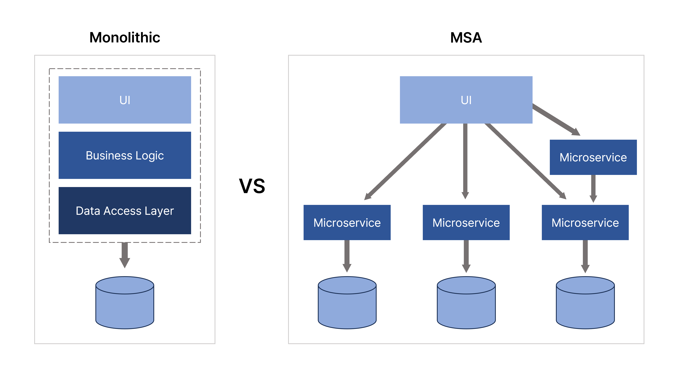

# MSA에서의 트랜잭션

https://wikidocs.net/298466

# 모놀리식과 MSA의 차이

- 모놀리식
  - 하나의 서비스 또는 애플리케이션
  - 애플리케이션의 모든 기능이 하나의 거대한 코드 베이스로 구성된 전통적인 방식
    - 빠르게 구현 가능
    * 유지보수가 힘들다
- 마이크로 서비스

  - 하나의 큰 애플리케이션을 여러 개의 작은 애플리케이션으로 쪼개어 변경과 조합이 가능하도록 만든 방식

    - 유지보수가 용이

    - 각 기능에 따라 다른 언어 선택 가능

    * 서비스 간 호출 시 API를 사용하기 때문에 통신 비용이나 Latency가 그만큼 증가

# 모놀리식에서의 트랜잭션

# MSA에서의 트랜잭션

## 2 Phase-Commit (2PC) pattern

2 Phase-Commit은 이름 그대로 두 단계를 정하는 방식이다. 준비 단계와 커밋 단계로 나뉘어진다. 준비 단계에서는 말그대로 해당 서비스들이 준비가 되었는지를 확인한다. 앞서 말했던 것처럼, 회원이 맞는지.. 상품 재고가 있는지... 이때 각 서비스는 Coordinator에게 응답했을 때 바로 커밋되지 않는다는 점이 중요하다.

관련한 모든 서비스의 응답이 왔을 때 커밋 단계에서 해당 요청을 Commit할 것인지 Rollback할 것인지 판단하기 때문에 준비 단계에서는 해당하는 DB에 관련한 모든 서비스의 응답이 올 때까지 **Lock**을 설정한다.

- User가 상품 주문을 하면 주문과 관련된 모든 DB의 요청 처리 가능 여부를 통해 Commit과 Rollback을 판단한다.
  - 하나의 DB라도 요청 처리 불가 응답이 오면 모든 요청을 Rollback한다.
  - 모든 DB에서 요청을 처리 가능 응답이 오면 모든 요청을 Commit한다.

### 2PC 패턴의 문제점

- 모든 요청을 처리할 때까지 관련한 모든 DB에 Lock이 설정된다.
  - 따라서 지연 시간이 증가할 수 있다.
  - 비즈니스가 복잡해져서 관련 서비스가 늘어난다면 관련 서비스 수와 비례해서 지연 시간이 길어질 수 있다.
- MSA 사용 의미가 퇴색된다.
  - MSA는 각 서비스 간의 결합을 줄이고 독립적인 서비스를 구축하기 위함이다.
  - 2PC를 적용하면 Coordinator 기반으로 서비스 간의 강력한 결합이 생기므로 MSA를 사용하는 의미가 퇴색될 수 있다.
- NoSQL은 2PC 패턴을 지원하지 않는다.
  - NoSQL은 빠른 쓰기, 빠른 읽기, 가용성 등을 우선시하므로 2PC와는 거리가 멀다.

## SAGA pattern

SAGA 패턴은 MSA 환경에서 일관성을 지키기 어렵다는 것을 기반으로, 약간의 일관성을 포기하고 최종 일관성을 보장하여 효율성을 높이기 위한 패턴이다.

2PC에서는 하나의 트랜잭션으로 묶어서 동시에 처리를 하지만(이를 위해 순차적으로 관련 DB에 Lock 설정), SAGA 패턴은 긴 트랜잭션을 여러 개의 짧은 로컬 트랜잭션으로 분리하는 접근 방식이다. 각 트랜잭션은 다른 트랜잭션의 완료를 기다리지 않고 독립적으로 실행된다. 따라서 트랜잭션의 원자성을 지켜줄 방법이 필요하다.

만약 중간에 문제가 발생하면 보상 트랜잭션이 실행되어 이전 트랜잭션을 롤백하는 것과 같은 효과를 가져온다.

### 보상 트랜잭션?

분산된 트랜잭션 중 일부가 실패할 경우 그 실패 전에 성공적으로 완료된 트랜잭션을 보상, 즉 되돌리는 역할을 하는 트랜잭션이다.

이 과정에서 메시지 브로커를 통해 이벤트를 Pub/Sub하게 된다.

예를 들어, 주문 생성 트랜잭션이 완료 후에 결제 완료 로직에서 장애가 발생했을 때, 보상 트랜잭션을 실행한다. 보상 트랜잭셩 비즈니스 로직을 실행하면 성공해서 SUCCESS 상태가 된 로직을 CANCLED 상태로 변경한다. 최종적으로 SUCCESS 상태의 주문만 이후에 처리하는 느낌으로 최종적으로 롤백된 것처럼 구현할 수 있게 된다.

따라서 SAGA 패턴은 이벤트 기반으로 작동한다.

### **롤백(Rollback)이 아닌 '보상(Compensation)'**

SAGA의 핵심은 실패를 다루는 방식에 있다. 2PC는 실패 시 '롤백(Rollback)'을 통해 모든 변경 사항을 원자적으로 되돌린다. 반면 SAGA는 이미 커밋된 로컬 트랜잭션을 롤백할 수 없으므로, **'보상 트랜잭션(Compensating Transaction)'**을 통해 실패를 처리한다.

- **실패 시나리오:** `Order` (성공) `Payment` (성공) `Product` (재고 부족으로 **실패**)
- **보상 시나리오:**
  1. `Product` 서비스가 실패했으므로, 실패 이벤트를 발행한다.
  2. 이 이벤트를 받은 `Payment` 서비스가 **'결제 환불'**이라는 보상 트랜잭션을 실행한다.
  3. `Payment`의 환불이 완료되면, 이 이벤트를 받은 `Order` 서비스가 **'주문 취소'**라는 보상 트랜잭션을 실행한다.

이처럼 SAGA는 실패한 지점부터 역순으로, 이미 성공했던 로컬 트랜잭션들을 되돌리는 별도의 보상 트랜잭션을 실행하여 데이터를 '정리'한다.

### 코레오그라피 SAGA

→ 중앙의 지휘자 없이 각 서비스가 서로의 이벤트를 보고 스스로 결정하여 협업하는 방식이다.

**성공 시나리오**

1. **[Order Service]** 주문을 생성하고 COMMIT한 뒤, **`OrderCreatedEvent`**를 Kafka로 발행한다.
2. **[Payment Service]** `OrderCreatedEvent`를 구독하여 결제를 처리하고 COMMIT한 뒤, **`PaymentCompletedEvent`**를 발행한다.
3. **[Product Service]** `PaymentCompletedEvent`를 구독하여 재고를 차감하고 COMMIT한 뒤, **`StockDecreasedEvent`**를 발행한다.
4. **[Order Service]** `StockDecreasedEvent`를 다시 구독하여, 최종적으로 주문 상태를 `CONFIRMED`로 변경하고 COMMIT한다.

**실패 및 보상 시나리오**

'재고 차감'이 실패하는 경우, 각 서비스는 '성공 이벤트'뿐만 아니라 '실패 이벤트'도 구독하고 있어야 한다.

1. ... (1, 2번 단계는 성공) ...
2. **[Product Service]** `PaymentCompletedEvent`를 구독했지만, 재고 부족으로 로컬 트랜잭션이 실패한다. 그리고 **`StockDecreaseFailedEvent`**를 발행한다.
3. **[Payment Service]** `StockDecreaseFailedEvent`를 구독하고 있다가, 이 이벤트를 받고 자신의 **보상 트랜잭션(결제 환불)**을 실행한다. 그리고 `PaymentRefundedEvent`를 발행한다.
4. **[Order Service]** `PaymentRefundedEvent` (또는 `StockDecreaseFailedEvent`)를 구독하고, 자신의 **보상 트랜잭션(주문 취소)**을 실행하여 주문 상태를 `CANCELLED`로 변경한다.

---

**[ 장점 ]**

- **느슨한 결합**: 서비스들은 서로의 존재를 알 필요가 없다. 오직 Kafka의 이벤트만 구독하고 있으면 된다.
- **단순함**: SAGA의 흐름을 관리하는 별도의 지휘자 컴포넌트가 필요 없어 구조가 단순하다. 각 서비스는 자신의 책임에만 집중하면 된다.

**[ 단점 ]**

- **트랜잭션 가시성 부재:** 전체 비즈니스 트랜잭션의 현재 상태가 어디쯤 와 있는지 한눈에 파악하기 매우 어렵다. "주문 123번은 왜 재고는 차감됐는데 배송은 시작 안 됐지?"라는 질문에 답하기 위해, `order`, `payment`, `product` 서비스의 로그와 DB를 모두 뒤져야 한다.
- **순환 의존성:** A가 발행한 이벤트를 B가 구독하고, B가 발행한 이벤트를 다시 A가 구독하는 등의 순환 의존성이 발생하기 쉬우며, 이를 파악하기 어렵다.
- **계약 관리의 복잡성:** 어떤 서비스가 어떤 이벤트를 발행하고 구독하는지에 대한 '계약'이 명시적으로 관리되지 않으면, 시스템 전체의 동작을 이해하기 매우 어렵다.

결론적으로, 코레오그래피 SAGA는 참여하는 서비스가 2~3개 정도로 적고, 비즈니스 흐름이 단순한 '선형적(Linear)' 프로세스에 매우 적합하다. 복잡한 '조건부 분기'가 포함된 비즈니스 트랜잭션이라면, 코레오그래피 방식의 복잡성은 기하급수적으로 증가한다.

### 오케스트레이션 SAGA

→ 각 서비스는 다른 서비스들을 쳐다보지 않고 오직 지휘자만 쳐다본다. 지휘자는 각 서비스에게 언제, 무엇을 연주할지 명령을 내리고, 연주가 끝나면 이벤트를 받아 다음 서비스를 실행한다. 만약 오류가 발생하면 지휘자가 직접 나서서 바로잡는다.

**성공 시나리오**

1. **[Order Service]** 최초 주문 요청을 받으면, `Order`를 생성하는 대신 **SAGA 오케스트레이터**에게 "주문 생성 SAGA를 시작하라"고 명령한다.
2. **[Orchestrator]** SAGA의 상태를 `PENDING`으로 저장한 뒤, 첫 번째 단계인 `payment-service`에게 **`ProcessPaymentCommand`**를 (Kafka를 통해) 보낸다.
3. **[Payment Service]** 명령을 받아 결제를 처리하고, 성공하면 **`PaymentCompletedEvent`**를 발행한다.
4. **[Orchestrator]** `PaymentCompletedEvent`를 구독하고, SAGA의 다음 단계인 `product-service`에게 **`DecreaseStockCommand`**를 보낸다.
5. **[Product Service]** 명령을 받아 재고를 차감하고, 성공하면 **`StockDecreasedEvent`**를 발행한다.
6. **[Orchestrator]** `StockDecreasedEvent`를 구독하고, 마지막 단계인 `order-service`에게 **`ConfirmOrderCommand`**를 보낸다.
7. 모든 단계가 성공했으므로, SAGA의 최종 상태를 `COMPLETED`로 변경한다.

**실패 및 보상 시나리오**

'재고 차감'이 실패하는 경우, 모든 제어권은 오케스트레이터에게 있다.

1. ... (1~4번 단계는 성공) ...
2. **[Product Service]** `DecreaseStockCommand`를 받았지만 재고 부족으로 실패하고, **`StockDecreaseFailedEvent`**를 발행한다.
3. **[Orchestrator]** `StockDecreaseFailedEvent`를 구독하고, SAGA가 실패했음을 인지한다. SAGA 상태를 `ROLLING_BACK`으로 변경하고, **보상 트랜잭션을 역순으로 지휘**하기 시작한다.
4. **[Orchestrator]** `payment-service`에게 **`RefundPaymentCommand`**를 보낸다.
5. **[Orchestrator]** `payment-service`로부터 `PaymentRefundedEvent`를 받으면, `order-service`에게 **`CancelOrderCommand`**를 보낸다.
6. 모든 보상 트랜잭션이 완료되면, SAGA 상태를 `FAILED`로 최종 변경한다.

---

**[ 장점 ]**

- **중앙 집중화된 로직과 명확한 가시성**: 전체 비즈니스 로직이 오케스트레이터 한 곳에 명시적으로 정의된다. 덕분에 SAGA의 현재 상태를 추적하고 디버깅하기가 매우 쉽다. "이 주문은 왜 실패했지?"라는 질문에, 오케스트레이터의 상태만 확인하면 즉시 답을 얻을 수 있다.
- **순환 의존성 부재:** 참여 서비스들은 서로의 이벤트를 구독할 필요가 없다. 오직 오케스트레이터의 '명령'에 응답하고, 자신의 결과를 '이벤트'로 보고하기만 하면 된다. 서비스 간의 의존성이 단순해진다.
- **복잡한 흐름 관리 용이 (Easier to Manage Complexity):** "만약 A 조건이면 C를 호출하고, B 조건이면 D를 호출하라"와 같은 복잡한 분기, 병렬 실행, 타임아웃 처리 등을 오케스트레이터 내부에서 상태 머신(State Machine)으로 쉽게 구현할 수 있다.

**[ 단점 ]**

- **과도한 책임 집중:** 오케스트레이터가 너무 많은 비즈니스 로직과 각 서비스의 내부 사정을 알게 되면, 그 자체가 또 다른 형태의 '중앙집중식 모놀리스'가 될 위험이 있다.
- **추가 컴포넌트 관리 부담:** SAGA의 흐름을 관리하는 오케스트레이터 자체를 개발하고, 배포하고, 고가용성을 유지해야 하는 추가적인 운영 부담이 발생한다.
