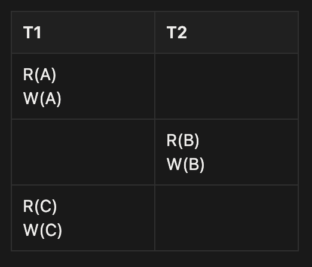
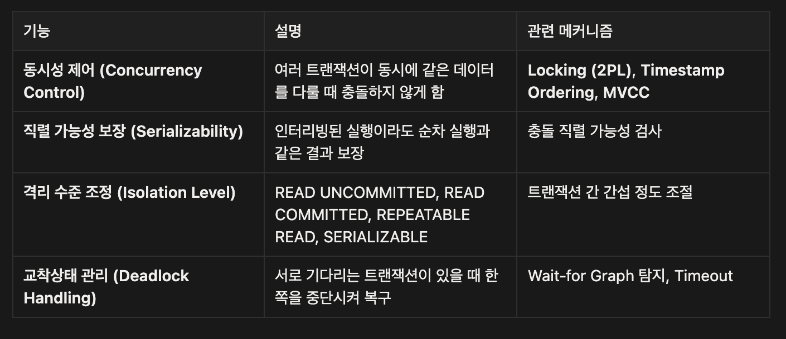
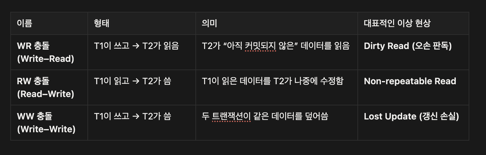
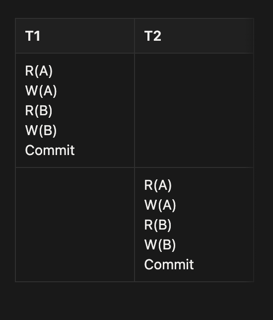
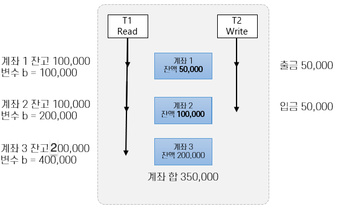

# DBMS 병행성 제어 (트랜잭션)

# 들어가며

- DBMS는 조직 내의 거의 모든 사용자가 동시에 사용하는 다중 사용자 시스템
- 개별 사용자 프로그램이 동시에 조작하는 데이터에 대한 무결성을 위한 병행성을 제어할 수 있어야 함
- DBMS에서는 트랜잭션을 사용하여 병행성을 제어함

# 트랜잭션 - Transaction

- DB에서 하나의 작업 단위를 의미함
- 논리적으로 묶인 일련의 연산들을 포함함
- 데이터 무결성을 유지하고, 안전한 데이터 처리를 보장하는 중요한 개념

## 트랜잭션 개요

- 데이터베이스 객체들에 대한 일련의 판독(Read) 또는 기록(Write)
  - 판독시에는 객체(Database Object)의 내용이 디스크(Disk)에서 버퍼 풀(Buffer Pool)의 프레임(Frame)으로 페이징되고 그 값이 프로그램 변수로 복사됨
  - 기록시에는 프레임의 객체 복사본이 수정된 후 디스크에 기록
- 데이터베이스 객체는 프로그램이 정보를 기록하거나 판독하는 단위
  - 페이지, 레코드 등이 될 수 있으며 DBMS마다 다르게 구현

| 용어                                    | 의미                                                                     |
| --------------------------------------- | ------------------------------------------------------------------------ |
| **데이터베이스 객체 (Database Object)** | DBMS가 관리하는 데이터 단위 (예: 페이지, 레코드, 블록 등)                |
| **버퍼 풀(Buffer Pool)**                | 디스크 I/O를 줄이기 위해 데이터를 메모리에 임시로 저장해두는 영역        |
| **프레임(Frame)**                       | 버퍼 풀 안에서 데이터를 담는 하나의 칸 (슬롯)                            |
| **트랜잭션(Transaction)**               | 여러 개의 읽기·쓰기 연산을 하나의 논리적 단위로 묶은 것 (All or Nothing) |

> ## READ

1. 프로그램에서 DB 정보 요청
2. DBMS가 해당 데이터(레코드)가 저장된 디스크 페이지를 찾음
3. 해당 페이지를 버퍼 풀의 빈 프레임으로 가져옴(페이징)
4. 버퍼 풀에 올라온 데이터를 프로그램이 사용가능한 프로그램 변수로 복사

## WRITE

1. 프로그램에서 객체를 수정
2. 메모리에 올라와 있는 버퍼 풀 프레임의 복사본에 먼저 적용
3. 커밋(commit) 발생 시점에 DBMS가 변경된 프레임을 디스크에 반영시킴
   >

### ACID

- **원자성(Atomicity)**
  - 트랜잭션과 관련된 작업들이 부분적으로 실행되다가 중단되지 않음을 보장
- **일관성(Consistency)**
  - 실행을 완료하면 언제나 일관성 있는 데이터베이스 상태로 유지됨을 보장
- **격리성(Isolation)**
  - 트랜잭션 수행 시 다른 트랜잭션의 연산작업이 끼어들지 못하도록 보장
- **지속성(Durability)**
  - 성공적으로 수행된 트랜잭션은 영구적으로 데이터베이스에 반영됨을 보장

## 트랜잭션과 일관성

- 트랜잭션의 인터리빙과 관계없이 모든 트랜잭션은 순서대로 실행한 결과를 보장해야 함
  (인터리빙, Interleaving : 두 개 이상의 트랜잭션이 동시에 실행될 때, 각 트랜잭션의 명령문(읽기·쓰기)이 서로 섞여(interleave) 실행되는 현상) - 두 트랜잭션 t1과 t2가 동시에 실행 되더라도 실제 효과는 t1이 종료된 후 t2가 실행된 결과와 같아야 함 - **예시**
              ```sql
              # 두 작업이 존재한다고 가정할 때
              T1: A 읽기 → A+100 → A 쓰기
              T2: A 읽기 → A*2 → A 쓰기

              # 실제 실행 순서는 다음처럼 섞일 수도 있음 (인터리빙)
              T1: A 읽기
              T2: A 읽기
              T1: A+100 쓰기
              T2: A*2 쓰기

              # DBMS는 트랜잭션이 인터리빙 되더라도
              # 결과가 '직렬(serial)' 실행한 것과 동일해야 함을 보장함

              # 직렬 가능성(Serializability)
              # 여러 트랜잭션을 동시에 수행해도, 결과는 어떤 순서로든 순차적으로 실행한 것과 같음
              ```

      - 격리성(Isolation) 만족
      - 무결성 제약조건을 집행할 메커니즘 제공
- DBMS는 서로 다른 트랜잭션 단위 작업을 인터리빙
  - DBMS는 인터리빙해서 실행한 실제 효과가 **트랜잭션들을 선형으로 실행한 것과 동등**하도록 보장함
- 손상 복구
  - 트랜잭션이 정상적으로 완료되지 못하는 경우
    - 트랜잭션을 철회(abort)하는 경우 (트랜잭션 중 오류 발생)
    - 시스템 손상 (서버 다운, 디스크 오류 등)
    - 예상치 못한 상황
  - 일관성 보장을 위해 미완료 트랜잭션의 단위 작업을 무효화 함

> 여러 트랜잭션이 동시에 실행되더라도 DBMS는 내부적으로 직렬 가능성(Serializability) 을 보장하여 마치 순서대로 실행된 것처럼 보이게 만들고, 실패 시 회복 메커니즘(Recovery)으로 일관된 상태를 유지한다.

## **트랜잭션과 스케줄**

- DBMS 관점에서 트랜잭션 하나는 단위 작업(action - read와 write)들의 나열
  - 트랜잭션은 부분적으로 순서화된(partially ordered) 집합으로 정의할 수 있음
  - 단위 작업의 리스트로 취급할 수 있음
- 트랜잭션 T에서 객체 O를 읽는 작업에서,
  - 판독 단위 작업 **RT(O)**, 기록 단위 작업 **WT(O)**, 철회 작업 **AT**, 완결 작업 **CT**
- 트랜잭션 스케줄
  - 어떤 트랜잭션에 있는 단위작업의 리스트
  - DBMS가 보는 트랜잭션의 단위 작업들을 기술
  - 각 트랜잭션에 Abort와 Commit 연산을 넣은 스케줄을 완전한 스케줄(Complete Schedule)로 부름
  - 다른 단위 작업이 인터리빙 되지 않는 경우 직렬 스케줄(Serial Schedule)로 부름
  

> DBMS 내부에 스케쥴러(Scheduler)라는 모듈이
> 여러 트랜잭션의 작업(읽기,쓰기)을 어떤 순서로 실행할지 조율한다.
> → 물리적으로는 병렬 실행이지만, 논리적으로는 직렬 실행처럼 보이게 만드는 것

    트랜잭션이 동시 실행 중에도 직렬 가능성과 일관성을 보장하도록 동작함

>

**스케쥴러의 업무**



Lock 기반 스케줄링 (2-Phase Locking, 2PL)

데이터를 읽거나 쓸 때 “잠금(lock)”을 걸어서 다른 트랜잭션 접근 제한

잠금은 일정 규칙(획득 → 해제 순서)에 따라 관리

가장 전통적이고 널리 쓰이는 방식 (MySQL InnoDB, PostgreSQL 등)

Timestamp 기반 스케줄링

트랜잭션에 시간순서를 부여하고,
그 순서에 맞게 충돌 검사를 수행해 실행

물리적인 Lock을 덜 사용해서 병렬성 높임

(예: 일부 NoSQL, MVCC 엔진)

---

# 일관성

## **직렬 가능성**

- 직렬 가능 스케줄(Serializable Schedule)
  - 일관적인 데이터베이스 인스턴스에 대한 효과가 완결된 트랜잭션 집합 S에 대한 완전한 직렬 스케줄의 효과와 동등함이 보장되는 스케줄
  - 주어진 스케줄을 수행해서 나온 데이터베이스 인스턴스는 해당 트랜잭션들을 직렬 순서대로 수행해서 나온 데이터베이스 인스턴스와 동등
- 트랜잭션들을 똑같이 직렬로 수행하더라도 순서를 바꾸면 결과도 달라질 수 있음 – 이 결과는 수용 가능함
- Abort된 트랜잭션이 있는 스케줄까지 포함하지는 않음

- 직렬 스케쥴 : 실제 하나씩 순서대로 실행한 스케쥴
- 직렬 가능 스케쥴 : 동시에 실행되었지만, 결과가 직렬 스케쥴과 동일한 스케쥴
- 비직렬 스케쥴 : 동시에 실행된 결과가 직렬 스케쥴과 다름 (데이터 불일치 가능)
  → 결과가 같을 필요는 없음. 단지 어떤 직렬 순서와 동일하냐만 확인함

## **교차수행에 의한 일부 이상**

→ 비직렬 스케쥴이 인터리빙으로 인해 일관성이 깨지는 상황들

- 트랜잭션 T1과 T2의 단위 작업이 충돌(conflict)하는 경우
  - 동일한 개체에 대해 두 개 이상의 단위 작업이 수행될 때 하나 이상의 트랜잭션이 기록 연산일 경우
- 기록-판독 충돌(WR Conflict)
- 판독-기록 충돌(RW Conflict)
- 기록-기록 충돌(WW Conflict)



## 순차적 트랜잭션

.png>)



전제 상황

- 계좌 1 잔액 : 100,000원
- 계좌 2 잔액 : 50,000원
- 총 잔액 : 150,000원
- T1은 계좌 1에서 5만원을 출금 하여 계좌2에 5만원을 입금함
- T2는 계좌 1, 계좌 2의 이자를 10% 증액함

### **기록-판독 충돌(WR 충돌) - Dirty Read**

- 미 완결된 데이터를 읽는 경우
- 기록-판독 충돌(WR 충돌)
  - 트랜잭션 T1이 수정한 데이터베이스 객체 A를, T1이 Commit되기 전에 트랜잭션 T2가 판독(Read)하는 경우
  - 이러한 판독을 **오손 판독(Dirty Read)**라고 부름

.png>)

- T1의 작업 중간에 T2의 작업이 실행 되면서
- T2가 T1의 미완료 데이터를 읽음 (Dirty Read 발생)


### **판독 - 기록 충돌(RW 충돌) - Unrepeatable Read**

- 반복 불가능한 읽기를 수행하는 경우
- 판독-기록 충돌(RW 충돌)
  - T1이 객체 A의 값을 판독중에 T2가 객체 A의 값을 변경하는 경우
  - 이런 판독을 반복 불가능한 판독(Unrepeatable Read)라고 부름




- T1이 읽는 중간에, T2가 같은 데이터를 수정(Write)함
- T1 안에서 읽은 결과가 달라짐 → Unrepeatable Read 발생

### **기록-기록 충돌(WW 충돌)**

- 미 완결된 데이터를 덮어 쓰는 경우
- 기록-기록 충돌(WW 충돌)
  - T1이 어떤 객체 A의 값을 수정하고, 진행 중인 상태에서 R2가 값을 덮어 쓰는 경우
  - 이런 기록을 맹목 기록(Blind Write)라고 부름

---

# 락(Lock)

## **Lock Mode**

- 직렬성을 보장하기 위한 방법으로, 데이터 객체들이 상호 배타적으로 액세스 되도록 함
- 한 트랜잭션이 한 데이터 객체에 액세스 했을 때 다른 트랜잭션이 해당 객체를 수정하지 못하도록 함
- 다중 트랜잭션 환경에서 데이터베이스의 일관성과 무결성을 유지하기 위한 순차적 진행을 보장
- 잠금 모드
  - Shared Lock Mode(Read Lock)
    - 트랜잭션 *T1*가 데이터 객체 A에 Shared Lock(공유 잠금)을 가지고 있다면 *T1*는 A를 읽을 수 있지만 갱신할 수 없음
  - Exclusive Lock Mode(Write Lock – X로 표시)
    - 트랜잭션 *T1* 가 데이터 객체 A에 Exclusive Lock을 가지고 있다면 *T1*는 A를 읽을 수도, 갱신할 수도 없음

## **Shared Lock(공유 잠금) Mode**

- Shared Lock 또는 Read Lock - S로 표시함
- 다른 트랜잭션에서 데이터를 읽을 수 있는 Lock Mode
  - Shared Lock은 다른 트랜잭션에 대한 읽기 시도를 허용
- 동일 데이터베이스 객체에 여러 Shared Lock이 적용될 수 있음
  - 트랜잭션 T1이 객체 A에 Shared Lock을 가지고 있으면, 트랜잭션 Ti에 대해 Shared Lock을 허용
  - 트랜잭션 T1이 객체 A에 Shared Lock을 가지고 있으면, 트랜잭션 Ti에 대해 Exclusive Lock을 허용하지 않음
- SELECT 쿼리에 적용됨

> 리소스를 다른 사용자가 동시에 읽을 수 있지만 변경을 불가하게 하는 것

## **Exclusive Lock(베타적 잠금) Mode**

- Write Lock – X로 표시함
- 다른 트랜잭션에서 데이터를 읽을 수도, 쓸 수도 없는 잠금 모드
  - Exclusive Lock은 다른 트랜잭션의 접근을 허용하지 않음
- 트랜잭션 T1이 객체 A에 Exclusive Lock을 가지고 있을 경우, Ti는 A에서 Shared Lock을 가질 수 없음
- 트랜잭션 T1이 객체 A에 Exclusive Lock을 가지고 있을 경우, Ti는 A에서 Exclusive Lock을 가질 수 없음
- UPDATE, DELETE, INSERT 등의 갱신 쿼리에 적용됨

> 리소스를 다른 사용자가 읽지도, 변경도 못하게끔 접근을 허용하지 않는 것

## **Strict 2 Phase Lock**

| 단계                                  | 이름                                                    | 설명                             |
| ------------------------------------- | ------------------------------------------------------- | -------------------------------- |
| **1단계: 확장 단계(Growing Phase)**   | 트랜잭션이 필요한 **잠금을 요청하고 획득**할 수 있음    | (R/W 전 필요한 S or X Lock 획득) |
| **2단계: 축소 단계(Shrinking Phase)** | **잠금을 해제만 가능**, 새로운 잠금은 더 이상 요청 불가 | (Commit 시점에 모든 Lock 해제)   |

- 가장 널리 사용되는 잠금 규약으로, 두 가지 규칙을 사용
  1. 트랜잭션 T가 어떤 객체를 판독(수정)하려면, 그 객체에 대해 공유(배타적) 잠금을 요청
  2. 트랜잭션이 종료될 때 가지고 있던 모든 잠금을 풀어줌
- 잠금 규약은 안전한 인터리빙만을 어용함
  - 두 트랜잭션이 동일한 객체에 접근하며, 한 트랜잭션이 객체를 수정하려 할 때, 단위 작업이 직렬 순서로 수행한 효과를 얻도록 함

> 트랜잭션이 직렬 실행처럼 안전하게 동작하도록 보장하는 잠금 규약
> → 트랜잭션 시작 전에 잠금을 요청-획득하고, 트랜잭션이 끝나기 전까지 잠금을 절대 풀지 않음

---

# **잠금 기반 병행 제어**

## **잠금 관리**

- DBMS는 잠금 관리자(Lock Manager)를 제공
  - 잠금 관리자는 잠금 테이블(Lock Table)과 트랜잭션 테이블(Transaction Table)을 유지
  - 잠금 테이블 엔트리(Lock Table Entry)로 객체에 대한 잠금 정보 관리
- 잠금 요청과 잠금 해제 요청 구현
  - Shared Lock을 요청하고, 요청 큐는 비어 있으며(객체에 대한 Lock을 가진 트랜잭션이 없음), 해당 객체가 현재 Exclusive로 Lock되어 있지 않은 경우에는, Lock Manager는 이 Lock을 허가하고 해당 객체에 대한 Lock Entry를 갱신
  - Exclusive Lock을 요청하고, 현재 그 객체에 대한 Lock을 가진 트랜잭션이 없는 경우에는 Lock Manager는 이 Lock을 허가하고 Lock Table Entry를 갱신
  - 이 밖의 경우에는 요청된 Lock이 바로 허가될 수 없으며, 해당 객체에 대한 Lock Request Queue에 요청을 추가

## **교착상태(Deadlock)**

- 두 트랜잭션이 잠금 해제를 기다리는 관계에 사이클이 생기는 경우


| 트랜잭션 | 현재 잠금                             | 추가로 요청 중인 잠금         |
| -------- | ------------------------------------- | ----------------------------- |
| **T1**   | 객체 A에 **배타적 잠금(X Lock)** 보유 | 객체 B에 **배타적 잠금 요청** |
| **T2**   | 객체 B에 **배타적 잠금(X Lock)** 보유 | 객체 A에 **배타적 잠금 요청** |

- 논리적으로 교착상태를 막을 수 있는 방법은 없음
  - 예방으로 프로세스의 시작을 막음
  - 탐지로 교착상태를 검출하여 프로세스를 Kill

### **교착상태 예방**

- 트랜잭션마다 우선순위를 부여해주고 우선 순위가 낮은 트랜잭션은 우선순위가 높은 트랜잭션을 기다릴 수 없도록 하여 예방
- 우선 순위 지정에는 타임 스탬프를 사용
  - 가장 오래된 트랜잭션이 가장 높은 우선순위를 가짐
- 잠금 관리자는 두 가지 전략 중 하나를 사용
  - 트랜잭션 *Ti* 가 잠금을 요청하고 트랜잭션 *Tj* 가
  - Wait-Die
    Ti 입장에서 자신의 우선순위가 높으면 기다리고 그렇지 않으면 철회
  - Wound-Wait
    Ti 입장에서 자신의 우선순위가 높으면 Tj를 철회, 그렇지 않으면 자신이 기다림

### **교착상태 탐지**

- Deadlock은 매우 드물게 발생되며, 몇 안되는 트랜잭션만 관련됨
- 발생 후 탐지해서 해결하는 것이 좋을 수 있음
  - DBMS는 주기적으로 Deadlock인지를 점검
- 잠금 관리자는 Wait-for 그래프라는 자료구조를 유지하면서 교착상태 사이클을 탐지
  - Tj 의 잠금 해제를 Ti 가 기다린다면 Ti 에서 Tj 로 가는 간선이 존재함
  - 잠금 관리자는 잠금 요청이 큐에 들어올때 마다 그래프에 간선을 추가, 허가 후 삭제
- 희생자 선택 기준(Victim Selection)
  | 기준                         | 설명                                           |
  | ---------------------------- | ---------------------------------------------- |
  | **트랜잭션 경과 시간**       | 짧게 실행된 트랜잭션을 우선 중단               |
  | **수행량(변경된 데이터 양)** | 작업량이 적은 트랜잭션 중단 (롤백 비용이 적음) |
  | **우선순위**                 | 시스템 정책상 낮은 우선순위의 트랜잭션 중단    |

# **특수한 잠금 기법**

## **동적 데이터베이스와 팬텀 문제**


## Phantom Read

- 하나의 논리적인 작업 내에서 여러번 SELECT 문장 수행 시 특정 데이터가 보였다, 안보였다 하는 경우
  - Non-Reapeatable Read : 특정 데이터가 바뀌어 보이는 것. ( UPADTE )
  - Phantom Read : 데이터의 갯수가 일치하지 않는 것. ( INSERT )

## Index Locking

- 트랜잭션 T1의 동작에 따라
  - 인덱스가 없어서 파일에 있는 모든 페이지를 모두 살펴보아야 한다면, T1은 기존 페이지들을 모두 잠금하고 파일에 새 페이지가 추가될 수 없도록 만들어야 함
  - 인덱스가 있다면 등급이 10인 데이터 엔트리에 잠금을 할 수 있음. T2는 T1의 잠금 해제를 기다려야 함.
    이를 인덱스 잠금(Index Locking)이라고 함

## **InnoDB Lock**

- MySQL에서 Reapetable Read 격리 수준에서도 Phantom Read가 발생하지 않는 이유
  .png>)

### **1. Record Lock**

- InnoDB는 다른 스토리지 엔진과 다르게 레코드 단위로 Lock을 걸 수 있음
  - 레코드 그 자체에 Lock을 거는 것이 아닌 `Index에 Lock`을 거는 방식
  - 만약 Index가 설정되지 않은 Table이라면, PK를 기준으로 자동으로 생성된 클러스터 인덱스를 통해 Lock을 걸음
  ```sql
   SELECT c1 FROM THERE c1 = 10 FOR UPDATE
   // FOR UPDATE
   // t.c1=10인 행에 대해 Lock ->  UPDATE/INSERT/DELETE가 불가능
  ```
- MySQL 엔진이 아닌, 스토리지 엔진에서 Lock을 잡음
- MySQL 8.0 이상 부터는 거의 표준

### **2. Gap Lock**

- 레코드 사이의 간격을 잠그는 것
- 레코드와 레코드 사이의 데이터가 생기는 것을 방지하는 역할
  ```sql
  SELECT c1 FROM t WHERE c1 BETWEEN 10 and 20 FOR UPDATE
  // FOR UPDATE
  // 10 ~ 20 사이의 간격이 잠겨있기 때문에 t.c1=15인 값을 INSERT 할 수 없음

  SELECT * FROM child WHERE id = 100;
  // 단, 고유 인덱스를 검색하는 작업에는 사용되지 않음
  ```

### **3. Next-Key Lock**

- Record Lock과 Index Record 이전 간격의 Gap Lock을 조합한 잠금
- InnoDB에서 Phantom READ가 발생하지 않는 이유

```sql
SELECT * FROM users WHERE age BETWEEN 10 AND 13 FOR UPDATE;
```

| 구간     | 락 종류       | 의미                                      |
| -------- | ------------- | ----------------------------------------- |
| (-∞, 10) | 없음          | 10보다 작은 값은 조건 밖이므로 락 안 걸림 |
| [10, 11] | Next-Key Lock | 10 레코드 + (10~11 사이 gap)              |
| (11, 13] | Next-Key Lock | 13 레코드 + (11~13 사이 gap)              |
| (13, 20) | Gap Lock      | 13 이후 삽입 방지                         |
| (20, +∞) | 없음          | 조건 벗어난 완전 바깥 영역                |

[[ MySQL ] Phantom READ](https://velog.io/@manx/MySQL-Phantom-READ)

## **그 외 잠금기법**

- 트리 구조 인덱스의 경우, 인덱스 구조를 무시하고 각 페이지를 하나의 데이터 객체로 간주해서 2PL 방식을 사용
- 다단위 잠금
  - 의도 공용 잠금 (Intention Shared Lock: IS)
    - 트랜잭션이 테이블의 개별 Row의 Shared Lock을 얻음
  - 의도 전용 잠금(Intention Exclusive Lock: IX)
    - 트랜잭션이 테이블의 개별 Row의 Exclusive Lock을 얻음

---

# **SQL의 트랜잭션 지원**

## **트랜잭션 특성**

- 트랜잭션은 세 가지 특성을 가짐
  - Access Mode: UNSPECIFIED, READ ONLY, READ/WRITE
  - Diagnostics-size: 기록할 수 있는 오류 조건의 수
  - Isolation Level: 동시에 실행되고 있는 다른 트랜잭션의 작업들에 대해 주어진 트랜잭션이 노출되는 정도를 제어

### **Isolation Level (1)**

- SERIALIZABLE (Level 3)
  - 트랜잭션 T는 완결된 트랜잭션들이 만들어 놓은 변경만 판독
  - T가 판독하거나 기록한 값은 T가 종료된 후에 변경할 수 있음
- REPEATABLE READ (Level 2)
  - 트랜잭션 T는 완결된 트랜잭션들이 만들어 놓은 변경만 판독
  - T가 판독하거나 기록한 값은 T가 종료된 후에 변경할 수 있으나, Index Locking은 하지 않음
- READ COMMITTED (Level 1)
  - 트랜잭션 T는 완결된 트랜잭션들이 만들어 놓은 변경만 판독
  - T가 판독하거나 기록한 값은 T가 종료된 후에 변경할 수 있으나, T가 판독한 Row는 다른 트랜잭션이 접근가능
- READ UNCOMITTED (Level 0)
  - 트랜잭션 T는 진행중인 트랜잭션이 만들어 놓은 변경도 판독할 수 있음

---

트랜잭션 격리 수준(Transaction Isolation Level)은 트랜잭션들이 얼마나 고립되어 있는지를 나타내는 것으로, 특정 트랜잭션이 다른 트랜잭센에 의해 변경된 데이터를 볼 수 있도록 허용할 지 말지를 결정합니다.

트랜잭션 격리 수준은 4가지로 나눕니다.

- SERIALIZABLE (Transaction Level 3)
- REPEATABLE READ (Transaction Level 2)
- READ UNCOMMITTE (Transaction Level 1)
- READ COMMITTED (Transaction Level 0)

트랜잭션 격리 수준은 트랜잭션 수준 읽기 일관성(Transaction-Level Read Consistency)를 지키기 위해서입니다.

### **Isolation Level (2)**

- SERIALIZABLE (Level 3)
  - 다른 트랜잭션이 읽고 있는 데이터는 다른 트랜잭션에서 수정/삭제/삽입 불가능
  - 모든 이상현상 방지
- REPEATABLE READ (Level 2)
  - 다른 트랜잭션에서 읽고 있는 데이터는 다른 트랜잭션에서 수정/삭제 불가능
  - Phantom Read 발생
- READ COMMITTED (Level 1)
  - Commit 된 데이터만 다른 트랜잭션에서 읽을 수 있음
  - Non-Repeatable Read, Phantom Read 발생
- READ UNCOMITTED (Level 0)
  - Commit 되지 않은 데이터를 다른 트랜잭션에서 읽을 수 있음
  - Dirty Read, Non-Repeatable Read, Phantom Read 발생

### **Isolation Level (3)**

| **Level**        | **Dirty Read** | **Non-Repeatable Read** | **Phantom** |
| ---------------- | -------------- | ----------------------- | ----------- |
| READ UNCOMMITTED | 가능성 있음    | 가능성있음              | 가능성있음  |
| READ COMMITTED   | 불가           | 가능성 있음             | 가능성 있음 |
| REPEATABLE READ  | 불가           | 불가                    | 가능성 있음 |
| SERIALIZABLE     | 불가           | 불가                    | 불가        |

---
