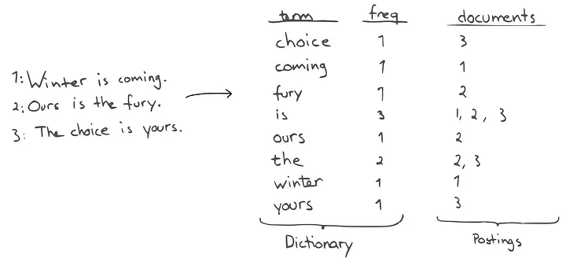

# VectorDB

---

> 의미기반 검색의 DB
> 

### 등장 배경

> RDBMS/NoSQL 까지는 데이터를 그대로 저장하고 그 값으로 조건 검색하는 DB
말 그대로 DB 내에서는 데이터 간의 연관성이 없다
> 

`그런데 왜 연관성이 중요하냐?`

- AI에서 가장 중요한 요소는 데이터 (학습의 양)
- 근데 학습의 양이 말도 안되게 많기 때문에 그 양의 데이터를 기존 DB 에 저장을 한다는 것은 문제가 된다
- 이 점을 해결할 수 있는 점이 바로 벡터 디비

### 벡터 DB 는 저장 단위가 적고 고정길이 때문에 효율적이다

> 기존 DB 저장 구조
> 
- 문서 1개 = 3KB
- 문서 10,000개 = 30MB
- 문서 10만 개 = 300MB
- 문서 내용이 길어질수록 실 저장 용량도 늘어남

> 벡터 DB 저장 구조
> 

예를 들어 1536차원 float32 기준:

- 1536 × 4 bytes = **약 6KB**
- 문서가 1KB든 10MB든 → **벡터는 항상 6KB로 고정**

→ **원본 길이에 상관없이 일정한 저장 용량**

임베딩(Embedding)과 벡터(Vector)

- 텍스트, 이미지, 오디오 같은 **비정형 데이터**를
- AI 모델(예: BERT, Sentence Transformer, OpenAI Embedding API 등)에 넣으면
- **고차원 벡터(예: 768차원, 1024차원)** 로 변환됨.

예:

- “개” → [0.12, -0.32, 0.87, ...] (768차원 숫자들)
- “강아지” → [0.10, -0.30, 0.85, ...]
- “고양이” → [0.89, 0.15, -0.77, ...]

“개”와 “강아지” 벡터는 서로 가깝고

“개”와 “고양이”도 어느 정도 가깝고

“개”와 “냉장고”는 멀리 떨어져 있는 구조

### Vector DB 종류

---

# Elastic Search

> 검색 엔진 + 분산 NoSQL + 분석 엔진 역할을 동시에 하는 DB
> 

<aside>
💡

모든 검색엔진의 시초는 루씬 기반

루씬?

자바 기반의 정보 검색 라이브러리

색인 검색이 가능

(Index) 색인 : 특정 단어로 직접 이동할 수 있는 자료구조

</aside>

### 동작 흐름

- **문서를 JSON으로 저장하면**
- **Analyzer**가 텍스트를 분석(토큰화)
    - "고양이를 좋아합니다"
        
        → ["고양이", "좋아하다"]
        
- 단어별로 **Inverted Index** 생성
- 검색할 때
    - 사용자가 "고양이 좋아"라고 검색
    - ES는 “고양이” 토큰을 찾아서
    - 관련 문서 목록을 가져오고
    - 점수(score) 계산해 랭킹 정렬

- 기본적으로 Http 프로토콜이 접근 가능하다 (REST API를 통해 데이터 조작 가능)

### 역색인

- 기존 DB 에서는 볼수 없는 역색인 기능을 지원

- 색인은 값 → 위치로 매핑되어 있음
`WHERE age > 20` 정확한 값 (단어)가 어디에 있는지 찾아보는 느낌
- 역색인은 문서를 보고 단어를 찾는게 아니라 단어 → 문서 목록으로 저장
    - 예시로 Doc 1(문서) 가 “고양이 귀여움” 으로 이루어져 있으면
    Doc 2(문서) “강아지 귀여움”
    - > 고양이 - > Doc 1
    - > 강아지 - > Doc 2
    - > 귀여움 - > Doc 1, Doc 2

| 구분 | 색인(Index) | 역색인(Inverted Index) |
| --- | --- | --- |
| 목적 | 특정 컬럼 값 빠르게 조회 | 텍스트 검색(문서 검색) 빠르게 수행 |
| 기반 시스템 | RDBMS(MySQL, PostgreSQL) | Elasticsearch, Lucene, 검색엔진 |
| 구조 | 값 → row | **단어 → 문서 리스트** |
| 예시 | age=20 찾기 | “고양이 포함된 문서” 찾기 |
| 주요 장점 | 조회/정렬 빠름 | 큰 텍스트에서도 Full-text 검색 빠름 |
| 적용되는 검색 | 정확한 값/범위 검색 | 의미/키워드 기반 자연어 검색 |