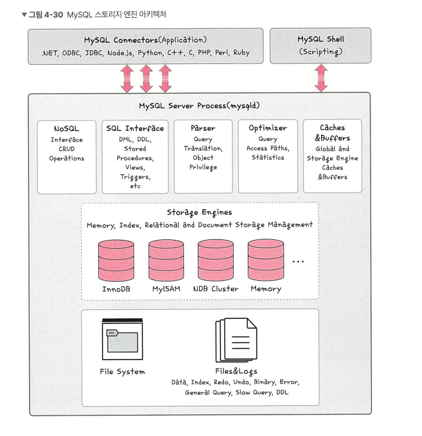

# 관계형 데이터베이스와 NoSQL

---

- 목차
    
    

# 관계형 데이터 베이스(RDBMS)

---

- 테이블(table)로 이루어져 있으며, 키(key)와 값(value)의 관계를 나타내는 데이터 베이스
- 현재 가장 많이 사용되고 있는 데이터베이스
- 데이터의 종속성 관계로 표현하는 것이 특징

> 사용언어 : SQL
> 

[SQL이란 무엇인가요? - 구조적 쿼리 언어(SQL) 설명 - AWS](https://aws.amazon.com/ko/what-is/sql/)

Ex : MySQL, PostgreSQL, 오라클, SQL Server, MSSQL

### MySQL 스토리지 엔진 아키텍처

---



MySQL은 접속 클라이언트, 엔진, 스토리지 엔진으로 구분할 수 있다

엔진에서는 SQL문장을 분석하고 검증하고 최적화한 뒤 스토리지 엔진을 통해 데이터를 읽고 쓴다

스토리지 엔진은 실제 디스크에 접근해 데이터를 읽고 쓰는 역할을 수행한다. 
InnoDB, MyISAM 등을 선택할 수 있다

InnoDB는 기본으로 선택되는 스토리지 엔진이며, 버퍼풀, 언두 로그 등을 통해 MVCC 를 제공한다

### 왜 SQL 인가?

1. 모듈식 스토리지 엔진

> 부품을 갈아 끼울 수 있다.
아키텍처가 분리되어 있다. (MySql 엔진 + 스토리지 엔진)
> 
- 쿼리를 분석하고 최적화하는 역할

MySQL 엔진 : 클라이언트의 접속, SQL 파싱, 전처리, 옵티마이징 등 논리적 처리 담당

스토리지 엔진 : 디스크 I/O, 메모리 캐싱, Locking 등 실제 데이터의 물리적 저장 및 조회 부분 담당

### 모듈식의 이점

1. Handler API를 통한 추상화
- 스토리지 엔진이 내부적으로 동작하는지 몰라도 인터페이스 Handler API를 통해 데이터를 요청하면 된다.
1. 다형성 (Polymorphsm) 구현
- Inno DB (OLTP 용, 트랜잭션 지원) Memory 등으로 엔진을 교체하여 성능 특성 변경이 가능하다.

### 대표적인 스토리지 엔진

`InnoDB` : 가장 많이 사용된다.  트랜잭션 처리가 가능하고 안정적이다

`MyISAM` : 예전 방식, 트랜잭션을 지원하지 않지만 구조가 단순하다

`Memory` : 디스크가 아닌 Ram에 저장, 속도는 빠르지만 휘발성인 체제

<aside>
💡

MySQL 은 플러그인 방식의 스토리지 엔진 아키텍처를 채택하여, 논리 계층(쿼리) 와 저장 계층 (물리)를 분리한 것이 큰 특징이다.
트랜잭션 처리가 중요한지 아니면 읽기 속도가 중요한지 비즈니스 요구사항에 맞춰 엔진을 유연하게 선택할 수 있는게 큰 장점

</aside>

# PostgreSQL 과 MySQ비교

|  | MySQL | PostgreSQL |
| --- | --- | --- |
| 데이터베이스 기술 | 순수 관계형 데이터베이스 관리 시스템 | 객체 관계형 데이터베이스 관리 시스템 |
| 데이터유형 | 숫자, 문자, 날짜 및 시간, 공간, JSON 데이터 유형 | 기하학, 열거형, 네트워크 주소, 배열, 범위, XML, hstore, 복합을 포함하여 모든 MySQL 데이터 유형 |
| 기능 | 보기, 트리거 및 프로시저와 같은 데이터베이스 기능을 제한적으로 지원 | 구체화된 뷰, *INSTEAD OF* 트리거, 여러 언어의 저장 프로시저와 같은 최고급 데이터베이스 기능 지원 |
| ACID 규정 준수 | InnoDB 및 NDB 클러스터 스토리지 엔진에서만 ACID를 준수 | 항상 ACID와 호환 |
| 인덱스 | B-트리 및 R-트리 인덱스를 지원 | 트리와 함께 표현식 인덱스, 부분 인덱스, 해시 인덱스와 같은 여러 인덱스 유형을 지원 |
| 성능 | 높은 빈도의 읽기 작업 성능에 좋음 | 높은 빈도의 쓰기 작업에 좋음 |

> 객체 관계형?
> 
- 기본은 관계형 DB인데 + 객체지향을 섞은 것
- 테이블 + SQL 을 쓰지만 사용자 정의 타입(UDT) + 객체 배열 레코드를 저장 + 상속, 메소드 , 오버로딩 등 객체 개념 일부를 지원하는 것이 특징
- `객체지향 언어(Java)와 객체 구조와 DB 구조 사이의 불일치 (임피던스 미스매치)를 줄일 수 있는 이점이 존재`

```jsx
PostgreSQL 예시
CREATE TYPE phone_list AS (
    home  text,
    work  text,
    mobile text
);

CREATE TABLE member (
    id      int PRIMARY KEY,
    name    text,
    phones  phone_list  -- 복합 타입
);
`칼럼 자체가 복합 타입 ( 배열, JSON 등)이 될 수가 있다`
```

> MySQL 읽기 작업에 좋은 이유
> 
- PostgreSQL은 데이터 베이스의 모든 사용자에 대해 메모리 할당량 (약 10MB) + 새로운 시스템 프로 세스 생성 → 메모리 차지가 심하다
- 하지만 MySQL 같은 경우 단일 프로세스 사용, 데이터를 단순히 읽는 다는 측면에서는 메모리 연산이 많은 Postgre보다 간단

> Postgre가 쓰기 작업에 좋은 이유
> 
- MySQL은 `실제 동시성` 을 구현. 
한 사용자가 테이블 편집시 다른 사용자가 기다려야한다
- PostgreSQL에는 읽기 & 쓰기 잠금이 없는 다중 버전 동시성 제어 (MVCC) 지원이 내장되어 있음

---

# NoSQL

---

NoSQL(Not only SQL) 이라는 슬로건에서 태어난 데이터베이스.

말 그대로 비관계형 데이터베이스

- 테이블 ,행, 열(RDBMS의 특징)을 가용하지 않는다
- 스키마가 없거나 유연하다 (스키마의 틀이 엄격하지 않음)
- 대규모 처리에 분산 확장이 쉽다 (스키마가 유연하기 때문에)

`No SQL은 정형화된 구조가 아니라 대규모 서비스 설계에 초점을 맞춘 DB`

### 등장 배경 (기존 관계형 데이터베이스 (RDB)의 한계)

1. 수평 확장이 어려움
- RDB는 보통 한 서버의 성능을 올리는 방식에 의존 → 대규모 트래픽에서는 한계
1. 정해진 스키마에 맞춘 데이터만 저장 가능
- JSON  , 로그, 센서 데이터, 사용자 행동 데이터 등 비정형(정해지지 않은) 데이털르 저장하는 것은 어려움
1. JSON 이 많은 구조는 성능 저하

| 항목 | RDBMS (SQL) | NoSQL |
| --- | --- | --- |
| 스키마 | 고정된 스키마 | 스키마 자유/유연 |
| 확장성 | 수직 확장 | 수평 확장 |
| 구조 | 테이블 기반 | JSON, Key-Value 등 다양한 구조 |
| 일관성 | 강한 일관성(ACID) | 궁극적 일관성(EC) 가능 |
| JOIN | 지원함 | 대부분 JOIN 없음 |
| 속도 | 복잡한 쿼리 가능, 무거움 | 단순 작업 매우 빠름 |
| 사용 목적 | 관계 중심 데이터 | 대규모 비정형 데이터 |

### NoSQL 이 적합하지 않은 경우

1. 트랙젝션이 필수일 때
- RDBMS 같은 경우 ACID를 보장한다.
- 하지만 대부분의 NoSQL 구조는 CAP 이론에서 가용성(A) 와 분할내성 (P)를  우선시한다
일관성(C)를 희생해서 최종적일관성 모델을 택하는 경우가 많다
한마디로 지금 당장이라는 시점의 노드가 같은 값은 보지 않는 것

> CAP?
> 


1. Consistency (일관성)
- 모든 노드가 항상 동일한 데이터로 보는 것

<aside>
💡

A 서버에서 값을 10으로 바꿈

B,C 서버도 즉시 같은 값 10으로 바꾸어야 한다.

→ 은행 / 회계에서의 입,출금에서 정확한 값이 즉시 필요할때

</aside>

1. Availability (가용성)
- 요청하면 항상 정상 응답을 돌려줄 수 있어야 한다.
- 일부 서버가 죽어도 전체 시스템은 계속 응답해야 한다

3., Partition Tolerance(분할 내성)

- 네트워크가 나뉘어도 시스템이 동작해야한다

<aside>
💡

CAP에서는 3개를 동시에 만족할 수 없다

네트워크 장애가 발생한 경우를 가정

1. 일관성을 지키려고 한경우
→ 일부 서버의 요청을 막아서 동기화를 기다려야 한다.
→ 응답을 포기하므로 가용성을 희생한다.

2. 가용성을 지키려면?
→ 장애 난 노드든 아니든 일단 응답을 모두 하게 유도
→ 값이 서로 달라질 수 있으니 일관성을 위배하는 경우가 생긴다.
</aside>

# NoSQL 종류

---

## 1. Key-Value Store

> 키 - 값 형태로 이루어진 저장소
가장 단순하고 빠른 형태의  NoSQL
> 

### Redis


- 인메모리 저장소 : 모든 데이터가 서버의 메인 메모리에 상주하여 디스크로  I/O로 인한 지연 시간 제거
- String(문자열)이외에도 리스트(list), 세트(Set), Hash 등 다양한 추상화 데이터 유형 제공
- 메모리 데이터를 디스크에 주기적으로 백업(스냅샷 방식)하여 시스템 장애 시에도 데이터 복구
- 데이터베이스 앞에 캐싱하는 방식을 적용하여 데이터의 응답 시간을 단축한다.

### Amazon DynamoDB

- HTTP 로 통신한다 (다른 DB 리소스 같은 경우 TCP Connection 기반인데, DynamoDB는 Contectionless하다
- 서버리스의 특징 (별도의 서버가 존재하지 않는다

## 2. Document Score (문서형 NoSQL)

> JSON 기반 구조 DB
> 

### MongoDB

- 가장 인기 있는 문서형 NoSQL
- BSON(Binary JSON) 기반
- 유연한 스키마
- 단일 문서 트랜잭션은 강함
- 멀티-도큐먼트 트랜잭션도 지원하지만 성능의 희생 존재
- 복잡한 Query 지원 (Aggregation 기능 등)

## 3. Wide Column Store (열 기준 NoSQL)

> 행 안에 Column Family라는 묶음이 잇고 ,그 안에 Column들이 동적으로 존재하는 구조
RDBMS는 테이블이 열 고정이 되어있는데 WideColumn Store는 열이 미리 정해져 있지 않고 필요할때만 추가한다
> 
- 구글 Bigtable 구조를 기반으로 태어난 분산형 대규모 데이터베이스

| 유형 | 대표 DB | 장점 | 단점 | 적합한 사용 사례 |
| --- | --- | --- | --- | --- |
| **Key-Value** | Redis, DynamoDB | 빠름, 단순, 캐시 | 검색/조인 약함 | 세션, 캐시, 실시간 카운트 |
| **Document** | MongoDB, Firestore | 유연한 스키마, JSON 기반 | 조인 약함, 대형 문서 비효율 | 웹/앱 백엔드, 서비스 데이터 |
| **Wide Column** | Cassandra, HBase, Bigtable | 수평 확장, 대규모 처리 | 다루기 어려움 | 로그, IoT, 빅데이터 |
| **Graph** | Neo4j, Neptune | 관계 분석 최적 | 범용 DB로는 부적합 | 추천, 그래프 분석, SNS |

### NoSQL 3대장 비교 (MongoDb, Cassandra, Redis)

| 항목 | **MongoDB** | **Cassandra** | **Redis** |
| --- | --- | --- | --- |
| **DB 유형** | Document DB (JSON/BSON) | Wide Column Store | Key-Value / In-memory |
| **CAP 성향** | CP (일관성 우선) | AP (가용성 우선) | AP(기본) 또는 강한 Consistency 옵션 |
| **트랜잭션** | 멀티 문서 트랜잭션 지원 | 거의 없음(단일 파티션 수준) | 명령 단위 원자성, Lua 스크립트 |
| **확장성** | 수평 확장 가능 | 수평 확장 최고 수준 | 클러스터링 가능하지만 구조 단순 |
| **속도** | 읽기/쓰기 둘 다 준수 | **쓰기 성능 최강** | **메모리 기반이라 최강 속도** |
| **스키마 유연성** | 매우 높음 | 중간 | 낮음 (Key-Value) |
| **JOIN** | 없음 (Aggregation으로 대체) | 없음 | 없음 |
| **일반 사용 사례** | 웹 백엔드, 앱 데이터, 기능 데이터 | 초대규모 로그, 시계열, 메시징 | 캐시, 세션, 실시간 카운터, 랭킹 |
| **장점** | JSON 친화적, 개발 편함 | 확장성·가용성 최강 | 속도 최강, TTL 기능 |
| **단점** | 고가용성/일관성 조절 어려움 | 모델링 난이도 높음 | 메모리 비용 높음, 복잡 저장 어려움 |