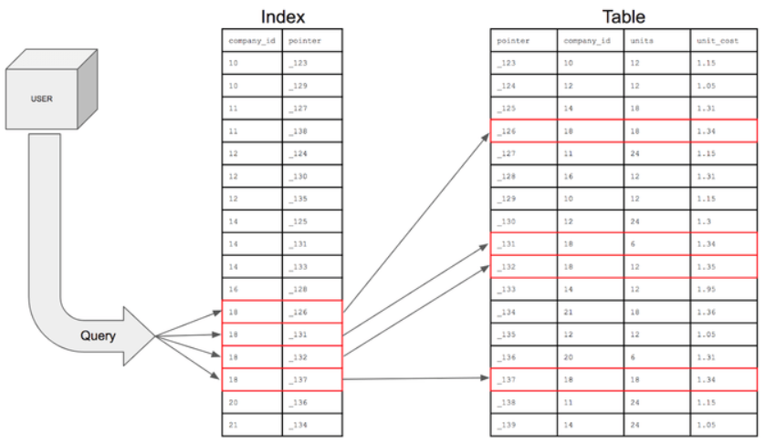

## 1. 인덱스 기본 개념

### 인덱스란?

인덱스(Index)는 데이터베이스에서 데이터 검색 속도를 향상시키기 위한 자료구조다. 책의 목차나 색인처럼, 원하는 데이터를 빠르게 찾을 수 있도록 도와준다.

### 인덱스의 구조

인덱스를 생성하면 실제로 별도의 인덱스 자료구조가 만들어진다. 이는 원본 테이블과는 별개로 존재하며, 트리 구조(주로 B-Tree 또는 B+Tree)로 구성된다.

- **검색 키(Key)**: 인덱스를 생성한 컬럼의 값들 (정렬된 상태)
- **포인터(Pointer)**: 실제 데이터가 저장된 위치를 가리키는 주소

인덱스를 활용하면 데이터를 조회하는 SELECT 외에도 UPDATE나 DELETE의 성능이 함께 향상된다. 해당 연산을 수행하려면 대상을 먼저 조회해야 하기 때문이다.



### 인덱스 사용 전후 비교

**인덱스를 사용하지 않을 때 (Full Table Scan)**

```sql
SELECT * FROM users WHERE nickname='User290526U';
-- 실행 시간: 0.21초
```

- 테이블의 첫 번째 레코드부터 마지막까지 순차적으로 모든 데이터를 확인
- 70만 개의 레코드가 있다면 최악의 경우 70만 개를 모두 검사
- 데이터가 많을수록 검색 시간이 선형적으로 증가 → 시간복잡도: O(n)

**인덱스를 사용할 때**

```sql
CREATE INDEX idx_user ON users(nickname);
SELECT * FROM users WHERE nickname='User290526U';
-- 실행 시간: 0.00초
```

- 인덱스를 통해 정렬된 구조에서 이진 탐색처럼 효율적으로 검색
- 트리 구조를 활용하여 빠르게 원하는 데이터의 위치를 찾음
- 검색 시간이 로그 시간으로 감소 → 시간복잡도: O(log n)
- 위 예시에서는 **0.21초 → 0.00초**로 극적인 성능 향상

### 인덱스 생성 방법

**단일 컬럼 인덱스**

```sql
CREATE INDEX 인덱스_이름
ON 테이블_이름(컬럼명);

-- 예시
CREATE INDEX player_name_idx
ON player(name);

-- 사용
SELECT * FROM player WHERE name = "Sonny";
```

**복합 인덱스 (Multicolumn Index 또는 Composite Index)**

여러 개의 컬럼에 인덱스를 생성할 수 있다. 이때 먼저 쓴 컬럼을 정렬한 후 다음 컬럼을 정렬한다.

```sql
CREATE INDEX 인덱스_이름
ON 테이블_이름(컬럼명1, 컬럼명2, ...);

-- 예시
CREATE INDEX team_id_backnumber_idx
ON player(team_id, backnumber);

-- 사용
SELECT * FROM player WHERE team_id = 105 AND backnumber = 7;
```

**유니크 인덱스**

인덱스를 걸 컬럼이 유일한 값을 가질 경우 UNIQUE를 붙인다.

```sql
CREATE UNIQUE INDEX 인덱스_이름
ON 테이블_이름(컬럼명);

-- 예시
CREATE UNIQUE INDEX team_id_backnumber_idx
ON player(team_id, backnumber);
```

**테이블 생성 시 인덱스 생성**

```sql
CREATE TABLE player (
    id INT PRIMARY KEY,
    name VARCHAR(50),
    team_id INT,
    backnumber INT,
    INDEX player_name_idx(name),
    UNIQUE INDEX team_id_backnumber_idx(team_id, backnumber)
);
```

참고로 PRIMARY KEY에는 인덱스가 자동으로 생성된다.

### 인덱스 사용 확인

**사용된 인덱스 확인하기**

```sql
EXPLAIN SELECT * FROM player WHERE backnumber = 7;
```


EXPLAIN 결과에서 key 항목을 통해 어떤 인덱스가 사용되었는지 확인할 수 있다.

**한 테이블에 여러 인덱스가 있을 때**

옵티마이저(Optimizer)가 쿼리를 분석하여 가장 효율적인 인덱스를 자동으로 선택한다.


**직접 인덱스 지정하기**

```sql
-- 권장하는 인덱스 지정
SELECT * FROM player USE INDEX (인덱스_이름) WHERE ...;
SELECT * FROM player USE INDEX (backnumber_idx) WHERE backnumber = 7;

-- 강제로 인덱스 지정
SELECT * FROM player FORCE INDEX (인덱스_이름) WHERE ...;

-- 특정 인덱스 제외
SELECT * FROM player IGNORE INDEX (인덱스_이름) WHERE ...;
```

### 커버링 인덱스 (Covering Index)

커버링 인덱스는 실제 테이블에 접근하지 않고 인덱스만으로 원하는 데이터를 모두 얻을 수 있는 경우를 말한다.


**조건**
- 조회하는 컬럼들이 모두 인덱스에 포함되어 있을 때
- 예: `SELECT name, age FROM users WHERE name = 'John'`에서 (name, age)로 복합 인덱스가 걸려있는 경우

**장점**
- 실제 테이블 접근이 불필요하므로 조회 성능이 더욱 빠름
- I/O 작업이 줄어들어 시스템 부하 감소

### Full Scan이 더 좋은 경우

인덱스가 항상 좋은 것은 아니다. 다음의 경우에는 Full Table Scan이 더 효율적이다.

- 테이블에 데이터가 적을 때 (수십~수백 건 정도)
- 조회하려는 데이터가 테이블의 상당 부분(20~25% 이상)을 차지할 때
  - 이 경우 인덱스를 통한 랜덤 I/O보다 순차 I/O가 더 빠르다

### 인덱스의 장점

- 테이블 조회 속도와 성능을 향상시킨다
- 전반적인 시스템 부하를 줄인다
- WHERE, ORDER BY, JOIN 등의 성능을 개선한다

### 인덱스의 단점

- 인덱스를 관리하기 위해 DB의 약 10%에 해당하는 저장공간이 필요하다
- 인덱스를 관리하기 위한 추가 작업이 필요하다
  - **INSERT**: 인덱스에 새 노드 삽입 및 트리 재정렬
  - **UPDATE**: 인덱스된 컬럼값 변경 시 인덱스 재정렬
  - **DELETE**: 인덱스에서 해당 노드 삭제 및 재조정
- 인덱스를 잘못 사용하면 오히려 성능이 저하될 수 있다
- INSERT, UPDATE, DELETE가 빈번한 컬럼에 인덱스를 걸면 인덱스 크기가 비대해져 성능이 저하된다

## 핵심 요약

### 인덱스의 본질
- 인덱스는 **검색 속도 향상을 위한 추가 자료구조**다
- 읽기 성능은 향상되지만 **쓰기 성능은 저하**된다
- **공간 비용**과 **시간 비용**의 트레이드오프가 존재한다

### 복합 인덱스 설계
- 순서가 매우 중요: **같음 > 정렬 > 범위** 순으로 설계
- **높은 카디널리티** 컬럼을 앞에 배치
- 왼쪽부터 순차적으로 사용해야 효과적

### 인덱스 사용 원칙
- 무조건 많이 만드는 것이 아니라 **필요한 곳에 선택적으로** 생성
- 카디널리티가 낮은 컬럼은 인덱스 효과가 적음
- 전체 데이터의 20~25% 이상 조회 시 Full Scan이 더 효율적
- 항상 **실제 데이터로 테스트**한 후 적용
